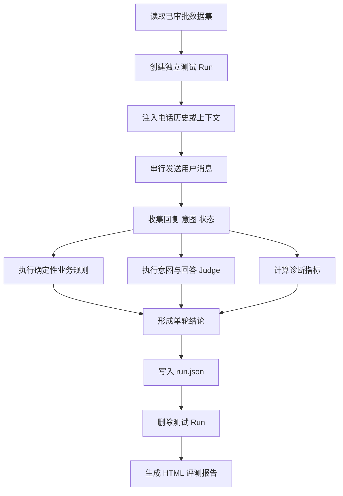
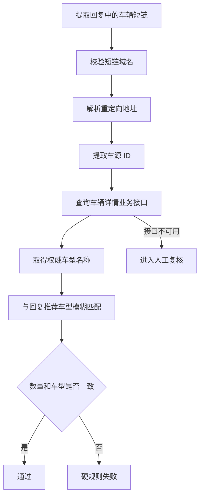
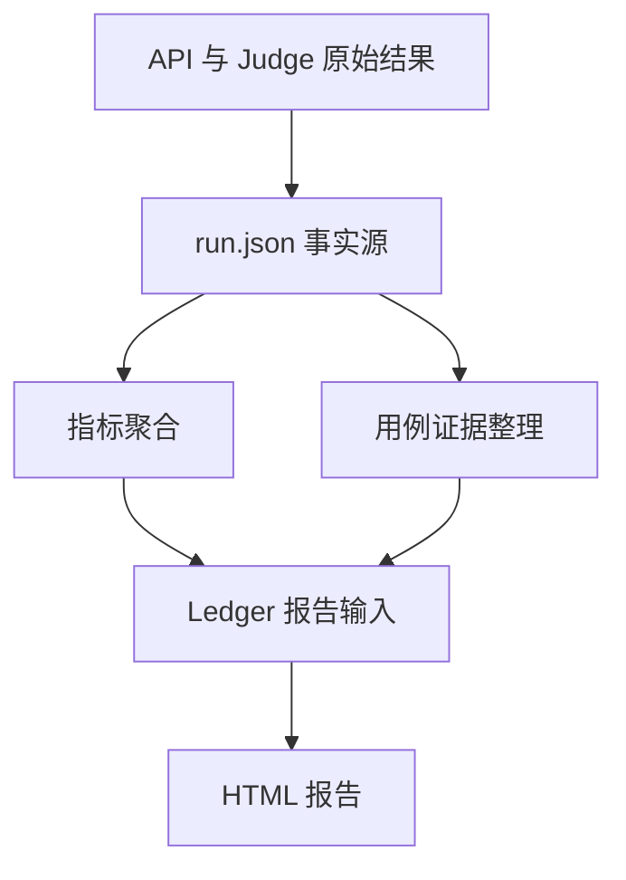
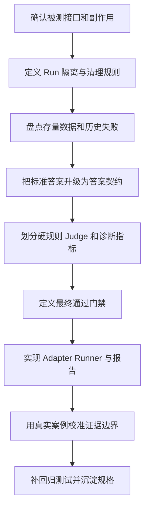

# 从“文本相似度”到“业务证据链”：客服 IM Agent 自动化评测重构复盘

大模型应用上线以后，最难回答的问题往往不是“接口通不通”，而是：

> Agent 的回答到底对不对？它是否理解了用户意图？是否违反业务规则？换了模型、Prompt 或知识库以后，原来的能力有没有退化？

这次我们重构了一个 IM Agent 自动化评测项目。被测对象是二手车销售场景中的 IM Agent，它需要理解客户需求、查询车源、推荐车辆、承接历史对话，并在合适的时机完成邀约。

旧测试逻辑更接近“拿实际回答和标准答案做文本对比”。这种方法实现简单，但很快遇到几个问题：

- 同一个业务意思可以有很多种合法表达，文本不同不代表回答错误。
- 回答看起来很像标准答案，也可能包含重复邀约、虚假承诺等严重违规。
- 实时车源、价格和链接来自业务接口，静态数据集不可能提前列出所有正确答案。
- 一个总分无法说明到底是意图错了、规则错了、事实错了，还是只是表达不够好。
- 报告有结果，却缺少失败原因和原始证据，测试人员仍然需要手工翻 JSON。

因此，这次重构的重点并不是换一个相似度算法，而是重新定义一套可执行、可解释、可回归的评测闭环。
!image-20260808023232545.png

---

## 一、先定义评测目标，而不是先选工具

项目一开始并没有急着引入 Promptfoo、DeepEval 或其他评测框架，而是先确认四个问题：

1. 被测系统是什么类型？
2. 测试时能拿到哪些证据？
3. 哪些错误可以用确定性代码判断？
4. 哪些问题必须交给 LLM Judge？

 IM Agent 不是一个无状态问答接口。每个测试场景都会创建真实测试 Run，写入会话和业务状态；发送消息后，Agent 还可能更新标签、邀约状态和延迟任务。

因此，第一条不可妥协的测试约束是：

> 每个场景独立创建测试 Run，并且无论执行成功还是异常，都必须删除该 Run。

```python
created = None
try:
    created = adapter.create_run(fixture)
    response = adapter.send_message(created.record_id, question)
    evaluate(response)
finally:
    if created is not None:
        adapter.delete_run(created.record_id)
```

这段代码表达的不是普通资源释放，而是评测可信度的前提。如果复用历史 Run，上一条用例留下的会话、邀约状态或推荐车源都可能污染下一条用例。

整个评测主链路最终被定义为：



这里最重要的设计是：规则、Judge 和诊断指标并行产生证据，但只有明确的门禁项才能决定通过或失败。

---

## 二、项目结构：专项独立，共享稳定协议

项目最终没有建设一个“大而全”的通用 Agent 评测平台，而是保持 IM 业务独立：

```text
projects/test-c2-im-eval/
├── datasets/
│   └── regression.json
├── docs/
│   ├── data_api/
│   ├── rules/
│   └── articles/
├── src/c2_im_eval/
│   ├── adapter.py
│   ├── dataset.py
│   ├── runner.py
│   ├── rules.py
│   ├── answer_assertion.py
│   ├── judge.py
│   ├── link_validator.py
│   ├── metrics.py
│   ├── report.py
│   └── cli.py
├── tests/
├── tasks/active/
├── run.sh
├── pyproject.toml
└── uv.lock
```

各模块职责保持明确：

| 模块 | 职责                             |
|---|---|
| `adapter.py` | 封装测试 API，隔离厂商字段                |
| `dataset.py` | 校验数据集结构和字段约束                   |
| `runner.py` | 编排 Run 生命周期、消息执行和各层评测          |
| `rules.py` | 执行可确定复现的业务硬规则                  |
| `answer_assertion.py` | 文本诊断、向量诊断和最终门禁决策               |
| `judge.py` | 回答正确性、意图语义和表达质量 Judge          |
| `link_validator.py` | 验证车辆链接数量及链接车源一致性               |
| `metrics.py` | 汇总正确率、规则、意图、Judge、延迟等指标        |
| `report.py` | 把 `run.json` 转换为统一 Ledger 报告输入 |

专项独立并不代表完全不共享。仓库只共享两类稳定能力：

- 指标和报告输入协议。
- 统一 HTML 报告的结构、风格与交互。

业务规则、数据集、Adapter、Judge 和门禁继续留在专项内部。这样既避免了重复建设报告，也不会为了“将来可能复用”而提前制造复杂抽象。

---

## 三、数据集不是问答列表，而是可执行的业务契约

旧数据中已经积累了真实问题和回答，因此数据集建设没有从零合成，而是采用三类来源：

1. 存量真实对话和历史测试数据。
2. 生产或测试环境中出现过的典型失败。
3. 针对覆盖缺口定向补充的边界和对抗样本。

每条用例至少包含：

- 用例 ID、分类和优先级。
- 用户问题。
- 标准答案或预期行为。
- 历史对话和电话上下文。
- 期望意图。
- 邀约状态。
- 业务硬规则。
- 回答契约。

一个经过简化和脱敏的用例结构如下：

```json
{
  "id": "C2-IM-CONTEXT-001",
  "case_type": "phone_context",
  "level": "P0",
  "review_status": "approved",
  "fixture": {
    "phone_conversation_records": [
      {"speaker": "AGENT", "content": "已约好周六到店看车"},
      {"speaker": "USER", "content": "好的，周六下午过去"}
    ]
  },
  "turns": [
    {
      "question": "预算十万左右还有 SUV 可以看吗",
      "intents": ["DESCRIBE_NEEDS", "SEARCH_CARS"],
      "invite_succeeded": true,
      "answer_contract": {
        "required_points": [
          "回应预算和 SUV 找车需求",
          "保持已约周六到店的上下文"
        ],
        "optional_points": [
          "补充筛选条件"
        ],
        "forbidden_points": [
          "再次询问何时方便到店"
        ]
      }
    }
  ]
}
```

这里有两个关键变化。

第一，标准答案从“唯一参考文案”升级成了 `answer_contract`。它分别描述必须覆盖、可以补充和禁止出现的内容，不再要求模型逐字复现标准答案。

第二，数据增加 `review_status`。只有业务已审批的 `approved` 用例才能进入默认回归，候选数据不能悄悄影响发布结论。

---

## 四、断言设计：确定性问题交给代码，语义问题交给 Judge

这次重构最终形成了四层评测。

### L1：Run 生命周期与基础设施

这一层检查：

- Run 是否创建成功。
- 消息是否发送成功。
- 响应结构是否合法。
- Run 是否成功删除。
- Judge 是否可用。

基础设施失败必须和业务失败区分开。比如测试 API 返回 HTTP 502，结论应当是 `error`，而不是把 Agent 判为回答错误。

### L2：业务硬规则

凡是可以稳定复现的规则，都使用普通代码：

- 回复不能包含完整手机号。
- 不能做无依据的确定性承诺。
- 已邀约成功后不能再次发起邀约。
- 需要发送三条车源链接时，不能只发送一条。
- 链接中的车辆必须与回复推荐车型一致。

硬规则命中后直接失败，不能被高相似度或优秀文风抵消。

### L3：意图和回答正确性

意图识别先做枚举集合的精确比较，输出 Precision、Recall、F1 和混淆关系；LLM Judge 只负责解释语义边界，不能替代结构化枚举校验。

回答正确性由独立 Judge 检查：

- 必选业务点是否覆盖。
- 是否命中禁止项。
- 是否出现核心遗漏。
- 是否和上下文、业务状态或权威证据矛盾。
- 新增信息是合理补充、证据不足，还是错误承诺。

Judge 必须返回固定 JSON，而不是一段无法聚合的自由文本：

```json
{
  "verdict": "correct",
  "required_points": [
    {
      "point": "承接用户预算",
      "covered": true,
      "evidence": "回复提到十万左右"
    }
  ],
  "forbidden_points": [],
  "contradictions": [],
  "core_deviations": [],
  "reason": "核心需求均已覆盖",
  "confidence": 0.92
}
```

固定输出契约使 Judge 结果能够进入自动化门禁，也能在报告中逐项解释。

### L4：回答质量

表达质量是另一条独立维度，包括：

- 回答相关性。
- 清晰易懂。
- 语气与用户体验。
- 上下文一致性。
- 可信度。

质量评分的定位非常重要：

> 一条语气很好、表达流畅但业务事实错误的回答，仍然必须失败。

因此质量 Judge 只用于分析和优化体验，不会覆盖回答正确性结论。

---

## 五、标准答案和实际回答，为什么不能只算相似度

最初设想的文本对比链路包括：

```text
Diff 相似度
  -> 确定性规则
  -> Transformer 余弦相似度
  -> BM25 + 向量
  -> LLM Judge
  -> 综合分值
```

继续分析后，我们发现“综合分值决定通过”存在很大风险。

例如：

- “可以看看十万左右的 SUV”与“目前确定有三台现车，价格绝对不会变”可能有较高关键词重合，但后者包含未经证实的承诺。
- 标准答案写“询问用户更关注年份、里程还是空间”，实际回答写“您对车龄和公里数有什么要求”，文字差异明显，但业务语义一致。
- 标准答案没有写出实时查询到的具体车型，不代表 Agent 推荐该车型就是编造。

所以，相似度最终被降级为诊断指标，不参与门禁。

当前实现保留：

- `SequenceMatcher`：观察整体文字顺序相似度。
- 中文 Bigram Precision、Recall、F1：观察短语覆盖。
- Embedding Cosine：配置向量模型时观察语义接近程度。
- BM25：存在多个参考答案时观察多参考检索匹配。

如果配置了向量，相似度诊断分为：

\[
diagnostic = 0.25 \times BigramF1 + 0.75 \times EmbeddingCosine
\]

未配置向量时，只使用 Bigram F1 作为诊断分。Sequence 和 BM25 保留为独立证据。

真正决定正确性的门禁规则是：

```python
if has_critical_hard_rule_failure:
    return "failed"
if judge_is_unavailable:
    return "error"
if correctness_judge == "incorrect":
    return "failed"
if correctness_judge == "review" or has_noncritical_issue:
    return "review"
return "passed"
```

这条决策链保证：硬规则优先、Judge 不可用时不误报通过、相似度不参与最终裁决。

---

## 六、最关键的一次校准：动态车源不能被误判为“编造”

重构过程中出现过一个很典型的问题。

Agent 在回答中推荐了一款具体车辆，正确性 Judge 却给出 `review`，理由是“标准答案没有该具体车源，可能属于编造”。

业务确认后发现，这款车来自 Agent 实际调用的车源查询接口，是真实车源。

这暴露了一个非常重要的评测原则：

> 静态数据集中没有出现的动态业务事实，不等于错误事实。

对于实时车源、价格、配置、库存和链接，评测必须先回答“有没有权威证据”，而不是直接拿静态标准答案做包含关系。

项目因此新增车辆详情链接验证：



验证分成两步：

1. 检查应提供的链接数量。
2. 查询每条链接对应的权威车型，与回复中的推荐车型做归一化模糊匹配。

例如，回复推荐三款车却只提供一条详情链接，即使这条链接本身车型正确，仍会得到：

```text
车辆详情链接数量：失败
推荐场景要求 3 条车辆详情链接，实际提供 1 条
```

相反，只要业务接口确认链接确实对应所推荐车辆，Judge 就不能再因为标准答案没有列出该车型而判定“编造”。

这个案例也说明：LLM Judge 不是权威事实的生产者。它只能在我们提供的证据边界内做判断。

---

## 七、为什么没有直接引入 Promptfoo、DeepEval 和 Agent-EvalKit

工具选型阶段重点分析了三个候选方案。

### Promptfoo

Promptfoo 的优势是配置式断言、模型对比、红队测试和快速实验。但当前项目不是简单 Prompt 测试，而是带数据库状态、真实业务副作用和严格清理流程的有状态系统。

如果为了适配 Promptfoo 再封装一层生命周期和报告转换，首版反而会增加维护成本。因此暂时不把它引入主执行链路。

### DeepEval

DeepEval 的 Golden Synthesizer、Conversation Simulator 和 GEval 对未来补充候选数据有价值。

但 Tool Correctness、Task Completion、Faithfulness 等指标需要工具调用轨迹、完整 trace 或 retrieval context。当前黑盒接口并没有暴露这些证据，直接计算只会得到“看起来专业但证据不足”的指标。

因此，DeepEval 只保留为后续小范围实验选项，不进入当前核心门禁。

### Agent-EvalKit

Agent-EvalKit 更适合能够观察内部执行轨迹的白盒 Agent 评测。当前项目的目标是测试环境和生产环境都能运行的黑盒回归，因此暂不增加这项依赖。

最终采用的是更朴素的组合：

- Python 规则负责硬约束。
- 自定义 LLM Judge 负责语义判断。
- 结构化 `run.json` 保存事实。
- 统一 Ledger 渲染器负责报告。

选择工具的标准不是“能力最多”，而是“能否使用当前真实证据稳定回答业务问题”。

---

## 八、报告不是结果列表，而是失败定位工具

第一版报告虽然包含指标，但用例详情仍然难读。随后报告经历了几轮针对性调整：

1. 增加最终失败原因。
2. 展示每个指标的校验结果，包括全部 LLM Judge。
3. 将内部断言代码转换为中文业务名称。
4. 明确标注“核心门禁”“独立评分”和“仅辅助诊断”。
5. 统一上下文字段为 `phone_conversation_records`。
6. 移除冗长的自主对话流。
7. 保留完整结构化原始证据，用于追溯。
8. “返回与状态”只展示回复和识别意图，避免重复展示请求与指标。

最终每条用例可以回答四个问题：

- 最终是通过、失败、复核还是基础设施异常？
- 失败由哪一条规则或哪一个 Judge 导致？
- 实际回复和识别意图是什么？
- 原始输入、业务状态和 Judge 证据在哪里？

报告数据流保持单向：



HTML 从不手工修改。所有展示调整都落在结构化数据映射或统一渲染器中，下一次运行会自动继承。

---

## 九、指标体系：既看能力，也看评测系统自己是否可靠

当前报告至少覆盖以下指标。

### 业务结果

- 场景通过、失败、复核、异常数量。
- 回答正确率。
- 各业务硬规则失败次数。

### 意图识别

- 精确集合匹配率。
- Precision、Recall、F1。
- 期望意图到实际意图的混淆关系。

### 回答质量

- 相关性、清晰度、语气、上下文一致性、可信度平均分。

### 工程可靠性

- Run 创建数和删除数。
- Run 清理成功率。
- Judge 可用率。
- 平均延迟、P50、P95 和最大延迟。

工程指标不能省略。如果 Judge 大面积不可用，或 Run 没有正确删除，即使业务正确率看起来很高，这次评测也不可信。

---

## 十、测试与验证：评测框架本身也必须被测试

Agent 评测项目很容易出现一个悖论：我们在测试 Agent，却没有测试自己的评测器。

因此，项目为以下路径补了自动化测试：

- 数据集合法与非法结构。
- API HTTP 错误和业务错误。
- 消息异常后仍然删除 Run。
- 删除失败被归类为基础设施错误。
- 正确性 Judge 如何驱动最终门禁。
- 链接数量不足。
- 链接车型和推荐车型不一致。
- 报告是否展示失败原因、Judge 和中文断言。
- 报告响应区域是否只保留必要字段。

当前项目测试结果为：

```text
19 passed
2 个 approved 场景通过数据集 Schema 校验
3 条真实车辆短链通过在线车型匹配
```

一次真实回归中，测试 API 在创建 Run 时返回 HTTP 502。项目没有把它误判为 Agent 回答失败，而是输出 `error`，并在报告中显示具体 HTTP 状态。因为 Run 没有创建成功，所以不存在残留测试数据。

这次异常反而验证了基础设施错误与业务失败分离的重要性。

---

## 十一、回顾整个规划过程

如果把这次重构压缩成一条可复用路线，可以分为九步：



这九步的先后顺序很重要。

如果先选工具，容易被框架已有指标牵着走；如果先做综合分，容易掩盖严重违规；如果先做大平台，可能还没搞清楚业务证据就增加了大量抽象。

真正有效的顺序是：

> 先确定事实和门禁，再实现执行链路；先让一个专项闭环可靠，再考虑复用。

---

## 十二、这次重构留下的五个经验

### 1. 标准答案是业务语义基线，不是唯一文案

生成式回答天然具有多样性。测试应比较业务点、事实和动作，而不是逐字匹配。

### 2. 相似度适合诊断，不适合单独裁决

低相似可能只是同义改写，高相似也可能包含严重违规。相似度应该帮助定位差异，而不是替代业务判断。

### 3. 硬规则和质量分必须分离

敏感信息、重复邀约、虚假承诺、链接错误都应直接失败，不能通过“总体表现不错”被平均掉。

### 4. 动态事实必须绑定权威证据

实时车源不在静态数据集中，并不代表它是幻觉。评测系统需要接入可验证的业务证据，或者诚实地给出 `review`。

### 5. 报告的价值是缩短失败定位时间

测试人员不应该根据内部代码猜测 `CORRECTNESS_JUDGE` 或 `ANSWER_SIMILARITY_DIAGNOSTIC` 的含义。报告必须直接说明评测项、结论、原因和证据。

---

## 结语

这次 IM Agent 评测重构，表面上增加了数据契约、规则、Judge、指标和报告，真正完成的却是一件更基础的事：

> 把“我觉得这条回答不太对”，变成一条可执行、可解释、可重复验证的工程判断。

一套可靠的 Agent 评测系统，不在于接入了多少流行工具，而在于能否明确区分：

- 什么是确定性违规。
- 什么是语义偏差。
- 什么只是表达差异。
- 什么缺少权威证据。
- 什么其实是评测基础设施故障。

当这些边界被写进数据契约、代码门禁、测试和报告以后，Agent 的每次模型升级、Prompt 调整和业务规则变化，才真正具备自动化回归的基础。
