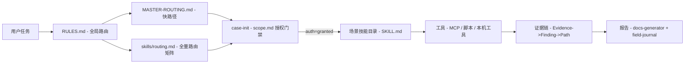

# AI Agent 拿到 APK 不知道用 jadx 还是 Frida？这个开源项目把逆向/渗透技能打包成了"路由系统"

> 破暗而行，逆水为舟

## 导语

如果你用过 AI Agent（Claude Code、Cursor、Codex CLI 这些）来做逆向或渗透，大概率遇到过这种情况：

你给它一个 APK，它说"我来分析一下"，然后开始猜——先试 jadx，不行换 apktool，再不行又试 Frida。每次都是从零开始，没有方法论，没有工具路径，没有经验复用。换一台机器，又要重新配一遍环境。

这不是 AI 不够聪明，是它**没有"安全方法论"这个知识层**。

最近有人把这个麻烦事做成了一个项目，叫 **reverse-skill**。它不是一个工具，而是一套**技能路由包**——把逆向/渗透/安全分析里几十种场景，按"遇到什么任务 → 走什么方法论 → 调什么工具 → 记什么证据"这条线，完整打包成了 AI Agent 能直接读、直接执行的结构化目录。

## 一句话结论

**reverse-skill 是一套"安全技能路由系统"**，专门给 AI Agent 用的——你丢给它一个 APK、一个 JS 加密参数、一个固件、一个 CTF 题目，它不再猜命令，而是先路由到对应的方法论，再调用本机已有工具按流程执行，最后把证据链和结论写出来。

适用人群：安全从业者、逆向工程师、CTF 选手、AI Agent 重度用户。

## 核心亮点

### 1. 覆盖场景极其全面——从 APK 到固件，30+ 场景一条线

根据项目文档，reverse-skill 按场景拆成了独立技能目录，每个目录就是一个完整的方法论包：

| 场景 | 技能目录 |
|------|----------|
| APK / Android 逆向 | `skills/apk-reverse/` |
| iOS / 移动端 | `skills/mobile-reverse/` |
| 二进制逆向 (exe/dll/so/elf) | `skills/ida-reverse/` + `skills/radare2/` |
| .NET / C# | `skills/dotnet-reverse/` |
| 前端 JS 签名 / 加密参数 | `skills/js-reverse/` |
| DSL VM / 风控自定义 VM | `skills/reverse-engineering/dsl-vm-reverse/` |
| HTTP 抓包 / 请求重放 | anything-analyzer、Reqable MCP + js-reverse/ |
| 恶意软件 / YARA | `skills/malware-analysis/` |
| 渗透测试 / 漏洞扫描 | `skills/pentest-tools/` |
| 攻击链 / 红队编排 | `skills/attack-chain/` |
| CTF 竞赛 | `CTF-Sandbox-Orchestrator/` (40+ 子技能) |
| 固件 / IoT | `skills/firmware-pentest/` |
| 补丁差分 / N-day | `skills/patch-diff-exploit/` |
| Pwn / 漏洞利用 | `skills/pwn-chain/` |
| EDR 绕过 | `skills/edr-bypass-re/` |
| API / GraphQL | `skills/api-security/` |
| 供应链 / SBOM | `skills/supply-chain-security/` |
| LLM / AI 安全 | `skills/llm-security/` |
| OLLVM 脱密 | `skills/reverse-engineering/references/ollvm-deobfuscation.md` |
| 图表 / 报告 | `skills/diagram-generator/` + `skills/docs-generator/` |

**30+ 场景全部独立成目录，每个目录有完整的 SKILL.md + 工具索引 + 流程说明**。不是随便列个清单，是真能路由过去。

### 2. AI Agent 原生适配——专门为 Claude Code / Codex / Cursor 设计的引导流程

这是这个项目最独特的地方。

项目里有一份 `README_AI.md`，专门写给 AI Agent 读的。当 AI Agent 第一次 clone 这个仓库，它会：

1. 自动检测操作系统（Windows / Kali / macOS / Linux）
2. 按平台读取对应的部署文档
3. 刷新本机工具索引（`refresh-tool-index`）
4. 读取 `RULES.md` 执行全局路由规则
5. 通过 `MASTER-ROUTING.md` 或 `master-route.ps1` 脚本进行任务分诊
6. 初始化作战 case 目录（scope / 授权 / 网络配置）
7. 打开对应技能的 SKILL.md 执行

**整个过程不需要用户手动操作**。AI Agent 读完 README_AI.md 就会自动执行。

### 3. 三层路由体系——"先走快路径，再查全表，最后提案"

路由是 reverse-skill 的核心设计。它有三层：

- **PRIMARY 快路径**（`MASTER-ROUTING.md`）：按条件（如"APK / smali / jadx / apktool"）直接命中，走最短路径
- **全量路由矩阵**（`routing.md`）：30+ 场景完整映射表，未命中时查全表
- **提案机制**：如果全表也没有命中，允许 AI Agent 提议新增技能目录

这套设计解决了安全领域一个核心问题：**场景太多，不可能全部记住，但路由系统可以帮你快速找到正确的那条路**。

### 4. 作战契约体系——不只有技术，还有流程

安全工作的特殊性在于：**不是能跑就行，还要有授权、有证据链、有报告**。

reverse-skill 的 `skills/ops/` 目录下包含了完整作战契约：

| 文件 | 用途 |
|------|------|
| `scope-contract.md` | 启动门槛——授权未 granted 禁止对目标 ACT |
| `evidence-finding-path.md` | 证据链——从 Evidence 到 Finding 到 Path 的完整链路 |
| `role-map.md` | 角色映射——谁负责什么技能 |
| `timeline-workitem.md` | 时间线与工作项覆盖 |
| `sandbox-profile.md` | 工具对照——沙箱环境配置 |
| `skill-supply-chain.md` | 外部 skill/MCP 安装的安全门闩 |

**授权门禁（case-guard）** 是一个值得一提的设计——`case-init.ps1` 脚本会生成 `scope.md`，其中包含 `auth.status` 和 `network_profile` 字段。如果授权未就绪，AI Agent 会被禁止对目标执行任何操作。这在红队/渗透场景里是刚需。

### 5. 本机工具自动索引——不用手动配，AI 自己扫

每次部署后，AI Agent 会执行 `refresh-tool-index` 脚本（按平台分 Windows PowerShell / Linux Bash / Kali 版本），自动扫描本机已安装的工具，生成 `tool-index.md` 和 `tool-index.json`。

**这解决了 AI Agent 最头疼的问题之一：不知道本机装了哪些工具。** 有了工具索引，`RULES.md` 的路由规则才能正确判断"这个任务能不能在本机执行"。

### 6. 多平台部署——Kali / macOS / Ubuntu 全覆盖

项目文档提供了完整的平台部署文档：

- Kali Linux → `kali/README-kali.md`
- Ubuntu/Debian → `docs/platforms/linux.md`
- macOS → `docs/platforms/macos.md`
- Windows → 原生 PowerShell 脚本支持

**依赖要求**：Java/JDK（jadx、apktool）、Node.js 22.12+（JS 工具链 + MCP 服务）、Python 3.x（Frida + 辅助脚本）、一个代码 AI 客户端（Claude Code、Codex CLI、Cursor 等）。

### 7. 证据链与报告生成——从"跑通了"到"写清楚了"

安全分析的最后一步永远是**写报告**。reverse-skill 内置了 `docs-generator` 和 `diagram-generator` 两个技能目录，配合 `field-journal/` 脱敏经验库，可以自动生成结构化的分析报告和架构图。

**证据链流程**：Evidence → Finding → Path，三层递进，不是简单记流水账。

### 8. 社区生态对照——借鉴不并库

项目文档里有一个 `references/community-security-skills.md`，记录了社区安全 skill 生态对照表。**作者态度很明确：借鉴但不并库**，不把别人的东西直接搬进来，而是保持路由关系。

这种做法在开源安全项目里其实挺少见——大多数人要么闭门造车，要么一股脑全塞进来。reverse-skill 选择了中间路线：**路由到外部，不复制内部**。

## 快速上手

### 安装

```bash
git clone https://github.com/zhaoxuya520/reverse-skill.git
```

### 刷新工具索引（按平台）

| 平台 | 命令 |
|------|------|
| Windows | `powershell -File skills/scripts/refresh-tool-index.ps1` |
| Linux / macOS | `bash skills/scripts/refresh-tool-index.sh` |
| Kali Linux | `bash kali/scripts/refresh-tool-index.sh` |

### 让 AI Agent 自动引导

初次下载后，只需让 AI Agent 阅读 `README_AI.md`，无需其他操作。AI 会自动完成：

1. 检测操作系统 → 读取对应部署文档
2. 刷新工具索引 → 生成 `tool-index.md`
3. 读取 `RULES.md` → 执行全局路由规则
4. 就绪，等待任务

### 命令速查表

| 阶段 | 命令 / 路径 | 用途 |
|------|-------------|------|
| 部署 | `git clone https://github.com/zhaoxuya520/reverse-skill.git` | 下载项目 |
| 工具索引（Win） | `powershell -File skills/scripts/refresh-tool-index.ps1` | 扫描本机工具 |
| 工具索引（Linux/macOS） | `bash skills/scripts/refresh-tool-index.sh` | 扫描本机工具 |
| 工具索引（Kali） | `bash kali/scripts/refresh-tool-index.sh` | 扫描本机工具 |
| 快速路由 | `powershell -File skills/scripts/master-route.ps1 -Hint "<任务>"` | 任务分诊 |
| 初始化 case | `powershell -File skills/scripts/case-init.ps1 -Hint "<任务>" -CaseName "my-case"` | 创建作战目录 |
| 快速初始化（含授权） | `powershell -File skills/scripts/case-init.ps1 -Hint "<任务>" -CaseName "my-case" -AuthGranted -TargetUrl "https://target/" -NetworkProfile authorized_target_only` | 一步到位 |
| 冒烟测试 | `powershell -File skills/scripts/smoke.ps1` | 验证部署完整性 |
| 门禁检查 | `powershell -File skills/scripts/case-guard.ps1 -CaseRoot work\my-case` | 授权未就绪退出 |
| 证据追加 | `powershell -File skills/scripts/append-evidence.ps1 -CaseRoot work\my-case -Id E-001 -Title "..." -ReproCommand "..."` | 记录证据 |

### 架构图

reverse-skill 的核心流程，用一张图就能说清楚：



## 写在最后

reverse-skill 解决了一个很实在的问题：**AI Agent 做安全分析时，缺少"方法论层"**。

现在的 AI Agent 很强，但它的强是"通用能力"的强——你让它写代码，它很行；你让它解 APK，它可能连 jadx 和 Frida 的区别都搞不清楚。reverse-skill 相当于给 AI Agent 装了一个**安全知识库 + 路由系统**，让它知道"遇到什么情况该走什么流程"。

### 适用边界

- **适合**：安全团队用 AI Agent 做逆向/渗透时的方法论标准化；个人研究者搭建可复用的安全分析环境；CTF 选手快速搭建竞赛环境
- **不太适合**：完全没有安全基础的人（虽然 AI 会路由，但你得先知道自己在分析什么）；对工具链有严格合规要求的生产环境（授权门禁是设计层面，但实际执行仍需要人工审核）
- **前提**：本机需要安装对应工具（jadx、Frida、IDA 等），reverse-skill 是路由系统，不是工具安装器

### 一点感受

这个项目给我的感觉是：**作者是真在拿 AI Agent 做安全分析的人**。

从 README_AI.md 的 Agent 引导流程，到 case-init 的授权门禁设计，再到 evidence-finding-path 的证据链，每一个设计点都能看出"踩过坑"。不是那种"我把文档翻译成中文"的项目，而是真正在解决"AI Agent 做安全分析时到底缺什么"这个问题的项目。

项目目前采用 MIT 许可证（主体），子模块有 GPLv3 和 AGPL-3.0 的，注意区分。

---

#reverse-skill #AI安全 #逆向工程 #渗透测试 #ClaudeCode #开源工具 #MCP #安全工具 #CTF #技能路由