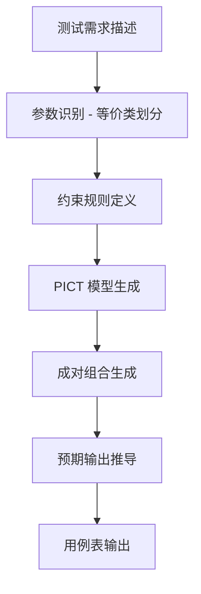

# 一个 Claude Skill 把 25,920 个测试用例砍到 30 个——微软的 PICT 终于有人打包了

做测试的应该都遇到过这种场景：

需求评审完了，参数表列出来了，手算一下全组合——八万多个用例。老板说周四要，排期两周。你只能凭经验挑几个"看起来容易出问题"的，测完心里完全没底。

这不是不认真，这是穷举测试在真实项目里根本跑不动。

最近 GitHub 上有人把微软内部用了十几年的成对组合测试工具 PICT，打包成了一个 Claude Skill。项目叫 **pypict-claude-skill**，作者是 omkamal。

一个 Claude Skill，让 AI Agent 自动用微软 PICT 的成对组合测试方法论，从需求参数表生成最小覆盖的测试用例——把 25,920 个用例缩到 30 个左右，而且覆盖不漏。

---

**1. 成对组合测试，不是穷举而是数学省力**

PICT 的核心逻辑：大部分 bug 是由单个参数或两个参数交互触发的，三个以上参数同时出问题的概率极低。所以不跑所有组合，只覆盖所有"两两组合"——覆盖率不掉，用例数能砍掉 99% 以上。

项目文档里 ATM 系统的例子很直观：8 个参数，每个 3-5 个取值，穷举 25,920 个用例，PICT 约 30 个。

**2. 自动从需求建参数模型**

你不需要自己写 PICT 模型文件。在 Claude 里直接说人话：

```
Design test cases for a login function with username, password, and remember me checkbox.
```

AI 会自动分析出参数、取值、约束条件，生成 PICT 模型，然后跑出最小用例集。这个"从人话到模型"的转换，是它最值钱的地方——之前用 PICT 得先学它的语法，现在直接说需求就行。

**3. 支持业务约束规则**

现实世界的参数不是随便组合的——macOS 上不可能有 IE 浏览器，4GB 内存的机器不可能跑 macOS。这些约束在模型里写清楚，PICT 生成时会自动跳过无效组合：

```
IF [OS] = "MacOS" THEN [Browser] <> "IE";
IF [Memory] = "4GB" THEN [OS] <> "MacOS";
```

**4. 自动推导预期结果**

不只是生成参数组合。每个用例的"预期输出"也是 AI 根据业务逻辑推导的——从 "Login succeeds, user redirected to dashboard" 到具体报错信息，都写得清楚。这一步省掉了手动填预期结果的重复劳动。

**5. 覆盖场景不限于 API 测试**

项目文档列出的适用场景包括函数/API 测试、系统配置组合、表单验证、用户认证流程、浏览器兼容性、移动端设备/OS/屏幕组合、硬件接口测试——基本覆盖了日常测试工作里需要做参数组合的场景。

**6. 安装方式够多，零门槛上手**

提供了 5 种安装方式，从插件市场一键安装到 git clone 到下载 ZIP 包都行。最省事的两行：

```bash
/plugin marketplace add omkamal/pypict-claude-skill
/plugin install pict-test-designer@pypict-claude-skill
```

**7. 附带了完整的 ATM 真实示例**

项目里有一个完整的 ATM 系统测试用例集，从规格文档到 PICT 模型到最终 31 条测试用例，全部可查。这不是理论演示，是能直接参考的模板。我看了下，ATM 系统的参数有 8 个维度——交易类型、卡类型、PIN 状态、账户类型、金额、现金余额、网络状态、卡片状况——每个维度 3-5 个取值，31 条用例覆盖了全部两两组合。

**8. 有最佳实践指南，不教人瞎用**

文档里专门给了参数命名的建议、等价类划分的写法、边界值怎么取、预期输出怎么写——都是具体到例子级别的指导。比如不要写 "Works" 或 "Success" 这种模糊的预期，要写 "Login succeeds, user redirected to dashboard"。

---

这个 Skill 的流程说白了就是"需求 → 模型 → 用例"的自动化管道：



---

**安装**

推荐走插件市场，最简单：

```bash
/plugin marketplace add omkamal/pypict-claude-skill
/plugin install pict-test-designer@pypict-claude-skill
```

装完重启 Claude Code，就能用了。

**命令速查**

| 用途 | 命令 | 说明 |
|------|------|------|
| 插件市场安装 | `/plugin marketplace add omkamal/pypict-claude-skill` | 添加市场源 |
| 安装 skill | `/plugin install pict-test-designer@pypict-claude-skill` | 自动保持更新 |
| 个人目录安装 | `git clone ... ~/.claude/skills/pict-test-designer` | 所有项目可用 |
| 项目级安装 | `git clone ... .claude/skills/pict-test-designer` | 仅当前项目 |
| 子模块共享 | `git submodule add ...` | 团队共享 |
| 验证安装 | 直接问 Claude：`Do you have access to the pict-test-designer skill?` | 确认可用 |

**使用**

安装后直接问 Claude：

```
Design test cases for a login function with username, password, and remember me checkbox.
```

AI 会自动完成：需求分析 → 参数识别 → 约束建模 → 用例生成 → 预期输出 → 表格输出。

---

这个项目不是它把测试用例数砍了 99%，而是它把"测试设计方法论"这件事做成了 AI Agent 能理解、能执行的技能。

测试行业的痛点从来不是"跑用例"——自动化框架早就解决了。痛点一直是"设计用例"：怎么从一堆参数里找出最有效的组合，怎么保证覆盖不遗漏，怎么让新来的同事也能写出跟老测试一样质量的用例。

PICT 本身已经存在十几年了，微软内部一直在用。但把它装进 Claude Skill，让它从"你得先学会 PICT 语法才能用"变成"你说人话它就能出用例"——这个转换才是真正的价值。不过得说清楚，Pairwise 是"高覆盖、低成本"的折中方案，不是"零遗漏"，安全关键系统建议结合更严格的测试策略。

#测试 #PICT #成对组合测试 #Claude #开源工具 #质量保障 #自动化测试 #测试设计 #微软 #AI测试

---

