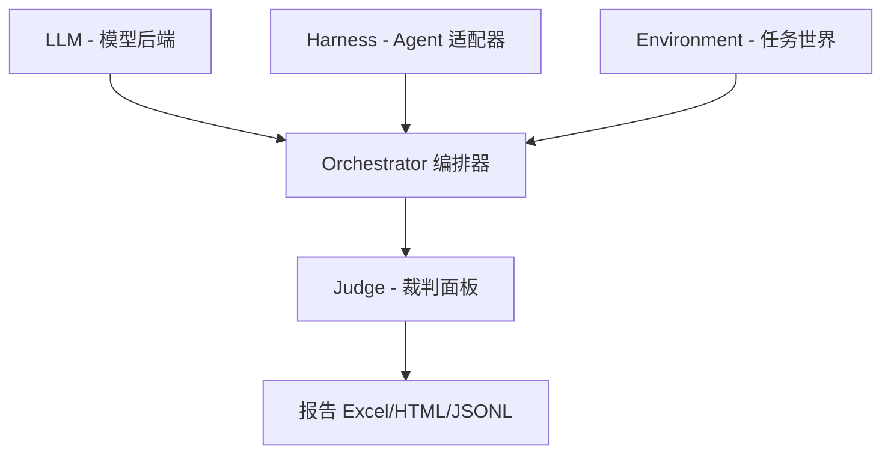

每次要对比两个模型、或者评估一个 coding agent 的真实能力时，最麻烦的不是"跑测试"，而是"搭评测框架"。写评测脚本、配裁判模型、处理结果格式、保证可复现——一套下来，正经工作还没开始，先搭了三天的轮子。

它把整个评测流程做成了一个自包含的 agent skill。你不需要手写评测脚本，只需要告诉 coding agent 你想评测什么，agent 自己会按流程走完。

**Eval-Anything 是一个 AI 评测框架，核心思路是"一条 pipeline，任意 coding agent 驱动"。装好之后，Claude Code、Cursor、Codex 等 agent 通过读一个 SKILL.md 就能自动执行完整的评测流程。**

---

**核心亮点**

**1. 评测即 skill——agent 自己读流程，自己跑**
整个评测流程写在一个 `skills/eval-anything/SKILL.md` 里，包含决策树、自动选择算法、模板和 4 道人工闸门。把这份 skill 喂给 coding agent，agent 用自己的 Read/Write/Edit/Bash 工具就能端到端跑一轮评测，不需要另外写脚本。

**2. 5 步流程 + 4 道人工闸门，全程可控**
流程是固定的：任务类型识别 → 数据集来源选择 → 自动选 harness → dry-run 确认 → 开跑出报告。中间 4 道闸门都会停下来让你确认——任务类型对不对、数据集选哪个、harness 配置要不要改、组合数确认后再开跑。不是黑盒，每一步都有机会修正。

**3. 支持任意 OpenAI 兼容的模型后端**
vLLM、SGLang、Ollama、DeepSeek、Qwen、Kimi、GLM……只要暴露 OpenAI 兼容的 API 端点，就能直接接入。也支持 Claude 原生 API（prompt caching、extended thinking、原生 tool_use）。配置写一行 YAML 就行。

**4. 三轴架构：LLM × Harness × Environment**
评测分成三个维度：LLM 是模型后端（模型本身），Harness 是外部 coding agent 适配器（用什么 agent 来跑任务），Environment 是任务世界（评测任务本身）。三轴可以自由组合，一个实验跑出 LLM × Harness 的成功率热力图。

**5. PoLL 多裁判面板，消除单模型偏见**
单个 LLM 做裁判会有自偏好问题——GPT 判 GPT 总是偏高。Eval-Anything 的 PoLL 方案是让多个跨家族的 LLM 独立打分，然后聚合。内置 15 个裁判模型目录，涵盖 OpenAI、Anthropic、Qwen、DeepSeek、GLM、Kimi、Gemini 和本地 vLLM。预设了 4 个面板：default（gpt-4o + claude-sonnet + qwen-max）、budget（便宜版，适合 CI）、frontier（最强版，适合发论文）、domestic（国产模型，适合国内部署）。

**6. 裁判面板的聚合规则全透明**
每个裁判的原始 JSON 打分全部保留。聚合规则不是黑盒：score 用 trimmed_mean（去掉最高最低）、passed 用多数决、labels 做 union 后按支持度过滤、disagreement 超阈值自动标记 panel_disagree。这些被标记的 case 是人工复核的黄金样本。

**7. 支持自包含任务目录 + 隐藏 rubric**
业务评测场景下，把任务文件和隐藏评分标准放在一个目录里，Environment 会按 `env.reset → harness.run(ctx) → env.grade(final_answer)` 三步走。Harness 是外部 coding agent，在任务目录里干活，产出最终答案；Environment 再用隐藏 rubric 和裁判面板给它打分。这比传统的 prompt 模板评测更接近真实场景。

**8. 报告产物丰富，7 种格式**
跑完一轮评测，自动产出 Excel（明细/汇总/对比热力图）、HTML 仪表盘（含热力图、维度雷达图、Elo 排行榜、校准卡）、Markdown 可解释报告、JSON 机器摘要、JSONL 完整轨迹、Markdown 案例研究。中途崩溃也没关系，结果已经落盘，`--resume` 跳过已有结果继续跑。

**9. 可扩展：新增 LLM / Harness / Environment 都有固定模式**
新增 LLM 只需继承 `BaseLLM` + `register_llm()` + 加 YAML 配置。新增 Harness 同理——继承 `ExternalAgentHarness`，实现一个 `run(ctx)` 方法。目前内置只有 ClaudeCodeHarness，但注册机制是公开的，Codex、OpenCode、Hermes 的适配器都在路线图上。

**10. 支持 Pairwise + Elo 排名**
绝对分数受 rubric 影响大，"哪个答案更好"才是人类真正能判断的。设置 `pairwise_judge` 后，每对输出会做头对头比较（含位置交换消除顺序偏差），然后聚合出 Elo 排行榜和胜率矩阵。

---

**快速上手**

安装：
```bash
# pipx 隔离（推荐）
pipx install "git+https://github.com/Rogerrrr18/Eval-Anything.git"

# 或源码开发模式
git clone https://github.com/Rogerrrr18/Eval-Anything.git
cd Eval-Anything
pip install -e .

# 加上 Claude Code harness（拉取 claude-agent-sdk）
pip install -e ".[claude-code]"
```

使用（Claude Code）：
在仓库根目录起会话，告诉它：
```
"把 skills/eval-anything/SKILL.md 当作 system prompt 读进来。
我想跑一个评测 / 对比这些模型 / 接入新 LLM / …"
```

其他 coding agent 同样适用：
```
"Read skills/eval-anything/SKILL.md，按里面规定的流程帮我设计 / 运行 / 解读评测。
所有人工确认环节直接向我提问。"
```

---

**命令速查**

| 阶段 | 命令 | 用途 |
|------|------|------|
| 安装 | `pipx install "git+https://github.com/...Eval-Anything.git"` | 隔离安装 |
| 安装 | `pip install -e .` | 源码开发模式安装 |
| 安装 | `pip install -e ".[claude-code]"` | 加装 Claude Code harness |
| 运行 | `eval-anything --experiment my_exp --config-dir configs` | 运行实验 |
| 恢复 | `eval-anything --experiment my_exp --config-dir configs --resume` | 崩溃后恢复（跳过已有结果） |
| 预览 | `eval-anything --experiment my_exp --dry-run` | 预览组合数，不实际跑 |

---

**架构示意**



每个任务三步走：`env.reset → harness.run(ctx) → env.grade(final_answer)`。Harness 是外部 coding agent，在任务目录里干活；Environment 用隐藏 rubric 和裁判面板给它打分。

```text
skills/eval-anything/
├─ SKILL.md                       ← 入口路由：决策树 + 闸门规约
│
├─ references/                    ← Ground truth，agent 下笔前必须 Read
│  ├─ cli.md                      CLI 参数手册
│  ├─ configs.md                  4 类 YAML 的字段 schema
│  ├─ datasets.md                 任务类型 → 开源测试集映射
│  ├─ reports.md                  报告产物解读
│  ├─ extending.md                新增 LLM / Harness / Env 注册步骤
│  └─ harness-selection.md        Harness 自动选择算法
│
├─ workflows/                     ← 流程剧本
│  ├─ design-experiment.md        主流程：5 步 4 闸门
│  ├─ add-llm.md
│  ├─ add-harness.md
│  ├─ compare-models.md
│  └─ mock-dataset.md
│
└─ templates/                     ← Jinja 模板，agent 用 Write 工具落盘
   ├─ dataset.jsonl.j2
   ├─ environment.yaml.j2
   ├─ experiment.yaml.j2
   └─ mock_synthesis_prompt.md
   
   
   
   
   
①  任务类型识别              ──▶  闸门 1   确认任务类型 + Capability Contract
②  数据集来源选择            ──▶  闸门 2   开源 · Mock · 自有 · 混合
     └─ 走 Mock 分支         ──▶  闸门 2b  审核 3 条生成样例
③  自动选 harness            ──▶  闸门 3   看 YAML diff 后确认写盘
     + 生成 配置 YAML
④  --dry-run 展示组合数      ──▶  闸门 4   确认开跑
     + 预估耗时
⑤  跑完 · 读报告 · 输出洞察小结
```
---

**写在最后**

Eval-Anything 有意思的地方在于，它不是一个"你写评测脚本，它帮你跑"的传统框架，而是把评测流程本身做成了一份 agent 可读的 skill。这意味着评测设计、执行、结果解读，都可以由一个 coding agent 端到端完成，你只需要在 4 道闸门处确认。

几个值得一提的限制：目前内置的 Harness 只有 ClaudeCodeHarness，想用 Codex 或 Hermes 需要自己写适配器（不过注册机制已经留好了）。另外，PoLL 裁判面板的成本取决于你选哪个 preset——frontier 面板成本是 default 的 2-3 倍，适合发布前做最终验证，日常开发用 budget 面板就够了。

项目用 Python 3.10+，依赖管理走 pip/pipx，技术栈干净。GitHub 上已开源，想深入了解的可以去看源码和 `skills/eval-anything/` 下的完整 skill 文档。

详细参考 https://github.com/Rogerrrr18/Eval-Anything#%E4%B8%AD%E6%96%87

#EvalAnything #AI评测 #模型评估 #LLM #Agent #开源 #PoLL #ClaudeCode #codingAgent #GitHub