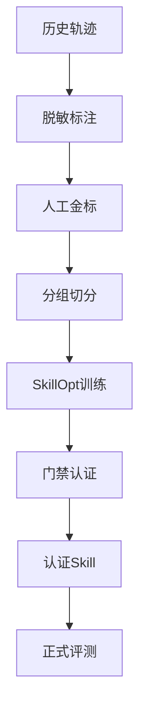

# 裁判也会判错：用 SkillOpt 给 LLM 评测系统的 Judge 补课

IM Agent 的黑盒评测，销售场景，Agent 要理解客户问题、查车源、推荐车辆、承接历史对话、合适的时机邀约。评测流程其实很简单：

```
Agent 回复 → Judge 用 LLM 判断对不对 → 出报告
```

那次跑了 50 个场景，结果 25 个 passed、21 个 failed、3 个 review、1 个基础设施报错。我当时盯着那 21 个 failed 发愁，愁的不是数字难看，是另一个问题：这里面有多少是 Agent 真错了，有多少是 Judge 冤枉了它？

举个很现实的例子：Agent 回答了实时车价，跟标准答案里的旧车价对不上，Judge 一看"和标准答案不一致"，判个 incorrect。可车源是动态的，价格本来就天天变，标准答案是迁移过来的历史数据，拿旧价当唯一真相，这不就是冤枉人吗？反过来也有风险，Agent 编了个像模像样的价格，Judge 被唬住了，直接放行。

**Judge 自己会判错。** 
它不准，报告里的 passed/failed 数字就不值得信，所以我们现在还留着人工 review 兜底——每一轮评测都要人再复核一遍。这就是很多 LLM 评测系统的真实状态：花了大价钱上 LLM Judge，结果还得人给它擦屁股。

那怎么办？我的答案是：给 Judge 也上个训练班。工具是微软开源的 SkillOpt。

## 这次到底解决了什么

先说清楚边界，避免误会。SkillOpt 是微软开源的**文本空间优化器**（PyPI 上当前是 v0.2.0），核心思路挺大胆：把一份 skill.md 文档当成冻结 LLM 的"可训练参数"，用类似神经网络训练的纪律来优化 prompt 文本。训练循环是 rollout → reflect（优化器模型分析失败轨迹）→ 有界的 add/delete/replace 编辑 → validation gate（候选编辑必须在留出集上严格变好才接受）→ 产出 `best_skill.md`。产物是一个 300 到 2000 token 的 markdown，推理时零额外模型调用，部署成本基本没有。

我们在这个项目里做的事，只聚焦一件：**根据 Judge 的真实误判记录，自动改写它的 prompt，让它判得更准。**

注意，训练的是**评测员（Judge）**，不是被测的 IM Agent。
一开始我们也想直接训练业务 Skill 让 Agent 变聪明，但查了测试 API 的请求字段，创建 Run 只能传机器人 ID、客户手机号、昵称、电话历史这些，没有 `skill_content`、`prompt_version` 之类的注入能力。没有候选 Skill 注入能力，SkillOpt 就没法比较不同业务 Skill 对同一批用例的影响，训练出来的东西没有因果意义。而三类 Judge 的 system prompt 是我们自己控制的，能注入候选 Skill、能拿到人工金标对比，这才符合 SkillOpt 的核心前提：目标模型冻结、Skill 文本是唯一训练状态、每次 rollout 有可靠分数、候选编辑必须过独立门禁。

所以方案的本质是一句话：**先用 SkillOpt 训练一套更可靠、可审计、可回滚的评测员操作手册，再用这套手册去评测黑盒 Agent。**

## 关键过程

### 为什么不能直接手改 prompt

刚开始我脑子里想的其实很简单：Judge 判错了？那我改 prompt 呗，加一句"车价以运行时事实为准"不就完了。

后来冷静了一下，手改 prompt 有三个老毛病。

第一，凭感觉改。看到一个 bad case 就加一条规则，但不知道这条规则会不会把原来判对的 case 改错。改好 1 个、弄坏 3 个，你根本不知道，因为你没有全量回放。

第二，没有验证。改完没有客观数字告诉你新版比旧版好还是差，全靠"我感觉这次准了"。

第三，改坏了回不去。prompt 越改越长，越改越乱，最后没人知道里面哪句话是干嘛的，也不敢删，删了怕出事。这就是典型的 prompt 技术债。

SkillOpt 把"改 prompt"变成一个有纪律的流程：拿一批人工确认过正确答案的误判样本，让优化器模型分析"Judge 为什么判错"，生成小幅修改（加一句、删一句、换一句，不允许大改），每个修改必须在另一批留出样本上验证判得更准才接受，变差就拒绝。循环几轮，输出改进版，附带前后准确率对比。

手改是拍脑袋，SkillOpt 是有考试的改。区别就在这。

### 五篇文章带来的五个结论

动工之前我们读了五篇 SkillOpt 相关文章，表述角度各不相同，但方法论结论高度一致，这五条后来直接写进了方案：

一是 Skill 是可训练的过程性知识。Skill 不是一次性 prompt，而是跨任务复用的流程、判断步骤、边界和错误规避规则。我们当时的三段 Judge prompt 已经有 Skill 雏形，但缺训练闭环。

二是轨迹必须带可验证结果。反思不能靠一两个 anecdotal bad case 就重写 prompt，训练样本必须包含：Judge 收到的脱敏输入、原始结构化输出、人工金标、判断证据、机器评分、场景族和风险标签。

三是修改必须是有界的。候选 Skill 只允许有限数量的增删改，避免一次大改同时动多个判断边界。首期用小编辑预算，不搞全量重写。

四是 selection gate 决定接受还是拒绝。训练集暴露误判模式，selection 集决定接受或拒绝，test 集只用于最终认证。不能拿 Judge 自己的输出当金标，也不能拿 test 结果继续改 Skill，否则就是自己考自己，自欺欺人。

五是安全约束和可训练策略必须分离。SkillOpt 适合训练"如何判断"的程序性规则，不适合自动改写业务红线。输出 JSON Schema、`correct/review/incorrect` 状态定义、动态车源事实的权威证据边界、意图判断不得从 Agent 回复反推、无权威事实时不得把动态数据判为编造……这些全部由固定契约或 Python 硬规则保护，训练只动判断步骤。

### 落地的四步闭环

工程上我们把它拆成了四步，每一步都有明确产物和门禁。

第一步是人工标注。从 50 场景那次运行里导出 49 条脱敏候选，每条包含 Judge 收到的输入、它的原始判断、场景族和风险标签，人工确认每条的正确答案应该是 correct、review 还是 incorrect。这是"教材"，没有它 SkillOpt 根本不知道什么算判错。标注记录的契约长这样，字段全是我们自己定的：

```json
{
  "id": "C2-JUDGE-CORRECTNESS-0001",
  "judge_type": "correctness",
  "input": {
    "history": [],
    "question": "这台车多少钱？",
    "expected_answer": "…",
    "actual_answer": "…",
    "runtime_vehicle_facts": {},
    "link_evidence": null
  },
  "gold": {
    "verdict": "correct",
    "required_points": [],
    "forbidden_points": [],
    "reason": "…"
  },
  "risk_tags": ["price", "runtime_vehicle_fact"],
  "scenario_family": "ask_price_first_turn",
  "review_status": "approved",
  "reviewer_count": 2
}
```

关键点有三个：`gold` 必须由人工审核填写，不能直接复制 Judge 当时的 verdict，否则就是拿判错的答案当正确答案，越练越歪；`scenario_family` 是后面切分数据的分组依据，保证同一问题族不会同时进训练和考试；`reviewer_count` 记录审核人数，严重错误、review 边界和动态事实样本至少要双人审核，分歧先仲裁再入库。

我们做了一个本地标注工作台，支持搜索、状态筛选、快捷键、草稿自动保存、断点续标、双人审核门禁、排除无效样本和 approved-only 导出，原始候选文件保持只读。启动它就一条命令：

```bash
./review-labels.sh
# 浏览器默认打开 http://127.0.0.1:8765
# 不想自动开浏览器就加 --no-open
```

!{{year}}年{八月}月-{{noteName}}.webp

第二步是切分数据。49 条按 `scenario_family` 分组隔离切成训练、验证、考试三份，考试那份锁死，训练期间绝不碰。这里有个细节：不能按记录随机切分，否则同一问题或参考答案的轻微改写可能同时进 train 和 test，等于考试漏题。标注完成后，从候选到切分的命令是：

```bash
# 校验已批准的人工标注
uv run c2-im-eval skill-data validate \
  datasets/judge_skills/v1/correctness_approved.jsonl \
  --require-approved

# 按 scenario_family 分组隔离切分 train / selection / test
uv run c2-im-eval skill-data split \
  datasets/judge_skills/v1/correctness_approved.jsonl \
  datasets/judge_skills/v1/splits
```

技术试点阶段 50 条按 30 / 10 / 10 切，只验证工程链路；正式认证至少 150 条，按组 60% / 20% / 20% 切，P0 高频意图和严重风险在 test 里必须有足够样本，test 在训练开始前生成哈希锁死。

第三步是训练。命令就一条：

```bash
./train-skills.sh correctness 2
```

脚本本身很短，作用就是检查前置条件然后调起训练：只支持 correctness 类型、epochs 必须是正整数、没有 approved 切分就直接退出码 2 拒跑——防止数据没准备好就瞎跑：

```bash
#!/usr/bin/env bash
set -euo pipefail

judge_type="${1:-correctness}"
epochs="${2:-2}"

if  "${judge_type}" != "correctness" ; then
  echo "当前只实现 correctness Judge Skill" >&2
  exit 2
fi
if ! [[ "${epochs}" =~ ^[1-9][0-9]*$ ]]; then
  echo "epochs 必须是正整数" >&2
  exit 2
fi
if  ! -f "datasets/judge_skills/v1/splits/split_manifest.json" ; then
  echo "缺少 approved 数据切分；先执行 c2-im-eval skill-data split" >&2
  exit 2
fi

uv run --group skillopt python scripts/train_judge_skill.py \
  --config configs/skillopt/correctness.yaml \
  --cfg-options "train.num_epochs=${epochs}"
```

训练参数全在配置文件里，核心是这几项：

```yaml
model:
  backend: azure_openai
  optimizer: tencent-tokenhub-deepseek-v4-pro   # 优化器模型：负责分析误判、生成编辑
  target: tencent-tokenhub-deepseek-v4-pro      # 目标模型：被优化的冻结 Judge
  azure_openai_auth_mode: openai_compatible

train:
  num_epochs: 2
  batch_size: 5
  seed: 42

optimizer:
  learning_rate: 2        # 文本学习率：限制每次编辑幅度
  min_learning_rate: 1
  skill_update_mode: patch  # 只做有界增删改，不全量重写

env:
  name: c2_correctness_judge
  skill_init: skills/judges/correctness/seed_skill.md
  split_dir: datasets/judge_skills/v1/splits
  out_root: runs/skillopt
```

注意 `optimizer` 和 `target` 是同一模型——一个是出题改卷的，一个是答卷的，两边分开配。`learning_rate: 2` 这种"文本学习率"就是限制每次编辑最多动几处，防止一次大改同时改坏多个判断边界。

SkillOpt 是可选依赖组，锁的是官方 0.2.0，我们通过一个薄启动器把自定义 benchmark 注册进去，不复制也不重写它的训练引擎：

```python
#!/usr/bin/env python3
"""把项目自定义 benchmark 注册到固定版本 SkillOpt 后启动训练。"""
import os

os.environ.setdefault(
    "AZURE_OPENAI_ENDPOINT",
    os.getenv("AI_APICLIENT_BASE_URL", "<内网网关地址>"),
)
os.environ.setdefault(
    "AZURE_OPENAI_API_KEY", os.getenv("AI_APICLIENT_API_KEY", "<API_KEY>")
)
os.environ.setdefault("AZURE_OPENAI_AUTH_MODE", "openai_compatible")

from scripts import train as skillopt_train
from c2_im_eval.skillopt_env import C2CorrectnessJudgeAdapter


def main() -> None:
    original_register = skillopt_train._register_builtins

    def register_with_c2() -> None:
        original_register()
        skillopt_train._ENV_REGISTRY[
            "c2_correctness_judge"
        ] = C2CorrectnessJudgeAdapter

    skillopt_train._register_builtins = register_with_c2
    skillopt_train.main()


if __name__ == "__main__":
    main()
```

那段 rollout 的核心逻辑是这样的：把固定契约和候选 skill 拼成 system prompt，调一次冻结的 Judge 模型，把返回结果和人工金标比对，算出 hard/soft 分数，整个对话轨迹落盘成 `predictions/<样本ID>/conversation.json` 供事后审计——全程只读离线标注数据，不创建 Run、不碰测试 API：

```python
def process_one(item, out_root, skill_content, *, target_call=None):
    item_id = str(item["id"])
    pred_dir = Path(out_root) / "predictions" / item_id
    pred_dir.mkdir(parents=True, exist_ok=True)

    skill = load_correctness_skill(skill_content)   # fixed contract + candidate skill
    user = json.dumps(item["input"], ensure_ascii=False)
    call = target_call or _default_target_call      # 注入 mock 可离线测

    result = {"id": item_id, "hard": 0, "soft": 0.0,
              "task_type": "correctness", "predicted_answer": "", ...}
    try:
        response = call(skill.system_prompt, user)   # 一次冻结模型调用
        result["predicted_answer"] = response
        prediction = parse_prediction(response)
        hard, soft = score_prediction(prediction, item["gold"])  # 与人工金标对比
        result["hard"], result["soft"] = hard, soft
        if not hard:
            result["fail_reason"] = f"verdict={prediction['verdict']}，gold={item['gold']['verdict']}"
    except Exception as exc:
        result["fail_reason"] = f"error: {type(exc).__name__}: {exc}"

    (pred_dir / "conversation.json").write_text(
        json.dumps(conversation, ensure_ascii=False, indent=2), encoding="utf-8"
    )
    return result
```

`target_call` 这个参数很关键——训练时传的是真实模型调用，写测试时可以注入假实现，官方 0.2.0 兼容测试就是这么跑的，18 个全过。

第四步是认证上岗。在锁定的考试集上对比新旧 prompt，依次过 Schema、Accuracy、Safety、Slice、Stability、Privacy、Report 七道门禁，过了才把 `C2_IM_CORRECTNESS_SKILL_PATH` 指向新文件，以后 `./run.sh` 正式评测就用新 Judge。没过就留在 rejected artifact 里，不许进正式评测，也不许看了考试集的 bad case 再回头改同一版本。

对日常评测的改动是零：`./run.sh` 用法完全不变，只是 Judge 背后的 prompt 换成了训练过的版本。切换方式是环境变量：

```bash
# 默认用 seed_skill.md；认证通过后指向新版本
export C2_IM_CORRECTNESS_SKILL_PATH=skills/judges/correctness/certified/best_skill.md
./run.sh
# 出问题一键回滚：取消环境变量，跑回 legacy prompt
```

而且正式评测的 `run.json` 会记录每个 Judge Skill 的来源和 SHA-256 哈希，哪次评测用了哪个版本的 Judge 一查便知：

```json
{
  "judge_skills": {
    "correctness": {
      "version": "c2-correctness-v1",
      "sha256": "…"
    }
  }
}
```

### 当前状态：链路通了，卡在人工标注

目前工程代码已经全部实现：Judge prompt 拆成了不可训练的 `contract.md` 和可训练的 `seed_skill.md`，run.json 记录 Judge skill 的来源和 SHA-256；SkillOpt 适配四件套（dataloader、rollout、adapter、scoring）写完，官方 0.2.0 兼容测试 18 个全过；训练入口和配置文件就位，缺 approved 数据时门禁主动拒跑、退出码 2，防止瞎跑。

唯一的卡点，就是那 49 条候选还没完成人工审核，approved 数量是 0。这一步不启动，训练就得等。这挺反直觉的——你以为用上了自动优化工具，结果最重的活还是人工。但仔细想想没毛病：SkillOpt 没有"人工确认的对错"就无从训练，自动化的地基恰恰是人工标注。

另外还有一个现实约束要说明：49 条只够跑通工程链路，证明这条管线是通的；真要宣称"Judge 变准了"，需要 150 条以上的人工标注。所以我们把它定位成技术试点，不提前吹牛。

### 一个具体例子

假设 49 条标注里发现一个规律：Judge 经常把"Agent 回答了实时车价，但与标准答案里的旧车价不一致"判成 incorrect，而人工认为应以实时数据为准，判 correct。

SkillOpt 的优化器模型分析这批误判后，往 prompt 里加一条类似"当运行时车辆事实与标准答案冲突时，以运行时事实为权威，不判编造"的规则，然后在验证集上确认：加了这条后这类 case 判对了、其他 case 没变坏 → 接受。攒几轮这样的修改，Judge 就系统性变准。

本质就是：把人工 review 时脑子里积累的经验，沉淀成 Judge 的 prompt，以后不用每次都靠人。

## 速览

| 能力/决策 | 读者收益 | 前提或代价 |
| --- | --- | --- |
| 用 SkillOpt 训练评测 Judge 而非被测 Agent | Judge 判得更准，报告可信，人工复核量下降 | 测试 API 需能注入候选 Skill 才有因果意义；否则先训练评测员 |
| 可训练 skill 与固定契约分离 | 业务红线、JSON Schema 永不被自动改写 | 需要把 prompt 拆成 contract.md + seed_skill.md |
| 有界编辑 + selection gate | 每次改动必须验证变好才接受，防止改好1个弄坏3个 | 需要独立留出集，训练集/验证集/考试集严格隔离 |
| 训练产物零推理开销 | 部署成本为零，产物只是几百 token 的 markdown | 目标模型冻结是前提 |
| 版本哈希 + 可回滚 | run.json 记录 Judge 版本，出问题一键切回 legacy | 需要版本化管理与显式配置启用 |
| 人工标注 49 条起跑通链路 | 工程闭环可验证 | 49 条只够试点；宣称"变准"需 150 条以上 |

## 工作流



## 经验感想

这个项目做下来，我最大的感受是：**LLM 评测系统里，最容易被忽略的偏差来源不是被测对象，是评测者自己。** 大家花大力气设计数据集、堆规则、上 Judge，但很少回头问一句：Judge 自己准吗？它的误判率是多少？谁在评测评测者？SkillOpt 给了一个很优雅的答案：把 Judge 的 prompt 当成可训练参数，用人工金标 + 有界编辑 + 独立门禁把它练准。

但代价也必须要讲清楚。一是人工标注是硬门槛，49 条跑通链路、150 条才敢宣称有效，标注质量直接决定训练质量，双人审核和分歧仲裁不能省；二是上游版本要锁死，PyPI 0.2.0 和 upstream main 的后端能力有差异，升级前必须重跑兼容性测试，我们锁了一个已核验的 commit，改动前都得重新验证；三是训练平面必须和正式评测平面物理隔离，训练循环里严禁调用真实测试 API，防止训练触发业务副作用，这条我们是靠代码门禁保证的。

下一步我们打算和 v5 带上下文数据集结合：v5 有 61 条 pilot，涵盖历史继承、覆盖、噪声干扰这十类场景，正好是 correctness Judge 最容易误判的领域。用 v5 跑一轮评测，把带 `context_contract` 的 Judge 轨迹导进标注候选池，给训练集补充上下文类误判样本，朝 150 条正式认证目标走。这条路不需要等人工 review 完成，就能先把轨迹和候选攒起来，和主线汇合。

最后说句实话：49 条还没标完，我们离"Judge 变准"还有一段路。但至少现在，改 prompt 这件事从"拍脑袋"变成了"有考试的改"——这已经值回票价了。


`LLM评测` `SkillOpt` `Prompt工程` `Agent评测` `AI工程化` `agent 评测`
