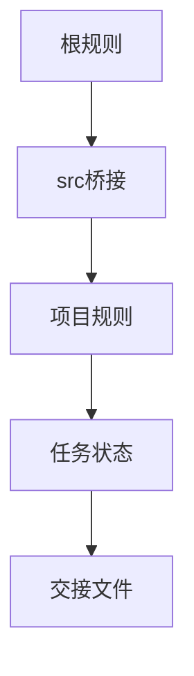
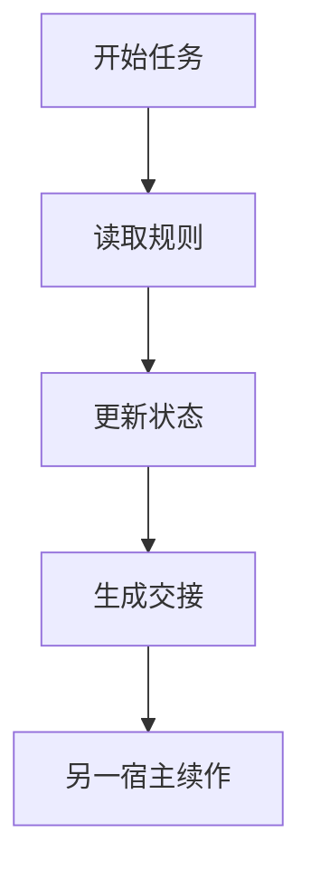
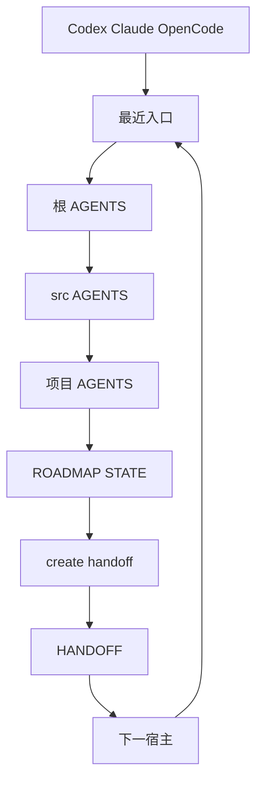
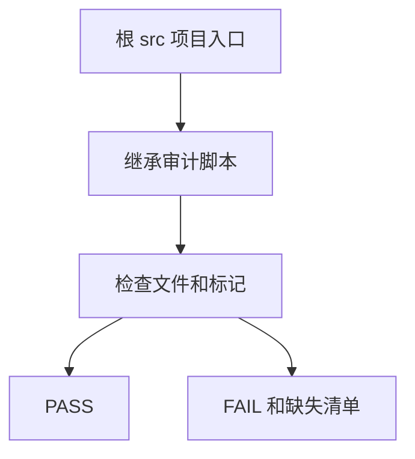

# 换了三个IDE后，我不再让Agent靠记忆续命

背景：一篇技术文章该调用工作区里的写作 Skill，Agent 却只看到了当前会话的技能清单。规则明明在父级文件里，项目目录也写着「继承」，但它没有真的进入工作上下文。文件躺在磁盘上，Agent 还是像第一次上班一样失忆，多少有点荒诞。

这里处理的是一个常见场景：上午用 Claude Code 做到一半，下午换 Codex，晚上又在 OpenCode 里打开项目。三个工具都很能干，但聊天记录不共享；如果任务状态只活在对话框里，切换一次就得重新考古。

## 这次到底解决了什么

改造把父级规则变成三层入口：工作区根是唯一总纲，`src` 放统一桥接，每个项目都有自己的 `AGENTS.md` 和 Claude Code 入口。优先级固定为用户要求、根规则、`src` 规则、项目局部规则。局部约束可以更严，不能偷偷把父级规则放水。

同时为跨工具交接增加 `HANDOFF.md`。它不保存模型的脑内想法，而是把接手者真正需要的文件、下一步和核对方式写到共享文件系统里。聊天可以断，现场不能断。

## 速览

| 部件 | 解决什么 | 不能解决什么 |
| --- | --- | --- |
| 父级规则桥接 | 让项目入口回读总纲 | 不能替代宿主的启动配置 |
| 继承审计 | 防止新项目漏掉入口 | 不能判断人是否认真执行 |
| HANDOFF.md | 让不同模型接着做 | 不能替代真实工作树核对 |

## 关键过程

三个宿主走同一条路：Codex 和 OpenCode 从项目 `AGENTS.md` 回读父级；Claude Code 额外从项目 `CLAUDE.md` 进入同一读取顺序。没有为每个 IDE 复制一大份规则，父级仍是单一事实源，项目文件只做强制跳转和本地补充。



工作区新增审计脚本，检查每个一级项目是否都有带统一标记的 `AGENTS.md` 与 `CLAUDE.md`，也检查三个宿主的启动引导。当前审计覆盖 22 个一级目录。

```bash
cd <workspace-root>
/usr/bin/python3 -B tools/verify_agent_inheritance.py
```

输出 `PASS` 才说明入口没有漏。它不证明 Agent 已经理解规则，但能先堵住「文件压根不存在」这种低级洞。

核心代码其实很短。它没有尝试解析自然语言规则，更不会假装能读懂模型有没有遵守；只检查一个可以客观验证的前提：根、桥接、三个宿主入口和每个项目的两个入口是否存在，并且是否带着同一个继承标记。下面是审计器的真实核心逻辑：

```python
MARKER = "<!-- code_project: parent-agents-required -->"
HOST_ENTRIES = ("CLAUDE.md", "bootstrap/codex.md", "bootstrap/opencode.md")

def verify(root: Path) -> list[str]:
    errors: list[str] = []
    for relative in HOST_ENTRIES:
        path = root / relative
        if not path.is_file():
            errors.append(f"缺少宿主启动入口：{relative}")
        elif MARKER not in path.read_text(encoding="utf-8"):
            errors.append(f"宿主启动入口缺少继承标记：{relative}")
    for project in project_dirs(root):
        for name in ("AGENTS.md", "CLAUDE.md"):
            path = project / name
            if not path.is_file():
                errors.append(f"项目缺少 {name}：{path.relative_to(root)}")
            elif MARKER not in path.read_text(encoding="utf-8"):
                errors.append(f"项目 {name} 缺少继承标记：{path.relative_to(root)}")
    return errors
```

审计器把遗漏变成非零退出码。它不检查 Agent 是否真的执行规则，后者仍要靠宿主的提示词装载、任务过程和人工复核共同兜底。

交接时用下面这条命令生成现场说明。接手者先读根规则、桥接规则、项目规则、ROADMAP、STATE 和 HANDOFF，再检查真实文件和验证记录；不是翻聊天记录猜上一位模型做到哪了。

```bash
/usr/bin/python3 -B tools/create_handoff.py tasks/active/<task> \
  --project src/<project> \
  --next-action '核对状态后继续实现'
```

## 工作流



## 先说问题：为什么「父级规则存在」仍然会失效

很多工作区都有根 `AGENTS.md`，每个项目也有自己的规则文件。看起来已经是继承结构，实际却常常像一份没有被 import 的配置：当 IDE 只把当前项目作为工作区打开，父目录不一定进入模型上下文；当项目规则写着「继承」，却又把本地规则排在父级之前，冲突时到底听谁的并不清楚；当新建项目忘了建入口文件，规则从第一天就断了。

更麻烦的是跨工具切换。Claude Code、Codex、OpenCode 的对话记录互不相通，模型无法继承前一个模型的临时记忆。真正可共享的只有仓库文件、任务状态、验证日志和工作树。如果这些文件没有约定好，所谓「继续上次任务」就会退化成读半天聊天记录，再猜一次。

## 改造目标：规则有唯一来源，状态有唯一现场

这轮改造定了两个很朴素的目标。第一，工作区根规则是总纲，项目规则只能补充，不能降低安全、验证、Skill、状态管理等父级要求。第二，跨 IDE 不传递聊天，传递可检查的任务现场。

为此，目录入口分成三层。根 `AGENTS.md` 定义全局约束和完成门禁；`src/AGENTS.md` 明确桥接顺序并定义新项目的最小入口；每个一级目录有本地 `AGENTS.md`，Claude Code 还配有 `CLAUDE.md` 桥接文件。三个文件都不复制整套总纲，只写明必须回读什么、冲突时谁优先。单一事实源仍在根目录，减少了一年后规则彼此打架的概率。

## 具体改造点：从文字约定到能失败的检查

第一处改造是优先级。以前有项目把本地规则放在工作区快速规则之前，这会让「全局必须调用某个 Skill」在局部目录里悄悄失效。现在顺序固定为：用户当前要求、根规则、`src` 桥接规则、项目局部规则。项目可以要求更严格的测试、限制外部环境、增加脱敏字段，但不能宣布父级规则不适用。

第二处改造是宿主适配。Codex 和 OpenCode 通过项目 `AGENTS.md` 进入继承链；Claude Code 通过项目 `CLAUDE.md` 进入同一条链。根目录的三个启动引导也重复这个读取顺序。这样不管是从工作区根启动还是直接打开项目目录，入口都在离任务最近的位置。

## 规则到底改在哪里：六个文件逐一展示

下面是这轮实际新增或统一的规则，不是示意图。根规则只保存一次总纲，其他文件只负责把不同宿主带回它，或者记录一次可核对的交接现场。

| 文件 | 新增或统一的规则 | 为什么放在这里 |
| --- | --- | --- |
| 根 `AGENTS.md` | 优先级、父级继承、审计、任务交接门禁 | 所有项目共享的唯一总纲 |
| `src/AGENTS.md` | 根、`src`、项目三层读取顺序 | 所有代码项目的统一桥接 |
| 项目 `AGENTS.md` | 从项目目录回读父级，局部规则不得放宽 | 直接打开项目时仍有最近入口 |
| 项目 `CLAUDE.md` | Claude Code 的同路径桥接 | Claude Code 识别的最近入口 |
| `bootstrap/codex.md`、根 `CLAUDE.md`、`bootstrap/opencode.md` | 三个宿主从工作区根启动时的读取顺序 | 宿主启动入口不各自发明规则 |
| `tasks/active/<task>/HANDOFF.md` | 接手前必读、当前事实、下一步和完成条件 | 让续作依赖文件现场，不依赖聊天 |

先看根 `AGENTS.md`。这里新增的是不可被项目局部规则改写的优先级、入口审计和交接动作。全局 Skill 触发也留在这一层，因此项目单独打开时仍必须回读它：

```markdown
### 父级规则继承（强制）

<!-- code_project: parent-agents-required -->

- `AGENTS.md` 是整个工作区的总纲。
- 统一优先级：用户当前明确要求 > 根 `AGENTS.md` > `src/AGENTS.md` > 项目局部规则。
- 项目局部规则只能补充，不得削弱、跳过或重排父级规则。
- 修改或新建 `src/*/AGENTS.md`、`src/*/CLAUDE.md` 后，必须运行继承审计。
- 切换未完成任务前，必须更新 `STATE.md`、生成 `HANDOFF.md`；接手者先读 HANDOFF 再继续。
```

`src/AGENTS.md` 不重复总纲，它只声明每个代码项目都必须经过的桥。项目 `AGENTS.md` 使用同一个标记和优先级，Claude Code 再由同目录 `CLAUDE.md` 带回这条链：

```markdown
# AGENTS.md - src workspace bridge

<!-- code_project: parent-agents-required -->

进入 `src/<project>/` 前，依次读取：

1. `../AGENTS.md`；
2. 本文件；
3. `<project>/AGENTS.md`。

项目文件只能增加更严格的业务、数据、安全或验证要求，不能放宽父级规则。
```

```markdown
# CLAUDE.md - project parent-rule bridge

<!-- code_project: parent-agents-required -->

Claude Code 打开项目时，开始任何任务前依次读取根 `AGENTS.md`、`src/AGENTS.md`、项目 `AGENTS.md` 和本文件。项目规则只能补充，不能放宽父级规则。
```

Codex、Claude Code、OpenCode 的根启动文件也各有一段同义入口：任务落在 `src/<project>/` 时继续读取根、`src`、项目规则。它们不保存各自版本的总纲，避免三个宿主日后各长出一套互相冲突的制度。

最后展示交接文件。`create_handoff.py` 只会为同时拥有 `ROADMAP.md` 和 `STATE.md` 的任务生成它；下面是实际生成内容的脱敏形态。它把「接手前先看什么、现在以什么为准、下一步干什么」固定下来：

```markdown
# HANDOFF - <task>

## 接手前必读

1. 工作区根 `AGENTS.md`
2. `src/AGENTS.md`
3. `<project>/AGENTS.md` 与 `CLAUDE.md`
4. 本任务的 `ROADMAP.md` 与 `STATE.md`

## 当前事实

以 `STATE.md`、工作树状态和最近验证输出为准；不要以聊天记录推断。

## 接手后的第一步

<明确的下一步>

## 交接完成条件

接手者已阅读上述文件、核对真实工作树和验证记录，并更新 `STATE.md` 后再继续实现。
```

## 它们怎么连接：读取链、脚本调用和交接链

这里容易产生一个误解：`AGENTS.md`、`CLAUDE.md` 和 `HANDOFF.md` 不是 Python 模块，它们之间没有 `import` 或函数调用。它们约定的是宿主和 Agent 的读取顺序。真正执行文件扫描或写入的，是审计脚本和交接脚本。

从任意宿主开始，一条完整链路如下。直接打开项目时，Codex 和 OpenCode 从项目 `AGENTS.md` 进入；Claude Code 先读同目录 `CLAUDE.md`，它再要求回读父级。无论入口在哪，最终都会收敛到根、`src`、项目三层规则。



这张图里的每一条边对应一个明确动作：

1. 宿主读取自己识别的最近入口。工作区根启动时用 `bootstrap/codex.md`、根 `CLAUDE.md` 或 `bootstrap/opencode.md`；直接打开项目时用项目 `AGENTS.md`，Claude Code 还会用项目 `CLAUDE.md`。
2. 最近入口要求 Agent 回读根 `AGENTS.md`，再读 `src/AGENTS.md` 和项目 `AGENTS.md`。规则按这个顺序叠加，后面的项目规则只能增加限制。
3. 根规则判断任务是否达到中等复杂度。达到时，Agent 创建或复用 `ROADMAP.md` 与 `STATE.md`；它们记录目标、当前状态、改动和验证，而不是替代业务代码。
4. 切换工具前，Agent 先更新 `STATE.md`，再实际调用 `create_handoff.py`。脚本检查 `ROADMAP.md` 与 `STATE.md` 是否存在，满足条件才写出 `HANDOFF.md`。
5. 下一宿主先读 `HANDOFF.md` 中列出的文件，再检查工作树和最近验证输出；随后按同一规则读取链继续。这让交接从聊天摘要回到可复核的文件现场。

审计是另一条独立的静态链路。它不启动任何 Agent，也不判断自然语言规则的质量；它遍历文件并检查入口、标记和项目目录是否齐全：



实际操作的先后顺序也可以压缩成两条命令。前一条用于规则入口改动后的结构审计，后一条用于任务切换前生成交接现场：

```bash
cd <workspace-root>
/usr/bin/python3 -B tools/verify_agent_inheritance.py

/usr/bin/python3 -B tools/create_handoff.py tasks/active/<task> \
  --project src/<project> \
  --next-action '核对 HANDOFF、STATE、工作树和最近验证后继续'
```

审计返回 `PASS` 只表示读取入口完整；交接脚本成功只表示 `HANDOFF.md` 已写入。Agent 是否真的遵守规则，仍由下一位接手者读取文件、检查工作树和重跑验证来确认。

第三处改造是审计。新增脚本回答一个具体问题：此刻有多少一级目录真的具备两个入口？脚本检查根、`src`、三个宿主引导，以及每个一级目录的 `AGENTS.md` 和 `CLAUDE.md` 是否含统一标记；缺任一个就返回非零。当前结果是 22 个一级目录通过。

```text
工作区根规则
  ├── src桥接规则
  │     ├── 项目AGENTS入口
  │     └── 项目CLAUDE入口
  ├── 宿主启动引导
  └── 审计脚本与回归测试
```

## 一个交接实例：Claude Code 做到一半，Codex 怎么接

假设 Claude Code 已经完成了数据迁移的前半段：方案在 ROADMAP，已改文件和测试结果在 STATE，下一步是补迁移校验。此时不需要让 Claude 写一封长篇聊天总结，更不需要把上下文复制给 Codex。切换前生成 `HANDOFF.md`，把项目位置、接手前必读文件和下一步写入任务目录。

Codex 打开后依次读取根规则、桥接规则、项目规则、ROADMAP、STATE 和 HANDOFF，再用 `git status`、diff、测试输出核实。它接到的是一份可反证的现场：若 STATE 说测试通过，接手者可以重跑；若 HANDOFF 说下一步是某个文件，接手者可以检查它是否已经被改过。

这条原则有点像数据库里的写前日志，出事时不能只剩记忆。

## 怎么在自己的仓库落地

这里给一个从零落地的顺序。顺序不能倒：没有唯一规则源就先铺入口，只会把冲突复制到更多文件；没有可执行审计就急着要求 Agent 遵守，最后只能靠肉眼巡检。

1. 先盘点现状。列出根规则、项目规则和各宿主入口，找出优先级冲突、缺失入口和历史遗留的局部规则。盘点阶段不改内容，先知道哪些规则是事实、哪些只是猜测。
2. 再收敛权威来源。把全局 Skill、验证、状态管理和安全边界留在根 `AGENTS.md`；明确优先级为「用户要求 > 根规则 > `src` 桥接 > 项目局部」。项目文件只新增更严格的限制，不能改写这个次序。
3. 写两层短桥接。`src/AGENTS.md` 只负责声明三层读取顺序；每个项目的 `AGENTS.md` 只负责强制回读父级并补充业务约束。Claude Code 还要有同目录 `CLAUDE.md`，把它带回同一条链。不要复制根规则全文，否则三个月后必然漂移。
4. 把入口检查写成脚本，并先写反例测试：删掉一个项目的 `CLAUDE.md`、删掉一个继承标记，都应得到失败；完整入口才应通过。这里检查的是结构契约，不是自然语言质量。
5. 最后再处理续作。中等以上任务一开始创建 `ROADMAP.md` 和 `STATE.md`；切换宿主前生成 `HANDOFF.md`；接手者先读文件和验证记录，再看工作树。这一步解决的是「换工具后不知道上一位做了什么」，不是规则加载本身。
6. 每次新建项目或改入口都运行审计；每次接手都核对 `git status`、差异和最近验证。审计失败就先修入口，状态与工作树不一致就先修现场，二者都不要靠聊天记录蒙混过关。

桥接文件只需要做一件事：把读者带回权威规则。下面是 `src/AGENTS.md` 的最小真实形态，项目规则沿用同样的优先级，不另造一份总纲。

```markdown
# AGENTS.md - src workspace bridge

`src/` 下任一目录都继承工作区根 `../AGENTS.md`。进入项目时依次读取：

1. `../AGENTS.md`；
2. 本文件；
3. `<project>/AGENTS.md`。

规则优先级固定为：用户当前明确要求 > 工作区根 `AGENTS.md` > 本文件 > 项目局部规则。
```

接手动作也应当由工具生成，而不是让每个模型凭心情写总结。这个命令会拒绝一个没有 `ROADMAP.md` 或 `STATE.md` 的任务目录，避免生成一份空壳交接：

```bash
cd <workspace-root>
/usr/bin/python3 -B tools/create_handoff.py tasks/active/<task> \
  --project src/<project> \
  --next-action '先读 HANDOFF、STATE 和最近验证，再继续实现'
```

规则源决定「应当做什么」。最近入口提高「能否被读到」的概率，审计负责「入口有没有断」，任务现场负责「换工具后如何续作」。入口、审计和任务现场都不能替代规则源。

## 已验证效果和仍然存在的限制

继承审计通过，标准库回归用例覆盖完整入口、缺少 Claude 入口、缺少继承标记三种情形；交接工具能在任务目录生成 HANDOFF；三个宿主的引导文件都写入相同的父级读取顺序。

限制也要讲清楚。静态审计只能证明入口存在，不能证明每一个 Agent 每次都认真读了；宿主启动配置仍需要团队按各自 IDE 的方式选择正确工作区根；一个没有版本历史的旧项目局部规则文件仍待恢复。这套护栏让错误更早失败，让交接更容易复核。

## 经验感想

规则写得再漂亮，如果没有入口、没有审计、没有交接产物，它很容易变成高级电子阅读理解。目标是让错误更早暴露，并且让换工具这件事不再把任务打回原始社会。

这轮改造还留着一个诚实的边界：一个历史项目的局部规则文件没有可恢复的版本，当前只保留了统一继承入口，原内容仍待确认。因此「22 个入口已审计通过」不等于「所有历史局部规则都已无损复原」。把这个限制留在任务状态里，比假装全绿更有用。

## 

`Codex` `Claude Code` `OpenCode` `工程治理`
