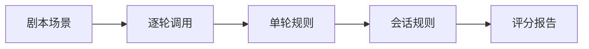
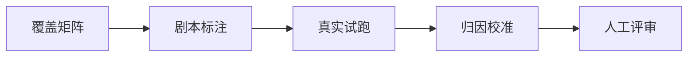

# 客服机器人最难测的，不是答错一句话

一段客服对话里，第一句不邀约，第三句才邀约，用户答应之后不再推新话题。这三件事拆开看都很普通，合在一起才是用户真正感受到的服务。以前把会话切成「最后一问加冻结历史」来测，省了一次次调用，却把最难的部分切没了。

这次重构把评测单位换成完整会话：用户消息逐轮进入测试环境，系统自己的回复成为下一轮上下文，对话结束后再判断整条链路。它适用于需要跨轮状态判断的客服、销售和服务型 Agent；不适合拿来替代低成本的单轮冒烟测试，后者仍然有价值。

## 这次到底解决了什么

旧方案能判断一句回复有没有答偏，却很难判断「该不该现在邀约」「是否错过收口」「用户已答应后有没有又报价」。新方案把规则拆成单轮和会话两层，硬红线交给代码，语气、覆盖度和上下文连贯性再交给独立 Judge。

## 速览

| 决策 | 带来的收益 | 代价 |
| --- | --- | --- |
| 逐轮真实执行 | 测到系统自己产生的上下文 | 调用成本随轮数增加 |
| 固定剧本加探索场景 | 既能回归也能找长尾问题 | 需要持续评审和维护 |
| 行为断言代替文本 diff | 不被措辞波动牵着跑 | 参考要点要写得克制 |

## 关键过程

数据分成两条线。50 条 scripted 用例把关键链路固定成 2 到 5 轮的剧本，覆盖无信号答疑、购买信号、确认到店、拒绝处理、多意图和错误前提；30 条 exploratory 场景只固化画像和测试使命，让测试 Agent 在真实回复上继续追问。前者保证可比，后者负责捞出剧本外的问题。

剧本关注行为契约；示例已脱敏：

```json
{
  "signal": "price_or_finance",
  "expect": {"invite": "should", "reference_points": ["说明需按条件核算", "自然收口"]},
  "session_expect": {"close_within": 1, "no_repeat_invite_after_accept": true}
}
```

这一段解决的是措辞波动：回答可以换说法，不能跳过应答的动作，也不能在用户答应后重新推销。



实际实现保持朴素：Runner 逐轮执行，结束后调用会话校验器。它会检查无信号时的过早邀约、信号后的超窗未收口、确认后继续报价或重复邀约。随后才做 Judge 评分和报告汇总。

会话结束时，确定性代码先把每轮回复折成文本，逐轮查「不允许邀约」和「确认后只能确认」，再查整段的收口窗口。为避免公开业务词库，下面保留真实控制流，省去具体正则。任一命中都返回带轮次和证据的 critical 结果。

```python
def evaluate_scripted_session(scenario: dict, turns: list[dict]) -> list[RuleResult]:
    expects = scenario["script"]["turns"]
    reply_texts = ["\n".join(turn.get("replies", [])) for turn in turns]
    invited = [detect_invite(text) for text in reply_texts]
    results: list[RuleResult] = []

    for index, expect in enumerate(expects[:len(turns)]):
        if expect["expect"].get("invite") == "must_not" and invited[index]:
            results.append(RuleResult("INVITE_PREMATURE", "critical", f"第{index + 1}轮过早邀约"))
        if expect["expect"].get("invite") == "confirm_only" and (
            PRICE_AMOUNT.search(reply_texts[index]) or RECOMMEND.search(reply_texts[index])
        ):
            results.append(RuleResult("NEW_TOPIC_AFTER_ACCEPT", "critical", f"第{index + 1}轮确认后又加推"))

    chain = scenario["script"]["session_expect"].get("invite_chain")
    if chain:
        signal_turn = chain["signal_turn"]
        window_end = min(signal_turn + chain.get("close_within", 0), len(turns))
        if not any(invited[signal_turn - 1:window_end]):
            results.append(RuleResult("INVITE_NOT_CLOSED", "critical", "购买信号后未在窗口内收口"))
    return results
```

真实项目还额外检查确认后重复邀约，并在每一轮先执行手机号、无依据承诺、未知金额、链接等单轮红线；这些不交给 Judge。Judge 只在硬边界已经确定之后评价自然度、覆盖度和上下文连贯性，这样它的波动不会把业务禁止项判成「还行」。

下面这条命令是项目当前的离线回归入口。它不会发起真实聊天，输出通过才说明规则与加载器没有被改坏：

```bash
cd projects/wechat_eval_agent
uv run --with pytest python -m pytest tests/ -q
```

首次 50 条真实试跑得到 25 通过、22 失败、2 复核和 1 次 Judge 异常。这里最容易犯的错，是把失败数直接当成产品结论。后续定点复跑和规则校准把问题拆开：有真实机器人缺陷，有本次未复现的有效场景，有规则误判，也有短暂基础设施异常。产品、评测和研发据此分别定位机器人、规则和运行环境的问题。

## 工作流



## 从单轮切片到会话：旧方案究竟漏掉了什么

旧数据的形态并不差：一条用户问题，加上一段冻结历史和必要事实，调用一次就能得到一次判断。它很适合检查事实有没有答错、链接是否可用、是否出现明显违规词。问题在于，历史里的机器人回复不是本次被测系统生成的；被测系统实际上是在别人的上下文里答最后一问。

这会制造两种很隐蔽的错觉。第一种是误判。用户首轮只是询问基础信息，客服没有邀约本来是合适的；若只截取这一轮，很容易把「没有收口」判成问题。第二种是漏判。用户后来已经问了价格、分期或看车，机器人却连续几轮都没有自然收口，单轮切片很难发现这条链路从头到尾都断了。

新方案保留单轮测试，让它负责每轮都能确定的红线；完整会话负责需要看状态变化的行为。成本增加是真事，但把钱花在能解释的调用上，比用廉价样本得到一个漂亮却没法行动的分数划算。

## 数据集怎样组织，才能既稳定又不僵硬

项目把数据、执行和评测分开。数据集只保存用户侧的场景、逐轮问题和期望，不保存机器人在某次试跑中的回复；执行层每次都从测试环境取得新回复；评测层从逐轮记录和整段 transcript 生成规则结果与 Judge 输入。这样规则改了可以重跑，报告改了可以从结构化运行结果重生成，谁也不需要手工修 HTML。

```text
datasets/
  draft/scripted/       固定剧本与覆盖矩阵
  draft/exploratory/    画像和探索使命
  approved/             人工复核后才能进入的正式场景
src/
  scripted.py           加载器、逐轮执行者和会话校验器
  runner.py             调用、记录、汇总和清理
tests/
  test_scripted.py      加载、状态和正负例回归
```

状态字段记录每轮的购买信号、邀约期望、参考要点和条件化期望；整段会话还记录信号发生轮、允许收口窗口、确认后不重复邀约等约束。失败因此能落在一句清楚的话上：第几轮、什么信号、违反了什么行为。

## 一个完整例子：邀约时机

假设用户第一轮问基础车况，第二轮转而问分期，第三轮说准备到店。三轮分别对应无信号、购买信号和确认信号。期望规定每一段的业务边界：第一轮不能硬拉；第二轮需要在回答后自然提供下一步；第三轮只能确认安排，不能又报价、推其他商品或再发起一次邀约。

会话校验器需要四类明确结果：过早邀约、未在窗口内收口、确认后开启旧话题、确认后重复邀约。任一项都属于服务流程错位，归为 critical。回答是否自然、是否充分承接多意图、前后是否自洽，再交给独立 Judge。

## P4 为什么先做归因，再谈通过率

真实试跑之后，团队先做了两批定点复跑：一批针对失败和异常候选，另一批针对怀疑规则误判的候选。

一类问题确实是产品缺陷，例如无信号过早邀约、遗漏收口、确认到店后又加推、错误前提被顺着说、用未经证实的「几成新」做承诺；这些应该保留为回归证据。另一类是模型行为波动：首跑出现、复跑没有再出现的场景也不能删，它提醒我们需要多次 trial 或人工复核。还有一类是规则本身过窄，例如自然邀约不只会写「到店」，也可能是预约、安排接待、备车、试驾；规则需要扩充，但绝不能靠放松到失去约束。

## 一套可以照着做的实施教程

如果要把这套方法迁到自己的客服或销售 Agent，建议严格按下面的顺序做。先接 LLM Judge 会让业务禁止边界在评分后才暴露。

1. 先按状态转折设计测试。对每个关键链路写出「没有信号」「出现购买或解决信号」「已确认下一步」「明确拒绝」等状态，再为每个状态写允许与禁止的动作。只有每轮都能判定的规则，才进入硬规则。
2. 再定义最小数据契约。每轮至少包含 `question`、`signal`、`expect.invite`；会话补充 `signal_turn` 与 `close_within`。先在加载器中拒绝空问题、未知枚举和越界轮次，避免运行结束才发现数据根本不能解释。
3. 先写正反例测试，再写规则。至少覆盖：无信号却邀约必须失败；信号后窗口内自然收口必须通过；已确认后加推或重复邀约必须失败。下面这两个真实断言就是校准时的最小护栏：

```python
codes = [item.code for item in evaluate_scripted_session(scenario, turns)]
assert "INVITE_NOT_CLOSED" in codes

assert evaluate_scripted_session(scenario, turns_with_natural_close) == []
```

这一步先锁住业务边界，后面扩充 `detect_invite` 的自然表达时，才不会把「能识别更多邀约」误改成「什么都算收口」。

4. 接入 Runner，但保持执行和评分分离。Runner 每轮只做四件事：取下一条用户动作、调用被测机器人、保存真实回复、执行单轮规则；会话结束后再调用 `evaluate_scripted_session`，最后才把 transcript 交给独立 Judge。`run.json` 是唯一运行事实源，HTML 必须从它生成，不能手改报告掩盖问题。
5. 先跑离线回归，再做小样本真实试跑。离线命令不触发聊天副作用，适合每次改规则后运行；真实环境只用已批准场景，并确保每个 Run 可清理。

```bash
cd projects/wechat_eval_agent
uv run --with pytest python -m pytest tests/test_scripted.py -q
uv run wechat-eval-agent validate datasets/approved/scenarios.json
```

两条命令都通过，说明加载契约和 scripted 回归没有被改坏；它们不等于真实机器人质量通过，真实试跑需单独授权和留存运行证据。

6. 真实失败先归因，再改任何东西。把失败分为机器人缺陷、模型波动、规则误判、基础设施异常、事实或策略待确认五类。原始失败一条也不删除；对每类候选做定点复跑，规则误判才调整规则，事实边界不清就先留在 `draft/review`，不要塞进 `approved`。
7. 最后才建立门禁和报告。确定性 critical 或运行错误直接失败；硬规则通过后再消费 Judge 核心维度。改了数据、规则或门禁，要重新评分并从结构化结果重新生成报告，同时记录为什么改、影响哪些用例。

这条顺序把「规则遵循」拆成了可测试的链条：数据契约防止用例歧义，单轮与会话规则防止业务越界，正反例防止规则漂移，归因防止把错误修到错误地方，人工 review 防止未经确认的事实变成基线。

## 目的、优势与适用边界

这套方案让评测结果可行动：产品同学能知道应改提示、规则还是事实源；评测同学能知道要修用例、正则还是 Judge；研发能从结构化证据复现问题。

它特别适合有明确阶段转换的对话：售前咨询、客服工单、预约服务、风控核验。若任务只有一次性问答，完整会话反而可能是过度设计；保持一个干净的单轮回归层更合适。即便在多轮场景中，也要接受它的代价：实时环境会变、模型会波动、人工 review 不能省。

## 经验感想

多轮 Agent 的问题经常来自状态没切换，或者前一轮承诺和后一轮动作打架。固定剧本把那些用户真会在意的转折点钉下来。

这件事还没到宣布大功告成的时候。当前数据仍是草稿，少数事实和政策边界等待人工 review，探索型场景也尚未接入正式门禁。这个慢一点的步骤很值：把未经确认的样本塞进 approved，只会给后续回归埋一颗更难找的雷。

## 

`LLM评测` `多轮对话` `数据集工程` `Agent`
