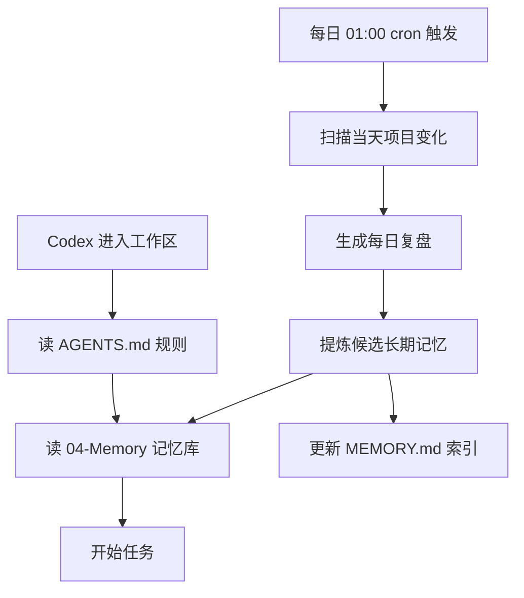

# 给 Codex 配一个 Obsidian 外置记忆库：跨项目永久记忆 + 每天凌晨 1 点自动复盘


Codex（以及 Claude Code、OpenClaw 这类 coding agent）最大的毛病不是"代码写得差"，而是"记不住"——换一个项目目录、隔几天再回来，它就像失忆了一样，把之前定过的规则、踩过的坑、偏好的工作流全忘了，每次都从零开始。

解决办法不是给它更大的上下文窗口，而是给它一个**外置记忆库**：用 Obsidian 当仓库，把长期规划、偏好、项目状态、工作流决策全部落盘成 Markdown，通过 `AGENTS.md` 告诉 Codex"每次动手前先来读这个目录"，再配一个每天凌晨 1 点的 cron，自动把当天所有项目变化整理成复盘、提炼出候选长期记忆。

这样 Codex 的记忆就不是"藏在聊天记录里"，而是"躺在磁盘上、可检索、可复用、可跨项目"。

本文要落地的东西，全部基于一个真实工作区（Alan-Workspace）已经在跑的结构来写，不搞空谈。

---

## 为什么要外置记忆，而不是靠上下文

先分清两个概念：

**上下文（Context）** 是临时的。它跟着对话走，会话一结束、目录一切换，就没了。你在 Codex 里手把手教它"这个项目要用 xx 规范"，它下次大概率忘。

**记忆（Memory）** 是持久的。它应该独立于任何一次会话存在，谁需要谁去读，跨项目、跨时间都能拿到。

Context 可以短，Memory 必须长。而 Obsidian 的价值在于：它本身就是本地 Markdown 文件，天然适合当"Codex 的磁盘记忆"——Codex 能直接读文件，不需要额外接口；同时 Obsidian 又能给人类做可视化检索、双链、图谱。

所以整套方案的核心就一句话：**把"Codex 该记住的东西"从对话里搬进 Obsidian，再用规则和定时任务保证它持续被写入、被读取。**

---

## 第一步：搭记忆库的目录骨架

外置记忆库不能是一堆散落的 `.md`，得有分区。否则 Codex 读的时候分不清哪个是"规则"、哪个是"状态"、哪个是"废话"。

参考一个已经在用的工作区，记忆库建议按职责分这几个区：

```
Vault/
├── AGENTS.md                     # Codex 的读取规则入口（必读）
├── 04-Memory/
│   ├── MEMORY.md                 # 长期记忆总入口 / 索引
│   ├── README.md                 # 记忆区使用说明
│   └── topics/                   # 按主题沉淀的正式记忆
│       ├── cron-jobs.md          # 定时任务运行记录
│       └── topic-extraction-candidates.md  # 待提炼的候选长期记忆
├── 02-Notes/                     # 每日复盘、驾驶舱、正式笔记
├── 03-Projects/                  # 各项目状态（每个项目一个 README）
├── 30-Tasks/                     # 计划与待办（日/周计划）
├── 40-Review/                    # 周/月/年度复盘
├── 00-Inbox/                     # 临时收集，定期整理
└── 70-System/                    # 系统层：脚本、规则、模板
```

关键点：

- **`04-Memory/` 是正式长期记忆区**，只放"稳定的、可复用的结论"，不放流水账。
- **`topics/` 按主题拆记忆**，比如 cron 运行记录、候选记忆提取，避免所有结论堆在一个文件里。
- **`MEMORY.md` 是总入口**，Codex 每次先读它，再按需跳转。
- **`AGENTS.md` 是"门卫"**，告诉 Codex 记忆库在哪、怎么读、什么时候读。

如果之前没有这类结构，直接按上面建目录即可。已有的话，重点是把"记忆"和"流水账"分开——记忆区只放能复用的，临时内容一律先进 Inbox。

---

## 第二步：用 AGENTS.md 指定 Codex 的读取规则

`AGENTS.md` 是 Codex 默认会读的规则文件。它的作用不是写代码规范，而是**告诉 Codex 记忆库的用法**。

一个可直接套用的骨架：

```markdown
# 工作区规则

> 这个 Vault 是你的长期知识库与记忆库。所有可复用的内容都应落盘到这里。

## 启动顺序（每次任务前必读）
1. 04-Memory/MEMORY.md（长期记忆总入口）
2. AGENTS.md（本文件，规则）
3. 当前项目目录下的 README / 状态文件

## 记忆库分区（强约束）
- 04-Memory/        正式长期记忆（只放稳定结论）
- 02-Notes/         每日复盘、驾驶舱、正式笔记
- 03-Projects/      项目状态（每个项目一个 README）
- 30-Tasks/         计划与待办
- 40-Review/        复盘总结
- 00-Inbox/         临时收集，定期整理
- 70-System/        系统层：脚本、规则、模板

## 落盘规范（必须）
- 所有 Markdown 顶部必须有 frontmatter：
  title / aliases / category / created / updated / tags
- 命名约定：
  文章    01-Articles/YYYY-MM-DD-标题.md
  复盘    40-Review/.../YYYY-MM-DD-标题.md
  笔记    02-Notes/YYYY-MM-DD-标题.md
  项目    03-Projects/<项目名>/README.md

## 记忆规则
- 每次任务开始前，先读 04-Memory/MEMORY.md 和相关 topics
- 任务中产生的新结论、新偏好、新决策，结束后写入对应分区
- 临时内容先进 00-Inbox，定期整理到正式区
```

要点：

- **把"先读记忆"写进启动顺序**，让 Codex 每次动手前先加载记忆，而不是等它自己想起来。
- **分区是强约束**，告诉它什么东西该放哪，避免乱写。
- **落盘规范要明确**，frontmatter 和命名统一，方便 Obsidian 检索和 Codex 定位。

这样，Codex 一进工作区就知道"我该先看记忆库，再动手"，长期规划、偏好、决策都能被复用。

---

## 第三步：建立"冲突检测"和"待审核记忆"机制

记忆库最大的风险不是"记不住"，而是**记错了、记重了**。所以光有写入还不够，要有两道闸：

**1）冲突检测（防记错）**

当新结论和旧记忆冲突时，不能直接覆盖，要先标记。做法是在 `MEMORY.md` 或 `topics/` 里维护一个"冲突清单"：

```markdown
## 冲突待决
- [ ] 旧结论：xx 项目用 A 方案（2026-05-01）
      新结论：xx 项目改用 B 方案（2026-08-09）
      待确认：以哪个为准？是否要归档旧结论？
```

这样 Codex 遇到矛盾时不会自作主张覆盖，而是留给人工裁决。

**2）待审核记忆（防记错）**

不是所有新发现都该直接进长期记忆。设一个"候选区"（比如 `topic-extraction-candidates.md`），所有新结论先落到这里，标注"待审核"，定期由人或 Codex 复核后再正式进入 `topics/`。

```markdown
## 候选长期记忆（待审核）
- 2026-08-09 | 结论：xx 项目应优先用 xx 工具 | 来源：每日复盘 | 状态：待审核
```

**为什么要这样**：自动化默认非破坏性。先记录、后审核、再定稿，比"直接写死"安全得多，也避免记忆库被一次性灌入大量未经验证的碎片。

---

## 第四步：配置每天凌晨 1 点自动复盘

这是整套方案的"心脏"——如果记忆只靠手动写，很快就会断。所以要配一个 cron，每天凌晨 1 点自动跑，做三件事：

1. **提取项目变化**：扫描当天各项目目录 / Inbox / Notes 里新增和修改的文件，收集变化点。
2. **生成复盘记录**：把当天项目进展、决策、踩坑整理成一份"每日复盘"笔记，落到 `40-Review/` 或 `02-Notes/`。
3. **提炼候选长期记忆**：从复盘里挑出可复用的结论，写入"待审核记忆"区，等人工或后续复核后正式进 `topics/`。

一个可参考的 cron 条目（凌晨 1 点）：

```cron
# 每天凌晨 1:00 自动复盘并同步记忆
0 1 * * * /bin/zsh /path/to/run-daily-review.sh >> /path/to/logs/cron-daily-review.log 2>&1
```

脚本里至少要覆盖：

- 用 `git log` 或 `find -newermt` 找出近 24h 变更的文件
- 读取这些文件的正文，归纳出"进展 / 决策 / 踩坑 / 新结论"
- 生成复盘笔记（带 frontmatter）
- 把可复用结论追加到"待审核记忆"区
- 更新 `MEMORY.md` 的 `updated` 时间戳

> 这套"每天定时提取 → 复盘 → 提炼记忆 → 更新索引"的链路，正是让记忆库"不间断增长、随时可调用"的关键。手动补一次容易，坚持每天自动跑才难，所以必须交给 cron。

---

## 落地的完整闭环

把上面几步串起来，整套系统是这样转的：



- **白天**：Codex 每次任务前读记忆库，用已有规则和偏好干活，产生新结论就落盘。
- **凌晨 1 点**：cron 自动把当天所有项目记录整理成复盘，提炼出候选记忆，喂回记忆库。
- **循环**：记忆库每天都在长，Codex 每次都能读到更完整的自己。

---

## 写在最后

给 Codex 配 Obsidian 外置记忆库，本质是**把"对话里的临时记忆"升级成"磁盘上的永久记忆"**。

- 用 `AGENTS.md` 管读取规则，让 Codex 每次动手前先看记忆。
- 用分区管落盘，长期规划、项目状态、每日复盘各归其位。
- 用"冲突检测 + 待审核记忆"管正确性，避免记错、记重。
- 用每天凌晨 1 点的 cron 管持续性，让记忆库自动增长、随时可调用。

这套东西一旦跑起来，Codex 就不再是"每次都是新来的实习生"，而是"记得你所有偏好和决策的老搭档"。而 Obsidian 的价值在于——这套记忆**你也能看、能改、能检索**，不是黑盒。

值得一试，尤其适合那些项目多、切换频繁、不想让 AI 每次重新认识你的开发者。