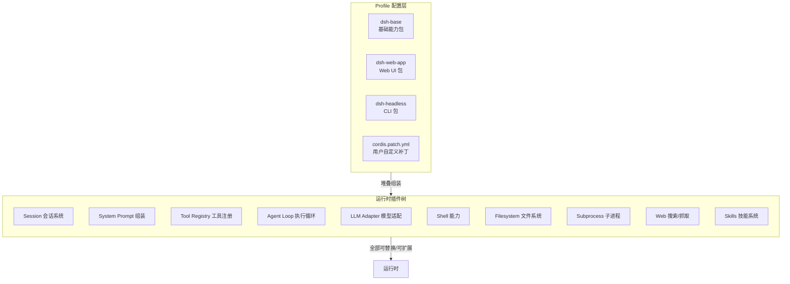
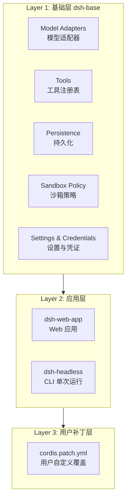
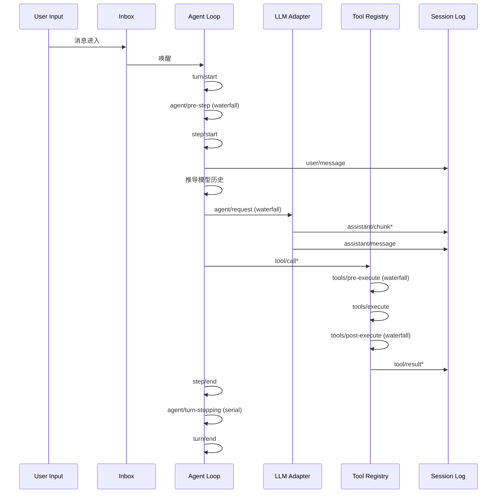
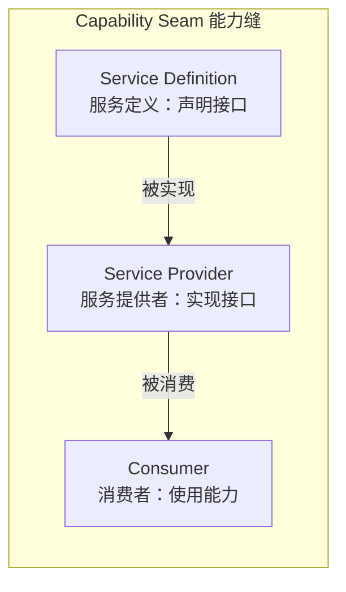
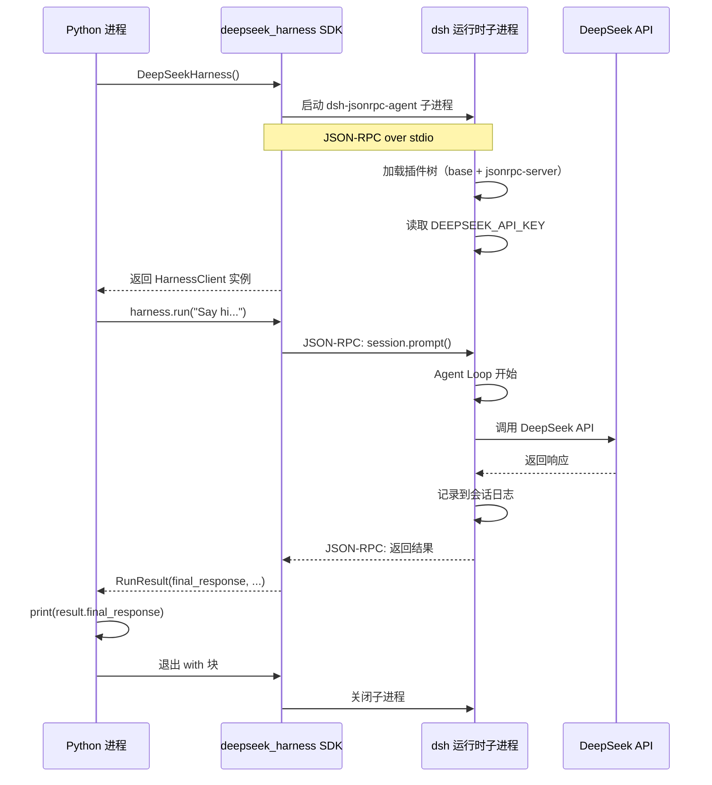
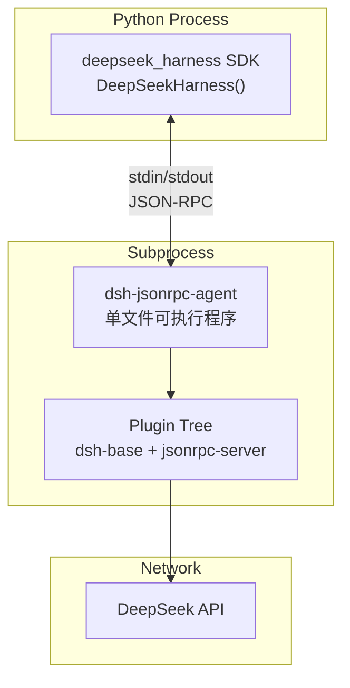

# DeepSeek Harness 深度体验：一个让你重新认识 Agent 框架的东西

> 一句话结论：**DeepSeek Harness 是 DeepSeek 官方出的一个 Agent 框架，但它的"一切皆插件"设计，让它在可玩性上跟其他框架不是一个画风。**


 DeepSeek 官方仓库多了一个东西——**deepseek-harness**，GitHub 上叫 `deepseek-ai/deepseek-harness`，npm 包名是 `@deepseek-ai/dsh`。


DeepSeek 不是一直在做 API 和模型吗？怎么突然搞了个 Agent 框架？开发文档和架构文档写得比很多大公司的项目还规范。

一口气刷完了它的 README、架构文档、开发指南，还有那份给 AI Agent 看的 AGENTS.md。越看越上头，决定写一篇。

**这玩意到底是什么，能干什么，怎么用，以及为什么我觉得它值得你关注。**

---

## 一、先回答一个最基础的问题：DeepSeek Harness 到底是什么？

官方定义很简单：

> DeepSeek Harness（dsh）是一个开源 Agent 框架，由 DeepSeek AI 开发。

但这句话太抽象了，说人话。

**Harness 这个词，在 AI 工程里本来就是个术语——"套具"的意思。** 就像给一匹马套上鞍具，你才能骑着它干活。DeepSeek Harness 干的事也是一样：给你的 Agent 套上一个框架，让它可以调工具、访问文件系统、执行 Shell 命令、调用 LLM、持久化会话、甚至自己修改自己的运行时。

但是，真正让 DeepSeek Harness 跟市面上其他 Agent 框架拉开差距的，不是它"能做什么"，而是它**怎么做的**。

它背后站着一个叫 **Cordis** 的东西。Cordis 是一个插件框架，设计理念来自一篇论文《A Programming Paradigm for Spatiotemporal Composability》。看不懂论文没关系，你只需要知道它的核心哲学：

**一切皆插件。模型适配器是插件，工具注册表是插件，会话日志是插件，甚至 Agent 循环本身也是插件。**

这意味着什么？

意味着你不需要去改一个"核心框架代码"来扩展功能。你想加一个模型提供商？注册一个插件。你想加一个工具？注册一个插件。你想换掉整个 Agent 的执行逻辑？还是注册一个插件。

**没有"核心要你去改"的概念，只有"插件在旁边挂上去"的概念。**

一张图帮你理解它的架构逻辑：



是不是感觉跟 Docker 的镜像层理念有点像？每层可以叠加，上层可以覆盖下层，每一层都是插拔式的。

## 二、安装：简单到有点不像话

我直接说最快的启动方式。

前提条件：你机器上装了 **Node.js**（22.19+ 或 24+，CI 甚至覆盖了 26）。

然后一行命令：

```bash
npx @deepseek-ai/dsh web
```

就这一行。`npx` 会帮你下载、启动，然后默认在 `http://127.0.0.1:3080` 给你开一个 Web UI。

如果你想从源码跑，也简单：

```bash
git clone https://github.com/deepseek-ai/deepseek-harness.git
cd deepseek-harness
pnpm install
pnpm run build
pnpm dsh web
```

整个仓库用 pnpm workspaces 管理，分了 40 多个包，但编译完以后跑起来就一个命令。

**如果你只想快速体验，用 `npx` 就够了。** 如果你想做二次开发或者研究它的架构，就从源码走。

## 三、核心架构：一个插件树是怎么长出来的

我花了点时间把它的架构逻辑理清楚，这段稍微有点硬核，但看懂了你就知道它为什么跟别的框架不一样。

### 3.1 三层体系

dsh 的运行时，本质上是一个**三层堆叠**的插件树：



- **Profile** 是一个命名的组合配置，存在 `~/.dsh/` 下面。它告诉你用了哪些 bundle，以及你自己的补丁文件。
- **Bundle** 是 Cordis 配置行的分发格式——一个 bundle 里包含了一组插件配置。比如 `dsh-base` 管基础能力，`dsh-web-app` 管 Web 界面。
- **Patch** 则是用户自己的覆盖层，你可以通过 `cordis.patch.yml` 替换掉任意一行配置。

想看你的机器上实际启动了哪些插件？一行命令搞定：

```bash
dsh --profile web --dump-config
```

它会打印出完整的插件树，每一行都可以被你的 patch 替换掉。

### 3.2 核心包的职责

列一下几个核心包，你大概知道它们干嘛就行：

| 包名 | 管什么 | 在 ctx 上的 key |
|------|--------|----------------|
| core/session | 会话日志（只追加） | ctx.sessions |
| core/system-prompt | Prompt 段和工具 schema 组装 | ctx.systemPrompt |
| core/tools | 带作用域的工具注册和执行 | ctx.tools |
| core/agent | Agent 接口与事件 | ctx.agents |
| core/agent-loop | 默认的 Agent 执行器 | ctx.agentLoop |
| llm/llm | 消息流 + 模型适配器 | ctx.llm |

每个包都是通过 `ctx.effect()` 或 `ctx.on()` 注册到 Cordis 上下文里的，删掉一个插件，它的所有副作用自动回收。

### 3.3 一次 Agent 执行，发生了什么

这个环节我觉得最有意思。一次 Agent 执行——也就是一个"step"（一次模型请求 + 它调用的工具）——经历了一个精心设计的事件链：



几个关键点：

- **`turn/start` 和 `turn/end`** 包围一次完整的交互回合，可能包含多个 step（模型请求 → 工具调用 → 再次请求）。
- **`agent/pre-step`** 是一个 waterfall 事件——监听器可以改写输入消息，甚至直接拒绝。所有监听器必须调用 `next()` 来让链继续。
- **`llm/stream`** 也是 waterfall，让你可以拦截/修改模型的流式输出。
- **`tools/*` 三个事件**（pre-execute、execute、post-execute）构成了一个完整的工具执行管道，每个环节都可以被拦截。
- **`agent/turn-stopping`** 是 serial 事件——没有 `next()`，你可以在里面决定是否阻止当前回合结束。

**Model-visible = logged** 是一个硬性约束：任何能到达模型的信息，必须能从会话日志中重建出来。这意味着如果你想给模型新增一个输入源，必须先扩展 `SessionEventMap`，再加一个日志事件。这个设计保证了所有的 Agent 行为都是可审计、可回放的。

## 四、能力缝（Capability Seam）：dsh 最让我眼前一亮的抽象

我觉得这个设计是 dsh 最有特色的地方，必须单独拿出来讲。

**能力缝**（Capability Seam）是 dsh 中一个核心概念，一个完整的缝由三个角色构成：



举个例子，**文件系统能力缝**：

- **Service Definition**：声明 `fs/read`、`fs/write`、`fs/list` 等接口
- **Service Provider**：可以是一个本地文件系统实现，也可以是一个远程沙箱实现
- **Consumer**：一个工具（比如 `read_file` tool），调用这个接口

为什么要这么设计？

因为**换一个 Provider，整个系统的行为就变了**。你把文件系统 Provider 从本地换成远程沙箱，Shell 能力、子进程能力、LSP 能力——所有依赖文件系统的模块——全部跟着一起迁移过去，不需要改任何一行消费者代码。

这就是缝的威力。

目前 dsh 内置了这些能力缝：

| 能力 | 接口 | 内置 Provider |
|------|------|---------------|
| Shell | 执行 shell 命令 | 本地 bash、pwsh |
| 子进程 | 管理子进程 | 本地进程树 |
| 文件系统 | 读写文件、目录操作 | 本地文件系统 |
| Web | 搜索、抓取网页 | 搜索 + fetch |
| 子 Agent | 生成子 Agent | 同进程子 Agent |
| 终端 | 持久化终端会话 | 本地终端 |
| LSP | 语言服务器协议 | 本地 LSP |
| 技能 | 执行技能 | 本地技能注册表 |

## 五、写一个插件到底有多简单？

我直接看文档里的例子，一个最简单的工具插件大概长这样：

```typescript
import { Context } from '@deepseek-ai/cordis';
import { definePlugin } from '@deepseek-ai/dsh';

export function apply(ctx: Context) {
  // 注册一个工具
  ctx.tools.register('my_custom_tool', {
    type: 'function',
    function: {
      name: 'my_custom_tool',
      description: '一个自定义工具',
      parameters: {
        type: 'object',
        properties: {
          query: {
            type: 'string',
            description: '查询内容',
          },
        },
        required: ['query'],
      },
    },
    async execute(args) {
      return `你查询了：${args.query}`;
    },
  });
}

export default definePlugin(apply);
```

然后把这个插件挂到 `cordis.yml` 或者 bundle 里，Agent 就能自动发现并使用它。

**如果你的插件包加了 `dsh-plugin` 这个 GitHub Topics，别人在 GitHub 上搜插件就能搜到它。** 官方专门给了一个话题 [`dsh-plugin`](https://github.com/topics/dsh-plugin)，社区生态已经开始长起来了。

## 六、Headless 模式：一个命令跑完一个任务

dsh 还内置了一个 **headless 模式**，不需要 Web UI，一条命令就能跑完一个 Agent 任务。

你需要先设置 `DEEPSEEK_API_KEY`，然后：

```bash
dsh --profile headless "帮我看看这个目录里有什么文件，整理成一份清单"
```

这个模式特别适合：
- CI/CD 里自动跑 Agent 任务
- 脚本中调用 Agent 做自动化处理
- 不需要交互界面的批量处理场景

headless 模式下，Agent 跑完任务就退出，不会启动任何 HTTP 服务。它跟 `web` 模式共享同一个 `dsh-base` 基础包，只是少了一层 Web UI 的插件栈。

## 七、Python SDK：从 Python 里驱动 dsh 有多爽

如果前面讲的 TypeScript 插件和 CLI 你都没太大感觉，那这一段你应该会兴奋——因为 **dsh 有个官方的 Python SDK**，装了就完事了，它直接帮你把整个 Agent 运行时以子进程的形式跑起来，然后 Python 代码通过 JSON-RPC 跟它通信。

### 7.1 安装：一行 pip

```bash
pip install deepseek-harness-sdk
```

注意，这个包安装的时候会自动把同版本的 `deepseek-harness-runtime-bin` 也装进来。runtime-bin 里是一个**单文件可执行程序**（`dsh-jsonrpc-agent`），打包了 Node 运行时 + 整个 dsh 核心插件栈。你机器上甚至不需要装 Node.js。

### 7.2 从零开始：一个最简单的例子

先设好 API Key（或者放 `.env` 里）：

```bash
export DEEPSEEK_API_KEY=***
```

然后写几行 Python：

```python
from deepseek_harness import DeepSeekHarness

with DeepSeekHarness() as harness:
    result = harness.run("Say hi, and tell me what time it is in Beijing.")
    print(result.final_response)
```

跑一下：

```bash
python hello_dsh.py
```

输出大概长这样：

```
Hi! The current time in Beijing is 2026-08-14 20:22 (CST, UTC+8).
```

**这就完了。** 你不需要写 API 调用代码，不需要拼 messages 数组，不需要处理工具调用的循环。`DeepSeekHarness()` 上下文管理器启动了子进程，`harness.run()` 发了一条消息，子进程里的 Agent 循环处理了它，返回结果，上下文管理器退出时自动关掉了子进程。

这个过程在底层是怎么跑的？我画了一张图：



### 7.3 跟正常编码有什么不一样

如果不走 dsh，你要自己写一个 Agent 调用 DeepSeek API，正常流程是这样的：

```python
import requests

DEEPSEEK_API_KEY = "***"

# 1. 自己拼 messages
messages = [
    {"role": "system", "content": "You are a helpful assistant."},
    {"role": "user", "content": "Say hi, and tell me what time it is in Beijing."}
]

# 2. 自己调 API
resp = requests.post(
    "https://api.deepseek.com/chat/completions",
    headers={"Authorization": f"Bearer {DEEPSEEK_API_KEY}"},
    json={"model": "deepseek-chat", "messages": messages}
)

# 3. 自己解析返回
data = resp.json()
print(data["choices"][0]["message"]["content"])
```

这看起来也没多复杂，对吧？但如果你想让这个 Agent **能访问文件系统、能执行 Shell 命令、能搜索网页、能持久化会话、能处理工具调用的循环**——你自己写的话，代码量会翻几十倍。而且每个工具调用后的二次请求、上下文管理、错误恢复，都得你自己处理。

用 dsh Python SDK 做同样的事：

```python
from deepseek_harness import DeepSeekHarness

with DeepSeekHarness(model="deepseek-v4-flash") as harness:
    result = harness.run(
        """
        帮我做三件事：
        1. 看看当前目录下有哪些 Python 文件
        2. 读取第一个 Python 文件的内容
        3. 总结一下这个文件做了什么
        """
    )
    print(result.final_response)
```

**普通编码 vs dsh Python SDK 的核心差异：**

| 维度 | 自己写代码 | dsh Python SDK |
|------|-----------|----------------|
| 消息组装 | 手动拼 JSON 数组 | 自然语言，run() 直接传 |
| 工具调用 | 自己写 loop，解析 function_call，执行工具，再送回去 | 内置 Agent Loop 自动处理 |
| 文件系统访问 | 自己写 os.read/open 等逻辑 | Agent 调用内置工具，dsh 自动执行 |
| Shell 执行 | 自己写 subprocess 逻辑 | Agent 调用 shell 工具，dsh 自动执行 |
| 会话持久化 | 自己写数据库/文件 | 自动记录到 JSONL 日志 |
| 上下文管理 | 手动拼接历史消息 | 自动从会话日志推导 |
| 多轮工具调用 | 手动写 while 循环 | 内置 step/turn 循环 |

**说白了，dsh Python SDK 帮你把"Agent 基础设施"全部外包了。** 你只需要关心"我要让 Agent 做什么"，而不是"怎么让 Agent 能调用工具、能记住上下文、能处理 API 错误"。

### 7.4 进阶：自定义配置

上面的例子用的是零配置模式，SDK 会自动用自带的默认配置启动。但如果你想自定义插件组合，或者换一个模型提供商，可以传 `cordis` 参数指向你自己的配置：

```python
from deepseek_harness import DeepSeekHarness

with DeepSeekHarness(
    provider="deepseek-official",
    model="deepseek-v4-flash",
    max_tokens=49_152,
    cordis="my-custom-cordis.yml",
) as harness:
    result = harness.run("帮我做一次代码审查")
    print(result.final_response)
```

`max_tokens` 是可选参数，控制每次请求的最大输出 token 数。不传的话就用 Provider 默认值。

### 7.5 子 Agent 和通知

dsh Python SDK 还能处理**子 Agent 层级**。当你的 Agent 在执行过程中生成了子 Agent 去干别的事，`RunResult` 里会携带所有子 Agent 的通知：

```python
from deepseek_harness import DeepSeekHarness

with DeepSeekHarness() as harness:
    result = harness.run("安排一个子任务去调研最近的 DeepSeek 更新")

    print("=== 主 Agent 响应 ===")
    print(result.final_response)

    print("\n=== 子 Agent 通知 ===")
    for notification in result.notifications:
        print(f"  [{notification.kind}] {notification.message}")

    print(f"\n=== 完成原因 ===")
    print(result.finish_reason)  # completed / max-tokens / error
```

`finish_reason` 告诉你最后一次 `turn/end` 事件的原因——任务正常完成是 `completed`，超 token 上限是 `max-tokens`，出错是 `error`。

`RunResult` 还包含 `session_id`（会话 ID，可以用于后续恢复）、`events`（根会话事件列表）、`session_root`（持久化会话的根目录位置）。

### 7.6 底层原理：JSON-RPC 子进程通信

Python SDK 跟 dsh 运行时之间走的不是 HTTP，而是**基于 stdio 的 JSON-RPC**。一行一行 JSON 格式的请求/响应，通过子进程的标准输入输出传输。



这个设计有几个好处：

1. **进程隔离**。Python 进程崩了，子进程还在；子进程崩了，SDK 能检测到错误。两边互不污染。
2. **不需要 Python 侧加载 Node 依赖**。运行时是一个独立的单文件可执行，Python 理论上只需要 stdio 通信能力。
3. **可替换运行时**。你可以选择用内置的 `exe` 模式（生产环境，不需要 Node.js），或者 `node` 模式（开发环境，从源码跑）。通过 `DSH_RUNTIME_MODE` 环境变量切换。

### 7.7 一个完整的实战例子

最后来个完整的，假装你是个项目经理，让 dsh Agent 帮你做项目巡检：

```python
#!/opt/homebrew/bin/python3.13
# -*- coding: utf-8 -*-
"""
用 dsh Python SDK 做项目巡检
"""
import os
from deepseek_harness import DeepSeekHarness

# 检查 API Key
if not os.environ.get("DEEPSEEK_API_KEY"):
    print("请先设置 DEEPSEEK_API_KEY")
    exit(1)

with DeepSeekHarness(model="deepseek-v4-flash") as harness:
    result = harness.run(
        """
        帮我巡检一下当前项目，做以下几件事：

        1. 列出项目根目录的结构（只看一级目录）
        2. 检查有没有 README.md，如果有，读一下它的内容
        3. 检查有没有 package.json，如果有，告诉我项目名称和依赖数量
        4. 检查有没有 .gitignore，如果有，看看忽略了什么
        5. 综合以上信息，给出一个项目健康度评分（1-10）和改进建议

        请按顺序执行，每做完一步给我汇报结果。
        """
    )

    print("=" * 50)
    print("项目巡检报告")
    print("=" * 50)
    print(result.final_response)
    print("=" * 50)
    print(f"完成状态: {result.finish_reason}")
    print(f"会话 ID: {result.session_id}")
```

这个脚本里，Agent 要依次执行：读文件系统 → 读文件内容 → 解析 package.json → 检查 .gitignore → 综合生成报告。**每一步都是 Agent 自己决定调用什么工具、什么时候结束、什么时候进入下一步。** 你不需要在 Python 代码里写任何文件操作逻辑。

这就是 dsh Python SDK 最核心的价值：**你调用的是 Agent 的智能，而不是 API 的接口。**

## 八、几个让我觉得"卧槽"的设计细节

### 8.1 AGENTS.md — 给 AI Agent 写的操作手册

这个仓库里有一个 `AGENTS.md`，不是给人看的，是给**AI Agent**看的。里面写了：

- 仓库的目录结构
- 每个包的职责
- 可用的构建命令和测试命令
- 代码规范（什么情况下用 FIXME、TODO、XXX）
- 事件系统的设计约束
- 提交规范

为什么单独提这个？因为当 AI Agent（比如 Codex、Claude Code）来读这个仓库时，它可以通过 `AGENTS.md` 快速理解整个项目的结构和约定，然后做出正确的代码修改。**这是 DeepSeek 团队在"AI 原生开发"上走得很前面的一个信号。**

### 8.2 会话日志即真相

dsh 的整个模型上下文，是从会话日志中推导出来的，而不是从某个"内存状态"里读的。`deriveMessages()` 函数从日志里投影出模型能看到的历史，`assistant/chunk` 事件保留了原始流式输出，方便回放和 UI 还原。

**Fork 会话、恢复会话、生成转录、做遥测——全都从这个日志流里来。** 这种设计保证了任何状态的修改都是可追溯的。

### 8.3 自修改 Agent

dsh 有一个叫 **self-modification** 的包，允许 Agent 在运行时检查、挂载、卸载它自己的插件。什么意思呢？Agent 可以一边跑，一边改自己当前的行为——加上一个新工具，或者换掉一个 Provider，不需要重启。

这在实验性场景和动态调整场景下，想象空间非常大。

### 8.4 双语文档与配对合并

这个仓库的文档是中英双语，不是简单的"中英各一份"，而是用了 **自动配对合并驱动**——当两个语言的文档同时修改时，Git 合并驱动会自动推导出对应的配对记录，减少手动调整的成本。

## 九、但也有几个现实问题

坦率地讲，我不可能只说好话。

1. **开发者预览阶段**。README 自己写了：`THERE WILL BE COMPATIBILITY-BREAKING CHANGES`。现在上生产要谨慎，接口可能会变。
2. **文档还在建设中**。架构文档很扎实，但面向普通用户的教程和 cookbook 还在补充中。想上手玩，需要有一定的 Node.js 和 TypeScript 基础。
3. **生态刚刚起步**。`dsh-plugin` 话题下的插件还不多，很多场景需要自己写插件。
4. **依赖 Node.js 22+**。如果你还在用 Node 18 或 20 的老版本，需要先升级。

## 十、我觉得它适合谁

- **Agent 框架研究者和架构师**：它的能力缝设计和事件驱动架构，值得深入研究。
- **想为 DeepSeek 生态做贡献的开发者**：写一个 dsh 插件，比写一个独立的 Agent 框架容易得多。
- **需要可定制 Agent 的团队**：如果现有的 Agent 框架（LangChain、AutoGPT 等）在灵活性上满足不了你，dsh 的"一切皆插件"可能会给你一个更好的答案。
- **AI 原生开发的早期实践者**：从 AGENTS.md 到自修改插件，dsh 在"AI 参与开发"这件事上走得很远。

---


DeepSeek 最初只是做 API 和模型的一家 AI 公司，现在他们做了一个 Agent 框架。这个框架不追求"开箱即用大而全"，而是追求"每一层都可替换、可扩展"。

你说它想干嘛？

我的理解是，**DeepSeek 在下一盘棋——API 是入口，模型是大脑，Harness 是躯体。** 当模型的能力越来越强，控制这个模型的"躯体"就变得至关重要。而一个插件化、可定制、可扩展的 Harness，就是这个躯体的最佳形态。

当然，现在还太早，dsh 还在开发者预览，很多功能还在打磨，生态还没长起来。但方向是对的。

**它会跑得多远，取决于 DeepSeek 的迭代速度，更取决于社区会在这个框架上长出什么样的插件生态。**

我挺期待的。

---

