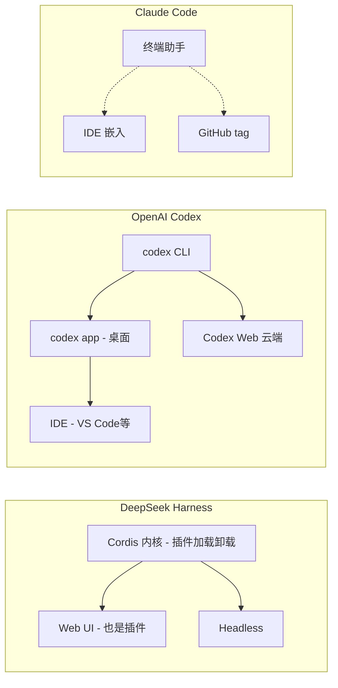

# 都是 Coding Agent 的壳，DeepSeek Harness、OpenAI Codex、Claude Code 到底差在哪

做 AI 编程的人，手机里大概都躺着一两个这样的东西：一个终端里的 Coding Agent，能读你的仓库、改你的代码、跑你的测试。Claude Code 也好，OpenAI Codex 也好，还有最近刚发 DeepSeek V4 Pro 之后紧跟开源的 DeepSeek Harness（dsh），看起来干的是同一件事——你给我一段话，我替你写代码。

但如果你真把它们当一回事去对比，会发现这三家其实根本不在一个形态上。一个是"能卸载重装的积木框架"，一个是"登录就用的云上 Agent"，还有一个是"嵌进终端和 IDE 的助手"。表面都是 Agent，底层各讲各的。

这里有个背景值得先铺一下。DeepSeek 官方在发 dsh 的时候放了一条公式：**Agent = Model + Harness**。这个说法最早是 LangChain 提的，意思是光有模型不够，你还得有一套"套具"（Harness，就是马鞍缰绳那套）把模型这股强大的力量往你要的方向带。你平时觉得"Claude Code、Codex 好用"，其实是它们背后那套 Harness 在起作用——工具、Skills、会话、沙箱、Agent 循环、调度、子 Agent，这些在过去全部被厂商封进一个叫软件名的壳里，你只管用，改不了。

DeepSeek Harness 干的标新立异的事，就是把这一整套东西**全部拆成插件**。这篇文章就把这三个放在一起，从形态、架构、玩法、适合谁几个角度对比一遍，帮你判断自己该用哪个。

| 对比维度 | DeepSeek Harness | OpenAI Codex | Claude Code |
| --- | --- | --- | --- |
| 核心形态 | 开源 Agent 框架，插件化 Web UI + headless | CLI + desktop app + IDE 集成 + Codex Web 云版 | 终端 agentic coding tool，可入 IDE / GitHub |
| 底层内核 | Cordis 插件系统，一切皆插件 | OpenAI 自家 Agent 运行时 | Anthropic 自家终端运行时 |
| 开源性 | MIT 协议，可私有部署商用 | 开源在 GitHub（Apache-2.0），但原生产品闭源 | 闭源 (npm 安装已废弃，走 curl/brew/winget) |
| 自定义程度 | 高：模型/工具/会话/UI/循环皆可换 | 低：能力边界由官方定 | 低：主要靠 CLAUDE.md 规则 + 插件目录 |
| 运行模式 | 4 种预设（标准/PTC/极简/创造） | 标准 / app / Web 多形态 | 单一 CLI 模式为主 |
| 可观测性 | Trajectory 追加事件日志，可分叉回放 | 云端控制台日志 | 终端日志 |
| 收费方式 | 自带 DeepSeek API（已涨价）或接任意模型 | 登录 ChatGPT 套餐（Plus/Pro/Business/Edu/Enterprise）或 API key | 订阅 + API |
| 适合谁 | 开发者 / 爱折腾 / 想做 Agent 研究 | 想开箱即用、要桌面 App 和云端的综合用户 | 想要终端里贴身助手、规则驱动的用户 |

（表里"开源部署"这一栏要拆开说：Codex 的 CLI 代码在 GitHub 上是 Apache-2.0 开源的，但真正的 Codex App、Codex Web 这些产品是闭源的，能力边界由 OpenAI 定；Claude Code 本身闭源。这点后面细讲。）

---

## 三个都在"运行什么"，但形态差得远

先花点篇幅把三个项目的官方定位讲清楚，因为很多人栽就栽在"以为它们是一回事"。

**DeepSeek Harness（dsh）** 是 DeepSeek AI 开源的一个 agent harness，现在还是**开发者预览**阶段，官方自己在 README 里写明"未来将出现破坏兼容性的变更"。它底层用 Cordis 插件系统，主张一切皆插件——模型适配器是插件、工具注册表是插件、会话日志是插件、连 Agent Loop 本身都是插件，甚至前端那个 Web UI 都是个 UI 插件，可以替换。启动命令是一行：

```sh
npx @deepseek-ai/dsh web
```

默认监听 http://127.0.0.1:3080。

**OpenAI Codex** 的形态最多。它官方 README 开头就给了四条路：想在代码编辑器里用（VS Code、Cursor、Windsurf），去装 IDE 插件；想要桌面 App 体验，运行 `codex app` 或访问 Codex App 页面；想要云上 Agent，用 Codex Web；想要本地 CLI，装 `codex` 命令。也就是说 Codex 是"CLI + 桌面 App + IDE + 云上 Web"都给你铺齐。它也可以登录你的 ChatGPT 套餐（Plus/Pro/Business/Edu/Enterprise）来用，或者用 API key。

**Claude Code** 官方定位写得很明确：住在**终端**里的 agentic coding tool，理解你的代码库，通过自然语言帮你执行例程任务、解释复杂代码、处理 git 工作流。它的 README 说"Use it in your terminal, IDE, or tag @claude on Github"——就是终端、IDE、GitHub 三个触点。注意一个细节：**Claude Code 官方 README 并没有单独强调一个独立的桌面 App**，它主打的是终端 + IDE 嵌入。npm 安装方式官方已标为废弃，推荐 curl 或 Homebrew 或 winget。

---

## 三条路，各自亮在哪

三个项目核心亮点分别展开一下，都是基于官方文档能确认的事实。

**DeepSeek Harness：把 Agent 拆成可插拔的积木**

核心亮点：

1. 一切皆插件，没有"要你改的核心"。模型、工具、会话、UI、循环全能换。你不用去啃一整个框架内部，想加能力就挂一个插件，想换执行逻辑也是挂一个插件。这是它跟另外两家最本质的区别。
2. 底层由 Cordis 驱动，设计有论文背书。内核极其克制，只负责插件的加载、卸载和依赖管理，别的不碰。它支持两个关键特性：时间可组合性（一个插件卸载后，它产生的副作用能不能完整撤销）和空间可组合性（一个插件依赖的其他插件变化时，能不能动态重处理依赖）。这让它甚至能在 Agent 运行中换插件而不崩状态。
3. 四种运行模式，覆盖从日常到科研。标准模式（开箱即用，文件、Shell、搜索、Skills、子 Agent 全预设）、PTC/Code 模式（给模型一套 TypeScript SDK，把多步工具调用压进一次 run_code，省 Token）、极简模式（只留 Bash 和文件编辑器，做模型基准评测）、创造模式（让 Agent 检查自己的运行时、在内存里造插件挂到自己身上——你甚至可以告诉它"造一个只读代码、专门做安全审计的模式"）。
4. 会话是只追加的事件日志。模型看到的系统提示、用户消息、推理、工具调用和结果、权限变化、压缩注入，全成为日志里的事件，下一轮历史从这份日志重推。配 Trajectory 视图可以按来源查每一次运行，可观测、可审计、可复现，对研究和排查"Agent 在哪一步跑偏"特别有用。
5. MIT 协议，可私有部署商用，也可接任意模型。它没锁死在 DeepSeek 模型上，支持自定义 provider、Base URL、协议和模型列表，你甚至可以在里面用 GLM。Python SDK 也有。
6. 有社区插件市场，装一个就能增强体验。dsh-at-file（输入框 @ 引用文件）、dsh-genui（回复里渲染图表表格表单）、dsh-automation（补自动化能力）、DSH-better-sidebar（把 dsh 补成 VS Code 式工作台，文件/终端/Git/内置浏览器全塞侧边栏）、ModLens（给纯文本模型补视觉能力）等。

需要提醒的代价：它是开发者预览阶段，兼容性可能变；学习成本高，一堆开发者术语，"一切皆插件"的心智不是开箱即用的人能秒懂的；第一方插件默认预设可能不够，很多能力要靠你自己在创造模式里造。

**OpenAI Codex：形态最全，登录就能用**

核心亮点：

1. 一个项目，CLI / 桌面 App / IDE / 云上 Web 全形态都给了。想要哪条路都有，不用在"命令行 vs 界面"之间做选择。
2. 桌面 App 体验是明确的一等公民。官方 README 专门讲了 `codex app` 和 Codex App 页面，说明桌面端不是附属品。
3. 认证灵活：可以登录你的 ChatGPT 套餐（Plus/Pro/Business/Edu/Enterprise），用订阅额度；也可以用 API key。
4. 安装路径多：curl / npm / Homebrew 都能装，也支持从 GitHub Releases 下对应平台二进制。官方给出的一键安装命令是：

```sh
curl -fsSL https://chatgpt.com/codex/install.sh | sh
```

Windows 用 PowerShell：

```powershell
powershell -ExecutionPolicy ByPass -c "irm https://chatgpt.com/codex/install.ps1 | iex"
```

5. CLI 代码开源（Apache-2.0），能看实现、能二次开发。

代价：原生产品（Codex App、Codex Web）是闭源的云服务，能力边界由 OpenAI 定；要跟 OpenAI 的账号和套餐绑定，自部署层面没那么多自由度。

**Claude Code：终端里最贴身边的 Coding Agent**

核心亮点：

1. 定位纯粹：住在终端，理解代码库，自然语言帮你执行例程任务、解释复杂代码、处理 git 工作流。
2. 触点广：终端、IDE、GitHub（tag @claude）都能用，不局限在某个界面。
3. 规则驱动：配合 CLAUDE.md 这种 Guides（前馈控制）和自动化测试/CI 这类 Sensors（反馈控制），能形成 Harness Engineering 里说的"约束闭环"——这也是 Anthropic 那套 Agent 方法论的核心。
4. 有插件目录：仓库里带若干 Claude Code 插件，能扩展自定义命令和 agent。
5. 安装简单：Windows 推荐 winget，macOS/Linux 推荐 curl 或 Homebrew。npm 安装官方已标废弃。

代 价：闭源，无法自部署；能力边界由 Anthropic 定；官方文档没主打一个独立桌面 App，如果你想要的是"图标点开一个软件"，它可能不是首选。

---

## 看看三个的形态差异

用一张图概括三者的"长相"区别（这里的名词都来自各自官方文档）：



能看出：dsh 是一条从内核往外长插件的"框架"；Codex 是同一套 CLI 能力铺到桌面/云端/IDE 的"全家桶"；Claude Code 是围绕终端助手往外伸触角的"贴身工具"。这条差异，决定了你到底该选谁。


---

## 各自怎么装、怎么启动

**DeepSeek Harness**

装好 Node.js（官方开发文档要求 Node 22.19+ 或 24+，CI 还覆盖 26），然后一行命令起 Web UI：

```sh
npx @deepseek-ai/dsh web
```

默认地址 http://127.0.0.1:3080。想从源码跑：

```sh
git clone https://github.com/deepseek-ai/deepseek-harness.git
cd deepseek-harness
pnpm install
pnpm run build
pnpm dsh web
```

仓库用 pnpm 构建（固定 pnpm@11.7.0），跑源码前确认装了 pnpm，装不上先 `corepack enable`。首次进 Web UI 会让你填 DeepSeek API key（去 platform.deepseek.com 申请，官方提醒记得充值），也可以配置成其他模型。

**OpenAI Codex**

最直接的三条安装路线：

```sh
# curl（Mac/Linux）
curl -fsSL https://chatgpt.com/codex/install.sh | sh

# npm
npm install -g @openai/codex

# Homebrew
brew install --cask codex
```

然后就地运行 `codex`，选 Sign in with ChatGPT 就能用套餐额度；想要桌面体验就 `codex app`，或访问 chatgpt.com/codex。

**Claude Code**

官方推荐这几条（npm 已废弃）：

```bash
# macOS/Linux 推荐
curl -fsSL https://claude.ai/install.sh | bash

# macOS/Linux Homebrew
brew install --cask claude-code

# Windows 推荐
irm https://claude.ai/install.ps1 | iex

# Windows winget
winget install Anthropic.ClaudeCode
```

然后进项目目录运行 `claude`。

---

## 命令速查

| 工具 | 安装 / 启动 | 用途 |
| --- | --- | --- |
| DeepSeek Harness | `npx @deepseek-ai/dsh web` | 一行起 Web UI |
| DeepSeek Harness (源码) | `pnpm install && pnpm run build && pnpm dsh web` | 从源码跑 |
| OpenAI Codex | `curl -fsSL https://chatgpt.com/codex/install.sh \| sh` | Mac/Linux 安装 |
| OpenAI Codex | `npm install -g @openai/codex` | npm 安装 |
| OpenAI Codex | `codex app` | 桌面 App 体验 |
| Claude Code | `curl -fsSL https://claude.ai/install.sh \| bash` | macOS/Linux 安装 |
| Claude Code | `winget install Anthropic.ClaudeCode` | Windows 安装 |

---

## 关键差异，翻译成人话

上面表格能看个大概，这里把最容易踩坑的三个点单独拎出来讲。

**第一个坑：别把"开源"和"能自部署"混为一谈。** Codex 的 CLI 代码在 GitHub 上是 Apache-2.0 开源，但你想用的桌面 App、云上 Web，是 OpenAI 的闭源产品；Claude Code 整体闭源；只有 dsh 是真正意义上的 MIT 开源 + 可私有部署商用。如果你要的是"自己能完全掌控、自托管"的那套，dsh 是唯一选项；如果你要的是"云端它帮你管好一切"，Codex 更合适；如果你只想要终端里一个能用的助手，Claude Code 就行，开不开源无所谓。

**第二个坑：Claude Code 没有一个官方主打"独立桌面 App"。** 很多人的印象是 Claude Code 有个下载即用的桌面软件，但它的官方定位是终端工具，可嵌入 IDE、可在 GitHub 里 tag。它没有像 Codex 那样单独强调一个 `app` 形态。如果你对"desktop app"有执念，Codex 反而是三个里桌面体验最明确的那个。而 dsh 的"桌面"目前更多是社区在做（比如有人做了 deepseek-harness-desktop 把 dsh 封装成免 Node.js 的桌面软件），官方核心是 Web UI + headless。

**第三个坑：dsh 的学习成本是三者里最高的。** 它的能力上限最高、自由度和可自定义也是最强，但这恰恰是门槛。四种模式、插件系统、Cordis 内核、事件日志……对不熟悉 AI Agent 架构的普通用户来说，光"创造模式里让 Agent 自己造插件"这一步就够劝退。前面卡兹克那篇速通文里也直说了：这个产品对普通用户"非常不友好，过多开发者术语、过高的使用门槛"。反过来，Claude Code 和 Codex 是"登录就能用"的思路，开箱成本低得多。

---

## 那到底该怎么选

给一个不装高深、基于现状的判断。

如果你要的是**"开箱即用、形态最全、登录就能编程"**，Codex 是稳妥选择——CLI、桌面、IDE、云上 Web 都有，认证也灵活。它适合"我不想折腾底层，我就想一个能自己跑代码的 Agent"的人。

如果你要的是**"终端里最贴身边、靠规则约束驱动"**的 Coding Agent，Claude Code 更对你胃口——它把 Harness Engineering 里的 Guides + Sensors 那套约束闭环用得很成熟，配合 CLAUDE.md 和测试/CI 能搭出稳定的"约束笼子"。适合想在 IDE / 终端里把 Agent 的规则体系管起来的人。

如果你要的是**"自己能掌控拼装、甚至想让 Agent 自己改自己"**，dsh 是目前最独特那个——一切皆插件，能私有部署、能接任意模型、能全链路可追溯，还有四种模式覆盖日常编码到模型评测到插件开发。代价是它现在还非常"工程化"，是开发者预览阶段，得接受它糙、它难上手、它未来可能有不兼容变更。说白了，dsh 更像一个"为开发者准备的基建和科研产物"，不是一个给普通用户的无脑工具。

**一句话总结这三个的定位差**：Claude Code 是"用起来最顺手的马"，Codex 是"租的最省心的马厩"，dsh 是"让你自己搭一匹、还能换零件的那套缰绳和马具"。


---

## 一点我的立场

得先说清楚：这三家我都没有天天重度跑到能掏出详尽 benchmark 的程度，上面的对比主要基于三个项目各自的官方文档（GitHub README、开发文档）和公开信息，属于"看官方怎么说 + 我自己判断"的产物，不是"我三个都深度把玩了三个月"的实测结论。里头有些主观判断，比如"dsh 学习成本最高""Claude Code 规则驱动强"，是基于文档描述和公开讨论做的合理推断，不是我有定量数据背书。

如果你是做 Agent 开发的、能被"一切皆插件、自进化"打动，那 dsh 值得你花一个下午把它从源码跑起来，去创造模式里让它自己造一个插件试试——那种"Agent 发现自己没扳手，现场造了一把插到自己手上"的体验，是另外两家给不了的。如果你只是想要一个"今天就能用起来帮我把这个仓库的 bug 修了"的工具，那直接选 Codex 或 Claude Code，别跟自己过不去。

不管选哪个，都别忽略一个正在发生的大背景：Harness Engineering 这个词，正从 Prompt Engineering、Context Engineering 手里接过接力棒。当模型越来越强、越来越自主的时候，决定你能不能用好它的，已经不是"怎么问"或"塞什么上下文"了，而是"你给它搭了一个什么样的 Harness"。这三家，其实都在抢着做那个 Harness——只是 A 家把它做成了全家桶，B 家把它做成了贴身工具，C 家把它做成了积木平台。


#DeepSeekHarness #dsh #OpenAICodex #ClaudeCode #AI编程 #Agent #HarnessEngineering #智能体 #开源 #ChatGPTCodex #开发者工具 #vibecoding