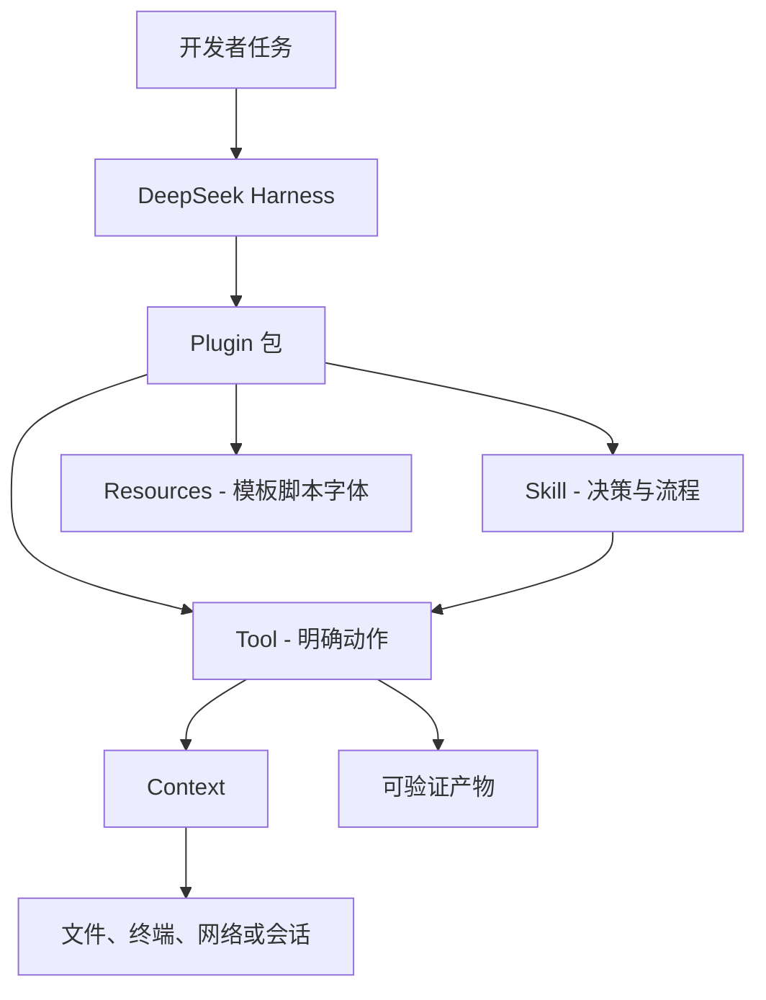
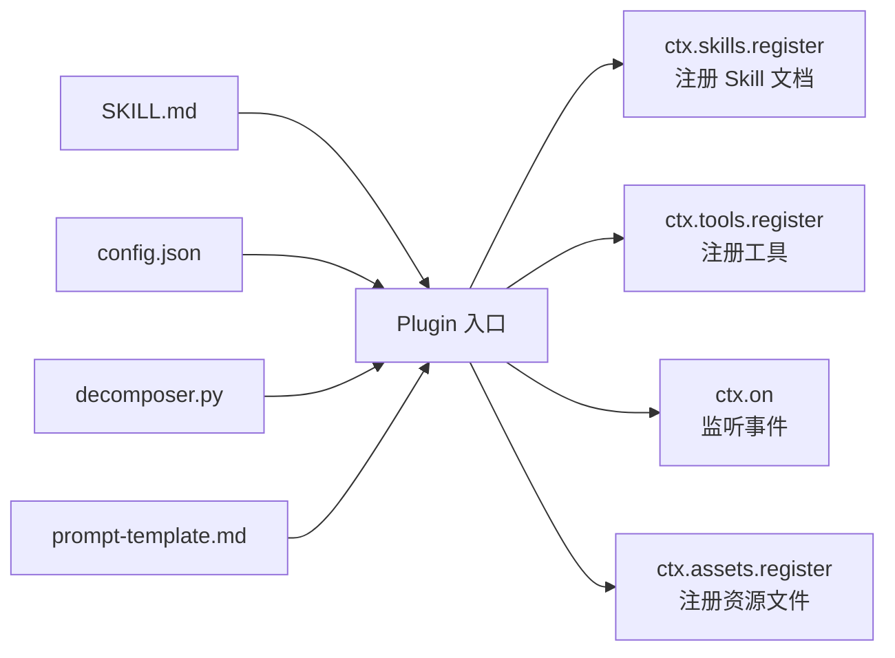

# 从 Skill 到 Plugin：DeepSeek Harness 插件开发完整教程


---
有人把一份 `SKILL.md` 写得很长：有步骤、有模板、有脚本、有示例。它在自己的机器上很好用，换一个 Harness、换一台电脑、换一位同事，就开始变得不确定：文件去哪了？脚本有没有带上？Agent 知不知道什么时候该用它？升级后还能不能找到？

这不是 Skill 写得不够好，而是它已经跨过了“提示词资产”的边界。它需要被包装成一个可以安装、发现、校验和升级的能力单元。

DeepSeek Harness 给了这条路一个相当直接的出口：把 Skill、工具、资源和少量运行时代码放进 Plugin。这样做的重点不是“给 Agent 再加一堆花活”，而是把一条重复执行的工作流，从聊天习惯变成可交付的软件包。

**一句话结论：**
Skill 负责让 Agent 明白“该怎样做”，Plugin 负责让 Harness 在正确的时机获得“可以做什么、到哪里找、怎样交付”的运行时能力；二者不是替代关系，成熟的插件往往把 Skill 放在中间，把工具和资源放在两侧。

---

**先把三层东西拆开，很多误会就没了**

不少人把 Harness、Skill、Plugin 都叫“扩展”，于是开发时把说明文字、JavaScript、依赖、配置和安装命令塞成一团。真正上线后，问题通常不是模型不聪明，而是边界不清。

|层次|它回答的问题|常见载体|最适合承担的责任|不该强行承担的责任|
|---|---|---|---|---|
|Harness|Agent 在哪里运行、上下文和扩展怎样协作|Agent Loop、运行层、Context|发现插件、装配能力、驱动会话|替每个业务决定操作流程|
|Skill|面对某类任务时，Agent 应如何判断和执行| `SKILL.md`、模板、参考资料|任务路由、步骤、验收口径、表达约束|可靠访问系统资源或维护状态|
|Plugin|这套能力如何被安装、注册和分发|包声明、配置补丁、入口代码、资源|装配 Skill、Tool、UI 或运行资源|用代码重写全部自然语言规则|
|Tool|Agent 能调用哪一个明确动作|函数、脚本、服务接口|读取、生成、校验、转换、执行|替模型做模糊的业务判断|

可以把它想成一家小餐馆。Harness 是厨房和出餐动线；Skill 是菜谱与出品标准；Plugin 是一个带齐原料、菜单和操作台的档口；Tool 则是烤箱、秤和收银机。只有菜谱，菜做不稳定；只有工具，Agent 又不知道什么时候该拿哪一把。

下面这张图不是某个版本的内部源码图，而是开发时很有用的职责图：

图中有一个关键约束：Skill 可以指挥 Tool，但不要让 Skill 假装自己已经完成了 Tool 的工作。比如“导出幻灯片”是意图，渲染脚本才是动作；“检查成品尺寸”是验收规则，图片解析器才是证据来源。

---

**什么情况下应该从 Skill 走到 Plugin**

不是每份 Skill 都值得封装。一次性的写作提示、只依赖当前会话的排查流程，留在 Skill 层反而最轻。以下信号出现两个以上，才值得动手做 Plugin：

1. **资源不再是一张文档。** 除了 `SKILL.md`，你还需要模板、参考文件、字体、渲染脚本或样例数据。靠人手复制路径，迟早有人漏文件。
    
2. **同一动作要被反复可靠地执行。** 比如把 HTML 渲染为图片、验证输出尺寸、生成目录、检查格式。让模型临场写命令，稳定性会随着上下文波动。
    
3. **能力需要被发现。** 用户希望通过斜杠命令、技能搜索或插件安装后直接使用，而不是在每个新会话里再解释一次“请先读这个文件”。
    
4. **需要可升级和可回归验证。** 当脚本、模板或说明修改后，团队需要知道安装包里到底带了什么，而不是只在作者本地能跑。
    
5. **风险要有边界。** 文件写入、网络、浏览器和终端都不是“多写一句提示”能管住的。动作应该落到可审计的 Tool，入口处限制范围。
    
    参考材料里的王虹手写风格 PPT 就属于典型例子：原先的 Skill 已经定义了视觉语言和产出要求；迁移后，插件还需要随包带上模板、字体和渲染脚本，并在启动时交给 `ctx.skills`。真正被提升的不是文案，而是交付的确定性。
    
    反过来，如果一个 Skill 只是告诉 Agent 如何审一份文档，既没有脚本也不依赖固定资产，就先别为了“插件化”写一层空壳。空插件只会增加安装和排错成本。


___
DeepSeek Harness 最能打的设计是"一切皆插件"——模型适配器是插件、工具注册表是插件、会话日志是插件、Agent Loop 是插件，连前端 Web UI 都是插件。但问题也出在这里：**一个普通用户，到底怎么开始写一个插件？**

如果你有一套现成的 Skill 或脚本，想把它变成 dsh 插件，最短路径可以压成 5 步。

先回答一个必须搞清楚的问题：**Skill 和 Plugin 到底有什么区别，什么时候该用哪一个。**
## Skill 和 Plugin：什么关系，什么时候选哪个

很多刚接触 dsh 的人在这两个概念上迷糊，因为从效果上看，它们都能让 Agent 做更多事。

**Skill 是什么**

Skill 是 Agent 在运行时能调用的能力包——你给 Agent 一份 `SKILL.md`，它读懂了就能按你的指令去做事。在 dsh 的体系里，Skill 是挂载在 Agent 循环上的"技能描述"，本质上是**提示词 + 约束规则**的组合。Agent 通过读取 Skill 的文档来理解"这个技能能做什么、该怎么做、有什么限制"。

Skill 的典型特征：开发成本低，写一份 Markdown 就能用；不需要编译、不需要打包、不需要改运行时配置；Agent 靠读文档来理解它，而不是靠代码注册。

**Plugin 是什么**

Plugin 是 dsh 的**一等公民扩展单元**。它有自己的 `package.json`、`cordis.patch.yml`、运行时入口文件。Plugin 可以注册工具、注册服务、监听事件、挂载 UI 组件、替换 Agent Loop——它的能力远不止"给 Agent 读文档"。

Plugin 的典型特征：需要声明 `dsh.bundle` 元数据，需要 Cordis 运行时加载，有能力操作 dsh 的运行时状态（注册/卸载服务、监听事件、注入工具）。

**什么时候用 Skill，什么时候该封装成 Plugin**

| 场景 | 适合用 Skill | 适合封装成 Plugin |
| --- | --- | --- |
| 我只想给 Agent 一套固定的工作指令和规则 | ✅ | ❌ |
| 我需要注册一个能在会话里随时调用的工具函数 | ❌ | ✅ |
| 我的能力是"提示词 + 模板 + 约束条件"的组合 | ✅ | ❌ |
| 我需要监听 Agent 事件、在特定时机插入逻辑 | ❌ | ✅ |
| 我要修改 Web UI 界面或添加新组件 | ❌ | ✅ |
| 我想把自己的能力发布到社区让其他人一键安装 | ❌ | ✅ |
| 我需要操作文件系统、网络、浏览器等外部资源 | ❌ | ✅ |
| 我的能力就是一条静态指令，不需要交互 | ✅ | ❌ |

**更直观的判断标准：** 如果你的能力是**告诉 Agent 怎么做一件事**，那就是 Skill——写一份 `SKILL.md` 就行。如果你的能力是**给 Agent 添加一个它原本没有的"器官"**（一个新工具、一个新事件监听、一个 UI 组件），那就是 Plugin——需要写代码、声明 bundle、注册到运行时。

**一个重要的中间态：Skill 可以包在 Plugin 里发布。**
比如 `requirement-decomposition-cross-platform`（需求结构化拆解）这个 Skill——核心能力是 12 维度需求拆解框架（SKILL.md 中定义的双模式策略、红线规则、输出模板），但如果你想把它做成可一键安装的 dsh 插件，就在外层加一个 Plugin 壳，用 `dsh.bundle` 声明和 `cordis.patch.yml` 配置打包，让它可以被 `dsh plugin add` 安装。这样既保留了 Skill 的灵活性，又获得了 Plugin 的可分发性。


---

## Plugin 开发前的准备

### 环境要求

dsh 的官方开发文档写得很清楚：

- Node.js 22.19+ 或 24+（CI 覆盖 22.19、24、26）
- pnpm（仓库在 `package.json` 中固定使用 `pnpm@11.7.0`，如果 `pnpm --version` 无法解析，先运行 `corepack enable`）
- Git 2.26+
- 可选：一个 DeepSeek API key 用于测试

### 理解 dsh 的插件加载机制

在开始写代码之前，必须理解 dsh 的**Profile 和 Bundle 机制**，否则你写出来的插件可能装上了但没生效。

dsh 的运行时是一个**插件树**，启动时按顺序从多个层叠加而成：

1. 每个 Profile 列出它叠了多少个 Bundle（按顺序）
2. 每个 Bundle 有自己的 `cordis.patch.yml`，声明它要挂载哪些插件、替换哪些配置
3. Profile 自己的 `cordis.patch.yml` 覆盖在 Bundle 之上
4. 用户主目录层面的 `cordis.patch.yml` 再覆盖
5. 命令行 `--patch` 参数最后覆盖

**这意味着你写的插件实际上是在一个已经跑起来的插件树上再做一层叠加。** 你不需要去碰深层的东西，只需要在 `cordis.patch.yml` 里声明你要挂载的插件 ID 和配置就行。

查看当前真实启动的插件树，用这个命令：

```sh
dsh --profile web --dump-config
```

它会打印出当前 Profile 实际启动的所有插件和配置。这个命令是调试插件"明明装了但没出现"的第一工具。

---

## 第一步：定义插件的目录结构和声明

以最简单的插件为例，创建一个能注册工具的 Plugin。

### 目录结构

```
my-dsh-plugin/
├── package.json          # 包声明 + dsh.bundle 声明
├── cordis.patch.yml      # Cordis 配置补丁
├── src/
│   └── index.ts          # 插件入口
├── tsconfig.json
└── README.md
```

### package.json 的 dsh 声明

这是最关键的元数据，告诉 dsh 这个包是一个插件 Bundle：

```json
{
  "name": "my-dsh-plugin",
  "version": "0.1.0",
  "private": false,
  "type": "module",
  "dependencies": {
    "cordis": "^4.0.0"
  },
  "dsh": {
    "bundle": {
      "patch": "cordis.patch.yml"
    }
  }
}
```

`dsh.bundle` 字段指向你的补丁配置文件。`dsh` 字段在 `package.json` 里还可以声明 `dsh.profile`（如果它是 Profile 模板的话），但大部分插件只需要 `dsh.bundle`。

### cordis.patch.yml：告诉 dsh 怎么挂载你的插件

```yaml
# cordis.patch.yml
patch:
  - id: my-plugin
    bundle: my-dsh-plugin
    config:
      someOption: value
```

`id` 是插件在 Cordis 树里的唯一标识。`bundle` 指向 npm 包名或本地路径。`config` 是你的插件启动时收到的配置对象。

### 入口文件：注册到运行时

```typescript
// src/index.ts
import { Context } from 'cordis'

export function apply(ctx: Context, config: MyConfig) {
  // 你的插件逻辑
  ctx.logger('my-plugin').info('插件已加载')

  // 注册一个工具
  ctx.tools.register('my_tool', {
    description: '描述你的工具做什么',
    parameters: {
      type: 'object',
      properties: {
        input: { type: 'string' }
      }
    },
    execute: async (params, context) => {
      // 工具逻辑
      return '工具执行结果'
    }
  })

  // 插件卸载时清理
  ctx.on('dispose', () => {
    ctx.logger('my-plugin').info('插件已卸载')
  })
}
```

`apply` 函数是 Cordis 插件的标准入口。dsh 的运行时会调用它，传入 `ctx`（Cordis 上下文）和 `config`（从 `cordis.patch.yml` 的 `config` 字段传入的配置）。

---

## 第二步：Skill 到 Plugin 的迁移实操

这一步用 `requirement-decomposition-cross-platform`（需求结构化拆解）这个 Skill 作为案例，拆解从一个真实的、多文件、多模式的复杂 Skill 到 Plugin 的完整迁移过程。
!image-20260815084317473.png

### 迁移前：Skill 是什么形态

这个 Skill 不是一份简单的提示词，它是一套完整的工具链，目录结构如下：

```
requirement-decomposition-cross-platform/
├── SKILL.md              # 核心：12 维度拆解框架、双模式策略、红线规则
├── prompt-template.md    # 通用 Prompt 模板，可在任何 AI 工具中直接复制使用
├── config.json           # 12 维度配置、红线规则、风险等级定义
├── decomposer.py         # Python 脚本，生成 12 维度报告模板
├── requirements.txt      # Python 依赖
├── bookmarklet.html      # 浏览器书签工具，一键调用
├── quick-start.md        # 使用指南，含 Cursor/Trae/Claude 等工具的配置方法
├── README.md             # 项目说明文档
├── samples/              # 示例样本目录
│   ├── sample_simple.md  # 极简需求示例
│   └── sample_detailed.md# 详细需求示例
├── utils/                # （可选）辅助工具目录
└── config.json           # 配置文件
```

它的核心是 `SKILL.md`，定义了如下能力：

- **双模式输入自适应：** 极简模式（一句话需求 < 100 字）→ Agent 先追问 3-5 个关键问题再输出报告；详细模式（PRD ≥ 100 字）→ 直接按 12 维度拆解
- **12 维度拆解框架：** 功能目标、用户角色、业务规则、状态流转、输入输出、数据逻辑、权限规则、异常场景、边界条件、并发风险、幂等要求、依赖服务。其中业务规则、数据逻辑、并发风险、依赖服务是四个重点维度，必须详尽输出
- **强制保护规则（4 条红线）：** 绝不写测试用例、绝不擅自补充业务规则、未明确内容必须标注「⚠️ 待确认」、重点领域必须详尽
- **输出报告结构：** 12 节标准格式，每节有表格模板和填写指引
- **跨平台使用：** 核心 Prompt 模板可在 Cursor、Trae、Claude、ChatGPT、DeepSeek、Kimi 等任何主流 AI 对话工具中直接使用
- **上游/下游协作：** 上游接 `requirements-analysis`（需求生成），下游接 `doc-based-testcase-generator`（测试用例生成）

Agent 读了 `SKILL.md` 后，在收到需求文档时，就会按 12 维度框架进行结构化拆解，输出标准报告。

### 迁移后：Plugin 要加什么

要把这个 Skill 变成可安装的 Plugin，需要加三层东西。

**第一层：插件声明**

在 `package.json` 里加 `dsh.bundle` 字段：

```json
{
  "name": "dsh-requirement-decomposition",
  "version": "1.0.0",
  "type": "module",
  "dsh": {
    "bundle": {
      "patch": "cordis.patch.yml"
    }
  },
  "dependencies": {
    "cordis": "^4.0.0"
  }
}
```

**第二层：Cordis 配置补丁**

`cordis.patch.yml` 告诉 dsh 怎么把这个插件挂进现有配置。这里把 Skill 的配置参数（如维度数量、重点领域、输入模式阈值）作为插件的配置项暴露出来：

```yaml
patch:
  - id: requirement-decomposition
    bundle: dsh-requirement-decomposition
    config:
      dimensions: 12
      focusDimensions: ["业务规则", "数据逻辑", "并发风险", "依赖服务"]
      simpleModeThreshold: 100
      redLines:
        noTestCases: true
        noRuleInvention: true
        explicitUnknowns: true
        focusAreasDetailed: true
```

**第三层：运行时注册入口**

这是整个迁移的核心。在入口文件里，你的插件不只是注册一个 Skill，而是注册一套完整的工具链——包括 Skill 文档、配置参数、以及一个命令行工具（decomposer.py）：

```typescript
// src/index.ts
import { Context } from 'cordis'
import { readFileSync, existsSync } from 'fs'
import { resolve } from 'path'

export interface Config {
  dimensions: number
  focusDimensions: string[]
  simpleModeThreshold: number
  redLines: {
    noTestCases: boolean
    noRuleInvention: boolean
    explicitUnknowns: boolean
    focusAreasDetailed: boolean
  }
}

export function apply(ctx: Context, config: Config) {
  const logger = ctx.logger('requirement-decomposition')
  logger.info('需求结构化拆解插件已加载')

  // 1. 注册核心 SKILL.md 到运行时
  const skillPath = resolve(__dirname, '../skills/SKILL.md')
  if (existsSync(skillPath)) {
    const skillContent = readFileSync(skillPath, 'utf-8')
    ctx.skills.register('requirement-decomposition', {
      name: '需求结构化拆解',
      description: '从一句话需求或详细需求中，结构化识别 12 个维度的关键信息',
      document: skillContent,
      slashCommand: '/decompose-requirement',
      // 把配置参数注入到 Skill 文档中
      config: {
        dimensions: config.dimensions,
        focusDimensions: config.focusDimensions,
        simpleModeThreshold: config.simpleModeThreshold,
        redLines: config.redLines
      }
    })
    logger.info(`已注册 Skill: 需求结构化拆解（${config.dimensions} 维度）`)
  }

  // 2. 注册 prompt-template.md 作为可引用资源
  const promptPath = resolve(__dirname, '../prompts/prompt-template.md')
  if (existsSync(promptPath)) {
    const promptContent = readFileSync(promptPath, 'utf-8')
    // 注册为可引用的资源文件，Agent 在需要时可通过 ctx.assets 读取
    ctx.assets.register('prompt-template', {
      content: promptContent,
      description: '跨平台通用 Prompt 模板，可在任何 AI 工具中复制使用'
    })
    logger.info('已注册 Prompt 模板资源')
  }

  // 3. 注册一个工具：从 config.json 读取配置并返回给 Agent
  ctx.tools.register('get_decomposition_config', {
    description: '获取当前需求拆解配置，包括维度列表、红线规则、风险等级',
    parameters: {
      type: 'object',
      properties: {
        dimensionId: {
          type: 'string',
          description: '可选：查询特定维度的配置'
        }
      }
    },
    execute: async (params) => {
      const configPath = resolve(__dirname, '../config.json')
      if (!existsSync(configPath)) {
        return '配置文件未找到'
      }
      const configData = JSON.parse(readFileSync(configPath, 'utf-8'))
      const dimensions = configData.decomposition_dimensions
      
      if (params.dimensionId) {
        const dim = dimensions.find((d: any) => d.id === params.dimensionId)
        return dim ? JSON.stringify(dim, null, 2) : `维度 ${params.dimensionId} 未找到`
      }
      
      return JSON.stringify(dimensions, null, 2)
    }
  })
  logger.info('已注册工具: get_decomposition_config')

  // 4. 注册一个工具：运行 decomposer.py 生成报告模板
  ctx.tools.register('generate_report_template', {
    description: '对需求文档运行 decomposer.py，生成 12 维度报告模板',
    parameters: {
      type: 'object',
      properties: {
        inputPath: { type: 'string', description: '需求文档路径' },
        outputPath: { type: 'string', description: '输出报告路径' },
        mode: { 
          type: 'string', 
          enum: ['auto', 'simple', 'detailed'],
          description: '输入模式：auto（自动检测）、simple（极简）、detailed（详细）'
        }
      },
      required: ['inputPath']
    },
    execute: async (params) => {
      const scriptPath = resolve(__dirname, '../scripts/decomposer.py')
      if (!existsSync(scriptPath)) {
        return 'decomposer.py 未找到，请确认插件包含该脚本'
      }
      // 这里执行脚本的逻辑...
      return `报告模板已生成到：${params.outputPath || './analysis.md'}`
    }
  })
  logger.info('已注册工具: generate_report_template')

  // 5. 注册一个事件监听：检测用户输入是否触发需求拆解
  ctx.on('agent/pre-step', (messages, next) => {
    const lastMessage = messages[messages.length - 1]?.content || ''
    const triggerKeywords = ['拆解需求', '分析需求', '梳理需求', '解析需求', '需求结构化']
    const isTriggered = triggerKeywords.some(keyword => lastMessage.includes(keyword))
    
    if (isTriggered) {
      logger.info('检测到需求拆解触发词，准备加载 Skill')
    }
    
    return next(messages)
  })

  ctx.on('dispose', () => {
    logger.info('需求结构化拆解插件已卸载')
  })
}
```

**迁移的核心逻辑是什么？** 原来 Agent 靠读文件来理解这个 Skill 的 12 维度框架、双模式策略、红线规则、输出结构。迁移后，这些信息在插件启动时由代码注册到运行时——`ctx.skills.register()` 注册核心文档，`ctx.tools.register()` 注册配置查询和报告生成工具，`ctx.on()` 监听事件自动触发。decomposer.py、config.json、prompt-template.md 随包一起打包，安装后通过 `dsh plugin add` 全部拉下来。

### 迁移核心流程图



（这是 Skill to Plugin 迁移的抽象图，帮助理解四类注册的对应关系。）

### 这个 Skill 迁移的特别之处

跟"把一份简单的提示词打包成插件"不同，`requirement-decomposition-cross-platform` 的迁移有四个典型难点：

**1. 多文件依赖。** 这个 Skill 有 SKILL.md、prompt-template.md、config.json、decomposer.py、bookmarklet.html 等多个文件。迁移时不是把一个文件注册到 `ctx.skills` 就完事，而是要把每个文件都注册到合适的运行时位置——核心文档挂进 skills，工具脚本挂进 tools，资源文件挂进 assets。

**2. 配置外置。** config.json 里的 12 维度配置、红线规则、风险等级，在 Plugin 里应该暴露为 `cordis.patch.yml` 的 `config` 字段，让用户可以在插件设置页里调整。比如用户想调整输入模式阈值（从 100 字改成 200 字），或者关闭某条红线，都可以在配置里改，而不需要改代码。

**3. 跨平台兼容性。** 这个 Skill 原本设计为跨平台（Cursor、Trae、Claude、ChatGPT、DeepSeek、Kimi），prompt-template.md 是通用 Prompt 模板。迁移到 Plugin 后，这个模板不应该丢失——它应该被注册为资源文件，在 Agent 需要时仍然可以引用和输出。

**4. 红线规则需要在运行时强制执行。** Skill 的 4 条红线（绝不写测试用例、绝不擅自补充业务规则等）在原来靠 Agent 自觉遵守，但迁移到 Plugin 后，可以通过事件监听在 `agent/pre-step` 或 `agent/post-step` 阶段做内容校验，实现在运行时层面强制约束。

### 最小可验证的 5 步迁移路径

1. 把 Skill 的 `SKILL.md`、`prompt-template.md`、`config.json`、`decomposer.py` 等资源文件放进插件目录
2. 在 `package.json` 里加上 `dsh.bundle` 声明
3. 写 `cordis.patch.yml`，声明插件 ID 和配置参数（维度、红线、阈值等）
4. 写入口文件：`ctx.skills.register()` 注册 Skill、`ctx.tools.register()` 注册工具、`ctx.assets.register()` 注册资源、`ctx.on()` 监听事件
5. 用全新的 Profile 安装验证

```sh
# 在开发目录安装本地插件
dsh plugin --profile web add "file:./dsh-requirement-decomposition"

# 查看插件树确认加载成功
dsh --profile web --dump-config

# 启动 Web UI 实际测试
dsh web

# 验证：说"拆解这个需求"，看 Agent 是否按 12 维度框架输出
```

---

## 第三步：注册不同类型的插件能力

dsh 的插件可以注册多种能力，不只是 Skill。每种能力的注册方式不同，我按注册类型分类，每种附一个最小示例。

### 注册工具（Tool）

工具是 Agent 在思考过程中可以调用的函数。这是最常用的注册方式：

```typescript
ctx.tools.register('search_code', {
  description: '在工作区中搜索代码',
  parameters: {
    type: 'object',
    properties: {
      query: { type: 'string', description: '搜索关键词' },
      path: { type: 'string', description: '限定搜索路径' }
    },
    required: ['query']
  },
  execute: async (params, context) => {
    // 实现搜索逻辑
    return `搜索结果: ${params.query}`
  }
})
```

### 注册 Skill（技能）

Skill 注册的是 Agent 读完文档后能执行的任务指令：

```typescript
ctx.skills.register('my-skill', {
  name: '我的技能',
  description: '技能描述',
  document: 'SKILL.md 的内容或路径',
  slashCommand: '/my-skill'  // 可选：注册一个斜杠命令
})
```

### 注册服务（Service）

服务是 dsh 里"能力缝"的核心概念。一个完整的服务包括 Service Definition（接口定义）、Service Provider（实现）、Consumer（消费方）：

```typescript
// 声明服务定义
ctx.provide('myService', {
  doSomething: async (input: string) => {
    return `处理结果: ${input}`
  }
})

// 在其他插件里消费这个服务
ctx.get('myService')?.doSomething('hello')
```

### 监听事件（Event）

插件可以监听 dsh 的生命周期事件，在特定时机插入逻辑：

```typescript
// 监听会话事件
ctx.on('session/event', (event) => {
  ctx.logger('my-plugin').debug(`会话事件: ${event.type}`)
})

// 监听 Agent 步骤事件
ctx.on('agent/pre-step', (messages, next) => {
  // 在 Agent 处理消息前注入逻辑
  ctx.logger('my-plugin').info(`Agent 即将处理 ${messages.length} 条消息`)
  return next(messages)
})

// 监听工具调用事件
ctx.on('tools/pre-execute', (call, next) => {
  ctx.logger('my-plugin').info(`工具调用: ${call.tool}`)
  return next(call)
})
```

### 注册 UI 组件（插件市场里的 Web 插件）

如果你的插件需要修改或扩展 Web UI，需要注册前端组件：

```typescript
// 注册一个设置面板
ctx.settings.register('my-plugin', {
  title: '我的插件设置',
  component: MySettingsComponent,
  order: 100
})

// 注册一个侧边栏 Tab
ctx.sidebar.register('my-plugin', {
  title: '我的插件',
  icon: 'star',
  component: MySidebarComponent
})
```

---

## 第四步：调试和测试

### 用 `--dump-config` 查看插件树

这是最常用的调试命令。插件明明装了但页面没出现，先看这一棵树：

```sh
dsh --profile web --dump-config
```

输出会列出当前 Profile 里所有加载的插件及其配置，按启动顺序排列。如果这里没有你的插件，说明 `dsh.bundle` 声明或安装路径有问题。

### 用全新的 Profile 测试

不要只在开发目录里自测。用一个新的 Profile 安装，模拟用户第一次安装的场景：

```sh
# 创建一个新的测试 Profile
dsh profile create test-web --from web

# 安装插件
dsh plugin --profile test-web add "file:./my-dsh-plugin"

# 启动测试 Profile
dsh --profile test-web
```

### 查看日志

dsh 的日志输出详细程度可以调整。把日志级别调到 debug 可以看到插件加载的详细信息：

```sh
DSH_LOG_LEVEL=debug dsh --profile web
```

### 运行测试

dsh 官方仓库使用 vitest 做单元测试。如果你的插件包含测试：

```sh
# 在插件目录里运行测试
pnpm run test

# 运行类型检查
pnpm run typecheck
```

---

## 第五步：发布到社区

### 安装到 GitHub 并添加 Topic

写完插件后，推到 GitHub 公开仓库，让你的插件能被社区发现：

1. 把插件放进公开 GitHub 仓库
2. 在仓库 About 区域加入 `dsh-plugin` Topic
3. GitHub 会自动聚合到 `dsh-plugin` Topic 页面

用 GitHub CLI 添加 Topic：

```sh
gh repo edit 你的用户名/你的仓库 --add-topic dsh-plugin
```

还可以加 `deepseek-harness`、`agent-plugin` 等 Topic 提高被发现概率。

### 写 README

README 必须包含以下信息，否则装了不知道怎么用：

- 安装命令（直接可复制执行）
- 使用方式（插件启动后怎么用、有什么命令）
- 环境要求（Node.js 版本、dsh 版本）
- 权限说明（是否需要网络、文件系统、浏览器等）
- 已知限制

### 安装命令格式

用户安装你的插件，只需要这一条命令：

```sh
# 从 GitHub 安装（推荐）
dsh plugin --profile web add github:你的用户名/你的仓库

# 从 tar.gz 安装
dsh plugin --profile web add https://github.com/你的用户名/你的仓库/archive/refs/tags/v0.1.0.tar.gz

# 从本地路径安装（开发调试用）
dsh plugin --profile web add "file:./my-dsh-plugin"
```

---

## 一个完整的插件模板

我把上面所有的内容整合成一个最小可运行的模板，你把这个模板里的 `my-plugin` 替换成你的插件名就能用。

### 目录结构

```
my-dsh-plugin/
├── package.json
├── cordis.patch.yml
├── tsconfig.json
├── src/
│   └── index.ts
├── skills/
│   └── SKILL.md          # 可选：如果插件包含 Skill
└── README.md
```

### package.json

```json
{
  "name": "my-dsh-plugin",
  "version": "0.1.0",
  "private": false,
  "type": "module",
  "main": "./src/index.ts",
  "types": "./src/index.ts",
  "dependencies": {
    "cordis": "^4.0.0"
  },
  "devDependencies": {
    "typescript": "^5.0.0"
  },
  "dsh": {
    "bundle": {
      "patch": "cordis.patch.yml"
    }
  }
}
```

### cordis.patch.yml

```yaml
patch:
  - id: my-plugin
    bundle: my-dsh-plugin
    config: {}
```

### src/index.ts

```typescript
import { Context } from 'cordis'

export interface Config {
  // 插件的配置项
}

export const name = 'my-plugin'

export function apply(ctx: Context, config: Config) {
  const logger = ctx.logger('my-plugin')
  logger.info('插件已加载')

  const dispose = ctx.tools.register('my_tool', {
    description: '我的工具',
    parameters: {
      type: 'object',
      properties: {
        input: { type: 'string' }
      },
      required: ['input']
    },
    execute: async (params) => {
      logger.debug(`工具被调用: ${params.input}`)
      return `你好，${params.input}`
    }
  })

  ctx.on('dispose', () => {
    logger.info('插件已卸载')
  })
}
```

### tsconfig.json

```json
{
  "compilerOptions": {
    "target": "ES2022",
    "module": "ESNext",
    "moduleResolution": "bundler",
    "strict": true,
    "esModuleInterop": true,
    "skipLibCheck": true,
    "outDir": "./lib"
  },
  "include": ["src"]
}
```

---

## 常见问题

### 插件装了但页面没出现

运行 `dsh --profile web --dump-config` 查看插件树，确认你的插件 ID 是否出现在输出里。如果没有，说明 `dsh.bundle` 声明或安装路径有问题。检查 `package.json` 的 `dsh.bundle` 字段是否指向了正确的 `cordis.patch.yml` 路径。

### Skill 迁移后 Agent 不识别

检查 `ctx.skills.register()` 是否在 `apply` 函数里被正确调用。确认 `cordis.patch.yml` 的 `id` 字段和入口文件导出名称一致。在全新 Profile 中测试，不要只在开发目录里自测。

### 需要用到外部 npm 包

在 `dependencies` 里正常声明即可，dsh 的包管理器会处理依赖安装。注意如果依赖是原生模块（需要编译的），确保平台兼容性。

### 插件需要操作文件系统

插件运行在 dsh 沙箱里，默认有文件系统访问权限（取决于 Profile 配置）。如果你的插件需要读写特定目录，在 README 里说明，并在 `cordis.patch.yml` 的 `config` 里声明默认路径。

### 插件需要网络访问

dsh 的插件可以访问网络，但注意沙箱策略。如果插件需要访问外部 API，在 README 里说明，并在 `cordis.patch.yml` 的 `config` 里配置 Base URL 和鉴权方式。不要把 API key 硬编码在代码里。

---

## 写在最后

dsh 的插件生态还非常早，甚至有点野。但"一切皆插件"这个设计，让 dsh 插件的能力边界比传统框架的"预留接口"宽得多——你能注册工具、注册服务、监听事件、挂载 UI、替换 Agent Loop。你写的插件不只是"给 Agent 加个新功能"，而是**在 dsh 的运行时里加一个新的"器官"**。

从 Skill 到 Plugin 的迁移，核心就是加三层东西：`dsh.bundle` 声明、`cordis.patch.yml` 配置、运行时注册入口。这三层加的不仅是"可分发"，更是一个插件在 dsh 生态里被发现、被安装、被使用的完整路径。

如果你已经有一套 Skill 或脚本，现在就可以试试把它变成一个插件——5 步走完，推上 GitHub 加上 `dsh-plugin` Topic，社区里的人就能装你的插件了。

（以上插件开发步骤基于 dsh 官方架构文档、开发指南和社区实操案例整理。具体的 API 签名和包导入路径以 dsh 官方最新版本为准，因为项目处于开发者预览阶段，API 可能有不兼容变更。）

#DeepSeekHarness #dsh #插件开发 #Plugin #Skill #Cordis #Agent #开源 #开发者教程 #AIAgent #TypeScript