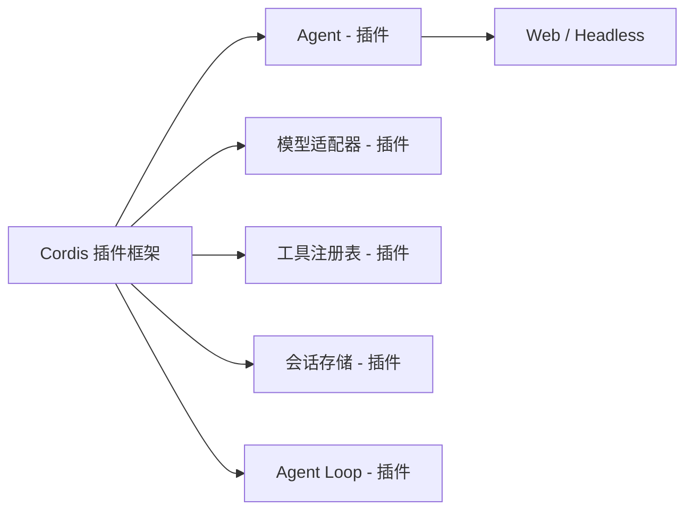

# 不用再为 Agent 东拼西凑了：DeepSeek 官方出品的 DeepSeek Harness 把一切都做成了一个插件

做 Agent 的人，多少都经历过这种循环：选框架、配模型、接工具、折腾沙箱、做会话存储、再补一套 UI……搭到一半发现"我还不如直接手写算了"。

模型的适配器是分开的，工具的注册表是分开的，会话日志是分开的，连那个 Agent 循环本身也是各自为政。你说它是生态丰富，说白了就是一大堆零件，得你自己拼。

最近 DeepSeek 官方把这个麻烦事做成了一整个东西——**DeepSeek Harness**（dsh）。它的思路很直接：**模型适配器是插件、工具注册表是插件、会话日志是插件、Agent Loop 本身也是插件。** 一切皆插件，你从"攒机器"变成了"选零件"。

一句话定性：DeepSeek Harness 是 DeepSeek AI 官方开源的 agent harness（智能体框架），底层由 Cordis 插件框架驱动，设计源自一篇《A Programming Paradigm for Spatiotemporal Composability》的论文。它既是能直接跑的 Coding Agent（有 Web 和 headless 两种形态），又是一套可以把它内部任何部件替换掉的插件框架。适合想把 Agent 当成一件"可以持续拼装"的东西来用的人。

在往下读之前，先给你一张速览表，把它的能力主线收一下：

| 能力 | 对你意味着什么 | 前提 |
|------|--------------|------|
| 一切皆插件架构 | 不拆核心框架，任意扩展/替换内部组件 | 基于 Cordis，需要一点框架理解 |
| Web UI + headless 双形态 | 有界面可点，也能无头跑 | 需安装 Node.js |
| 官方开源 + MIT 协议 | 可自用、可商用、可改源码 | 注意当前处于开发者预览阶段 |
| 插件生态（dsh plugin add 可装） | 上架了插件市场，可一键装 UI/记忆/工具类插件 | 可搭配 dsh-market 使用 |
| 面向 Agent 的 AGENTS.md | 官方连"给 AI 看的开发文档"都写好了 | 面向进阶开发者 |

需要先说明一句：dsh 目前是**开发者预览**阶段，正在快速迭代，未来会有破坏兼容性的变更。把它当玩具玩没问题，但要上生产，得接受"下个版本可能不兼容"的预期。

---

## 核心亮点

**1. 一切皆插件，没有"要你去改的核心"。**

这是 dsh 最反常规的地方。大多数框架是"核心代码 + 预留接口"，你想加能力得去碰那坨核心。dsh 反过来——模型适配器、工具注册表、会话日志、Agent Loop 本身，全是插件。你想多接一个模型，注册一个插件；想换掉整个 Agent 的执行逻辑，还是注册一个插件。这意味着你不必为了扩展去啃一整个框架的内部实现，框架的边界被拆成了一块块可以插拔的积木。前提是你得习惯"插件"这套心智，而不是"改 config"。

**2. 底层由 Cordis 驱动，设计有论文背书。**

dsh 不是凭空造轮子，它站在 Cordis 这个插件框架之上，设计的理论依据是一篇《A Programming Paradigm for Spatiotemporal Composability》论文。对写业务的人来说，论文不必细读，但知道"它有理论根基、不是临时拼的"这点，能让你判断它的扩展性上限时更有底气。官方也明确是 DeepSeek AI 出品、MIT 协议，来源可信。

**3. 一条命令启动 Web UI，开箱即用。**

装好 Node.js 之后，核心就是你最常用的那条命令：

```bash
npx @deepseek-ai/dsh web
```

跑起来默认访问 `http://127.0.0.1:3080`，一个可以点的 Web UI 就起来了。不用先配模型、不用先搭数据库，先把界面拉起来看效果再说。对想"先尝一口"的人很友好。

**4. Web 与 headless 双形态，能点的也能无头跑。**

它不是只有一个网页壳子。既能以 Web UI 的形式交互，也能做 headless（无头）运行——适合放到 CI、脚本、自动化流程里。前面那条命令带 `web` 参数是启动 Web 形态，去掉了就偏向于可编程的 agent harness 用法。这意味着"人机交互"和"机器自动化"挂了同一套底层，不用搞两套。

**5. 插件生态正在长出来，还有插件市场可装。**

因为架构天然支持插件，社区里已经有人在贡献社区插件（能通过 `dsh plugin add` 安装），还有人做了 dsh-market 这类插件市场，一键装 UI 增强、记忆、工具类插件。对一个上线不久的开源项目来说，生态能这么早跑起来，说明门槛确实低。前提是现阶段插件质量参差，装之前先看一眼是不是你需要的、作者是否在维护。

**6. 官方连"给 AI 看的文档"都准备好了。**

它有一份面向 agent 的 **AGENTS.md**，还有开发指南、架构文档。意思是你不仅可以自己读，还能把这份文档喂给 AI agent 让它按规范开发 dsh 插件或理解它的架构。这在开源项目里算比较少见的讲究——官方把"人和 AI"两条阅读路径都铺好了。

**7. 社区入口齐全，有企微群也有 Discussions。**

提交反馈或 bug 报告走 GitHub Discussions，想跟人实时聊可以加企微小助手、填问卷入群，官方还有微信公众号。对一个想来凑热闹、想交流插件的开发者来说，能找到活人的地方。

---

## Mermaid：dsh 的插件化架构长什么样

如果你第一次接触"一切皆插件"，用一张图来感受它跟传统框架的区别：



不需要读懂每一个方块，关键是抓住一点：连 Agent Loop 本身都是挂上去的插件，而不是焊死在核心里的东西。你换模型、加工具、改存储、甚至重写整个循环，都是在旁边挂插件，不是进核心撬锁。

（以上是基于项目架构文档的抽象图，便于理解"一切皆插件"，不作为官方架构图照搬。）

---

## 快速上手

最省力的路径：装好 Node.js，然后敲一条命令。

先确认有没有装 Node.js：

```bash
node -v
```

没装的话先去装（dsh 跑在 Node.js 上）。然后启动 Web UI：

```bash
npx @deepseek-ai/dsh web
```

默认地址是 `http://127.0.0.1:3080`，浏览器打开就能用。更完整的 Web UI 操作方式，官方在项目文档里有一个用户指南专章，需要深入的话可以去翻。

如果你想从仓库源码自己跑（比如要改代码、想跟主分支保持最新），官方给的步骤是这样：

```bash
git clone https://github.com/deepseek-ai/deepseek-harness.git
cd deepseek-harness
pnpm install
pnpm run build
pnpm dsh web
```

跑源码之前，确认你已经装了 pnpm（Node 包管理器），不然 `pnpm install` 会直接报找不到命令。

---

## 命令速查

| 阶段 | 命令 | 用途 |
|------|------|------|
| 前置 | `node -v` | 检查是否已装 Node.js |
| 快速启动 | `npx @deepseek-ai/dsh web` | 一行命令拉起 Web UI |
| 源码运行 | `git clone https://github.com/deepseek-ai/deepseek-harness.git` | 拉源码仓库 |
| 源码运行 | `cd deepseek-harness && pnpm install` | 装依赖 |
| 源码运行 | `pnpm run build` | 构建 |
| 源码运行 | `pnpm dsh web` | 从源码启动 Web UI |

最关键的还是这一条，装上 Node.js 后：

```bash
npx @deepseek-ai/dsh web
```

---

## 我的使用经验感想

说实话，我自己只跑到"一条命令把 Web UI 拉起来"这步，还没拿它在生产里重度跑过，所以下面谈不上深度体验，更多是基于文档和我试的过程做的合理推断。

从"一条命令起个能点的界面"这个体验来看，dsh 对"想先看看这玩意到底长啥样"的人相当友好——不用先配一堆模型密钥和数据库，先把面拉起来。这是它对比很多"光部署就要半小时"的 Agent 框架最明显的爽点。

但有几个门槛得提前说。

第一，它处于**开发者预览**阶段，官方自己警告"未来将出现破坏兼容性的变更"。这意味着你现在搭的东西，下个版本可能就要动。当玩具探索没问题，往生产环境搬之前要掂量清楚。

第二，虽然一条命令能启动，但"一切皆插件"这套心智是有学习成本的。你想真正玩转它、扩展它、换组件，就得理解 Cordis 那套插件模型。对只想开箱即用写几个提示词的人，可能反而觉得绕。

第三，插件生态还嫩。虽然有社区插件和插件市场跑起来了，但数量和质量都还在早期，跟成熟的 VS Code 生态没法比。装插件的时候，得自己去判断那个插件靠不靠谱。

替代方案也提一句：如果你想要的是"开箱即用、生态成熟"的 Coding Agent，市面上成熟的商业产品可能更顺手；dsh 的差异化在于**你自己能拼能改**的那种自由度，这正是它文档里反复强调的"插件可以替换核心部件，甚至组装出完全不同的东西"。

一句话，dsh 适合的是**想自己掌控 Agent 拼装过程的人**，而不是只想点一个"开始"按钮的人。

---

写在最后，简单给个判断。DeepSeek Harness 的价值不在"又出了一个 Agent 框架"，而在它把框架拆成了可以自由插拔的积木，还由官方下场维护、理论有论文背书、MIT 协议开放。它现在还在发育期，满身都是"开发者预览"的棱角，但"一切皆插件"这个方向，确实让我这种被"攒零件"折磨过的人眼前一亮。

想尝鲜：装好 Node.js，`npx @deepseek-ai/dsh web`，一分钟内你就能看到那个 Web UI。想深入：啃文档、翻 AGENTS.md、看看社区插件，加入企微群一起聊。剩下的事，交给时间去验证这个"插件化铺设"的思路能走多远。


#DeepSeekHarness #dsh #AI编程 #智能体 #Agent框架 #开源 #插件化 #DeepSeek #Cordis #AIAgent #开发者工具 #vibecoding