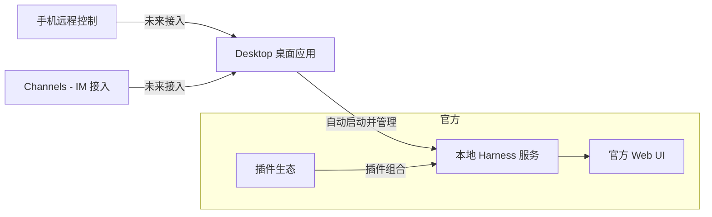

# Desktop-App: DeepSeek Harness 有人给它套了个桌面壳，装好就能用

用 DeepSeek Harness（dsh）的人都有个共同动作：先装 Node.js，然后敲一条命令把本地 Web UI 拉起来。`npx @deepseek-ai/dsh web`，浏览器开 `http://127.0.0.1:3080`，界面出来了才能开始用。

对开发者来说这不算门槛，但换个场景就卡住了：你想让一个不懂命令行的朋友、或者想从手机远程看着它干活、甚至想把它当成一个普通软件装进电脑里。这时候每次都要先开终端敲命令，就很劝退。

最近有人把这个麻烦事做成了一整个东西——**deepseek-harness-desktop**。一句话定性：它是为 DeepSeek Harness 生态打造的**现代化桌面端应用**，把官方那套"命令行启动 + 浏览器访问"的流程，整合成一个开箱即用的桌面软件，**装完就能用，不用自己装 Node.js、不用敲命令**。目前支持 macOS 和 Windows，MIT 协议。

先给你一张速览表，把它的能力主线收一下：

| 能力 | 对你意味着什么 | 状态 |
|------|--------------|------|
| 桌面应用封装 | 把官方 Web UI 带进原生桌面，自动管理本地服务 | 已可用 |
| 无需装 Node.js / 敲命令 | 装好即用，对非开发者更友好 | 已可用 |
| 服务启动 + 运行管理 | 应用自动拉起并管理本地 Harness 服务 | 已可用 |
| 系统托盘 + 桌面窗口 | 集成托盘，桌面环境内操作 | 已可用 |
| 手机远程控制 | iOS / Android 远程连接，手机发起任务看进度 | 即将推出 |
| 插件市场 | 模型、工具、界面、工作流按需组合 | 即将推出 |
| Channels | 接入微信、飞书、Discord、WhatsApp 等 IM | 即将推出 |

有个前提得先说清楚：**这是社区团队做的桌面版本，不是 DeepSeek 官方产品**，项目自己也把这句话放进了说明里。所以它的定位是"官方 Web UI 的桌面入口"，而不是又一个独立框架。

---

## 核心亮点

**1. 把"命令行启动 Web UI"整成了桌面软件。**

这是它最核心的价值。官方 dsh 目前通过命令行启动本地 Web UI，而这个项目把服务启动、运行管理和桌面窗口整合成一套开箱即用的桌面体验。你不再是"打开终端敲一串命令"，而是"点开一个软件"。

**2. 不用自己装 Node.js、不用执行命令。**

这是对非开发者最友好的一点。官方路线要求你先有 Node.js 环境和命令，而桌面版把这些都封装掉了。你装上桌面应用就能直接用本地 Harness，省掉环境配置这一大段前置学习成本。

**3. 基于官方 dsh 构建，核心能力不丢。**

项目明确说它是基于 `deepseek-ai/deepseek-harness` 构建的，核心能力、插件系统和 Web UI 都来自官方。它主要负责的是桌面应用封装、本地服务生命周期管理、桌面窗口和系统托盘集成、macOS/Windows 安装包构建发布、以及桌面环境下的界面适配。也就是说，它给 dsh 加的是"壳"和"桌面体验"，不是另起炉灶改掉 dsh 的内核。

**4. 说了要往"插件生态的桌面入口"方向做。**

项目不是只想做一个独立壳子。它希望 Desktop 成为 DeepSeek Harness 插件生态里的**桌面入口**，后续计划把桌面能力按官方插件机制重新组织，让服务管理、系统集成和插件市场都能沿用 Harness 的组合方式接入。方向是想跟 dsh 的"一切皆插件"生态长在一起，而不是孤立存在。

**5. 规划了手机远程控制。**

未来会支持 iOS 和 Android 远程连接 Desktop，在手机上发起任务、查看 Agent 进度、需要时继续跟进。这对"人不在电脑前但想让 Agent 继续干活"的场景是刚需。不过这项还在"即将推出"，现在只能看规划。

**6. 规划了插件市场 + Channels（IM 接入）。**

桌面端插件市场会提供插件的发现、安装、更新和管理；Channels 则计划接入微信、飞书、Discord、WhatsApp 等 IM 通道，让你直接在常用聊天工具里向 Agent 发起任务、接收进度并继续对话。这两块都还在"即将推出"阶段，但方向很明确——把 Agent 的入口下沉到桌面和日常 IM 里。

**7. 支持 macOS 和 Windows，社区入口齐全。**

官方下载页在 deepseekdesktop.com，支持 macOS 和 Windows。讨论交流有微信群、QQ 群，还有 Discord，社区入口铺得比较全，能找得到活人。

需要提醒的是：桌面端插件化、手机远程、IM Channels 这些目前都是"即将推出"的规划项，别把没上线的功能当成现在就能用的能力。现在能确定可用的，是"桌面封装 + 免 Node.js/命令"这一块。

---

## 桌面版在 dsh 生态里的位置

用一张图理解 Desktop 跟官方 dsh、插件生态、远程入口的关系：



核心关系就一句话：**Desktop 是官方 dsh 的一个桌面入口**，它负责把本地 Harness 服务管起来、把 Web UI 装进桌面窗口，而不是重新造一套 Harness。上面这张是帮助理解的抽象图，里面的名词都来自项目说明。

---


现在可用的方式是通过官方下载页拿安装包，装到 macOS 或 Windows 上直接用，不用自己配 Node.js。

下载桌面应用：

前往 `https://www.deepseekdesktop.com` 下载对应平台（macOS / Windows）的安装包，装完打开就能用。

如果你是开发者，想从源码跑桌面端，项目说明给的步骤是这样：

```sh
pnpm install
pnpm run dev:desktop
```

桌面端代码在 `apps/desktop` 目录下。跑之前确认装好了 pnpm（Node 包管理器），否则第一条命令会报找不到命令。

顺带说明一句：如果你更想用命令行直接跑 Harness、或者要参与核心功能开发，项目建议优先看官方仓库 `deepseek-ai/deepseek-harness`。桌面版目前的定位是"桌面端的便捷入口"。


| 场景 | 命令 | 用途 |
|------|------|------|
| 普通使用 | （无）访问 deepseekdesktop.com | 下载桌面应用直接安装使用 |
| 源码开发 | `pnpm install` | 安装依赖 |
| 源码开发 | `pnpm run dev:desktop` | 启动桌面应用开发模式 |

普通用户其实不用碰命令，下载安装包就行；上面两条命令是给想在本地跑源码的开发者准备的。

---

## 我的使用经验感想

说实话，我还没真正拿到 macOS/Windows 的桌面安装包跑起来，所以下面的判断更多是基于项目说明和我对 dsh 的认知做的合理推断，不是亲测结论。

从项目定位看，它解决的是一个真问题——**dsh 的入口太"开发者向"了**。官方是命令启动 + 浏览器访问，对命令行熟练的人是加分项，但对想把它当普通软件用、或者想远程操作的人来说是门槛。桌面封装天然解决了"免 Node.js、免命令"这一层。

但我有几个保留意见想摊开说。

第一，**"即将推出"的饼别算进现在的能力**。手机远程、插件市场、Channels 这几个最有想象力的功能都还挂着"即将推出"的标签。如果你是被这几个功能吸引来的，现在可能得失望——能确定使用的暂时只有桌面封装本身。

第二，**它是社区作品，不是官方出品**。项目自己声明"基于 DeepSeek Harness 构建的社区桌面版本，并非 DeepSeek 官方产品"。你想追官方核心进展，还是得回到官方仓库；社区桌面版的更新节奏和维护状态，得看这个团队持续投入的意愿。

第三，**"桌面壳"的长期价值取决于 dsh 生态本身**。Desktop 做得再好，底层还是 dsh。如果 dsh 的插件生态、远程能力成熟得快，这个桌面入口会越来越值钱；如果 dsh 还在快速迭代、兼容性变更频繁，那桌面壳也得跟着适配。

一句话，deepseek-harness-desktop 适合**想把 dsh 用得更"像普通软件"的人**——安装即用、免命令行、未来想手机 IM 远程。如果你本来就习惯命令行，或者想深度参与核心开发，那我建议直接用官方 dsh 那条路更直接。

---

官方给的是命令行界面，它补的是一个"装好就能用"的桌面入口，还明说了想往插件生态入口和 IM 远程的方向走。方向是对的，只是现在大部分红利还停在"即将推出"。

想尝鲜：去 deepseekdesktop.com 下个安装包，装完打开就能用本地 Harness，不用再为装 Node.js、敲命令发愁。想跟上它的进度：加微信群、QQ 群或 Discord，蹲一下手机远程和插件市场什么时候真上线。

剩下的事，交给时间验证这个"桌面入口"到底能不能在 dsh 生态里站稳。


#DeepSeekHarness #dsh #桌面应用 #AIAgent #智能体 #开源 #DeepSeek #macOS #Windows #Agent工具 #vibecoding #开发者工具