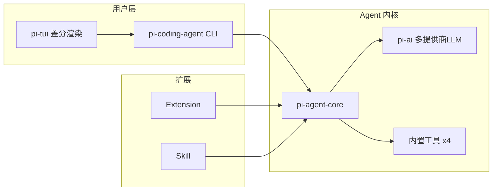
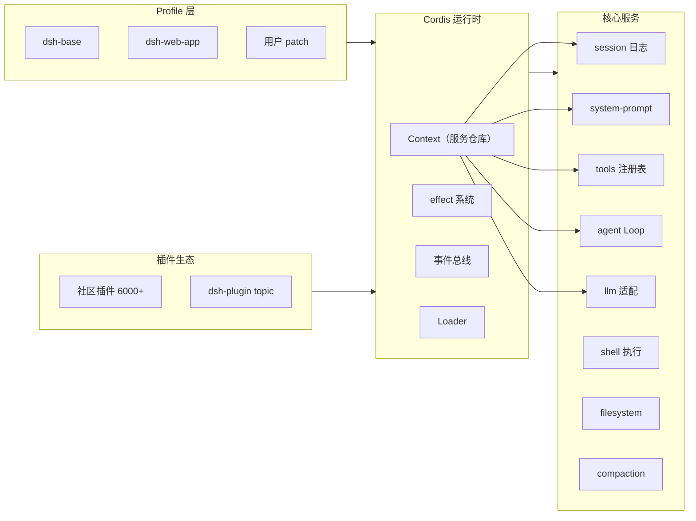
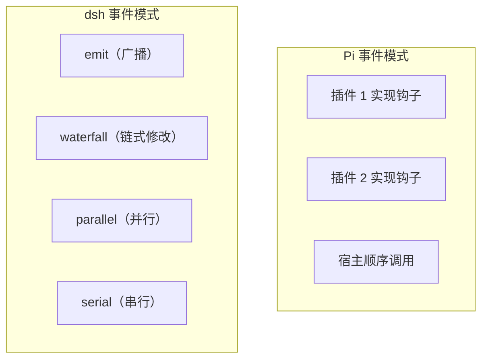
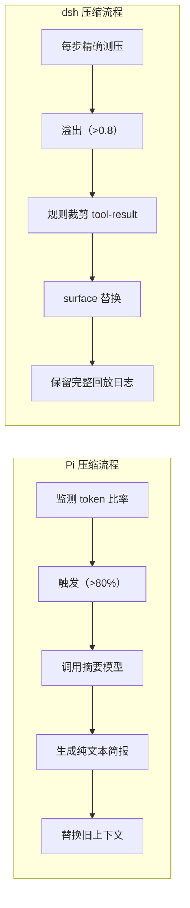
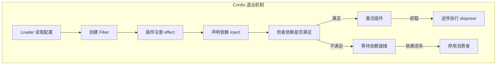
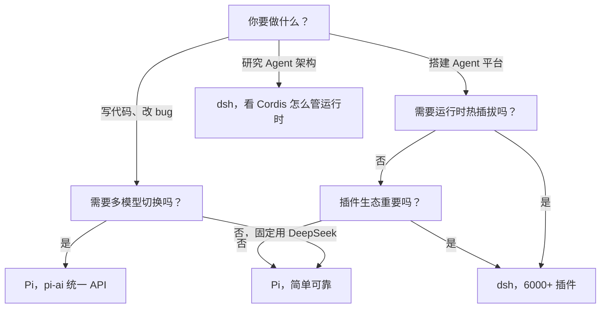

> 2026年8月13日，DeepSeek Harness 开源。24小时破7万 star，到检索日已超14万。另一边，Pi 经过一年打磨、5600+ 次提交，积累9万 star。两个项目都是 MIT、TypeScript，都叫"harness"，代码结构却隔着整个方法论光谱。

---

## 一、先看总表：32 项技术维度全面对比

在进入细节之前，先把两个项目拆到芯片级，一张表说清全部差异。

| 维度 | 子项 | Pi | DeepSeek Harness (dsh) |
|------|------|----|----------------------|
| **项目基础** | 出品方 | earendil-works（社区，Mario Zechner） | DeepSeek AI（官方） |
| | 首次发布 | 2025年8月 | 2026年8月13日 |
| | 当前版本 | v0.84.2（稳定） | v0.1（开发者预览） |
| | 提交次数 | 5,683 commits | 约 1,000+ commits |
| | 开源协议 | MIT | MIT |
| | 技术栈 | TypeScript monorepo、Bun 运行时 | TypeScript + pnpm workspaces |
| **设计哲学** | 核心口号 | "极简默认"（Default to Minimal） | "一切皆插件"（Everything is a Plugin） |
| | 内核框架 | 自研五包 monorepo | Cordis（论文驱动的组合式框架） |
| | Agent Loop 可替换 | 否，固定内核 | 是，Agent Loop 本身也是插件 |
| | 默认工具数量 | 4 件（读/写/改/执行命令） | 全插件式，按 profile 组装 |
| | 系统提示词长度 | 约 200 token | 视插件组合而定，可扩展 |
| **安装与启动** | 安装方式 | `npm install -g @earendil-works/pi-coding-agent` | `npx @deepseek-ai/dsh web` 或源码编译 |
| | 启动时间 | <1 秒 | 5-10 秒（含 Web UI 初始化） |
| | 用户界面 | 终端 TUI（差分渲染） | Web UI（:3080） |
| | 首次配置复杂度 | 低，仅需 API Key | 中，需 profile + 插件组合 |
| **模型生态** | 模型提供商 | OpenAI、Anthropic、Google、Kimi、MiniMax 等多家 | DeepSeek、Anthropic、OpenAI 及任意兼容端点 |
| | 模型适配层 | pi-ai 统一 API | Cordis 插件式 LLM Service |
| | 运行时切换模型 | 需重启会话 | 支持热切换（插件重载） |
| | 缓存优化 | 99.93% 缓存命中率（Pi + DeepSeek） | 原生 DeepSeek 推理内容回放优化 |
| **架构规模** | 包数量 | 5 个核心包 | 50+ 个包 |
| | 代码文件数 | 约 500+ | 约 8,600+ |
| | 插件/扩展数 | 按需安装（Extension + Skill） | 6,000+（dsh-plugin 话题仓库） |
| | 扩展机制 | Extension + Skill 钩子系统 | Cordis 插件（effect + inject + 事件） |
| **事件系统** | 事件模式 | 生命周期钩子（session_start/tool_call 等） | 4 种类型化模式（emit/waterfall/parallel/serial） |
| | 事件类型化 | 无，约定式接口 | 有，TypeScript declaration merging |
| | 事件持久化 | 无 | 有，SessionEvent 日志流 |
| **上下文管理** | 压缩策略 | 摘要模型 + 纯文本简报 | Surface 替换 + 规则裁剪 |
| | 压缩结果可读性 | 人可读，可跨会话移植 | 系统级，保留回放完整性 |
| | 会话回放 | 不支持 | 支持（事件流 deriveMessages()） |
| **插件生命周期** | 资源清理方式 | 扩展作者在 session_shutdown 中手动清理 | Cordis effect 自动逆序撤销 |
| | 依赖管理 | 无，宿主不追踪扩展关系 | 有，inject 声明依赖 + Fiber 追踪 |
| | 热插拔 | 不支持 | 支持（运行时加载/卸载插件） |
| | 插件退出影响范围 | 仅限于当前会话 | 运行时自动检查依赖链，级联停用消费者 |
| **安全与沙箱** | 内置权限系统 | 无（文档明确说明） | 有审批策略 + 沙箱 Service 层 |
| | 进程隔离 | 3 种模式（Gondolin/Docker/OpenShell） | 通过 ctx.sandbox + ctx.subprocess |
| | 供应链安全 | 严格（锁定版本 + shrinkwrap + audit） | 待观察（开发者预览阶段） |
| **成本与性能** | 单次成功任务成本 | ~0.028 美元（最低, Composio 实测） | 暂无公开基准 |
| | 启动耗时 | <1 秒 | 5-10 秒 |
| | 构建产物大小 | 轻量（5 包） | 重型（50+ 包，8600 文件） |
| **适用场景** | 目标用户 | 编码开发者（单人） | Agent 开发者/平台构建者 |
| | 典型场景 | 本地写代码、改 bug、重构 | 多 Agent 编排、自研工作流、Agent 平台 |
| | 上手门槛 | 低 | 高 |
| | 生态成熟度 | 成熟（年迭代） | 早期（开发者预览） |

这张表不是堆数字，而是两个项目的"设计签名"——每一行差异都指向同一个核心分歧：**Pi 把 Agent 当成工具来打磨，dsh 把 Agent 当成平台来构建。**

---

## 二、我是怎么测的

两套都从源码跑起来了。Pi 用的 `pi-mono` monorepo，dsh 基于 `47f9438` 提交。测试场景选了三个：**做一个简单的 CLI 工具**（检测系统状态）、**写一个带 API 的 Web 服务**（TODO 列表）、**修一个故意引入的 bug**。目的是看两个框架在真实开发流程里的手感和开销。

---

## 三、安装和启动：从零到能跑

先看第一个差异：上手路径。

### Pi

```bash
# 安装
npm install -g @earendil-works/pi-coding-agent

# 启动
pi

# 指定模型
pi --provider openai --model gpt-4o
```

装完就能跑，默认只读环境变量里的 API Key。没有额外配置，没有 Web 服务，没有数据库初始化。终端里直接进入对话。

### dsh

```bash
# 从 npm 跑
npx @deepseek-ai/dsh web

# 或者从源码
git clone https://github.com/deepseek-ai/deepseek-harness.git
cd deepseek-harness
pnpm install
pnpm run build
pnpm dsh web
```

启动后浏览器打开 `http://127.0.0.1:3080`，看到完整的 Web UI。第一次启动会生成 `~/.dsh/` 目录，里面是 profile、config、session 数据。

**差异在哪？** Pi 是终端 CLI，面向"打开就用"的场景；dsh 是 Web UI + 插件系统，首次启动后要经历浏览器加载、插件初始化、profile 组合。前者是"终端里干活"，后者是"浏览器里调试"。

---

## 四、架构哲学：两张图说清

### Pi 的架构流

Pi 的核心是一个五包 monorepo：



Pi 的设计哲学很清晰：**Agent Loop 是核心，其他都是扩展**。内置工具极少（读、写、改、执行命令），但 Extension 和 Skill 可以深入各个环节——包括工具调用、会话事件、模型 Provider、甚至压缩逻辑。

```typescript
// Pi 的扩展 API 示例 — 注册一个自定义工具
import { defineTool } from "@earendil-works/pi-agent-core";

export const myTool = defineTool({
  name: "system_status",
  description: "获取系统 CPU 和内存状态",
  parameters: {
    type: "object",
    properties: {},
  },
  execute: async (_, context) => {
    const cpu = await context.exec("top -l 1 -n 0 | grep 'CPU usage'");
    const mem = await context.exec("vm_stat | head -5");
    return `CPU: ${cpu}\nMEM: ${mem}`;
  },
});
```

### dsh 的架构流

dsh 的架构完全不同：**一切皆插件**，连 Agent Loop 本身都是插件之一。



```typescript
// dsh 的插件注册示例 — 注册一个工具到 Cordis 上下文
import { Context } from "@deepseek-ai/cordis";

export function apply(ctx: Context) {
  // 注册工具 — 这是一个 effect，插件卸载时自动撤销
  ctx.effect(() => {
    const id = ctx.tools.register("system_status", {
      description: "获取系统 CPU 和内存状态",
      parameters: {
        type: "object",
        properties: {},
      },
      execute: async (args, context) => {
        const cpu = await context.shell.exec("top -l 1 -n 0 | grep 'CPU usage'");
        const mem = await context.shell.exec("vm_stat | head -5");
        return `CPU: ${cpu}\nMEM: ${mem}`;
      },
    });
    // 返回 disposer — 卸载时自动清理
    return () => ctx.tools.unregister(id);
  });
}
```

**关键区别**：Pi 的扩展是"在核心上挂东西"，dsh 的插件是"跟核心住在一起"。Pi 的 Agent Loop 是固定的，你可以扩展它的行为；dsh 的 Agent Loop 本身可以被替换掉。

---

## 五、事件系统：两种解耦方式

这是一个很能体现设计差异的地方。

### Pi 的事件模型

Pi 的事件系统基于生命周期钩子：

```typescript
// Pi 的会话事件钩子
export default {
  session_start: async (ctx) => {
    // 新会话开始
    await ctx.db.connect();
  },
  session_shutdown: async (ctx) => {
    // 会话关闭 — 清理资源
    await ctx.db.disconnect();
    ctx.fileWatcher?.close();
  },
  tool_call: async (ctx, toolName, args) => {
    // 工具调用前拦截
    if (toolName === "execute_command") {
      // 安全检查
      if (args.command.includes("rm -rf /")) {
        throw new Error("危险命令被拦截");
      }
    }
  },
};
```

Pi 把生命周期事件做成约定的接口，扩展按需实现。基于 `session_start` 和 `session_shutdown` 做资源管理，扩展作者负责清理自己的东西。宿主不追踪跨扩展依赖。

### dsh 的 Cordis 事件模型

Cordis 有四种事件分派模式：

```typescript
// dsh 的四种事件模式
// 1. emit — 广播通知，不等待
ctx.emit("session/created", { id: "xxx" });

// 2. waterfall — 链式处理，每个监听器可修改结果
ctx.waterfall("agent/request", messages, (ctx, msgs, next) => {
  // 可以修改消息再传给下一个监听器
  return next(msgs.filter(m => m.role !== "system"));
});

// 3. parallel — 并行执行
ctx.parallel("tools/pre-execute", toolCall, (ctx, call, next) => {
  return next(); // 必须调用 next() 否则链断
});

// 4. serial — 串行执行，带返回
ctx.serial("fs/read", { path: "/etc/passwd" }, (ctx, args, next) => {
  // 可以拒绝或允许
  if (args.path.includes("..")) throw new Error("路径遍历");
  return next();
});
```

**这是个有论文支撑的设计**。Cordis 的论文《A Programming Paradigm for Spatiotemporal Composability》定义了插件之间的时空可组合性——时间上保证撤销顺序（逆序执行），空间上通过 Context 作用域隔离。



**差异**：Pi 的事件是"约定式的钩子"，dsh 的事件是"类型化的基础设施"。Pi 适合可控范围内的扩展，dsh 适合需要精细控制事件流的场景。

---

## 六、上下文压缩：同源但不同追求

长程 Agent 最头疼的问题：上下文满了怎么办。两个项目给出的解法高度同构，但工程实现方向完全不同。

### Pi 的压缩

Pi 把压缩做成"可换模型的能力"：

```yaml
# Pi 的压缩配置
compaction:
  enabled: true
  # 可换便宜模型做摘要
  summarizer_model: "deepseek-chat"  # 可以换成 gpt-4o-mini
  # 触发条件：token 超过 80%
  trigger_ratio: 0.8
  # 保留最近 N 条消息
  keep_last: 20
  # 输出纯文本简报
  format: "text"
```

关键设计：**纯文本简报可跨会话移植**。Pi 压缩出来的内容是人可读的，你可以在新会话里直接粘贴进去用。这跟 Pi 的"人能接管"哲学一致——压缩结果对使用者透明，你随时可以检查、修改、甚至手动敲回去。

```text
# Pi 压缩后的简报示例
[会话摘要]
用户正在开发一个 TypeScript Web 服务，使用 Express 框架。
已完成：
- 路由配置（GET /api/todos, POST /api/todos）
- 数据库连接（SQLite via better-sqlite3）
- 错误处理中间件
当前问题：POST 请求返回 400，原因是 body parser 未启用
已尝试：检查了路由注册顺序，未发现问题
下一步：检查 app.use(express.json()) 是否在路由之前注册
```

### dsh 的压缩

dsh 把压缩做成"可换后端的插件"：

```yaml
# dsh 的压缩配置（cordis.yml）
plugins:
  compaction:
    config:
      # 压力阈值
      threshold: 0.8
      # 压缩策略
      strategy: "surface"
      # 回放安全
      replay_safe: true
      # 裁剪规则
      tool_result_rules:
        max_length: 2000
        truncate: "keep_head"
        drop: ["cat_*.log", "node_modules/**"]
```

关键设计：**回放安全的 surface 替换**。dsh 压缩时不会破坏会话日志的可回放性——替换的不是原始事件，而是展示层（surface layer）。这意味着即使压缩后，日志仍然可以完整回放，只是模型看到的上下文被精简了。



**差异的本质**：Pi 偏"人能接管"——压缩结果可读、可拷、可手动改；dsh 偏"系统能扩展"——压缩策略可配、可换、不影响回放。Pi 承担了 prompt cache 被打穿的代价，dsh 用分层设计避免了这个问题。

---

## 七、实际开发场景对比

### 场景 1：做一个系统状态检测 CLI 工具

**在 Pi 里**：

```bash
$ pi
> 创建一个 Node.js CLI 工具，读取 /proc/stat 和 /proc/meminfo 并格式化输出
```

Pi 直接执行：读文件、写文件、执行命令。不到 30 秒，文件就写好了。过程中模型只调用了 4 次工具，输入 token 总量约 15K。

**在 dsh 里**：

```bash
$ npx @deepseek-ai/dsh web
# 浏览器打开 :3080，在 Web UI 中输入同样指令
```

dsh 一样能完成，但因为 Web UI 本身有额外的渲染和通信开销，第一次启动到可用需要约 5-10 秒初始化。工具的注册和调用通过 Cordis 事件路由，多了一层插件解析。

**Pi 更适合**"打开终端说句话就干活"的场景。

### 场景 2：写一个带 API 的 TODO 服务，中途换模型

**Pi**：

```bash
# 启动时直接指定
pi --provider openai --model gpt-4o

# 或者运行时切换（需要重启会话）
# 但 Pi 的 pi-ai 统一 API 让切换只改一行
```

Pi 的 `pi-ai` 包统一对接 OpenAI、Anthropic、Google 等多家提供商，API 接口一致。切换模型只需要改 Provider 参数，但**需要重启会话**。

**dsh**：

```yaml
# dsh 的模型配置（cordis.yml）
plugins:
  llm:
    config:
      provider: "deepseek"
      model: "deepseek-v4-flash"
    # 运行时热切换
    # 通过插件热插拔，不需要重启
```

dsh 的模型适配器是插件，通过 Cordis 的运行时动态加载/卸载机制，可以在不重启会话的情况下切换 Provider。这一点对长时间运行的 Agent 任务很有价值。

**dsh 更适合**"需要运行时切换的能力组合"的场景。

### 场景 3：修一个 bug，要排查历史上下文

这是一个很实际的场景。Agent 跑了 50 轮对话后，上下文满了，压缩已经开始，现在要回退到某个历史状态看看。

**Pi**：压缩后的纯文本简报可读，你可以手动翻看。但如果简报对某个历史细节做了精简，需要重新跑上下文才能看到原始信息。没有完整的事件回放。

**dsh**：会话日志是 append-only 的 `SessionEvent` 流，任何压缩都不破坏原始日志。通过 `dsh session log <id>` 可以回放完整的事件序列——包括每一步的 tool call、tool result、assistant message。这不仅仅是"查看历史"，而是**可验证的完整回放**。

```bash
# dsh 回放会话
dsh session log --id session-xxxx --replay
```

dsh 的 `deriveMessages()` 函数从日志投影模型历史，回放时能精确重建每一步的上下文。这跟 Pi 的"纯文本简报"是完全不同的设计思路——一个是人可读的摘要，一个是机器可回放的事件流。

---

## 八、插件系统：从"退出"看差异

给 Agent 加一个插件通常不难。真正让人头疼的是插件离开以后——配置里明明删掉了，文件监听器还在跑；Provider 换了，某个工具却仍握着旧对象。

### Pi 的退出策略

Pi 的文档说得很清楚：扩展作者在 `session_shutdown` 里清理资源，宿主负责调用这个钩子。

```typescript
// Pi 扩展的退出模式
export default {
  session_start: async (ctx) => {
    ctx.watcher = fs.watch("/some/path", callback);
  },
  session_shutdown: async (ctx) => {
    // 扩展作者自己清理
    ctx.watcher?.close();
    ctx.connections.forEach(c => c.destroy());
  },
};
```

**Pi 的分工**：宿主把门关上再打开，屋里有什么东西，由住在里面的人自己清点。扩展不多时，这套模式很省心。

### dsh 的退出策略

dsh 借 Cordis 的 `effect` 系统做资源追踪：

```typescript
// dsh 插件的退出模式
export function apply(ctx: Context) {
  // effect 注册 — 退出时自动撤销
  ctx.effect(() => {
    const watcher = fs.watch("/some/path", callback);
    return () => {
      watcher.close(); // 插件卸载时自动执行
    };
  });
  
  // 依赖注入 — 声明需要哪些服务
  ctx.inject(["ctx.shell", "ctx.fs"], (shell, fs) => {
    // 只有 shell 和 fs 都可用时，这段代码才会执行
  });
}
```

Cordis 记住了三件事：系统想让谁运行，资源由谁撤销，依赖失效会影响谁。



**差异的本质**：Pi 把退出边界交给扩展作者，dsh 把一部分跨插件关系交给运行时管理。前者在扩展少的时候更简单，后者在扩展复杂时更能保证清理的完整性。

---

## 九、选型决策树



---

## 十、不是替代，是分化

写到最后，我想说清楚一件事。

Pi 和 dsh 不是同一个产品的两个版本，而是 Harness 这一层正在分化的两极。

**Pi 代表"最小内核 + 用户掌控"**。它的核心判断是：模型已经够聪明了，不需要你用一整套产品规则把它喂饱。给模型最少的工具、最少的提示词，让它自己发挥。代价是扩展能力有限，不适合做平台。

**dsh 代表"可替换平台 + 生态供给"**。它的核心判断是：Agent 的竞争力不在模型，而在于 Harness 能组装多少能力。模型适配器、工具注册表、甚至 Agent Loop 本身，全都可以换。代价是复杂度高，学习曲线陡峭。

它们选择了两条相反的路径，但共同接受了一个前提：**模型是可替换的后端，决定体验差异的是 Harness**。

所以别再问"哪个更好"了。问自己：你是想用 Agent 干活，还是想造 Agent 给别人用？
