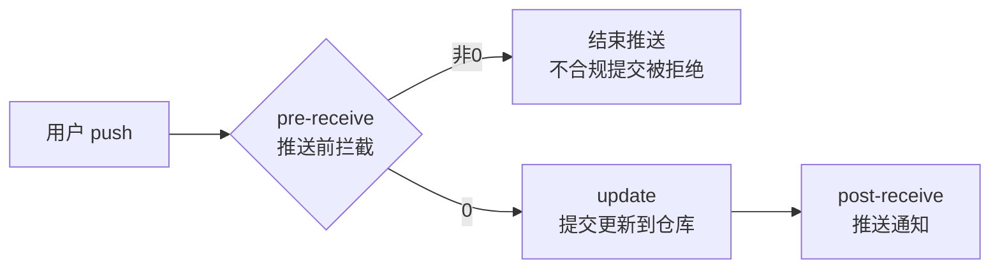

看过自己团队 git log 里那些"改代码"、"修复"、"update"的提交信息，你就知道这事儿有多糟心。

每次 Review 代码，先翻 commit 历史，结果全是没营养的废话。Release Note 靠人工整理，出一次版本恨不得把所有人拉一起开会回忆这周改了什么。更头疼的是 GitLab 服务端配了 pre-receive hook 做提交规范拦截，结果 teammate 本地写好的 commit message 一 push 就被拒，又得重来一遍——浪费时间不说，团队里怨气还大。

**最近 7DGroup 把这事儿做成了一个 DSH 组合层插件：`dsh-skill-7d-git-commit`，在 git commit 之前就跑一遍规范校验，过不了根本不让提交通过。客户端预检 + 服务端兜底，等于把规则卡在最近的地方。**

### 一句话结论

这是一个 DSH 插件包，装上之后，每次你在 DSH 会话里生成 git commit message，它都会自动按 7DGroup 提交规范校验——标题长度、标签格式、禁用字符、正文行数、动宾句式，全查一遍。校验不过就提示你改，改到通过为止。配合 GitLab 服务端 pre-receive hook，形成"客户端预判 + 服务端兜底"的双层防线。

---

**核心亮点**

**1. 9 个固定中文类型标签，少一个都不行**

项目定义了 9 类标签：【新增】、【修复】、【优化】、【调整】、【删除】、【文档】、【测试】、【回滚】、【合并】。没有「其他」这种兜底选项，也不允许自创格式。每条 commit message 先选类型，再写内容。

这意味着什么：git log 的可读性从"自由发挥"变成了"格式化输出"。一眼扫过去就知道某次提交是修 bug 还是加功能，是重构还是配环境。

**2. 标题规则写得细，不是随便写写**

标题格式：【类型】简短描述。去标签后 ≤50 字符，末尾禁止带句号逗号，禁用 @ # $ % ^ & * ~ 这些特殊字符。标题里不准出现"待优化"、"TODO"、"FIXME"这类临时标记。

说人话版本：commit message 的标题必须是一句话能说清楚的事，不能是"改代码"这种废话，也不能是"后续再优化"这种推诿。

**3. 正文用数字序号，每行不超过 70 字符**

复杂改动必须标题 + 空行 + 正文。正文用数字序号逐条罗列，每条不超过 70 个字符。这跟 Linux kernel 的 commit 规范是一个思路——短行、结构化、可快速扫读。

**4. Merge commit 和紧急发版可以豁免**

不是所有 commit 都要走严格校验。Merge commit 天然通过，紧急发版在标题或正文里加 `[skip-check]` 标记就跳过校验。这个设计很务实——规则要防的是懒散，不是紧急情况。

**5. 场景细分：代码、前端、配置、数据库、运维、容器、网关、文档全覆盖**

每条场景都规定了"注明什么 + 写什么动作"。比如数据库改动注明「数据表/字段/索引/执行脚本」+ 新增/修改/删除动作。网关改动注明「路由/过滤器/限流规则/转发策略」。不是笼统要求"写清楚"，而是告诉你"写哪些东西才叫清楚"。

**6. 追溯标识：关联需求ID、工单ID、缺陷ID**

多人协作场景下，标题末尾或详情末尾可以加 `关联需求ID-XXX`、`关联工单ID-XXX`、`关联缺陷ID-XXX`。这解决了"这个提交是为了修哪个 bug"的追溯问题，对 Release Note 自动生成尤其有用。

**7. 支持 GitLab 服务端 hook 一体化部署**

项目不只提供 DSH 客户端插件，还配了完整的 GitLab 服务端集成方案：

- `pre-receive` hook：在 push 到达仓库前做校验，不合规直接拒绝推送
- 规则外置到 `commit-rules.conf`，客户端和服务端共用同一套规则
- 支持 `warn`（警告模式，不阻断）和 `reject`（拦截模式，阻断推送）两种模式
- 审计日志 + 钉钉日报推送
- 一键部署脚本 `install-hooks.sh`

**8. 零核心改动，安装即用，卸载不残留**

这是 DSH 组合层插件，不是 DSH 核心补丁。装上去技能就可用，卸掉 bundle 行就恢复原样。不污染核心框架，不引入额外依赖风险。

**9. 内置事实来源，不撑大提示词**

校验规则文件 `references/git-commit-message.md` 按需加载，不会每次对话都塞进 prompt。设计上考虑了 LLM Agent 的上下文窗口管理。

---

**快速上手**

先装上 DSH 插件。有两种方式：

**安装前置条件：** dsh CLI、Node ^22.19.0 || >=24.0.0、pnpm 10+

```bash
dsh plugin --profile web add github:7dgroup-ai/dsh-skill-7d-git-commit
```

首次 git 安装时，pnpm 会拒绝运行构建脚本。需要把 pnpm 打印的确切包键写入该 profile 的 `pnpm-workspace.yaml` → `allowBuilds`，然后重新执行命令。

如果不想处理构建授权，直接用预构建 tarball 或 npm 包（发布后可用）：

```bash
dsh plugin --profile web add @7dgroup/dsh-skill-7d-git-commit
```

**最省事的安装方式：** 在 DSH 会话中直接告诉助手：

```
安装插件 github:7dgroup-ai/dsh-skill-7d-git-commit
```

助手会在会话内通过 Shell 执行对应的 `dsh plugin` 命令。git 安装时遇到同样的 pnpm allowBuilds 门禁，助手会打印需要添加进 profile 的 pnpm 设置文件的确切授权键，添加后让助手重试即可。

**在 DSH 会话中使用：**

```
为当前改动生成一条 commit message。
```

或者用斜杠命令显式触发：

```
/7d-git-commit
```

技能会分析改动内容，从 9 类标签中选择匹配类型，生成标题和详情，然后逐项校验。校验不通过就提示你修改。

**命令速查**

| 阶段 | 命令 | 用途 |
|------|------|------|
| 安装 | `dsh plugin --profile web add github:7dgroup-ai/dsh-skill-7d-git-commit` | 安装插件 |
| 安装（npm） | `dsh plugin --profile web add @7dgroup/dsh-skill-7d-git-commit` | 跳过构建授权 |
| 会话触发 | `安装插件 github:7dgroup-ai/dsh-skill-7d-git-commit` | 在 DSH 会话内自动安装 |
| 使用 | `为当前改动生成一条 commit message。` | 生成规范提交信息 |
| 显式触发 | `/7d-git-commit` | 斜杠命令触发技能 |

**GitLab 服务端部署（可选，形成双层防线）：**

```bash
# 单仓试点
sudo bash install-hooks.sh --pilot devops/7dgroup

# 试点验证通过后推广全局
sudo bash install-hooks.sh --global
```

服务端部署的完整操作流程：

1. 找到仓库物理路径（GitLab 用 hash 存储，需管理员账号查询）
2. 在仓库目录下创建 `custom_hooks` 目录
3. 创建 `pre-receive` 文件（shell 脚本）
4. 赋予执行权限：`chmod +x pre-receive`
5. 本地 push 验证

---

**GitLab 服务端 hook 工作流**（以下流程来自项目文档 `docs/gitlab-integration/`）



规则同步与审计：

```bash
# 规则变更后同步到全局
sudo bash scripts/sync-rules.sh --global --dry-run
sudo bash scripts/sync-rules.sh --global

# 生成 Markdown 日报
sudo bash scripts/audit-report.sh --markdown

# 推送钉钉通知
export DINGTALK_WEBHOOK="https://oapi.dingtalk.com/robot/send?access_token=xxx"
sudo -E bash scripts/dingtalk-notify.sh
```

---

**一些实际协作用法**

这个插件在 DSH 生态里的定位，其实可以玩出不少花样。我列几个实际能用的场景：

**场景一：在日常开发中当"提交助手"**

最直接的使用方式。每次改完代码，在 DSH 会话里说"帮我把这次改动写一条提交信息"。技能自动分析 diff，选类型、写标题、列详情，然后校验一把过。你不用记"五十个字符"、"动宾短语"这些规则，它帮你管。

**场景二：作为"合规检查器"修正已有提交**

团队成员已经写了一条不规范的信息，但不想重写。在 DSH 会话里说"修正这条 commit message，让它通过规范校验"。技能会按规则逐项检查并给出修改建议。这个场景对团队协作比较友好——不是一开始就禁止，而是先写、再改、逐步适应。

**场景三：客户端 + 服务端双层防线**

这是项目推荐的完整方案：

- 本地：DSH 插件在 git commit 前校验，不通过就提示改
- 服务端：GitLab pre-receive hook 在 git push 时检查，不通过就拒绝

本地漏掉的，服务端兜住；服务端不应该出现的，本地已经拦住了。配合审计日志，谁写了不规范提交、什么时间、什么内容，一清二楚。

**场景四：结合 CI/CD 流水线做规范报告**

项目的审计脚本 `audit-report.sh` 可以生成 Markdown 日报，配合钉钉机器人推送。把它放进 CI/CD 的定时任务，每天自动出一次提交规范报告，团队可以清楚地看到"这周合规率提升了多少"。

---

**几个注意事项**

**pnpm 构建授权问题**：git 安装时 pnpm 默认拒绝运行构建脚本，需要手动把包键加入 `allowBuilds`。这是 pnpm 的安全机制，不是 bug。想省事就用 npm 包形式安装。

**GitLab 版本差异**：项目文档特别提醒，不同 GitLab 版本自带的 git 版本不一致，相同命令的输出格式存在差异。`git log --no-merges --date-order -1` 在不同版本下输出格式可能不同。部署服务端 hook 时，先在测试环境验证脚本兼容性。

**服务端集成按需部署**：`docs/gitlab-integration/` 目录不进入 DSH 运行时包，需要手动复制到 GitLab 服务器。这个限制很合理——服务端 hook 是 GitLab 基础设施层面的东西，不应该跟 DSH 插件包耦合。

**Docker/gateway 场景的规范覆盖**：项目的场景细分规则里专门写了容器和网关场景的规范要求，覆盖了"编排脚本"、"资源配额"、"路由规则"、"限流阈值"等具体对象。如果你的团队有平台工程或基础设施团队，这个覆盖很有价值。

---

**写到最后**

这个项目解决的不是"怎么写 commit message"的问题，而是"怎么让团队每个人都写合规的 commit message"的问题。

GitLab 服务端 hook 做拦截，很多团队已经用上了。但问题在于：提交被拦截的时候，损失已经发生了——开发者写了一个不规范的 message，push 时被拒，重新改、重新 push，多花 5 分钟。如果团队大、提交频繁，这些 5 分钟累积起来就是一个不小的摩擦成本。

DSH 插件的思路是：把校验提前到"写"的环节，在 commit 生成的时候就确保合规，到了 push 阶段自然不会被拦。客户端预判 + 服务端兜底，两层防线都不算重，但效果比单层好得多。

前提是你们团队在用 DSH。如果没用，也可以单独把服务端 hook 方案拿走——项目文档里配了完整的一键部署脚本、审计日志和钉钉通知，拿来就能用。

#Git #GitLab #DSH #7DGroup #提交规范 #工程化 #DevOps #开源工具 #代码质量