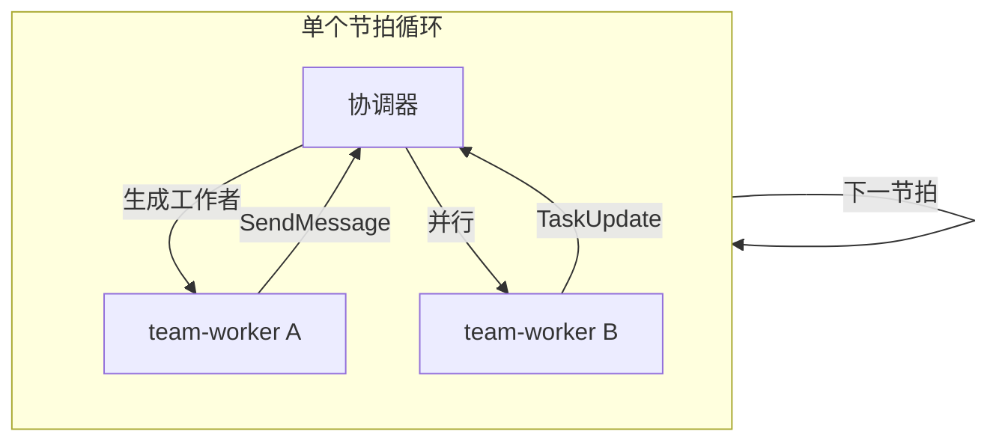

在 Claude Code 里跟 AI 协作开发，干着干着就会遇到几个问题：对话一长，上下文就胀，AI 开始丢三落四；想让 AI 多角色分析一个问题，得手动切换提示词；想同时跑几个任务，只能串行排队。

这些问题不是 Claude Code 本身的问题，而是"单会话、单角色、单任务"这个工作模式的天然缺陷。AI 对话就是一条线，而真实开发是多条线并行、多个角色协作、多个阶段递进的网状结构。

**最近有个叫 Claude Code Workflow 的项目，用 JSON 驱动 + 37 个模块化 Skill + 22 个专业化 Agent，把 Claude Code 从单条线的工作模式，扩展成了一个多智能体开发框架。现已演进为 Maestro Flow，支持 Gemini、Codex、Qwen、Claude 多 CLI 编排。**

### 一句话结论

CCW 是一套 Claude Code 的多智能体开发框架。它把"AI 对话"变成了"AI 工作流"——用 Skill 触发工作流、用 Agent 做后台分析、用编排器管理多 CLI 协作。npm 全局安装，一行命令装好。现已演进为 Maestro Flow，功能更全面。

---

**核心亮点**

**1. 37 个 Skill + 22 个 Agent，不是所有的 AI 交互都叫"工作流"**

CCW 把 AI 能力分成了三层：

- **Commands**：轻量心智命令，单文件。比如 `/switch-role` 切换角色、`/handoff` 保存进度
- **Skills**：复杂工作流，多文件。比如 `workflow-plan`（完整规划）、`brainstorm`（多角色头脑风暴）、`workflow-tdd-plan`（TDD 工作流）
- **Agents**：后台独立运行的专家。比如 `security-auditor` 全库扫描、`performance-analyzer` 全链路性能分析，只返回最终报告，不刷屏中间过程

三层的核心区别不是"谁更厉害"，而是"谁更合适"——简单任务用 Command，复杂流程用 Skill，大规模分析交给 Agent。

**2. 6 种工作流 Skill，覆盖不同粒度**

| Skill 触发词 | 使用场景 |
|---|---|
| `workflow-lite-plan` | 轻量规划、单模块功能 |
| `workflow-multi-cli-plan` | 多 CLI 协同分析 |
| `workflow-plan` | 完整规划与会话持久化 |
| `workflow-tdd-plan` | 测试驱动开发 |
| `workflow-test-fix` | 测试生成与修复循环 |
| `brainstorm` | 多角色头脑风暴分析 |

不是所有需求都需要完整规划。如果只是加一个按钮，用 `lite-plan`；如果需要跨服务分析，用 `multi-cli-plan`；如果要做 TDD，用 `tdd-plan`。按需选择，不浪费上下文。

**3. 多 CLI 编排：不是只能用一个 AI**

CCW 支持语义化调用多个 CLI 工具（Gemini、Codex、Qwen、Claude），用户只需在提示词里自然描述：

| 用户说 | 系统做 |
|---|---|
| "使用 Gemini 分析 auth 模块" | 自动调 `gemini` CLI 分析 |
| "让 Codex 审查这段代码" | 自动调 `codex` CLI 审查 |
| "问问 Qwen 性能优化建议" | 自动调 `qwen` CLI 咨询 |

还能做多 CLI 协同编排：并行分析、迭代优化（Gemini 诊断 → Codex 修复 → Claude 审查）、流水线编排（Gemini 设计 → Codex 实现 → Claude 审查）。

**4. Team 架构 v2：事件驱动的节拍模型**



协调器只在需要时唤醒（回调/恢复），简单后继直接生成，无需协调器往返。独立任务并发运行，依赖图按任务生成。不是"一个 AI 慢慢干所有事"，而是"协调器分派 + 工作者并行执行"。

**5. 3 个核心斜杠命令覆盖日常**

- `/ccw`：自动工作流编排器——分析意图、选择工作流、执行
- `/ccw-coordinator`：智能编排器——推荐命令链、支持手动调整
- `/workflow:session:start/resume/list/sync/complete`：会话管理

日常使用 `/ccw "添加用户认证"` 就够，自动匹配最合适的工作流。复杂场景用 `/ccw-coordinator` 手动编排。

**6. 完整 Issue 工作流**

从 Issue 创建到执行的完整闭环：

```bash
/issue/new       # 创建新 issue
/issue/plan      # 规划 issue 解决方案
/issue/queue     # 形成执行队列
/issue/execute   # 执行 issue 队列
```

**7. 前端仪表板 + 编排器编辑器**

不只有 CLI。CCW 带了 React 前端：

- **终端仪表板**：多终端网格，可调整窗格大小，实时执行监控，项目导航文件侧边栏
- **编排器编辑器**：基于 React Flow 的可视化工作流编辑，拖放节点，预构建模板库

**8. 智慧积累系统**

多 Agent 协作过程中，自动积累 learnings、decisions、conventions。不是每次都从零开始，而是团队越用越"聪明"。

---

**安装**

```bash
npm install -g claude-code-workflow
ccw install -m Global
```

**Codex 配置**（如果使用 Codex CLI 配合 `.codex/skills/` 工作流技能，需要在 `~/.codex/config.toml` 中添加）：

```toml
[features]
default_mode_request_user_input = true
multi_agent = true
multi_agent_v2 = true
enable_fanout = true
```

---

**使用示例**

```bash
# Skill 触发（无斜杠 - 直接描述）
workflow-lite-plan "添加 JWT 认证"
workflow-plan "实现支付网关集成"
workflow-execute

# 头脑风暴
brainstorm "设计实时协作系统"

# 斜杠命令
/ccw "添加用户认证"
/ccw "修复 WebSocket 中的内存泄漏"
/ccw "使用 TDD 方式实现"
/ccw-coordinator "实现 OAuth2 系统"

# 会话管理
/workflow:session:start
/workflow:session:resume
/workflow:session:complete
```

---

**命令速查**

| 类别 | 命令 | 用途 |
|------|------|------|
| 安装 | `npm install -g claude-code-workflow` | 全局安装 |
| 安装 | `ccw install -m Global` | 安装工作流文件 |
| 触发 | `workflow-lite-plan "..."` | 轻量规划 |
| 触发 | `brainstorm "..."` | 多角色头脑风暴 |
| 编排 | `/ccw "..."` | 自动工作流编排 |
| 编排 | `/ccw-coordinator "..."` | 手动链编排 |
| 会话 | `/workflow:session:start` | 启动会话 |
| 会话 | `/workflow:session:resume` | 恢复会话 |
| Issue | `/issue/new` | 创建 issue |
| 其他 | `ccw view` | 打开仪表板 |
| 其他 | `ccw upgrade -a` | 升级所有安装 |

---

**一些注意事项**

**CCW 已归档，演进为 Maestro Flow。** 项目 README 明确标注了这一点。核心功能全部保留并新增了知识图谱、自适应生命周期引擎、Hook 系统、团队协作等。新用户建议直接看 Maestro Flow：`npm install -g maestro-flow`。

**适合有一定 Claude Code 使用经验的用户。** CCW 的 Skill 和 Agent 体系需要理解 Claude Code 的工作方式才能用好。纯新手建议先跑一遍 `workflow-lite-plan` 入入门。

**依赖多 CLI 工具。** 多 CLI 编排需要额外安装 Gemini、Codex、Qwen、Claude 的 CLI 工具。CCW 不捆绑这些 CLI，只是编排它们。如果只用 Claude Code，多 CLI 功能用不上，但 Skill 和 Agent 体系不受影响。

**Codex 用户需要额外配置。** Codex CLI 的 `config.toml` 需要手动启用 `multi_agent`、`enable_fanout` 等特性，否则工作流技能无法正常运行。

---

**写在最后**

CCW 的核心思路不是"让 AI 更聪明"，而是"让 AI 的工作模式更接近真实开发"。

真实开发不是一个人在一个终端里干完所有事，而是多个角色、多个工具、多个阶段协同推进。CCW 把这种协同模式搬到了 Claude Code 里，用 Skill 定义工作流、用 Agent 做后台分析、用编排器管理多 CLI 协作。

如果你已经觉得"单会话 Claude Code 不够用"，CCW 是一个值得了解的框架。它已演进为 Maestro Flow，现在入坑正好赶上新版本。

#ClaudeCode #多智能体 #AI工作流 #开源工具 #MaestroFlow #开发框架 #AI编排