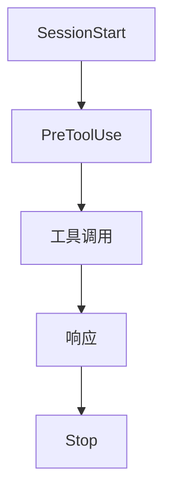

每次新建项目，打开 Claude Code，先跟 AI 说一遍"这是 TypeScript 项目，测试用 vitest，代码风格走 prettier，别动 `node_modules`"。换一个项目，又说一遍。换一个 Python 项目，又得说一遍。

这个跟 AI 对话里反复交代上下文的过程，其实是一种重复劳动。而且交代得越细，AI 越容易在长对话里忘记某条规则，最后干出删了你 `.env` 这种事。

**最近有个项目叫 Harness Starter，把这事儿固化成了一套模板。装一次，所有项目通用，而且自带安全拦截、进度感知和自动化审查。**

### 一句话结论

Harness Starter 是一套 Claude Code 的工程化模板。装进项目后，AI 在每次对话里自动知道当前项目是什么技术栈、测试怎么跑、哪些文件不能动、当前做到哪一步了。不用每次新建对话都重新交代一遍。开箱即用，`npx harness-starter` 一键安装。

---

**核心亮点**

**1. 5 个 Hook 覆盖对话全生命周期，不是只靠一个 CLAUDE.md**

Harness Starter 定义了 5 个 Hook，对应 AI 对话的不同阶段：

- **SessionStart**：新对话开始时注入 git 状态和当前进度。AI 知道"这个项目上次改了什么、当前分支有什么未提交的改动"
- **PreToolUse**：工具执行前做安全拦截。保护 `.env` 文件不被修改，拦截危险命令。这是 L2 核心功能，默认启用
- **PostToolUse**（可选）：编辑完成后自动格式化代码。只对"有问题"的文件执行 `--write`，其他文件只做 `--check`
- **PreCompact**（可选）：上下文压缩前保存会话关键状态。长会话里不会丢进度
- **Stop**：每次响应后自动审查变更，生成审查报告，按日期累积

这意味着什么：不是只靠一个 CLAUDE.md 文件约束 AI 行为，而是每个关键节点都有对应的规则和动作。

**2. 5 级成熟度路线图，不要求一步到位**

项目设计了一个从 L0 到 L5 的成熟度体系：

| 级别 | 名称 | 说明 |
|:---:|---|---|
| L0 | 裸用 | 无模板，手动提示 |
| L1 | 规则层 | CLAUDE.md + 行为准则 |
| **L2** | **反馈回路** | **PreToolUse + SessionStart + Stop + 审查报告 — 开箱即用** |
| L3 | 自动修正 | PostToolUse + PreCompact 自动格式化（需手动启用） |
| L4 | 自治系统 | gc-scan 连续 3 次 0 critical + Loop 持续更新 |
| L5 | 循环工程 | 外循环调度 + Maker/Checker 分离 |

默认安装直接到 L2，够大多数项目用。L3+ 的组件在仓库里，按需复制即可。不强迫你一步到位，而是"先装上，觉得不够再加"。

**3. 安全拦截：不让 AI 在你不知情的情况下改 .env**

PreToolUse Hook 的核心功能之一是安全拦截。AI 在对话里可能试图读取或修改 `.env` 文件，或者执行某些危险命令。Hook 会在工具执行前检查，命中保护规则就拦截并提示。

这个功能听起来简单，但实际用 Claude Code 做项目时是真有用——AI 有时候会自己决定"让我看看你的环境变量"或者"我帮你改一下配置"，有了这个拦截，至少不会在没人注意的时候出事。

**4. 4 种工作模式 + 5 种阶段感知，灵活调整严格度**

不是所有场景都需要严格审查。Harness Starter 通过 `.claude/.harness-state` 文件维护当前模式：

| 命令 | 效果 |
|------|------|
| `/harness-mode full` | 完整检查，所有规则生效 |
| `/harness-mode hotfix` | 紧急修复，跳过行数/文件数检查 |
| `/harness-mode tweak` | 微调，仅保护 .env |
| `/harness-phase design` | 宽松审查，不检查调试残留 |
| `/harness-phase fix` | 修复模式，>5 个文件变更即告警 |

设计阶段和修复阶段的严格度不一样，这个设计很务实。设计阶段允许有调试残留、TODO 标记，修复阶段则对文件变更数量敏感。

**5. GC 自治扫描：8 个确定性维度检查项目健康度**

L4 级别的功能，但组件已经内置在仓库里。`gc-scan.mjs` 扫描 8 个维度：

- CLAUDE.md 完整性
- Git 状态
- TODO/FIXME 密度
- .gitignore 健康
- Hook 注册
- Harness 状态
- TypeScript 类型
- LSP 配置

配合 `node scripts/gc-scan.mjs` 手动扫描，或 `/loop 24h "node scripts/gc-scan.mjs"` 定时循环。连续 3 次 0 critical 进入 L4 级别。

**6. 模板升级感知：区分"自定义"和"模板原生"文件**

项目用 `.claude/.harness-version` 做版本跟踪。升级脚本 `upgrade.mjs` 能智能区分"用户自定义"和"模板原生"文件——不会把你的自定义配置覆盖掉，只更新模板原生部分。

```bash
# 预览变更
node scripts/upgrade.mjs --dry-run

# 执行升级
node scripts/upgrade.mjs
```

**7. 54 个自动化测试覆盖完整工具链**

项目自带 54 个自动化测试，覆盖所有 Hook 脚本、GC 扫描器、安装向导和升级脚本。CI 配置也包含在仓库里。这不是一个"写了几个脚本就发布"的项目，测试覆盖是认真的。

**8. 三条安装路径，适配不同场景**

```bash
# 方式一：让 AI 自动安装（推荐）
# 在 Claude Code 中直接说：
帮我用 Harness Starter 初始化这个项目

# 方式二：npx 一键安装
npx harness-starter                    # 安装到当前目录
npx harness-starter /path/to/proj      # 安装到指定目录
npx harness-starter --force            # 覆盖已有文件

# 方式三：手动复制
cp -r .claude/ CLAUDE.md .lsp.json /path/to/your-project/
```

方式一最省事：AI 会自动拉取模板、检测项目技术栈、填写 CLAUDE.md 占位符、安装 Language Server、运行健康检查。

---

**安装后的项目结构**

```
your-project/
├── CLAUDE.md                   AI 行为规则（~70 行，含 6 级梯子）
├── .lsp.json                   LSP 配置
├── .gitignore                  忽略规则
│
├── scripts/
│   ├── check.mjs               安装健康检查
│   └── init.mjs                一键安装
│
└── .claude/
    ├── settings.json           Hook 注册
    ├── .harness-state          阶段/模式感知
    ├── .harness-version        版本标记
    ├── hooks/
    │   ├── pre-tool-check.mjs  安全拦截
    │   ├── session-context.mjs 上下文注入
    │   ├── session-review.mjs  变更审查
    │   └── lib/
    │       └── harness-context.mjs  共享数据层
    └── skills/
        ├── harness-init/       AI 安装向导
        └── harness-mode/       模式切换
```

**L3+ 可选功能（在仓库里，按需复制）：**

```
├── scripts/
│   ├── gc-scan.mjs             GC 扫描器（L4）
│   └── upgrade.mjs             智能升级（L3）
│
├── .claude/hooks/
│   ├── post-tool-check.mjs     自动格式化（L3）
│   └── pre-compact.mjs         长会话保护（L3）
│
├── .claude/skills/
│   ├── harness-gc/             GC Agent（L4）
│   ├── tech-review/            技术审查（L2+）
│   └── verify-goal/            目标验证（L2+）
│
├── .claude/references/        参考文档
├── tests/                      自动化测试（仅维护者）
├── .github/workflows/          CI 检查 + 测试
└── vitest.config.js
```

---

**Hook 生命周期流程**



一条对话的生命周期中，Hook 按上述顺序自动触发：

- SessionStart 注入 git 状态 + 当前进度
- PreToolUse 做安全拦截
- Stop 做变更审查并生成报告
- PostToolUse 和 PreCompact 是 L3 可选，默认不启用

---

**迁移也很简单**

```bash
cp -r .claude/ CLAUDE.md .lsp.json /path/to/new-project/
```

修改 CLAUDE.md 前三行，重新安装 language server，新项目就能用了。

---

**几个注意事项**

**默认只装 L2 核心文件。** `npx harness-starter` 只安装 14 个 L2 核心文件，L3+ 组件在仓库里，需要手动复制。这不是"少装了什么"，而是设计上不想给不需要高级功能的项目增加负担。

**环境变量控制。** 如果不想用自动格式化，设 `HARNESS_POSTTOOL_FORMAT=0`。如果不想扫描某些文件类型，设 `HARNESS_POSTTOOL_FORMAT_SKIP_PATTERNS=*.md,*.json`。这些在项目文档里都有说明。

**需要 Claude Code 2.1+。** 旧版本可能不支持完整的 Hook 机制。项目 badge 明确标注了 Claude Code 2.1+。

**其他平台（Cursor、Codex、Gemini）可以用，但需要自己适配。** 项目 README 写了："其他平台用户直接告诉 AI：适配这个模板到我的环境"。模板核心是 Hook 机制，每个平台的实现方式不同，需要手动适配。

---

**写到最后**

Harness Starter 解决的核心问题，不是"AI 能不能写好代码"，而是"AI 知不知道当前项目的上下文和规则"。

每次新建对话都重新交代一遍技术栈和规则，跟每次新开一个项目都重新搭一遍脚手架，本质上是同一类问题。Harness Starter 把前者也模板化了——不是"从零开始教 AI"，而是"从模板开始运行 AI"。

如果你已经在用 Claude Code 做项目，这是一个值得装上的模板。它不会让你的 AI 写代码更快，但会让你的 AI 少犯一些低级错误。

#ClaudeCode #AI #工程化 #模板 #开源工具 #DevOps #开发效率 #Harness