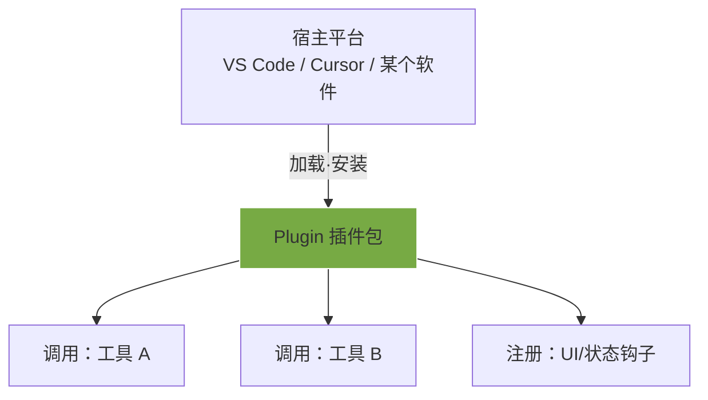
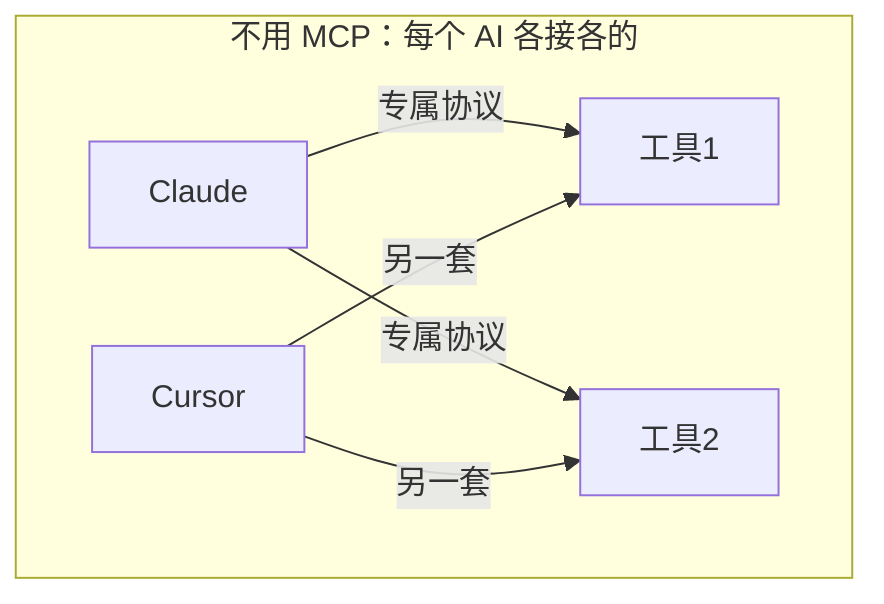
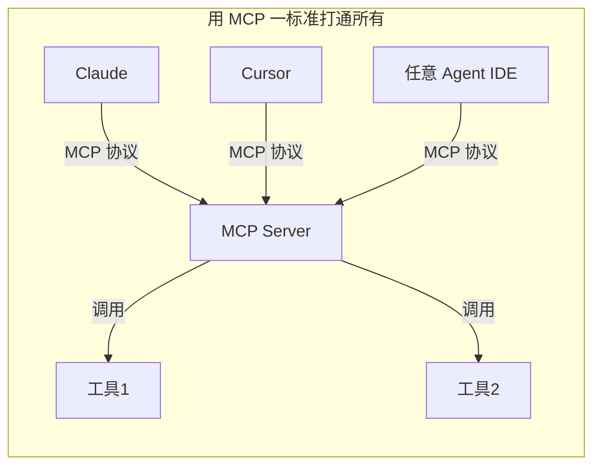
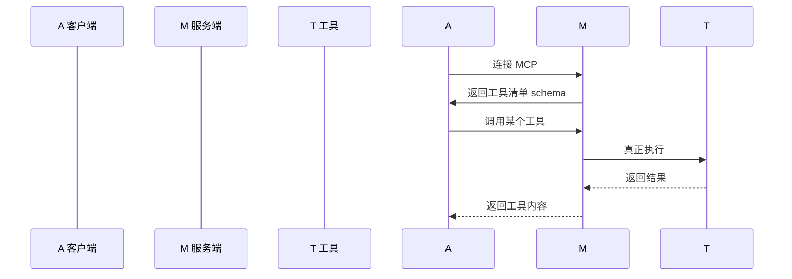
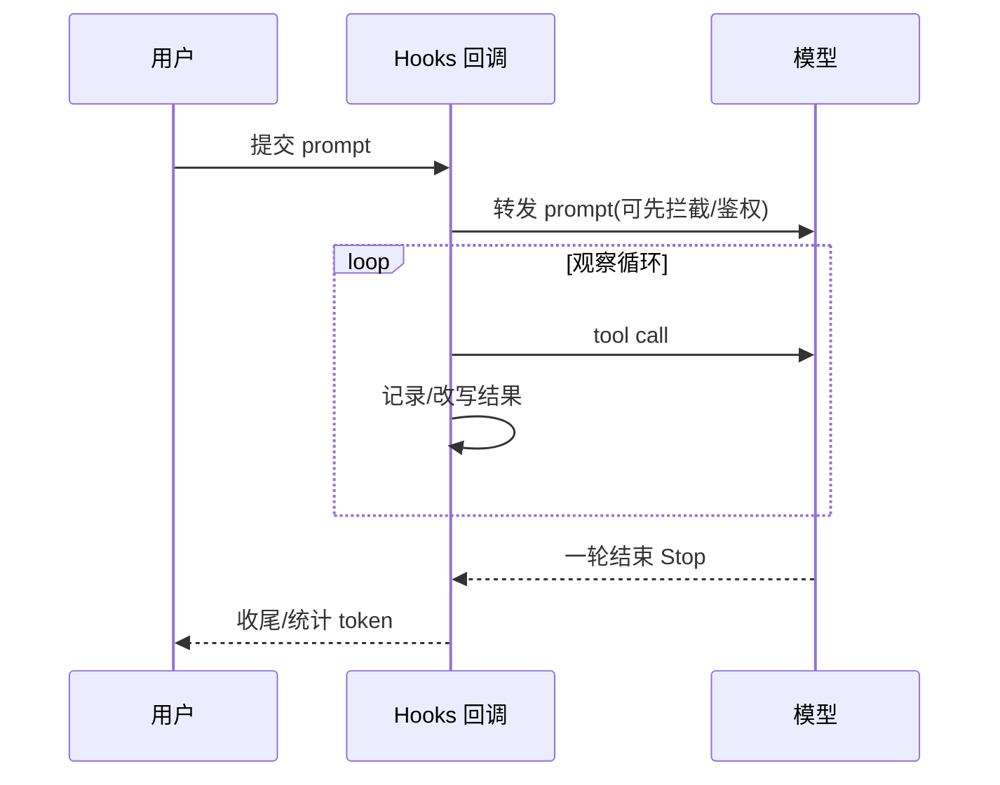
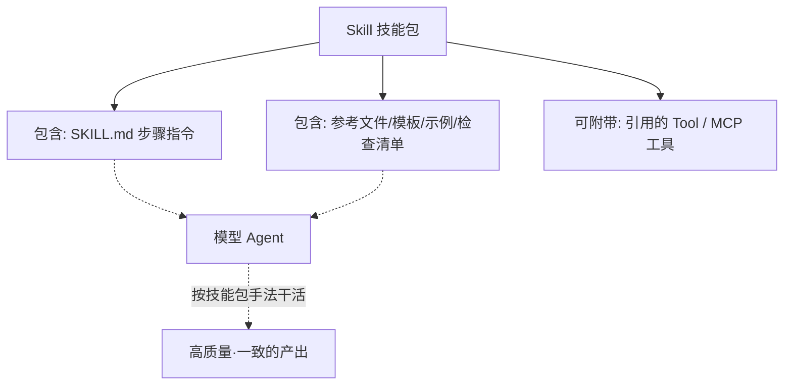
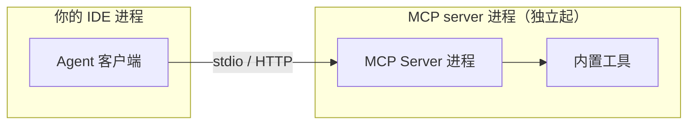
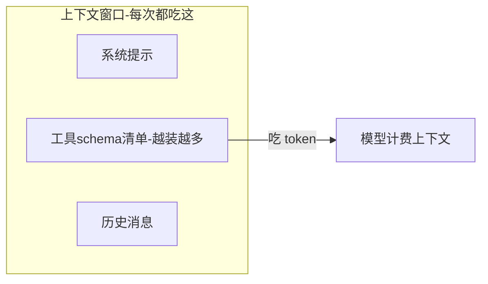
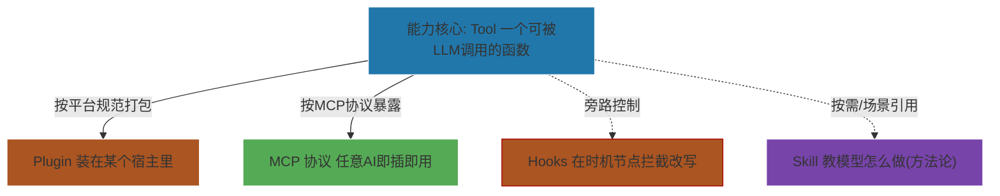

# 一篇文章彻底搞懂：Plugin、MCP、Hooks、Tool 到底该用哪个？

> 公众号排版稿 · 面向有一定基础、正在用 AI 编程工具（Claude Code / Cursor / VS Code Copilot / 各类 Agent）的开发者
>
> 参考来源：[MCP 官方文档](https://modelcontextprotocol.io/) · [Understanding MCP servers](https://modelcontextprotocol.org/docs/2026-07-28/learn/server-concepts) · [Claude Code 上下文窗口官方文档](https://code.claude.com/docs/zh-CN/context-window) · [聊聊 Claude Code 的 Skill / MCP / Hook / Plugin 到底怎么选](https://cloud.tencent.com.cn/developer/article/2703807) · [一图区分 MCP / Plugin / Tools / Skills / Hooks](https://www.cnblogs.com/yujiawen/p/19709287)

---

## 写在前面：这不是一篇"名词解释"，是一篇"选型指南"

很多同学刚接触 AI 模型编程时，看到一个又一个新词砸过来：**Plugin**、**MCP**、**Hooks**、**Tool**、**Skill**、**Subagent**……瞬间就晕了。

更烦人的是，这几个词经常出现在同一个界面里：配置 `mcp`、装个 `plugin`、写段 `hook`、调个 `tool`。它们长得都像"给 AI 加能力"，于是很多人默认它们是一回事——其实**完全不是**。

**它们不在同一个维度上。**

一句话先给你定调（后面全篇文章都是把这句话展开）：

> **Tool 是一个"能力"。Plugin 是"打包方式的合集形式"。MCP 是"让能力被标准化调用的通信协议"。Hooks 是"在流程某个节点暗中插一脚的程序"。Skill 是"一组被教给模型的高质量做事的步骤+知识包"。**

它们就像"**一个工具**"、"**一个装着工具的箱子**"、"**集装箱的通用标准**"、"**传送带上装的一个旁路开关**"、"**菜谱上写的一套标准做法**"——根本不是同一类东西。

> 说明：本文标题虽然写的是"四件套"（Plugin / MCP / Hooks / Tool），但 Skill 在 Claude Code / Cursor 里几乎和这四者天天出现在一起，所以在第一部分我专门补了 **Skill 一节**，并在全部对比表、选型决策树、全家福里贯穿带它参与比较——这样你才不会把 Skill 和 Tool / Plugin 混为一谈。

---

## 第一部分：先把五个词各自说透（这个世界很容易懂）

我先把五个概念分别讲清楚，并且配上直观的 `mermaid` 图，你看到图就懂了。

---

### 01 Plugin —— 它是"打包的形态"，不是"能力本身"

`Plugin`（插件）从字面就看出来——"插进去的东西"。它的核心是**"装配到一个既有宿主平台上"**。

- 你要给 **VS Code** 加功能 → 你写的是一个 **VS Code Plugin（扩展）**
- 你要给 **Cursor / JetBrains / 各种 IDE** 加能力 → 你写的是对应平台的插件
- 你要给 **ChatGPT / Dify 这类平台** 加功能 → 写的是平台的插件

所以 Plugin 最大的特点：**严重依赖宿主平台**。插件标准、生命周期、钩子位置（在平台给你预留的插槽里）统统由宿主定义。换一个平台，插件就废了（或者要大改）。



**一句话**：Plugin = 装在"**别人家系统**"里、按别人规范来扩展的**整体安装包**形式。

> 口诀：**Plugin 是"装到哪台机器上就遵守那台机器规矩"的配件。**

---

### 2 MCP —— 一个"通用标准"，让不同 AI 都能调用同一个能力

MCP 全称 **Model Context Protocol（模型上下文协议）**，是 [Anthropic 提出并开源](https://modelcontextprotocol.io/) 的**开放标准**，不是为了某个插件而是整个行业的"协议"。

它的杀手锏是：**把"能力"和"消费能力的 AI 客户端"解耦**。

你可以把 MCP 想成 **USB 的通用插口标准**：

- 早期每个 AI 要接打印机（工具），得单独接线、单独写驱动 → 那是"每个工具底层的专用调用"
- MCP 出现后 → 只要你的工具实现成 **MCP Server**，任何支持 MCP 的客户端（Claude、Cursor、各种支持 Agent 的 IDE、甚至自己的 Agent）都能**即插即用**。





**MCP 有三个角色**（官方定义）：

1. **客户端**：比如支持 MCP 的 IDE / Claude Code，负责发起对话、发起调用
2. **MCP Server**：把你要给 AI 的能力（工具、资源、能力）打包 + 标准协议暴露出来
3. **传输层**：客户端和 Server 之间的通道（常见 **stdio** 和 **HTTP/SSE streamable** 两种）

官方有个经典架构图（[Understanding MCP servers](https://modelcontextprotocol.org/docs/2026-07-28/learn/server-concepts)），我把它简化成一张最易记的：



> 口诀：**MCP 是"中间的通用插座",你造插座，别人拔线即插。** 不用管对面是 Claude 还是 Cursor。

---

### 3 Hooks(s) —— 在某个"时机点"插入的一段逻辑

Hooks 的本质是 **生命周期钩子/回调**，在 Agent 的某个**时机**插入自定义代码。

典型时机（以 Claude Code 为例）：

- `PreToolUse`（每次调用工具**之前**）
- `PostToolUse`（每次调用工具**之后**）
- `PreCompact` /（上下文压缩前）
- `UserPromptSubmit`（用户消息提交前）
- `Stop`（一轮结束）
- `Notification`（通知）

你就可以在这些"**节点**"上做：**日志记录、内容拦截、鉴权校验、结果改版、请求改态……** Hooks 的本质是"**在流程侧向切进去**"。



> 口诀：**Hook = 一根电线，你在机器转动的某个点位接出去仪表、拦一道。它不处于"能力本身"。**

---

### 4 Tool —— 最小、最基础的"能力单元"

在 AI Agent 语境里，**Tool = 一个可被 LLM 调用的函数/接口**。

- `search_web(url)`、`get_weather(city)`、`read_file(path)`、`git_status()`……

它就是一个函数，配一个 **JSON Schema 描述**（这个函数叫什么、参数是什么），然后**注册进 Agent**（或者注册进某个 Plugin / MCP Server 里）。

```python
# 一个最朴素的 Tool：本质上就是一个"带文档的函数"
# 用装饰器暴露给 LLM：名字、描述 + 参数
@tool
def get_weather(city: str) -> str:
    """查询某个城市的实时天气。"""
    ...
    return "晴,25°C"
```

**要记住**：Tool 是**最底层、最原子的概念**。Plugin 里面装的是 Tool，MCP Server 里暴露的也是 Tool，Hooks 不会改变 Tool 本身，只是"包围"它加前后置逻辑。

> 口诀：**Tool 是集装箱里的"货物"，Plugin / MCP / Hooks 都是"如何运输和处理货物"的：运输方式和路径。**

---

### 5 Skill —— 一组"怎么把事做好"的方法论，是教给模型的做法

Skill 这个词在 AI 编程工具里（尤其 Claude Code / Cursor）出现频率极高，但它和上面四个**完全不是一个思路**——它管的是**"怎么做"，而不是"能做什么"**。

一句话理解：**Skill = 一段高质量的提示词/指令 + 若干参考文件（步骤、模板、示例、清单），打包成一个"技能包"，在 Agent 做这类事时被引入，指导模型按这套"作业手法"干活。**

它不是 Tool（不直接提供一个函数去调），也不是 Plugin / MCP（不负责把能力"接进来"），它是一个**"行为规范包"**——告诉模型：这类任务你该按什么流程、注意什么、产出什么格式。



以 Claude Code 的 Skill 为例，它通常就是一个目录（带 `frontmatter` 声明名字与"何时该加载"）：

```text
my-skill/
├── SKILL.md            # "开场白/角色设定 + 分步骤怎么做"（会被注入指令上下文）
├── references/         # 按需加载的参考文档、代码模板
└── scripts/            # 辅助脚本（也可以声明要用的 Tool / MCP）
# SKILL.md 头部：
---
name: code-review
description: 我该如何做一次高质量 Code Review...（命中此描述时才加载）
---
```

**Skill 的几个关键特性：**

1. **它指导"过程"，不新增"能力"**：Skill 本身常常不含可调用的函数（不像 Tool），它靠"把方法论 / 参考注入模型上下文"来改变模型的动作与产出质量；它可以像"说明书"一样引用到现成的 Tool / MCP 工具。
2. **按需 / 按场景加载**：不是每次请求都塞进去（那样白烧 token），而是命中其 `description` 描述的场景时才加载进上下文。
3. **可组合 Tool / MCP**：一个 Skill 往往会"顺手声明"需要用到的 Tool / MCP 工具，把"方法（Skill）"和"能力（Tool）"组合成一套完整工作流。
4. **最容易和 Plugin 混淆**：Plugin 是"打进宿主平台的扩展包"（依赖宿主、常带 UI / 注册入口）；Skill 是"纯文本的做事方法论"，跨平台也基本以 Markdown 形式通用。

> 口诀：**Skill = 一份"这活儿该怎么干"的 SOP 配方，喂给模型照着做。它不改"能力"，改的是"动脑方式"。**

---

## 第二部分：用一个"快递发货"的比喻把几者串起来

为了更好记，我把五者用一套连贯的生活化比喻一次性钉在脑子里：

| 比喻 | 对应概念 | 生活含义 |
|---|---|---|
| **货物**（一个工具/一个函数） | **Tool** | 一个具体的"能干活的东西" |
| **纸箱+说明书**（打包方式） | **Plugin** | 一个"能装的包装箱"，固定在某个发货商的标准 |
| **快递的"通用电插口"标准** | **MCP** | 让任何智能系统（任何快递分拣机）都能统一接电搬运 |
| **传送带上的摄像头/闸门** | **Hooks** | 在某个工序点：检测、放行、拦截、记录 |
| **贴在箱子上的"作业指导书"（SOP）** | **Skill** | 教分拣员"这批货该怎么处理"，照着做产出一致 |

你在"快递分拣中心"里干活：**货**（Tool）是实实在在能搬运的东西；**Plugin** 是这套分拣中心专用的"箱型规范"；**MCP** 是让各家快递系统都能统一接电、统一口径的通用标准；**Hooks** 是你在分拣台某个工位装的摄像头/闸门联动器；而 **Skill** 是贴在墙上的那张"分拣作业标准卡"——它不搬货，只教你"每票货该按什么顺序、注意什么、填什么单子"。

---

### 插曲：为什么"Plugin"最近又火了？（DeepSeek Harness 视角）

写这篇文章时正好撞上一个新热点：**[DeepSeek 开源智能体框架 Harness（DSH）](https://github.com/deepseek-ai/deepseek-harness)，上线后 GitHub Star 迅速冲到十几万、多次登顶趋势榜**。它的招牌口号就是 **"万物皆插件 / 一切皆插件"**。于是很多人又开始问：Plugin 又火了？那我前面讲的"Plugin 依赖宿主、跨平台就废"还成立吗？

先说**结论**：DSH 没有推翻我上面的框架，它恰恰是"Plugin 被拉大到极致"的活例子——它把 **App、Agent、Flow、Skill** 这些全都用**"插件"这一种形态**统一打包、统一加载、统一分发。在 DSH 里：

- 一个 **Skill（方法论技能包）** 也可以被打包成一种插件来发布、复用、订阅；
- 你写的 **Agent / 应用 / 工作流**，同样以插件形式被 DSH 加载为子代理（比如它可以把 **Claude Code、Codex** 收编成手下的"子代理"，自己做那个统管调度的"调度层"）；
- **MCP Server**、**Tool** 也照样能在插件体系里被引用、组合。

也就是说：**Plugin 不再是"只能装在某个 IDE 里的死插件"，而是变成整座 Agent 大厦的通用乐高积木**。[极客公园](http://www.geekpark.net/news/369003) 和 [36氪](https://www.36kr.com/p/3947852851664512) 都把这件事讲得很热闹，也说明这一轮 Plugin 的"火"是**框架级**的火——火的不是某一个 IDE 的扩展机制，而是一种"以插件为第一公民"的组织方法。

这正好把本文的"五件套"又强化了一遍：

- 在 DSH 这样的框架里，**Tool / MCP / Hooks / Skill 都可能以"插件"为载体被统一调度**；
- 你之前学的"五者怎么组合"，在 DSH 里变成"我该怎么设计/复用哪些插件"；
- 而那些讨论 **"[Plugins 和 Skill 一样吗](https://www.cocoloop.cn/t/topic/15193)"**、"[DSH Skill 的 SKILL.md 怎么写](https://www.ai-indeed.com/encyclopedia/29670.html)" 的提问，本质都是在把本文的"维度思维"搬进新框架。

> 小提醒：DSH 迭代非常快（[GitHub Releases](https://github.com/deepseek-ai/deepseek-harness/releases) 一周多次），具体插件 API、目录约定请以官方文档为准。这篇文章教你的是**永恒的"维度"**：Tool（能力）、Plugin（打包形态）、MCP（协议）、Hooks（流程）、Skill（方法论）——底层逻辑不会因为框架迭代而变。

---

### 实操：在 DSH 里，一个最小插件和"把一个 Skill 变成插件"到底怎么写？

光说框架不够，我把官方入门文档的最小样子复刻给你，照着改就能跑（机制以 [官方 docs `basic` 教程](https://github.com/deepseek-ai/deepseek-harness/blob/master/docs/user/develop/basic/index.zh.md) 为准）。

#### ① 最小插件 = 一个会导出 `apply` 的 TS 模块

DSH 基于一个叫 **Cordis** 的插件容器。所谓"插件"，本质上就是一个导出了 `apply(ctx)` 函数的 TypeScript 模块——框架加载到这个模块时调用 `apply`，把 `ctx`（上下文）传给你，你用它注册能力，**卸载时 `ctx` 会自动帮你清理**（事件监听、定时器、工具，都不用你手动 `removeListener`）。

```ts
// src/my-plugin.ts —— 这就是一个完整的"能跑的插件"
import type { Context } from '@deepseek-ai/cordis'

export const name = 'hello-plugin'          // 插件名

export function apply(ctx: Context) {
  // 这里 ctx 已经就绪，注册你的能力即可
  console.log('[hello-plugin] plugin loaded!')
}
// 需要读写文件/调 LLM？声明依赖即可：
// export const inject = ['tools']          // 等 tools 服务就绪后才会 apply
```

> 三种写法：函数形式（上面这样）、对象形式（`export default { name, inject, apply }`）、类形式（`export default class MyService extends Service`，要给其他插件提供稳定服务时用）。

#### ② 在 cordis.patch.yml 里"注册"进框架

插件包写好，再用一个 patch 文件把它的**绝对路径**插进配置树，用 `pnpm dsh web --patch ./xxx/cordis.yml` 启动：

```yaml
# cordis.patch.yml —— 顶层数组，一行一个插件
- insert:
    - id: hello                    # 配置树里的稳定身份
      name: '/绝对路径/deepseek-harness/scratch-plugin/src/my-plugin.ts'
```

启动时终端出现 `[hello-plugin] plugin loaded!`，就说明插件被框架加载成功了。

> 顺带记住它和 Plugin 定义的呼应：**DSH 里 Plugin=能力/服务的"注册单元"，通过 `ctx` 把自己的 Tool、事件、UI 挂进框架**——和本文开头说的"Plugin 是在宿主里注册入口"完全同构，只是宿主从"某个 IDE"变成了"统一 Agent 底座"。

#### ③ 把"Skill 变成插件"：本质是把 `SKILL.md` 交给框架

回到用户最关心的组合：**一个 Skill 怎么打包成 DSH 里可分发、可复用的"插件"？**

关键思路：**Skill 插件 ≈ 把"方法论"（SKILL.md）打包进一个 bundle，让它能在需要时被引入模型上下文，且可随插件一起分发/订阅。** 官方也给 Agent 技能提供了统一格式，核心文件就是 `SKILL.md`，头部用 `frontmatter` 声明元信息：

```markdown
---
name: code-review
description: 当用户要做代码审查时使用（命中此描述才加载，省 token）
when_to_use: |
  • 用户提到 code review / 审查代码
  • 或者你判断当前任务适合先走一套审查流程
version: 0.2.0
license: MIT
---
# 我是这份 Skill 的"开头词 + 分步骤怎么做"
1. 先扫安全问题（注入/越权/敏感信息）
2. 再看可读性与命名
3. 最后给可落地的建议，附最小示例
# 引用到现成的 Tool / MCP 能力，把"方法"+"能力"串成完整工作流
```

配合文章之前讲的落地组合，一个完整的工作流通常是：

- **一个 `SKILL.md`**（定"怎么干"）→ 它声明要用到
- **若干 Tool / MCP 工具**（定"有什么可调"）→ 它把工程任务接进来
- **Hooks**（定"在节点上干什么"）→ 例如调用前鉴权、调用后记录
- 这几样再**一起打成一个 DSH bundle/插件**去分发、复用、订阅 → 就是"一切皆插件"

> 我的意思是：**DSH 的"一切皆插件"不是推翻五件套，而是给了它们一个统一的"外壳"和"分发通道"**。你以前学的 Skill 怎么写法论、Tool 怎么定义 schema、Hooks 在哪几个时机切进去——这些**维度不变**，变的只是"怎么把成品打包成一个 DSH 插件 / bundle，让它能被加载、被复用、被订阅"。

---

## 第三部分：它们在 IDE 模型里到底怎么调用、怎么启动、怎么烧 token——这是重头戏

很多人网上看了一堆名词，一到"**它在我 IDE 里到底该怎么用、钱花在哪**"就懵。这一节我用 4 个角度横向对比，这才是本文真正的"干货浓度"。

---

### 3.1 调用方式（Invocation）

| 概念 | 是怎么被调用的 | 谁在什么时候调 |
|---|---|---|
| **Tool** | 配置里写了 → Agent 运行时，**模型主动选**：把工具 schema 喂给 LLM → LLM 输出 `tool_use` → 运行时执行函数 | 模型决定"此刻要不要用" |
| **Plugin** | 插件**安装时注册**了一堆入口：UI 菜单、命令面板、监听事件；Agent 部分通过 Plugin 暴露的 Tool | 平台 / 事件系统 |
| **MCP** | 客户端启动时通过 MCP 协议**发现 Server 的工具清单**；之后复用 MCP 协议调用 Server 内的 Tool | 客户端经协议转发 |
| **Hooks** | **不靠模型选择**，是**强制的时机回链路**：到点就触发，不看模型想不想 | 宿主框架到节点自动触发 |
| **Skill** | **命中场景时把指令/参考注入上下文**，改变模型的"行为策略"；可声明要用的 Tool / MCP | Agent 根据任务场景自动加载（或用户显式指定） |

关键差异点，我用代码让你直观看出来：

```js
// ---- 调用方式对比 ----

// 1. Tool：由 LLM "选"要不要用（模型决策）
const messages = [{ role: "user", content: "上海今天热吗？" }];
const res = await anthropic.messages.create({
  model,
  messages,
  tools: [{ name: "get_weather", description: "查询天气", input_schema: {...} }],
});
// → 模型返回 tool_use，你才执行 get_weather

// 2. Hook：无论模型想不想，到点就执行（时机触发）
// hook 配置（声明式）：
// PreToolUse|weather  =>  先检查:用户有没有权限,没有就拦截/脱敏

// 3. Plugin：宿主加载它，把它的入口注册进系统
// 平台启动时实例化插件 → 注册命令/UI/工具 → 平台事件驱动调用

// 4. MCP：通过标准协议动态发现 &调用
// client 连上 server,server 返回工具清单:
//   列表 [{name:"toolA",...}]
// client 调:  call toolA ...

// 5. Skill：命中场景时把"做法"注入上下文,引导模型按 SOP 干活
// 相当于往提示词里塞一段方法论:
//   "你是资深 code review 专家,请按 SKILL.md 步骤: 1)先扫安全 2)再读可读性 3)最后给建议..."
// ——它不新增可调用的函数,而是改变模型"怎么想、怎么做"
```

---

### 3.2 启动方式（他们各自是从哪"活过来"的）

| 概念 | 启动时机 | 启动载体 |
|---|---|---|
| **Tool** | 随宿主 Agent **一起动**，它是宿主进程的一部分（或一个本地函数） | 代码里直接 import 的 |
| **Plugin** | 宿主平台**加载时**因为被安装，被初始化/实例化 | 宿主进程加载 |
| **MCP** | **独立进程**：MCP Server 是**独立运行的程序**，客户端打开时通过 stdio/HTTP **连接** | 独立进程/容器 |
| **Hooks** | **宿主框架早于所有调用**，在启动阶段注册 Hook 回调表 | 宿主进程内存里的回调，无副作用 |
| **Skill** | 由**目录/frontmatter 声明**即存在；在命中场景时由宿主**按需加载进上下文**，无需独立进程 | 宿主从技能目录读取的 Markdown/脚本 |

MCP 最特别的点是：它是**独立的进程**。这也是它"通用"的原因——



刚才启动 MCP server 的是谁？可以是：

- IDE / Claude Code 根据 `mcp.json` **顺手拉起**一个子进程（stdio 模式）
- 或者你在**远程 HTTP** 跑一个，IDE 连过去

看一个真实的 `mcp.json`（Claude Code的）例子，你能直观感受"它是个独立东西"：

```jsonc
// .mcp.json —— MCP Server 的启动描述
{
  "mcpServers": {
    "github": {
      "type": "stdio",                  // 传输：串行子进程
      "command": "npx",                 // 让 node 跑起来
      "args": ["-y", "@modelcontextprotocol/server-github"]
    },
    "company-db": {
      "type": "http",                   // 或连远程
      "url": "https://mcp.mycompany.com/db"
    }
  }
}
```

对比 Hook：Hook 根本**不是独立进程**，它就是一个注册表里的回调，跟宿主进程一体。

---

### 3.3 Token 消耗（划重点：#token 烧在哪，差别很大）

这是大家最容易忽略、也被坑得最深的一点。Token = 模型 API 的计费单位，**上下文越长越烧钱**。

**关键结论：**

- **Tool / MCP 的工具部分，是要吃 token 的**——因为工具的描述（schema、参数说明）会被拼进发给 LLM 的上下文里，模型"知道了有这个工具"才可能选它。
- **Plugin** 的 UI/视图部分不吃模型 token，但它打包的 Tool 同样会进上下文。
- **Hooks 默认"不"吃模型 token**——它是宿主的本地逻辑，模型设计它运行（但注意：hook 如果往上下文里塞了额外内容，它一塞，那些内容就又算 token 了）。
- **MCP 本身不额外烧 token**，但 MCP Server 里每个工具的描述都会进上下文，**工具数量越多 / 描述越啰嗦，token 开销越大**。
- **Skill 是"按需加载"的，天然省 token**：平时它**不进上下文**，只有命中其 `description` 描述的场景时才把"指令 + 参考"注入；**但一旦注入，指令和参考文件就会吃 token**——所以 Skill 的说明要精炼、参考文件按需读取，别一股脑全塞。

所以有个经典"钱坑"问题：**你装了很多 MCP Server，每个 Server 暴露几十上百个工具 → 每次请求，光这些工具清单的 token 就已经很可观**。



官方文档**把"上下文窗口"讲得很透**（[Claude Code 上下文窗口](https://code.claude.com/docs/zh-CN/context-window)）：工具定义、系统提示都会在每一次请求里计入（token 里）。我用一张表格再压一下：

| 部分 | 会烧 token 吗 |
|---|---|
| Tool 的 schema 描述 | ✅ 烧（进上下文） |
| MCP Server 里所有工具的清单 | ✅ 烧（也会进上下文，且可能很大） |
| Hook 本体逻辑 | ❌ 不烧（本地执行，不进上下文） |
| Hook 注入进上下文的内容 | ✅ 烧 |
| Plugin 的 UI 部分 | ❌ 不烧 |
| Skill 本身（未命中/未加载时） | ❌ 不烧（平时不进上下文） |
| Skill 被注入后的指令 + 参考文件 | ✅ 烧（命中加载后占用上下文） |

---

### 3.4 实现原理（它们底层到底差在哪）

| 概念 | 底层实现本质 | 是否跨进程 | 是否独立 |
|---|---|---|---|
| **Tool** | 就是一个函数，通过函数调用（Function Calling）暴露 schema | 否 | 否 |
| **Plugin** | 一个安装包，含清单文件 + 代码，宿主生命周期加载 | 否（宿主内） | 否 |
| **MCP** | 一套 JSON-RPC 2.0 协议，独立进程，明确定义的请求/响应消息规范 | **是（可独立进程）** | **是** |
| **Hooks** | 事件回调列表，宿主在时机点 monkey-patch / 回调 | 否 | 否，是框架回调 |
| **Skill** | 一组 Markdown 指令 + 参考文件的"技能包"，命中场景时被注入上下文引导模型 | 否 | 否（一份文本资产/目录） |

MCP 的跨进程特性是它与另外几个**最本质的区分**：它是一条**IPC 的协议**。而 Skill 的本质是**文本方法论**——它不像 Plugin 有可执行代码，也不像 Hooks 有回调入口，它就是"喂给模型怎么做的提示词 + 参考资料"。

---

## 第四部分：选型决策树（照着走就不会错）

我把最常见的几种场景列出来，你直接对号入座：

| 你的目标 | 首选方案 | 理由 |
|---|---|---|
| 我只想给我的 Agent 加"一个"小能力（比如查天气） | **Tool** | 最简单，一个函数 + schema 够了 |
| 我想让做出来的能力能被**各种 AI/IDE** 复用，不想每个平台重写一遍 | **MCP** | 标准协议，一次写好处处可接 |
| 我想给**某个既定平台**（VS Code / Cursor / Dify）加 UI / 功能扩展 | **Plugin** | 该平台的插件机制，跨平台也基本只能这么做 |
| 我想在**固定节点**控制流程（鉴权、防注入、脱敏、结果改写） | **Hooks** | 它是"时机点"，只在特定环节插入 |
| 我有**一类重复的活**，想让 Agent 每次都"按一个高质量标准做法来干" | **Skill** | 把方法论做成技能包，命中场景自动注入，产出稳定一致 |
| 我同时想让"能力"既通用又可控 | **MCP + Hooks** | MCP 管"能力",Hooks 管"流程" (最普遍的组合) |
| 能力、方法、流程要成一套体系 | **Skill + Tool/MCP + Hooks** | Skill 定做法、Tool/MCP 供能力、Hooks 控流程（最完整工作流） |

---

## 第五部分：Golden 经验（写给要少踩坑的你）

几个来自社区实践的真金心得：

1. **先 Tool，再 MCP。** 不要一上来就甩十几个别的 Server。Tool 是根，MCP 也只是"给 Tool 套标准箱子"。
2. **小心"工具清单爆炸"提高 token。** 装 MCP 时看一个 server 暴露几个工具；无关的就别让人家一直挂着，会在上下文吃掉大量 token。
3. **Hooks 是"免费"的流程控制，不要老想用模型判断的事（也别重要到不可错）。** 该放 Hooks 的（拦截、鉴权、记录）就别设计成让模型去判断。
4. **Plugin 要看宿主平台支持。** 不是你想装就能装，要看你的 IDE / 平台支不支持、装完能不能长期挂载生效。
5. **MCP 的"通用"是有成本的优雅。** 要启动独立进程、要管传输层和生命周期；别为只给自己内部一个 Agent 用的轮子强行上 MCP——先想想 Tool 够不够。
6. **把"重复的高质量过程"沉淀成 Skill。** 哪类活你每次全靠一段固定的厉害提示词才能干好，就把它固化成一个 Skill——此后命中即自动按这套方法做，又稳又省心。Skill 是"方法论"维度，别和 Tool / Plugin 混为一谈。
7. **Skill 也一样要控 token。** 它虽按需加载省 token，但一旦命中注入就会吃上下文；所以 SKILL.md 要精炼、references 按需读取，别把整本手册一股脑灌给模型。

---

## 结尾给你一张"一图流"全家福

用一张 `mermaid` 把这五者放一起，建议存图用来配文章头图：



---

**一句话总结全文**：

- **Tool = 一个能力（函数）**
- **Plugin = 装进某个平台的工具包形态**
- **MCP = 一套任何人都能接的"通用底座协议"，让 Tool 变得通用**
- **Hooks = 在流程特定时机插一脚的逻辑**
- **Skill = 一组教给模型"这活儿怎么干"的方法论**

它们**不冲突，可组合**（经典的组合是：**Skill 定义做法 + Tool/MCP 提供能力 + Hooks 管途中所有你该管的事**）。**会用组合而不是纠结名词，才是真正的 Agent 开发。**

---

> 如果这篇文章帮你把 Tool / Plugin / MCP / Hooks / Skill 的关系理清了，**点赞 + 在看**，转发给正在学 Agent 的朋友。评论区聊聊：你把 Tool、Plugin 和 Skill 搞混过吗？你现在都用哪个组合？
>
> 参考资料：
> - [Model Context Protocol 官方文档](https://modelcontextprotocol.io/)
> - [Understanding MCP servers（官方）](https://modelcontextprotocol.org/docs/2026-07-28/learn/server-concepts)
> - [Claude Code 上下文窗口官方文档](https://code.claude.com/docs/zh-CN/context-window)
> - [MCP 中文规范](https://modelcontextprotocol.com.cn/specification/2025-11-25)
> - [Claude Code 的 Skill/MCP/Hook/Plugin 区别与选型（腾讯云）](https://cloud.tencent.com.cn/developer/article/2703807)
> - [一图区分 MCP/Plugin/Tools/Skills/Hooks（博客园）](https://www.cnblogs.com/yujiawen/p/19709287)
> - [Dify 官方插件类型选择文档](https://docs.dify.ai/en/develop-plugin/getting-started/choose-plugin-type)
> - [Claude Code Agent Skills 官方文档](https://code.claude.com/docs/zh-CN/agent-skills)
> - [DeepSeek Harness 官方仓库（deepseek-ai/deepseek-harness）](https://github.com/deepseek-ai/deepseek-harness)
> - [DeepSeek 开源智能体框架"万物皆插件"解读（至顶网）](https://www.zhiding.cn/ai-applications/2026/0820/3196866.shtml)
> - [DSH 官方插件开发入门教程（《第一个插件》· basic）](https://github.com/deepseek-ai/deepseek-harness/blob/master/docs/user/develop/basic/index.zh.md)
> - [DSH 插件开发执行型 Skill（dsh-plugin-development）](https://github.com/NanmiCoder/dsh-agent-teams)

---

### 

`#AI编程`　`#Agent开发`　`#ClaudeCode`　`#MCP`　`#Plugin`　`#Hooks`　`#Tool`　`#Skill`　`#AI工具`　`#大模型应用`　`#API集成`　`#SOP方法论