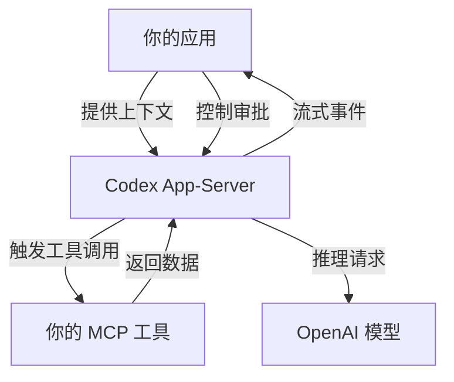

# OpenAI 开源了 Codex 的 Harness：不只是 CLI，是整个 Agent 运行时

> 这篇文章基于 OpenAI 官方博客 [Codex as a Platform](https://developers.openai.com/blog/codex-as-a-platform) 和 GitHub 仓库 [openai/codex](https://github.com/openai/codex) 的公开信息整理。DeepSeek Harness 部分基于 [deepseek-ai/deepseek-harness](https://github.com/deepseek-ai/deepseek-harness) 的项目说明。

---

搞 AI Agent 的团队，最近大概率都在面对同一个问题：**Agent 框架太多了，选一个不是难事，难的是"这个框架到底能不能放进我的产品里"。**

LangChain 给了一套编排层，但抽象太厚，出了事不好查。CrewAI 解决了多 Agent 协作，但跟业务系统的集成边界不清晰。Vercel AI SDK 轻量，但它只管前端到 LLM 的流，不管工具执行、权限控制、审批流这些"产品级"的事。

每个团队真正需要的，是一个能塞进自己产品里的 Agent 运行时——不是把业务塞进别人的聊天框，而是把 Agent 能力塞进自己的 Dashboard、工单系统、运维面板。

**最近 OpenAI 干了一件事，把 Codex 的底层运行时（Harness）开源了。** 这玩意儿之前只跑在 Codex CLI、Codex App、Codex IDE 背后，现在你可以在自己的应用里直接用它。

巧合的是，**DeepSeek 也在差不多的时间开了一个叫 DeepSeek Harness 的项目**，同样是 Agent 运行时，同样是"什么都能插"的架构思路。两个项目放在一起看，很有意思。

---

**一句话结论：** Codex Harness 是 OpenAI 给 Codex 所有产品形态（CLI、App、IDE）提供动力的底层 Agent 运行时，现在以 Apache-2.0 开源。它不是"又一个 Agent 框架"，而是一个你可以直接拿来做产品集成的执行引擎——Context 管理、工具调用、沙箱隔离、人工审批、结果流式返回，全给你包好了。

---

## 核心亮点

**1. 引擎和产品分离：你不需要复刻一个 Codex App**

大多数人对 Codex 的认知停留在"那个终端里的编码 Agent"或"ChatGPT 里的 Codex"。但 OpenAI 明确说了一件事：CLI、App、IDE 都只是 Harness 的一种消费形态。Harness 本身不绑定 UI，不绑定产品形态。你可以拿它来驱动一个运维仪表盘、一个安全事件调查面板、一个客户支持控制台——只要你的应用通过 App-Server 协议连上它，就能获得完整的 Agent 能力。

**2. Harness 设计直接影响了模型表现**

这不是一个"随便写写"的编排层。OpenAI 在 ARC-AGI-3 上的实验表明：同样的 GPT-5.6 Sol 模型，靠 Harness 层面的上下文保留和压缩优化，分数从 13.3% 提升到 38.3%，同时输出 Token 减少 6 倍。Harness 不是模型的"包装纸"，它是能力的放大器。

**3. 三层集成方式，按场景选**

不是所有场景都需要跑一个完整的 App-Server。OpenAI 给出了三种集成方式：

- **codex exec**：适合 CI 脚本、一次性批处理任务，跑一个作用域有限的 Agent 工作流，拿结构化输出走人
- **Codex SDK**：适合应用代码里需要启动、恢复、流式接收 Agent 任务的情况，提供程序化接口
- **Codex App-Server**：适合把 Agent 做成产品的一部分——持久化对话、流式事件、工具暴露、审批请求，全部交给 Harness 管理

**4. 你的应用继续拥有产品控制权**

OpenAI 的架构设计很清醒：**Harness 只负责 Agent 执行循环，产品层继续由你掌控。** 你的 Dashboard 还是你的 Dashboard，你的审批流还是你的审批流，你的 MCP 工具还是你的工具。Harness 在中间只做一件事——跑 Agent 循环，别的都不碰。

**5. 已有人用这个模式做成了产品**

这不是未来规划。OpenAI 博客列出了几个真实案例：

- **GitHub + JetBrains** 把 Codex 嵌入了 IDE 工作流
- **Cisco** 在 Cloud Control 的 App Builder 里用 Codex SDK 构建应用
- **Thrive Holdings + Crete** 用 Codex 做税务申报工作流，跑了 7000 份申报，准备时间减少约三分之一

这些案例都不是"把业务塞进一个聊天框"，而是把 Agent 作为能力嵌入到已有的产品界面里。

**6. 开源的是 Harness 和集成层，模型和托管服务是分开的**

开源部分包括 CLI、App-Server、Codex SDK。模型访问和托管服务仍然在 OpenAI 侧。这意味着你可以基于 Harness 建立自己的 Agent 基础设施，但推理能力仍然需要 ChatGPT 订阅或 API Key。这个拆分对产品团队来说其实是好事——不需要自己造 Agent 运行时，只需要关心怎么接入。

**7. 一个完整的双向交互协议**

App-Server 暴露了一个文档化的客户端协议：创建 Thread、启动 Turn、接收事件、处理审批请求。这意味着你的应用不只是"调用 Agent"，而是可以跟 Agent 实时交互——看到 Agent 在想什么、在做什么、需要什么审批，然后决定要不要继续。

---

## 和 DeepSeek Harness 放在一起看

DeepSeek 也在差不多的时间点开源了 DeepSeek Harness（dsh），同样定位为 Agent 运行时。两个项目放在一起对比，能看出两家在"Agent 运行时"这件事上选择了不同的哲学。

| 维度 | Codex Harness | DeepSeek Harness |
|------|--------------|-----------------|
| 开源协议 | Apache-2.0 | MIT |
| 架构哲学 | 引擎与产品分离，通过 App-Server 协议集成 | 一切皆插件，基于 Cordis 框架 |
| 安装方式 | 终端一键安装 / npm / Homebrew | npx @deepseek-ai/dsh web |
| 运行形态 | CLI + App-Server + SDK，支持非交互式 | Web UI 为主，默认 3080 端口 |
| 模型依赖 | 绑定 OpenAI 模型生态 | 未明确绑定，插件架构理论上可接入多种模型 |
| 当前状态 | 正式发布，有生产案例 | 开发者预览，明确提醒兼容性会破坏 |
| 面向场景 | 产品集成（嵌入现有应用） | 插件化开发（扩展 Agent 能力） |

**最关键的区别不在功能，而在定位。**

Codex Harness 的假设是"你有自己的产品，你只需要一个 Agent 运行时嵌入进去"。所以它提供了 App-Server 协议、SDK、非交互模式——一切都是为了让你的应用能控制 Agent，而不是让 Agent 控制你的应用。

DeepSeek Harness 的假设是"Agent 本身应该是一个可扩展的平台"。所以它的架构是一套插件系统，基于 Cordis 框架，任何东西都可以写成插件。这意味着你可以深度定制 Agent 的行为，但代价是需要理解这套插件架构，并且要接受当前还在快速迭代、兼容性随时可能被破坏的现实。

**一个更关心"产品集成"，一个更关心"能力扩展"。** 这不是谁好谁坏的问题，是选型方向的问题。

如果你正在做的是一个团队内部工具、需要快速验证 Agent 能力，DeepSeek Harness 的插件化可能更灵活，MIT 协议也更宽松。如果你在做的是面向客户的产品，需要稳定的接口、审批流、沙箱隔离，Codex Harness 的成熟度更高，但代价是模型锁定在 OpenAI 生态。

---

## 快速上手

安装 Codex CLI 很简单，支持 Mac、Linux、Windows：

```bash
# Mac / Linux (推荐)
curl -fsSL https://chatgpt.com/codex/install.sh | sh

# Windows
powershell -ExecutionPolicy ByPass -c "irm https://chatgpt.com/codex/install.ps1 | iex"
```

也可以用包管理器安装：

```bash
# npm
npm install -g @openai/codex

# Homebrew
brew install --cask codex
```

安装完成后直接运行 `codex` 启动，选择用 ChatGPT 账号登录即可（Plus、Pro、Business、Edu、Enterprise 计划都包含 Codex 使用权限）。

如果需要强制走 GitHub Releases 下载（而不是从 OpenAI CDN 下载），可以设置环境变量：

```bash
curl -fsSL https://chatgpt.com/codex/install.sh | CODEX_INSTALLER_USE_RELEASES_OPENAI_COM=false sh
```

### 命令速查

| 场景 | 命令 | 说明 |
|------|------|------|
| 一键安装 Mac/Linux | `curl -fsSL https://chatgpt.com/codex/install.sh \| sh` | 推荐方式 |
| 一键安装 Windows | `powershell -ExecutionPolicy ByPass -c "irm https://chatgpt.com/codex/install.ps1 \| iex"` | 推荐方式 |
| npm 全局安装 | `npm install -g @openai/codex` | 适合 Node.js 开发者 |
| Homebrew 安装 | `brew install --cask codex` | 适合 macOS 用户 |
| 启动 CLI | `codex` | 登录后即可使用 |
| 非交互式执行 | `codex exec` | 适合 CI 批处理场景 |

---

**架构示意**



你的应用负责产品上下文、业务规则、审批决策；Codex App-Server 负责 Agent 循环、状态管理、工具执行、事件流式传输；模型只负责推理。这个分层意味着：你可以保留完整的 UX 控制权，只把 Agent 执行这件事交给 Harness。

---

OpenAI 做这件事的时机很有意思。Agent 框架已经卷了一年，但大多数框架的假设是"你要用我的 UI 和我的方案"。Codex Harness 的假设是相反的：**你用你的 UI，你管你的业务，我只管 Agent 的执行循环。**

这不是一个"更好用"的 Agent 框架，它是一个更底层的运行时。如果你正在做的是"在自己的产品里嵌入 Agent 能力"，而不是"用别人的 Agent 产品"，那这件事值得认真看一眼。

当然，前提是你接受了 OpenAI 的模型生态。Harness 开源了，但模型访问还是 OpenAI 的。如果你的场景对模型供应商中立有硬要求，DeepSeek Harness 的插件化架构和 MIT 协议可能是另一个值得关注的方向——至少目前的局面是：Agent 运行时这个赛道，终于不再只有一家的选项了。

---

#AI #Agent #OpenAI #Codex #DeepSeek #开源 #MCP #LLM #AgentFramework #DevTools #Engineering #对比