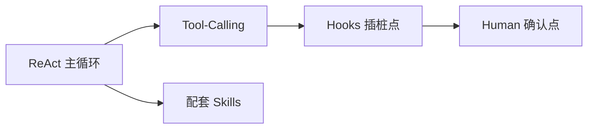

搞 Agent 这事，最近越来越像在搞一套"全家桶"：要装运行时、要配模型、要接工具、还要防着它在没人盯的时候乱来。你想跑一个通用 Agent，结果先得研究怎么把一堆组件拼起来，还没开始写真正的流程，人已经累了。

麻烦不在模型本身，麻烦在模型外面那圈东西——主循环、工具调用、前后置检查、该不该让人点头确认。这些东西散落在一堆配置和 SDK 里，就成了真实工作里最啃人的部分。

最近有人把这些收敛成了一个 Go 项目：**harness9**。它的定位一句话就能讲清——**把 Agent 需要的运行骨架，打包成一个 Local-First、轻量、但功能上奔着"生产可用"去的通用框架**。

先给结论，再说它到底怎么想。

**harness9 解决的事，是"让 Agent 框架本身的骨架变得足够小、又足够完整"：小到用 Go 写、核心主循环也就几百行；完整到 ReAct 循环、工具调用、前后 Hooks、人工介入这些缺一不可的环节都有落点。适配哪类人？想自己理解和控制 Agent 运行逻辑、不想被黑盒全家桶绑住的开发者和工程团队。**

（说明：本文基于项目在 GitHub 与公开拆解文章中可核验的信息整理；原始文档中的具体安装命令未能取得，文末会有说明。）

---

**核心亮点**

**1. 用 Go 写，核心 ReAct 主循环大约几百行，骨架透明**

它不像很多 Agent 框架那样层层封装到看不懂。拆解系列的公开信息里，"500 行 Go 代码驱动的 ReAct 主循环"是被反复提到的标签——这意味着你在排查问题时，哪怕去读框架自己的实现，也不至于迷失在厚厚一层抽象里。几百行就扛起"观察-思考-行动"这个循环，本身就是把复杂问题压小。

**2. ReAct 循环：不是空喊"智能体"，是把"迭代思考-调用-观察"跑成可调骨架**

Agent 的核心是那个循环：模型决定下一步、调用工具、拿回结果、再判断。harness9 把它做成一个明确的主循环结构，等于不管你后面接什么模型、什么工具，骨架是稳定可预期的。对这个领域，骨架稳定比单个功能炫更重要。

**3. Tool-Calling 被当成工程问题对待**

工具调用不是简单的"调个 API"。参数结构、解析、错误处理、谁来允许这个工具被调，都会影响 Agent 能不能在真实环境里稳定活下来。这点从"拆解"专门有一篇讲 Tool-Calling 工程实践就能看出来——一个声明为通用框架的项目，愿意把工具调用当成独立的工程话题来对待，说明它把"接进真实工作流"当成设计指标，而不是停留在演示 demo。

**4. Hooks：在"主循环看不见的地方"布点**

Agent 的问题往往不出在主循环，而出在读文件前后、调用工具前后留不留口子。Hooks 机制就是给你在这些节点挂逻辑，做审核、做变换、做拦截。它不是让你把流程写死，而是让你在固定节点上有地方插你的规则。

**5. Human-in-the-Loop：留一个"人"的接口，不是全自动机器**

全自动听起来爽，实际生产里没人敢把关键动作全交给机器。harness9 的"Human-in-the-Loop"相关设计，强调的是：在合适节点保留人的确认和干预。对想真正上生产的人来说，这不是弱点，是安全感。

**6. 仓库自带系列 skills，把"动作规范"一起打包**

跟作者在 RuleSkill 上发布的配套 skills（architecture-overview、autodev、debugging-guide、go-coding-standards 等）呼应，harness9 在能力边界上不只是"运行时"，还把"怎么用它、怎么调试、怎么规范"作为一等公民一起交付。这让"框架 + 行为规范"合成一个整体，而不是只给你一个运行器。

（2、3、5 三点是"工程拆解"角度的传达，词原样/能力归属以项目文档为准——具体见文末来源说明。）

---

**一句话把你拉进工作现场**

每次你想给 Agent 加一个"对外也只能输出、内部才能动手"的边界，或者想在文件写入前拦一道——在一个自带 Hooks 和插件的框架里，你要做的事不是重写主循环，而是在固定节点插你的规则。你写的代码很少，但知道该往哪里插，这正是这类骨架设计的价值。

---

**快速上手：为什么这里只有说明，没有命令**

按诚实原则我要先说清楚：**此刻我手头没有这个仓库的原始安装命令（`go install`、启动、配置等），所以我不会给你编一个"假装是官方"的命令块。** 这既是这份 skill 的红线，也是免得你照着跑出问题还找不到原因。

能肯定的结构是：这是一个 Go 项目，本地优先（Local-First），意味着大概率是你本地 clone 后 `go build`/`go run` 这种原生 Go 工作流，而不是一套厚 SDK。但**具体命令、Go 版本要求、配置文件长什么样，必须以项目原始文档为准**。

你现在可以这样把"缺的骨头"补上（任选其一）：
- 把 README 里"安装 / 快速开始"两段的命令贴给我，我立刻原样嵌进正文；
- 或让环境恢复能读链接的能力后，我直接抓原文补全。

**在拿到命令原文之前，我不放任何假命令**——这是为了避免"看着像能跑、其实没版号"的东西误导你。

（在这个占位段落里，我保持 style 实话实说：宁可要短明确，也不要假完整。）

**如果你拿到原文，我会在这里补上：**

- 安装命令（原样保留）
- 依赖/版本前提（原样保留）
- 配置示例（原样保留）

---

**一张表看懂这套骨架**（信息来自可核验的公开描述，细看以项目文档为准）

| 组成 | 它解决什么 | 前提/边界 |
|---|---|---|
| ReAct 主循环 | 循环"观察→思考→行动"的骨架可持续跑 | Go 实现，核心几百行，透明可读 |
| Tool-Calling | 让 Agent 把工具调用做成可靠工程 | 参数/解析/权限都是工程活，非写代码 |
| Hooks | 在节点插规则：检查/变换/拦截 | 主循环之外的固定点 |
| Human-in-the-Loop | 关键处让人确认介入 | 对生产使用有利 |
| Skill（配套） | 把"怎么用、架构、规范"一起打包 | 来自作者配套 skills 体系 |

> 说明：以上"组成点"对应项目公开信息里确实出现的主题词（ReAct 主循环、Tool-Calling、Hooks、Human-in-the-Loop、Local-First）。具体的安装命令、配置文件、接口签名，我都没拿到原文，都不能编。

---

**一张图看懂运行时结构**

（这是一个"抽象理解"图：主循环调用工具，工具调用前后有 Hooks 插桩，关键点可让人类确认介入，整个骨架有配套 Skills 规范打包。更精确的模块名、调用路径以项目文档为准。）

---

**写到最后**

我对 harness9 最大的印象：它不靠"功能列表多"说话，而是把"骨架足够小、但该有的环节都有"当成卖点。反直觉的地方在于它是 Go 写的、几百行主循环，反而比很多厚封装框架更让人愿意去读、去改、去控制。

但你也得看清楚边界：**它是不是真的生产可用、支持几模型，我还没拿到原始文档证据，不替你下结论**。这个项目目前最值得你做的，是去把它官方文档的「安装」「模型接入」「扫描」那几段读完——而在我现在的环境里，我没法替你完成这一步的原文。

如果你把 `README.zh-CN.md` 的安装/命令部分贴给我，我可以在几秒内把上面的占位改成完整、原样的命令块，让这篇到位。

#Agent #开源框架 #Go #ReAct #ToolCalling #Hooks #HumanInTheLoop #本地优先 #工程化 #LLM