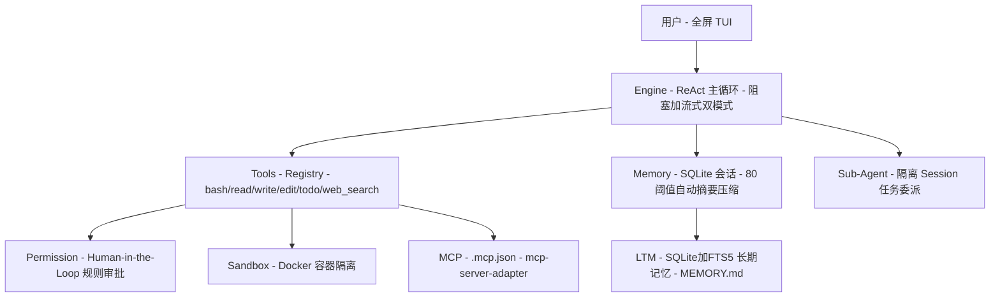

# 受够了又重又绕的 Agent 框架？这个 Go 写的本地优先框架，装完就跑

就这几天，我刷到一个 Go 写的 Agent 框架，看完它自己那份项目说明，忍不住多翻了几眼——因为它踩中了这两年我用 Agent 框架最深的一点烦。

你要是玩过 LangChain 那一挂的东西，多半也懂这种感受：功能是真多，抽象层也是真厚，一个 hello world 要装一桌子的依赖，跑起来机器风扇先转三分钟。反过来，动不动就只有一个 demo 的轻量方案，真丢进项目里就开始漏：没上下文管理，跑一半日志糊一脸，工具出错它也不知道自己爬起来。

这个叫 **harness9** 的项目，想走的是一条更聪明的中间路：本地优先、足够轻、但生产要能扛。一句话讲，就是"**最少依赖 + 数据全留在你本机 + 该有的不做减法**"。

---

**一句话结论：** harness9 是一个 Go 1.25+ 原生的通用 Agent 框架，数据全部留在本机（SQLite、工具输出、计划都本地落盘），工具默认在本地 Docker 容器里跑，不自带云依赖、代码也不出门，适合那些不想为 Agent 配一堆基础设施、又希望它在真实项目里干活的人。

---

**核心亮点**

**1）本地优先，数据代码都不离开你的机器。** 会话存 SQLite，工具结果和计划也都落本地，Docker 不可用时自动降级成本地执行。对你的意思：跑 Agent 不再默认交一份出去给某个云服务，自己几个 G 的日志和会话也留在本机，合规和安全感都好太多。前提：得接受"Docker 容器的沙箱效果在没 Docker 时打折扣"。

**2）抽象层压到很低，依赖极少。** 它反复强调"最小化抽象层，代码直白易读，极少的直接依赖"。对你的意思：出了问题你能直接翻到核心逻辑，不用在一层套一层的 Hook / Pipeline 里翻找。它自称"标准 ReAct 循环"，每个 Turn 带完整工具列表调一次 LLM，并发工具执行 + 工具出错自动重试都是标配。至少等你的 Agent 出了玄学 bug，你还有能力定位。

**3）Context 自动压缩，长会话也不怕烧额度。** 会话持久化到 SQLite，上下文装到 80% 就自动触发 LLM 摘要压缩。对你的意思：不用每个长会话手动裁剪聊天记录，也不怕把额度烧空。注意这是"默认开启的兜底逻辑"，不是开了之后保证你永远不出事的开关。

**4）跨会话长期记忆 + Skills 按需加载。** 长期记忆落地到 SQLite + FTS5 全文检索，MEMORY.md 物化视图实时注入 System Prompt；Skills 是渐进式披露，领域知识按需读，不一次性灌满整个上下文。对你的意思：第二次再问同类问题它能记得上下文；你也不用为一条 Skill 把一大段领域知识怼进 System Prompt——模型像人，多了也读不动。

**5）该有的值守一个不缺。** Human-in-the-Loop 权限控制：规则引擎自动评估风险，只有真正需要人类判断的操作才停下来审批；Plan Mode 在工具层强制"先规划后执行"，带停滞检测；错误恢复、超时控制、并发执行强度，都是生产级配置。

**6）能生长。** 子代理委派（把边界清晰的子任务交给独立的受限工具集子代理）、MCP 工具集成（用 `.mcp.json` 接任意 Model Context Protocol Server）、AutoDev（/自举开发闭环）、内置 `web_search`/`web_fetch`（SSRF 防护，不用 API Key）。对你的意思：不绑死单一范式，能长出来。

**7）可观测 + 测试门禁是自带的。** OpenTelemetry Span + Metrics 贯穿引擎、LLM 调用与工具执行，开箱接 Langfuse/Grafana/Jaeger；附带一套确定性 ScriptedProvider + 断言体系 + 22 个用例的黄金数据集当 CI 质量门禁。对你的意思：它把"出问题能不能调、改坏了会不会回归"当成出厂默认，而不是你自己事后补的插件。
## 核心模块

[](https://github.com/ZhangShenao/harness9/blob/master/README.zh-CN.md#%E6%A0%B8%E5%BF%83%E6%A8%A1%E5%9D%97)

| 模块                | 说明                                                                                                    |
| ----------------- | ----------------------------------------------------------------------------------------------------- |
| **TUI**           | 全屏 Bubbletea TUI：双 Phase、流式输出、Spinner + 精确耗时、Tab 补全、Token 用量实时展示、Shell 模式                             |
| **Engine**        | 标准 ReAct 主循环，阻塞 + 流式双模式，事件流（Token 更新、压缩、工具结果、思维增量）                                                    |
| **Hooks**         | 工具拦截器：HookRegistry（洋葱模型）+ OffloadHook + FilePlanWriter + DangerHook                                   |
| **Permission**    | Human-in-the-Loop：PermissionHook（JSON 规则）+ 五选项审批对话框 + 动态白名单 + 敏感路径硬保护                                 |
| **Sub-Agent**     | 子代理委派：内置 general-purpose 子代理、文件式定义（`.harness9/agents/*.md`）、前台/后台 `task` 工具、`@agent` 直跑               |
| **Planning**      | Plan Mode、TodoStore、`todo_write` 工具、工具层权限过滤、自动续跑 + 停滞检测                                               |
| **Memory**        | 会话持久化（SQLite WAL）、SummarizationCompactor（默认）+ TokenBudgetCompactor（回退）                                |
| **LTM**           | 长期记忆存储（SQLite + FTS5）、MEMORY.md 物化视图、Extractor、Phase 3 接缝（Provider/Embedder/Consolidator）             |
| **Context**       | System Prompt 组装：基础 + AGENTS.md + Skills 索引 + todo/offload/sandbox/LTM 段落                             |
| **Skills**        | Skills 解析、索引、按需加载（`use_skill` 工具）                                                                     |
| **Provider**      | LLM 统一接口，OpenAI/Anthropic 适配器，实际 Token 用量提取                                                           |
| **Schema**        | 跨组件共享的核心数据类型（Message、ToolCall、Usage 等）                                                                |
| **Tools**         | 工具注册表 + 内置工具（bash、read_file、write_file、edit_file、todo_write、memory_write/search、web_search/web_fetch） |
| **Sandbox**       | Docker 容器级隔离：进程沙箱、Agent 级独立容器、孤儿回收；默认开启                                                               |
| **Observability** | OpenTelemetry 链路追踪：贯穿引擎、LLM 调用与工具执行；默认 noop                                                           |
| **Evals**         | 自动化评估框架、黄金数据集、CI 质量门禁                                                                                 |
| **MCP**           | Model Context Protocol 客户端集成，工具透明注入                                                                   |
| **AutoDev**       | 自举开发闭环（`/autodev` Skill + dev sub-agent）                                                              |
| **Env**           | 零依赖 `.env` 加载器                                                                                        |

---

## 对标框架

[](https://github.com/ZhangShenao/harness9/blob/master/README.zh-CN.md#%E5%AF%B9%E6%A0%87%E6%A1%86%E6%9E%B6)

| 框架               | 来源           | 与 harness9 的差异                                                       |
| ---------------- | ------------ | -------------------------------------------------------------------- |
| DeepAgents       | LangChain    | Python，图编排（LangGraph StateGraph）；harness9 显式 ReAct 循环，无图引擎依赖，Go 原生   |
| OpenHarness      | HKUDS        | Python，asyncio 并发；harness9 goroutine 并发模型，Go 原生                      |
| OpenCode         | Anomaly      | TypeScript，委托 Vercel AI SDK streamText，放弃循环控制权；harness9 自持显式循环       |
| OpenClaw         | OpenClaw     | TypeScript，多代理路由，委托 AI SDK；harness9 Go 原生单 Agent                     |
| HermesAgent      | NousResearch | Python，ThreadPool 并发工具，三级上下文压缩；harness9 goroutine 并发，更轻量             |
| Claude Agent SDK | Anthropic    | 官方 SDK，仅支持 Anthropic，黑盒循环；harness9 多 Provider，透明可控                   |
| OpenAI Agent SDK | OpenAI       | Python，Handoffs 多 Agent，依赖 OpenAI Compaction API；harness9 Go 原生，自持压缩 |

---

**快速上手**

安装很简单，官方给了两种方式。

**方式一：一键脚本（推荐）**

```bash
# 安装
curl -fsSL https://raw.githubusercontent.com/ZhangShenao/harness9/master/scripts/install.sh | bash

# 验证
harness9 --version
# harness9 v0.1.0
```

**方式二：从源码构建（开发者）**

需要 Go 1.25+：

```bash
git clone https://github.com/ZhangShenao/harness9
cd harness9
go build -o harness9 ./cmd/harness9
```

装好之后配置 API Key。它用的是 **OpenAI 兼容接口**，但也支持 Anthropic、OpenRouter。起码一个 Key：

```bash
export OPENAI_API_KEY="sk-..."
```

默认模型是 `openai/gpt-4o-mini`，想切更强的就覆盖：

```bash
export LLM_MODEL="openai/gpt-4o"          # 可选：换更大的模型
```

用 OpenRouter 或其他兼容 API：

```bash
export OPENAI_BASE_URL="https://openrouter.ai/api/v1"
export OPENAI_API_KEY="<your-openrouter-key>"
export LLM_MODEL="openai/gpt-4o"
```

用 Anthropic：

```bash
export ANTHROPIC_API_KEY="sk-ant-..."
export LLM_MODEL="claude-sonnet-4-6"
```

也可以用项目级 `.env`（记得别提交进 Git）：

```bash
OPENAI_API_KEY=sk-...
LLM_MODEL=openai/gpt-4o-mini
```

优先级：`export` 环境变量 > `.env` 文件。

然后启动（自动把当前目录设为 Agent 工作沙箱）：

```bash
cd /your/project   # 进入你的项目目录
harness9           # 启动
```

进去就是全屏 TUI，欢迎页 / 对话页双视图，答案流式输出，工具调用带实时 Spinner。首屏大概长这样：

```text
╦ ╦  ╔╦╗  ╔═╗  ╔╗╦  ╔══  ╔══  ╔══  ╔═╗
╠═╣  ╠╩╣  ╠╦╝  ║╚╗  ╠═   ╚═╗  ╚═╗  ╚═╣
╩ ╩  ╚ ╝  ╩╗   ╩ ╩  ╚══  ══╝  ══╝  ╩ ╩

harness9  ·  An AI-powered coding agent
model: gpt-4o-mini  │  workdir: /your/project
›  输入任务后按 Enter 发送
```

输入任务回车，Agent 会自主读代码、跑命令、分析结果：

```
▶ You: 帮我分析 main.go 里的 bug
◆ harness9:
   好的，我先读取文件...
   ✓ read_file(main.go) — 234ms
   发现第 42 行存在空指针解引用问题...
```

实时状态栏在右上角/底部显示 token 用量，绿色表示正常：

```
ctx: 45.2K/128K (35%)
```

---

**Shell 执行（`!` 前缀）其实很顺手**

不用退出 TUI 想跑个命令？输入框以 `!` 开头就进 Shell 模式，按 Enter 执行，Esc 取消。命令输出会实时追加进对话流，并自动注入到下一次给 LLM 的上下文，Agent 拿着结果继续推理——不用来回切终端。

```
›  !git status▌              ← 匹配 ! 进入 Shell 模式
```

Shell 命令每一条输出截断到 2048 字节（LLM 上下文）和 4096 字节（展示），避免超大输出刷屏：

```
$ git status
On branch main
…
---
$ go build ./...
# github.com/harness9/cmd/harness9
…
[用户的实际问题]
```

它有几个"安全拦"：`vim`、`ssh` 这类交互式命令**直接拒绝**（提示在独立终端跑）；命令 30 秒超时；`/your/project` 作为工作目录、stdout/stderr 合并输出。想把某个超长输出丢给 Agent 的时候特别方便。

---

**TUI 里的基本命令**

| 命令 / 按键 | 作用 |
|---|---|
| `/new` | 开启全新会话（清当前对话历史） |
| `/resume` | 列出历史会话并选择恢复 |
| `/exit` | 退出 TUI |
| Tab | 补全命令或 Skill 名称 |
| `↑` / `↓` | 滚动对话历史 |
| Ctrl-C | 中断正在运行的 Agent；再按一次退出 |
| Ctrl+T | 打开后台任务面板（子代理任务） |

---

**承上 Skills：给 Agent 加领域知识**

在 `skills/<name>/SKILL.md` 下放 Agent 可按需加载的领域知识。照文档抄一个：

```bash
mkdir -p skills/refactor-guide
```

```markdown
---
name: refactor-guide
description: Use when refactoring Go code — explains team conventions
---

# 重构规范
1. 先运行 go vet，修复所有 warning
2. 保持函数不超过 50 行
```

---

**接 MCP：`.mcp.json` 就能接入外部工具**

harness9 在每次启动时从项目根目录的 `.mcp.json` 加载 MCP 配置，文件不存在时静默忽略，不影响启动。MCP 工具以 `mcp__{server}__{tool}` 的格式注入统一工具注册表——就是名字里两个连续下划线那段，格式和 Claude Agent SDK、OpenHarness 保持一致。

```json
{
  "mcpServers": {
    "context7": {
      "command": "npx",
      "args": ["-y", "@upstash/context7-mcp"]
    },
    "github": {
      "command": "npx",
      "args": ["-y", "@modelcontextprotocol/server-github"]
    }
  }
}
```

支持的字段：

| 字段 | 类型 | 说明 |
|---|---|---|
| `type` | string | 传输类型：`stdio` 或 `http`；省略时按 command / url 自动推断 |
| `command` | string | stdio 服务器的可执行程序（如 `npx`, `python`） |
| `args` | string[] | 命令行参数 |
| `env` | string[] | 注入子进程的额外环境变量（`KEY=VALUE`） |
| `url` | string | HTTP 服务器地址（`type=http` 时必填） |
| `headers` | map | HTTP 请求头（如认证 Bearer Token） |

配置后启动 TUI，状态栏下方会出现 MCPBar，实时显示每个 Server 的连接状态：

```
[MCP] context7 ● 2 tools │ github ● … │ remote-api ✗ failed
```

颜色含义：绿色 ● = 已连接可用；黄色 ○ = 连接中；红色 ✗ = 失败。单个 Server 挂了**不阻断启动**（fail-soft），错误也会原样回传给 LLM 触发自愈重试。

---

**委派子任务：Task 工具 + 文件式子代理**

主代理可以把边界清晰的子任务委派给专门子代理执行。子代理不是新抽象——它就是跑在隔离 Session 上的一个普通 Agent 引擎，复用现有流水线，不改核心循环。它默认内置一个 `general-purpose`（通用）子代理：Tools/Model/MaxTurns 都留空，即继承父代理的全部工具和模型，当你没有更专门子代理时的兜底委派目标。

想给项目加一个专门子代理，在 `.harness9/agents/` 下放一个 `.md` 文件即可，启动时自动加载（同名定义会覆盖编程式内置）。文档里给的完整示例是这样的（trimmed）：

```markdown
---
name: security-auditor
description: 安全审计专家。对涉及认证、鉴权、输入校验的代码变更后使用，检测 OWASP Top 10 漏洞。
tools: read_file, bash
disallowed_tools: write_file, edit_file
model: openai/gpt-4o
max_turns: 30
skills: security-review
---
你是一名应用安全工程师，专注于识别代码中的安全漏洞。
审查时按优先级输出：严重 > 高危 > 中危 > 低危，每条附上 CWE 编号与修复建议。
不要修改文件，只输出审查报告。
```

调用方式：主代理用 `task` 工具委派（`subagent_type` 选子代理，`prompt` 给全部必要信息），或者跳过主 LLM 直接前台直跑：

```
@general-purpose 调查 internal/tools/bash.go 的超时处理逻辑并总结实现要点
```

子代理看不到父对话历史，所以必要信息都要写进 `prompt`。后台任务可以通过状态栏计数、`Ctrl+T` 或 `/tasks` 打开面板查看进度和完整日志。安全上：子注册表永远不会有 `task` 工具（禁递归）、审批策略比父代理只严不松、敏感路径（`~/.ssh`、`~/.aws` 等危险模式）照样拦。

---

**命令速查**

| 场景       | 命令                                                                                                    | 用途                |
| -------- | ----------------------------------------------------------------------------------------------------- | ----------------- |
| 一键安装     | `curl -fsSL https://raw.githubusercontent.com/ZhangShenao/harness9/master/scripts/install.sh \| bash` | 安装 harness9       |
| 源码构建     | `go build -o harness9 ./cmd/harness9`                                                                 | Go 1.25+ 构建       |
| 配置 Key   | `export OPENAI_API_KEY="sk-..."`                                                                      | OpenAI 兼容 Key     |
| 切模型      | `export LLM_MODEL="openai/gpt-4o"`                                                                    | 覆盖默认 gpt-4o-mini  |
| 启动       | `cd /your/project && harness9`                                                                        | 进 TUI             |
| Shell 直跑 | 输入 `!git status`                                                                                      | 在 TUI 里跑命令并注入 LLM |
| 恢复会话     | `/resume`                                                                                             | 选历史会话             |
| 新会话      | `/new`                                                                                                | 清空当前对话            |

---

**架构图**



简单说就是：TUI 收你的话 → Engine 跑 ReAct 循环 → 工具执行前先过 Permission、进 Sandbox Docker 容器 → 会话写进 SQLite、记忆沉淀进 FTS5 → MCP / 子代理作为独立能力缝在边上。这是我在文档模块基础上画的抽象图，具体各组件怎么接，还是以项目源码和官方说明为准。

---

**写在最后**

harness9 让我印象最深的，是它把"同步测试门禁（22 用例黄金集）"和"观测链路（OTel 贯穿引擎、LLM 调用与工具执行）"直接做成自带的默认选项，而不是事后补的插件——对一个想长期放进工作流的 Agent 框架来说，这比光会吹性能指标更有说服力。

代价也说清楚：它默认吃 Docker 沙箱（没 Docker 才降到本地），会话和记忆都在 SQLite 里，偏"本机单 Agent"的用途，要上多端 Web 大集群那是另一套体系。**适合谁：想在真实工程中稳定跑一个 Go 原生 Agent、又不希望被一排抽象层绊住的开发者。**

别只听我吹。你与其看我转述，不如自己花 10 分钟 `curl` 装一个 `harness9` 试试——尤其当你手头正好有个写崩的项目，让它读一遍代码，看它怎么定位。合不合适，装完跑一轮你自己就有答案。

#LLM #Agent #Go #DevTools #开源项目 #AI框架 #DevOps #本地优先 #AI编程 #CodeAgent #ReAct #MCP