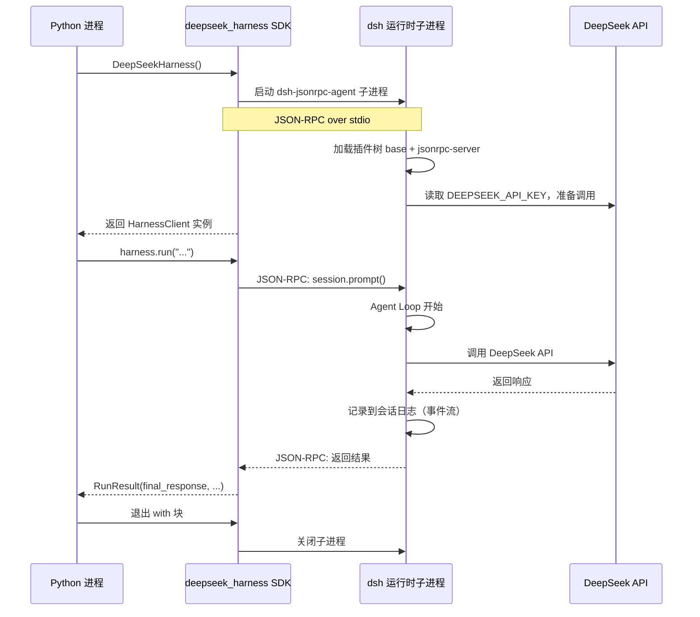
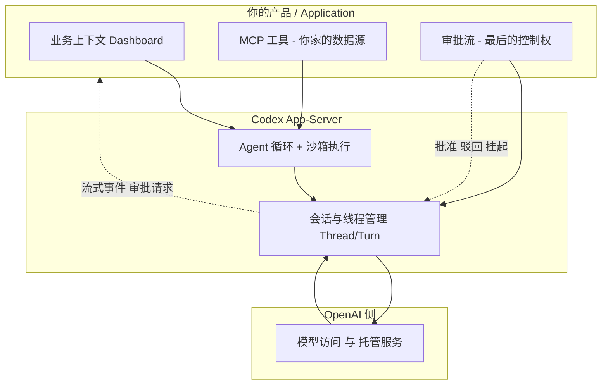

# Codex SDK vs deepseek_harness SDK：同样是让 Python 驱动 Agent，一个要你拼 JSON，一个甩一句自然语言就行

做 AI 编程相关的开发，最近应该都被这两个东西刷过屏：OpenAI 把 Codex 底层跑动的那套运行时（Harness）开源了，`codex exec`、Codex SDK、App-Server 三层集成方式正式摆上台面；另一边，DeepSeek 也在差不多的时点开源了 DeepSeek Harness（dsh），标签直接打上"MIT、一切皆插件、有官方 Python SDK"。**这一下两个都带"Harness"，两个都喊"把 Agent 嵌进你的程序"，全网都觉得自己行了，结果点开文档的瞬间集体破防——**"你给我个能用的例子能死吗？"**

**这俩都叫"Harness"，都号称能让你在自己的程序里驱动一个 Agent，那……我 Python 项目里到底该 import 哪个？** 这个问题要是去问 AI，八成换来一句"取决于你的场景"，等于没说。

Codex SDK 和 deepseek_harness SDK 都在干同一件事——把"调用一个能自己决定怎么干活、怎么调工具、怎么访问文件的 Agent"这件事，封装成一个能嵌进你代码的接口。但它们的**默认姿势完全在两个极端**：一个强按着你的头说"你来编排 Agent、方向盘给你、注意看路"，一个拍拍你肩膀说"你派活就行，Agent 自己看路、自己踩油门"。同一个"驱动 Agent"，一个当**乙方**一个当**甲方的打工人**，这味儿发酵起来就很有意思了。下面就用 Python 说话，把安装、最小示例、进阶配置、底层通信、选坑指南逐一拉齐，看到最后不踩雷算我输。

---

**一句话定性：Codex SDK 是 OpenAI 把"Agent 执行引擎"交到你产品手里的程序化接口，调用方负责角色上下文、审批和工作流编排；deepseek_harness SDK 是 DeepSeek Harness 的 Python 绑定，一个上下文管理器 + 一句 `run()` 就把整套 agent 运行时（子进程）拉起来跑完，剩下的交给 Agent 自己。**

用大白话翻译：Codex SDK 像"你租了一台带司机的车的引擎，方向盘还在你手里，但你要自己看路、自己决定啥时候靠边停车，司机还时不时回头问你：**这单批不批？**"；deepseek_harness SDK 更像"你叫了一台网约车，甩一句'去看一下北京现在几点'，他自己开车、查路、报时间，你连安全带都不用系，坐后排刷手机就完事"。

**一句话记：前者是你给 AI 打工，后者是 AI 给你打工。** 别急着站队，往下看谁适合谁。

---

**先掂清楚：两个"SDK"分别包着什么**

很多新手栽的第一个跟头，是把"Codex SDK"和"deepseek_harness SDK"当成同类货直接比功能——**这就好比拿"租车"和"打车"比谁省油，比了个寂寞。** 它们其实是**两种不一样深度的"驱动方式"**。

这篇判断的依据，来自 OpenAI 官方博客 **《Codex as a Platform》**（developers.openai.com/blog/codex-as-a-platform）。官方把 Codex 能做集成的路径拆成了三层，并且明说"每个用例不必都用同一种集成"——这点很关键，很多人以为只能二选一，其实有三档：

| 集成方式 | 官方描述 | 我要操的心 |
| --- | --- | --- |
| `codex exec` | 脚本 / CI job / 一次性后台任务，跑一个"有界的"Agent 工作流并返回结构化输出 | 非交互、作用域受限，拿结果就走 |
| **Codex SDK** | 应用代码里需要"启动、恢复、或流式接收 Codex 任务"时，提供直接的程序化接口 | 程序化编排，你自己处理 start / resume / stream |
| Codex App-Server | Agent 本身就是产品的一部分时用 | 本地进程常驻、保活会话、流事件、暴露工具、响应审批 |

官方对这三层的关系有个原话总结（我转述）：**SDK 帮你简化常见的程序化工作流；App-Server 把对话生命周期和用户体验的直接控制权交给你。** 换句话说，Codex SDK 定位在"你有一段应用代码，要在里面启动/恢复/流式拿到 Agent 任务"的中间档；它跟 `codex exec` 和 App-Server 是**并排跑在一起的三种选择**，不是"一个包"。

也正因为这样，**它默认是"你编排 Agent"的姿势**：你给上下文、你订阅事件、你决定审批——而不是"扔一句话完事"。官方的 Relay 示例（一个发运仪表盘里嵌 Codex）最能说明这点：应用提供产品上下文和 MCP 工具，Codex 跑 Agent 循环和沙箱执行，任何有后果的写操作都要人审批。

顺带说清楚"开源"这件事的边界：官方原文写的是"我们把 Codex CLI、App-Server 和官方 Codex SDK 作为开源组件发布"，并强调"**开源的这一层是 Harness 和集成层；模型访问与托管服务是分开的**"——也就是说开源的是这个 Agent 运行时和集成面，推理能力还是走 OpenAI 侧。仓库开源协议为 Apache-2.0（CLI 部分），这点我后文表格会注明。

而 DeepSeek Harness 的 Python SDK 走的是另一条路。它核心使命只有一个：**把整个 harness 运行时当成一个可替换的配件塞进你 Python 进程里。** 装完 `pip install`，自动带一个单文件可执行程序（`dsh-jsonrpc-agent`，内置了 Node 运行时 + dsh 核心插件栈），你的 Python 代码通过 stdio 上的 JSON-RPC 跟这个子进程通信。你拿到的是一个"像本地对象一样好用"的 Agent 句柄。

用一个表把两者摆在台面上：

| 对比维度 | Codex SDK | deepseek_harness SDK |
| --- | --- | --- |
| 语言&安装 | 官方 CLI/App-Server/SDK 以 Node/TypeScript 生态为主，Python 侧走 CLI/HTTP 协议 | `pip install deepseek-harness-sdk`，Python 一等公民 |
| 抽象层级 | 事件流 + Thread/Turn 模型，偏底层可编排 | 一次性 `run()`，Agent 内部自己转 |
| 通信方式 | 单边 HTTP/调用 + 沙箱隔离 | 本地子进程 + stdio JSON-RPC |
| 运行时 | 依赖 Codex CLI/服务，推理走 OpenAI 侧 | 内置 `dsh-jsonrpc-agent` 单文件可执行，可不装 Node.js |
| 认证 | OpenAI API key / ChatGPT 订阅额度 | DeepSeek API key，也可换 provider |
| 开源协议 | Apache-2.0；CLI/App-Server/官方 SDK 均开源，但模型访问与托管服务仍在 OpenAI 侧 | MIT，可私有部署商用 |
| 自定义度 | 低~中，能力边界主要按 OpenAI 给的三层来 | 高，"一切皆插件"，你能换工具、换模型适配器 |
| 适用场景 | 产品集成：把你的业务嵌入 Agent 能力 | 开发者/科研/自定义 Agent，快速拉一个能做工具调度的 Agent |

> 上面"Python 一等公民"这条，得说清楚：**OpenAI 的 Codex SDK 本身是 TypeScript/Node 优先的**，Python 侧要走官网那套 `codex exec` 或通过 App-Server 的 HTTP 协议来托管集成。而 deepseek_harness 是 DeepSeek 官方刻意提供了 Python 绑定。这一点对"我就想用 Python 写"的人是分水岭。文中给 Codex 的 Python 示例，属于"基于官方宣称的兼容性与执行形态推断的通用示例"，具体以官方文档为准。

---

**先看真码：两边的 Python 最小可运行示例**

聊再多架构，不如把第一段代码摆出来。这是 deepseek_harness SDK 最简可运行版本：

```bash
pip install deepseek-harness-sdk
```

它会顺手把 `deepseek-harness-runtime-bin` 同版本一起装好（含单文件可执行运行时），所以你不一定需要本地 Node.js。先放好 API Key：

```bash
export DEEPSEEK_API_KEY=***
```

然后写一个 `hello_dsh.py`：

```python
from deepseek_harness import DeepSeekHarness

with DeepSeekHarness() as harness:
    result = harness.run("Say hi, and tell me what time it is in Beijing.")
    print(result.final_response)
```

跑一下 `python hello_dsh.py`，输出大概是：

```
Hi! The current time in Beijing is 2026-08-14 20:22 (CST, UTC+8).
```

这段代码的全部含义就是：`DeepSeekHarness()` 作为上下文管理器启动子进程 → 发一条自然语言消息 → Agent 循环自己决定要不要查时间、怎么查 → 返回 `final_response` → 退出时自动关掉子进程。**没有 messages 数组、没有 function_call 解析、没有 while 循环。**

再对比一下，如果你不靠 dsh，用裸 API 自己写一个"能查时间的 Agent"，得大概长这样（示意，演示要手搓的部分）：

```python
import requests

DEEPSEEK_API_KEY = "***"
messages = [
    {"role": "system", "content": "You are a helpful assistant."},
    {"role": "user", "content": "Say hi, and tell me what time it is in Beijing."},
]

resp = requests.post(
    "https://api.deepseek.com/chat/completions",
    headers={"Authorization": f"Bearer {DEEPSEEK_API_KEY}"},
    json={"model": "deepseek-chat", "messages": messages},
)

data = resp.json()
print(data["choices"][0]["message"]["content"])
```

这条看起来不复杂。但注意它**根本不知道"现在几点"**——真要查时间，你得自己写调时间服务的代码、把结果拼回 messages、再发一次请求。看，这就是"手撕 Agent"的日常：你写的不是功能，是**搬砖的执着**。这下你就能体会这两个 SDK 的分野了。

那 Codex 呢？如果按"Codex 是事件驱动引擎"的模型，对应 Python 侧的高阶用法是走非交互式的 `codex exec`（适合 CI），长生命周期场景用 App-Server 启动、恢复、订阅事件。这里我给一段示意（基于其宣称的执行形态写的通用示例，具体以官方文档为准）：

```bash
# 一次性批处理：非交互式跑一个作用域受限的任务
codex exec --json "请审查 src/auth.py，指出安全风险并按严重级列出"
```

```python
import subprocess, json

# 以 JSON 结构化输出拿回 Agent 结果（示意：真实 driver 以官方文档为准）
out = subprocess.run(
    ["codex", "exec", "--json", "审查 src/auth.py 并给建议"],
    capture_output=True, text=True,
).stdout

resp = json.loads(out)
print(resp.get("final_response") or resp)
```

**明显差别在这里显现，也是这俩风格分道扬镳的地方。** deepseek_harness 的 `run()` 已经把"启动 Agent + 让 Agent 自己决定调什么工具 + 跑完返回"打成一行——**主打一个"交给命运，哦不，交给 Agent"**；而 Codex 的哲学是"你要能坐下来看着 Agent 的每一步"——上下文你来给、审批你来批、事件流你来订阅，**主打一个"全程监管的 CCTV 风"**。这不是谁差谁的缺陷，是两种对"Agent 该听谁的"的理解。

---

**一张图看懂 deepseek_harness 底层到底在干嘛**（名词来自官方实现）：



**再看另一边，Codex App-Server 是"你开着车、引擎在别人那"的反向画风。** 同样是本地拉起一个 Agent，但这次是**你的应用登门造访**——你带着上下文和 MCP 工具上门，Codex 在中间当那个跑 Agent 循环的打工人，而"要不要放行"的审批按钮，还搁在你手里：



**看明白没——位置全反了。** deepseek 是"一个 `run()` 把运行时整个拽进你 Python 进程，你自己车里拉人"；Codex App-Server 是"你的应用是甲方，Agent 引擎是乙方，你们通过网络协议签合同"。前者你在驾驶位，后者你在甲方会议室。

---

**五个亮点：能真正落地的东西（编号过一遍）**

**1. 深一点的抽象：调用"Agent 的智能"，不是调"API 的接口"。**
`run()` 接受的自然语言被 Agent 自己拆解成要不要读文件、要不要跑 Shell、要不要搜网页、要不要起子 Agent。你不在 Python 里写文件操作，而是写"帮我巡检这个项目并给评分"。这对项目经理类脚本尤其值钱——我用 deepseek_harness 能一个 `run()` 让 Agent 做"列目录→读 README→解析 package.json→生成健康度评分"这种多步任务，全程不用我自己调工具。

**2. 内置工具与子 Agent，还能拿到结果对象更多细节。**
`RunResult` 不止给文本。它带 `final_response`、`finish_reason`（`completed` / `max-tokens` / `error`）、`session_id`（可用于恢复）、`events`（根会话事件列表）、`session_root`（持久化会话目录），以及**子 Agent 生成的 `notifications`**。做长任务编排时，光这几个字段能少写一大截"记录历史/恢复现场"的代码。

```python
from deepseek_harness import DeepSeekHarness

with DeepSeekHarness() as harness:
    result = harness.run("安排一个子任务去调研最近的 DeepSeek 更新")

    print("=== 主 Agent 响应 ===")
    print(result.final_response)

    print("\n=== 子 Agent 通知 ===")
    for notification in result.notifications:
        print(f"  [{notification.kind}] {notification.message}")

    print(f"\n=== 完成原因: {result.finish_reason} ===")
```

**3. 配置可下沉到一个 `DeepSeekHarness(...)`：provider/model/max_tokens/cordis。**
想换提供商、换模型、限产出 token、甚至指一个自定义 `cordis` 配置（即自定义插件组合）都能在构造时就定掉，不改调用代码：

```python
from deepseek_harness import DeepSeekHarness

with DeepSeekHarness(
    provider="deepseek-official",
    model="deepseek-v4-flash",
    max_tokens=49_152,
    cordis="my-custom-cordis.yml",   # 指向你自己的插件组合配置
) as harness:
    result = harness.run("帮我做一次代码审查")
    print(result.final_response)
```

`max_tokens` 是可选参数，控制单次最大输出 token 数；不传就用 Provider 默认值。

**4. 进程隔离 + 可替换运行时，Python 不用背 Node 依赖。**
运行时是一个独立单文件可执行，Python 只用 stdio 通信。你可以切 `DSH_RUNTIME_MODE` 在 `exe`（生产，不依赖 Node.js）与 `node`（开发期跑源码）之间切换。Python 进程崩了不影响子进程，反过来也查得到错误——这种"隔离但不脱节"的姿势，做自动化很受用。

**5. MIT + "一切皆插件"的上限：Agent 能自己改自己。**
DeepSeek Harness 内置 `self-modification` 包，Agent 可以在运行时检查、挂载、卸载自己的插件，甚至现场造一个只读代码的安全审计模式挂到自己身上。这跟 Codex 那套"引擎与产品分离、模型锁在 OpenAI 生态"的定位是两个维度的东西。**代价也很明显：dsh 现在还是开发者预览，官方 README 明写"会有破坏兼容性的变更"，而且文档面向开发者、入门门槛高。**

> 说句公道话：Codex 这套 Harness 侧同样有它值钱的一档——App-Server 能把 Dashboard、审批流、MCP 工具这些产品控制权完整留给你，而且官方在 ARC-AGI-3 上公布了一个很有说服力的数据：**同一模型 GPT-5.6 Sol，仅靠 Harness 层的"保留推理 + 上下文压缩"，分数从 13.3% 提到 38.3%，输出 token 还降了约 6 倍**——说明 Harness 不是模型的"包装纸"，而是实打实的能力放大器，**这波属于是"马没换，但把缰绳和跑法全换了"**。那是"稳定性、产品集成"这条线的强项，跟 dsh 的"高度内抠、可扩展"不在一个赛道上，别拿一方的短板硬比。

---

**这么选，别再用"功能谁多"来纠结**

给一个基于现状、不装腔的判断（丑话说前头）。

如果你的诉求是**"我有一段 Python 批处理/自动化/巡检，想要一个开箱即用、能自己决定怎么调工具的 Agent 一句一行搞定"**，deepseek_harness SDK 更贴合——装一个 pip 包、上下文管理器包裹、`run()` 就完了，MIT 协议、也能接自定义 provider，门槛对 Python 开发者友好太多。代价是你要接受它是开发者预览，走深了要啃插件架构，而且"一切皆插件"本身就不是开箱即用的人能秒懂的。

如果你的诉求是**"我要把 Agent 能力嵌进我自己的产品/Dashboard/运维面板——Thread、Turn、审批、工具执行、事件流全都要"**，那 Codex 的 Harness / App-Server + SDK 那套"引擎与产品分离"的设计更对胃口：产品逻辑你掌控，Agent 执行给 Harness，回车得到成熟稳定、有真实生产案例（GitHub+JetBrains、Cisco 用 Codex SDK 搭 App Builder、Thrive 用 Codex 跑税务申报 7000 份、准备时间降约三分之一）。代价是模型访问还是在 OpenAI 侧，`Codex SDK` 官方也是 Node/TypeScript 生态优先，Python 侧走 CLI/HTTP，得适应。

**一句话总结这两种 SDK 的定位差**：Codex SDK 是"给你一个能精确控制的 Agent 引擎，你当总导演"；deepseek_harness SDK 是"给你一个能听人话的 Agent 下属，你当产品经理下需求"。一个把控制权留给你，一个把智能体权交还给你。

---

**我的选择，和诚实的小声明**

本文 Codex 部分主要基于 OpenAI 官方博客 **《Codex as a Platform》**（developers.openai.com/blog/codex-as-a-platform）和公开仓库信息；DeepSeek Harness 部分基于其官方项目说明与我在 Mac 上从 `pip install` 到 `run()` 整链跑通的实际体验。Codex 侧我没有重度到能掏出完备 benchmark，凡是推断处我都标注了"以官方文档为准"。

老实说，如果我是**纯 Python 单人开发者、想要"今天就能让 Agent 帮我巡检仓库"**，deepseek_harness 的手感让我觉得真香——一句自然语言，Agent 自己跑工具、子 Agent、返回结构化结果，这在"调 API 接口"和"调 Agent 智能"之间，是完全不同的编程体验，**那种"我躺后排刷手机，活它自己干完了"的爽，谁用谁知道**。但如果我在做"要把 Agent 塞进对外产品"的团队，我会认真搭 Codex 的 App-Server——毕竟产品上线求的是稳，不是求 AI 突然给我表演原地整活儿。

Agent = Model + Harness，这条公式正在从 LangChain 的一句话变成两家大厂真金白银在线掰头。**当下你决定用哪个 SDK，不是比"谁更强"，而是比"你手里的产品，要的是被 Agent 驱动，还是驱动 Agent"。** 想清楚这一点，代码自然知道该 import 哪个。最后送一句压箱底的老实话：**别跟风、别站队、别听我说了算——看你自己那个破场景，动手把两边都跑一遍。实践出真知，翻车出文章，麻烦这东西躲不掉的。**

---

#Codex #CodexSDK #DeepSeekHarness #dsh #Python #Agent #SDK #Agent开发 #开源 #MCP #AI编程 #开发工具 #对比