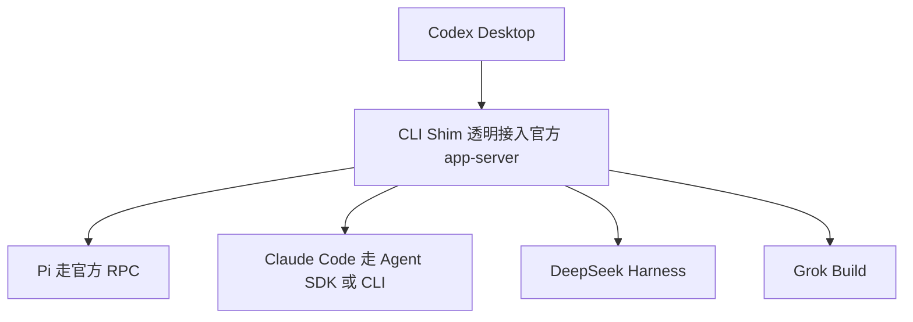

# 一个桌面，装下 Codex、Pi、Claude Code、DeepSeek：CodexHost 让 Agent 不必再"换壳"

这些年如果你主力用 Codex Desktop，多半有个说不出口的尴尬：它是我用过的桌面开发交互体验里最顺手的，界面、会话、流式输出、Diff、审批节奏都长在我点上。可一旦我想切到 Pi、Claude Code 或者 DeepSeek 的另一套思路，就麻烦大了。

麻烦在哪？每种 Agent 都有自己的客户端、自己的登录、自己的快捷键习惯。风格不一也就算了，关键是——**习惯是会上瘾的**。你在 Codex Desktop 里练出来的肌肉记忆，换到一个不熟的壳里，全部归零。于是很多人最终"谁用着顺手就守着谁"，其余那些不错的 Agent 一直停在"听说很好"的阶段。

最近有人把这个烦心事做成了一个项目：**CodexHost**。一句话讲清楚——它让你在官方 Codex Desktop 里自由选择真正干活的那个 Agent，Pi、Claude Code、DeepSeek Harness、Grok 都能以独立会话跑进来，同时保留 Codex 的原生体验。不用重装壳，不用改官方安装包，就一个增强层。

核心逻辑一句话：**把 "能聊" 和 "能干活" 分开——界面还是 Codex 的，干活的 Agent 可以不是 Codex。**

---

**先说清楚：它到底解决了什么破事**

先别急着夸。多 Agent 客户端其实不算新鲜玩意儿，早有一堆工具在做。市面上的「多 Agent 客户端」大多走一条叫 **ACP** 的路子，不同 Harness 通过同一套协议接进来。好处是接入快，坏处是——工具、审批、权限、Diff、提问这些原生能力，会先被协议"削平"，再在 UI 层补一层近似实现。

说得直白点：App 是接进来了，但功能变成"半吊子"。你提交一个工具调用、要批一个高权限操作、或者想中途改口问一句，它不一定能用——因为那层能力被协议架空了。

CodexHost 刻意不走这条路。它拆成三层干这件事：

- **Desktop 侧**：用 CDP / Electron Inspector 在官方 Codex Desktop 上增强 Agent 选择与会话界面——不重做聊天壳，也不碰官方安装包。
- **协议侧**：用 CLI Shim 透明地接入官方 app-server，Codex 的原生请求原样转发。
- **Harness 侧**：按每个 Harness 自己的原生接口接入——Pi 走官方 RPC，Claude Code 走 Agent SDK / CLI——然后再把这些能力投影到 Desktop 已有的流式输出、工具、Diff、审批和提问上面。



这整个过程，目标是保真，不只是"能聊"。**流式输出、工具状态、可靠的 Patch、原生审批和提问，尽量来自 Harness 自己，而不是 Host 猜的或编的。** 这一点，我用下来觉得是它和我之前用过的那些"多 Agent 壳"最大、也最关键的分界。

---

**核心亮点**

1. **Agent 与 Model 在选择框里自由切换。** 写完 Prompt，提交之前，直接在 Codex Desktop 里选真正执行任务的 Agent 和 Model，Grok 也能进列表。这对"同一批人、不同任务用不同 Agent"的场景很实用——不用切到另一个窗口。

2. **各家原生能力尽量原样保留。** 流式回复、Thinking、工具状态、Edit Diff、提问/取消、工具审批——这些在 Pi、Claude Code、Grok Build 上基本都是"已支持"。项目文档里给了明确的表格状态，哪项支持、哪项部分支持、哪项暂时没有，写得清清楚楚，不玩虚的。

3. **权限模式是真的。** Claude Code 那套权限模式是完整支持 ✅ 的。这在跑高敏感、需要逐级授权的任务时，意义和"能发指令"完全两码事。

4. **会话和上下文也能管。** 会话恢复、Fork、上下文压缩在各 Harness 里基本都支持，之前那套"起新会话、接着聊、压上下文"的节奏能延续下来。DeepSeek Harness 在部分能力上暂不支持 Model/Thinking 选择和 Fork（标 🚧 或 —），但会话恢复、工具状态、Diff、审批都没落下。

5. **费用不是黑盒。** Usage 面板能看到上下文、缓存命中与费用估算；Grok 还能看到账户额度、每周用量和重置时间一目了然。对靠预算控制过日子的人太友好了，终于不用月底才被账单吓一跳。

6. **可视化也顺手。** Mermaid 图表能可视化渲染——把 Pi + Codex Desktop 和 Pi Agent TUI 的渲染效果放一起对比，差距一眼能看出来。这对画架构图、给非技术同事讲流程，价值不用多说。

读者收益：**你把手感最顺手的那套壳留下来，把 Agent 心智换成最适合当前任务的那一个。** 前提是：你本来就在用 Codex Desktop，且愿意为"保真"付出一点接入成本。

---

**快速上手**

两种方式二选一。最省事的是 npm：

```bash
npm install -g @codexhost/cli
codexhost
```

npm 支持 macOS、Windows 和 x64 Linux。

也可以从 Releases 下载安装包，macOS / Windows 都有。macOS 装完如果首开提示 Apple 无法验证应用，先在终端跑：

```bash
xattr -dr com.apple.quarantine /Applications/codexhost.app
```

再重新打开 `codexhost` 就行。

Windows 上有个坑要提前说：如果你用的是绿色解压版 Codex Desktop，得在启动 codexhost 前手动设一个环境变量 `CODEXHOST_INSTALL_ROOT`，指向包含 `app\ChatGPT.exe` 的目录：

```powershell
[Environment]::SetEnvironmentVariable("CODEXHOST_INSTALL_ROOT", "D:\CodexPortable", "User")
```

然后重开终端启动。npm 命令和 Windows 安装版都适用。这一步别漏，漏了大概率启动不到指定的那套 Codex。

**命令速查**

| 阶段 | 命令 | 用途 |
|---|---|---|
| 安装（npm） | `npm install -g @codexhost/cli` | 全局安装 CLI |
| 启动 | `codexhost` | 启动 CodexHost |
| macOS 放行 | `xattr -dr com.apple.quarantine /Applications/codexhost.app` | 首次打开绕过 Apple 隔离 |
| Windows 指定目录 | `[Environment]::SetEnvironmentVariable("CODEXHOST_INSTALL_ROOT", "D:\CodexPortable", "User")` | 绿色解压版需要 |

---

**适用边界，几条先记下**

我实际用下来（以及看文档）认为这几个点你得心里有数：

- **它不是一个"我给你画全新界面"的东西。** 它的价值建立在你有 Codex Desktop 这个基础上。如果你根本没在用 Codex 桌面端，这个项目给你的就有限。
- **不同 Harness 的完整度参差不齐。** 别看表格一片绿，里面还是不少 🚧（部分支持/开发中）和 —（不支持），尤其斜杆命令、修订上一条消息这类偏交互的能力，在各 Agent 间差异明显，使用时先确认你要的那个能力当前不是"部分支持"状态。
- **跟 Mac + Windows 配合最好，切 Linux 你要走 x64 版。** 安装包目前官方支持 macOS 和 Windows，Linux 靠 npm + 专门页面。
- **绿色解压版 Codex 那个环境变量是必需操作，不能省。**
- 它目前明确接入的是 Pi、Claude Code、Grok Build、DeepSeek Harness 这几家。你如果有别的 Harness，先确认它官方有没有提。

我不是说它万能。它解决的核心痛点就是"多 Agent 客户端那层保真问题"。如果你更在乎界面推倒重来、或者想把所有 Agent 都接到同一个统一面板看，那它反而不是你要的东西。

---

**写在最后**

说实话，我最喜欢这个小项目的地方不是"又能多接一个 Agent"，而是它的价值取向：**多 Agent 的时候，第一优先级不是"接得多"，而是"接得真"。** 工具、审批、Diff、权限，这些是从 Harness 自己身上长出来的，不是壳替它编出来的。这一点，对真正跑重型自动化的人来说，安全感差一大截。

至于它够不够成熟？功能状态表格就摆在那里，愿不愿意试，看你自己。你要是本来就用 Codex 桌面、又时不时想换 Pi 或者 Claude Code 跑不同任务，那 CodexHost 值得你花十分钟装一下。装好用一句话总结：**一样的壳，换了个真正干活的内核。**

#AI编程 #Codex #ClaudeCode #DeepSeekHarness #PiAgent #Grok #AgentHarness #多Agent #开发工具 #开源