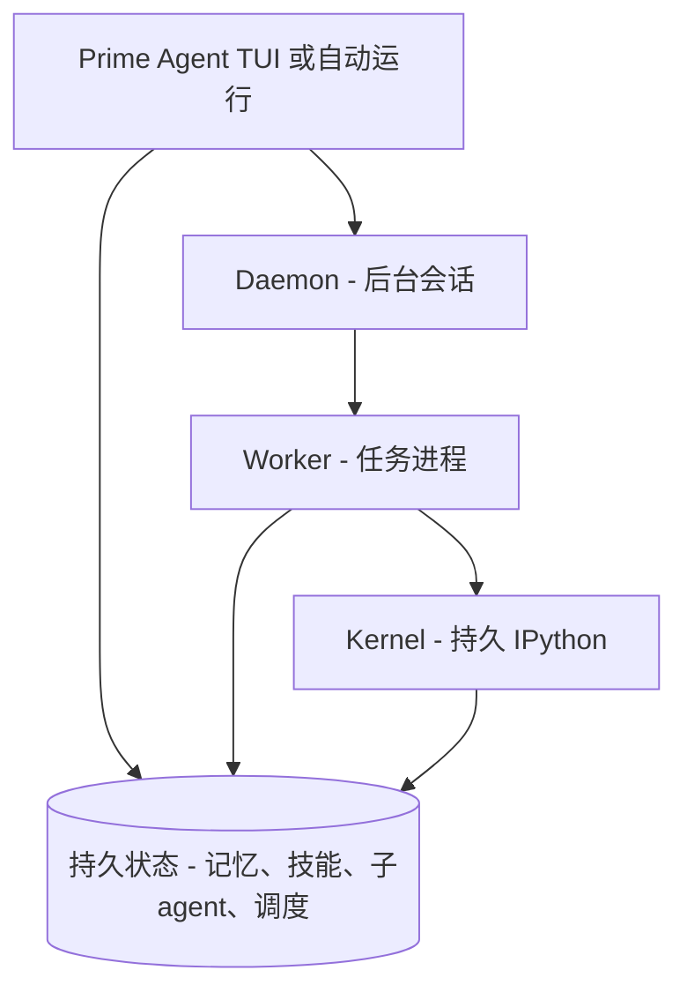

# 跑十几个小时不掉线，还能自己变强的 Coding Agent：Prime Agent 把"持久"做成了内核

写 Agent 的人都有一个共同的痛点：**会话一关，上下文就没了。** 你在终端里跟 Agent 聊到一半，关掉窗口去开个会，回来想让它接着干，结果它像失忆了一样——前半个小时的思路、临时定的约定、改到一半的文件结构全清零，只能重新喂一遍。

短对话还好说，真正难受的是**长任务**。让 Agent 跑一个测评、做跨多个文件的改造、或者自己写一个技能然后马上拿去用，只要超过一个会话窗口，十有八九会断在中间。它倒不是不想干，而是"记不住"。

最近有个开源项目把这件破事正面硬刚了一回：**Prime Agent**。

一句话说清楚——它是一款开源、面向**长任务**的 Coding 和 Research Agent。核心思路是：别把 Agent 当成"聊完就忘的对话模型"，而是把它放进一个**持久的执行环境 + 可自我改进的持久状态**里，让"有用的上下文"和"好用的工作习惯"能活过单个聊天窗口。

它给自己的定位很有意思，叫 **"Self-Improving RLM Agent"**——一个会自我改进的递归语言模型 Agent。下面拆开讲。

---

**先说它设计上的两个核心抽象**

Prime Agent 不靠堆功能，而是靠两个核心抽象撑起来的，懂了这两个，整个项目就通了。

**第一个，Recursive Language Model（递归语言模型，RLM）。** 它把"上下文"当成变量来用（官方管这叫 prompt-as-a-variable），把工具和递归子 agent 当成**函数调用**（programmatic tool / sub-agent calling），所有这些都跑在一个**持久化的 REPL** 里。

翻译成人话：你不是在跟一个"你一句我一句"的聊天窗口打交道，而是在一个**始终活着的 Python 执行环境**里，把 Agent 当成可以编程调用的一部分。它的干活过程，靠你的程序去驱动。

**第二个，Continual Harness（持续性 Harness）。** 它把补充提示词、记忆、技能描述、可复用的子 agent 规格，全部存在**持久、可自我更新**的状态里，并通过**小步、有据可查**的更新来持续优化——默认本地、限于当前会话，不会轻易外泄。

这俩叠加，就实现了项目那句核心承诺：**让好用的上下文和可复用的操作方式，活得比一个聊天窗口更久。**

---

**一个贯穿全文的"程序化"取向**

官方设计里归纳出六个反复强调的点，值得逐一展开：

1. **一切皆可程序化。** 一个持久的 **IPython 内核**是内置的模型工具；文件操作、shell 命令、工具调用、子 agent、上下文管理，全都通过代码完成，而不是靠一串零散的自然语句。连改配置、理文件，也是"写代码让它去做"。

2. **子 agent 是内建的。** 一个 `rlm(...)` 调用，就能真的拉起来一个真正的子 agent，去做并行或后台工作，然后把结果**以程序化的方式**返回来——它就是你代码里的一个函数，不用再跑到别的终端去手动开线程。

3. **Harness 能自我改进。** `/refine` 会审阅当前执行路径，并以小步、有证据的方式，去更新补充性的 harness 状态。它**永远不会改动那套不可变的 base prompt**，而且每次记录都能用快照回滚——这是它"自我改进"最落地的一个入口。

4. **技能是可执行的。** 技能不是"一段贴过去的文本"，而是**可以被 import 的 Python 包**，内置的技能创造者，可以把重复出现的工作流固化成项目级或个人级技能。

5. **后台会话能续命。** 基于 daemon 的 agent，关掉终端也不停，断线后还能再 **attach** 回来继续干。对"长任务写到一半"当常态的人来说，这条很实用。

6. **Agent 之间能直接对话。** 在跑的 agent 能互相发现、交换消息、互相安排活，而不必绕着你这个用户中转。

到这里你已经能感觉到：**它每一环的设计，都奔着"长时间、无人值守地推进工作"去。**

---

**长任务的"续命"开关，全在这套 CLI 里**

项目文档单独有一段叫 *Built for Long-Running Work*，把这些能力往上层再叠一层：

- **Continual Harness**：`/refine` 能把有保留价值的"经验"存为补充提示词、记忆、可复用技能描述或子 agent 规格，并记录修改历史。注意原文特意说明**它并不替代"打包和复核新的可执行技能"**这一步。
- **Agent-to-agent 直连**：在跑的 agent 和保留下来的子 agent 能互相发现、发消息、接管当前工作。
- **Daemon 连续性**：当前会话、IPython 状态、调度、子 agent，断线后不被中断，之后还能再挂回来。
- **心跳与调度**：`/heartbeat`、`rlm_heartbeat` 和 `prime-agent schedule` 能按节奏或指定时间再次切回会话。
- **持久目标**：`/goal` 让一个目标及其进度持续多个轮次，直到完成、暂停或清理。
- **有限的自主动作**：`/autonomous` 能在**配置的 token、时间预算内连续**运行，还能跑你自定义的质量看门（quality gate）。**提醒一句**：通过一个质量看门，只说明它验证的那个维度没问题；**触到预算上限，并不代表任务成功了。**

这些开关合在一起，基本就是把"短会话、人工盯"变成了"长任务、机器自己推进、你在关键节点把关"。

---

**快速上手**

在 macOS 或 Linux 上装，一行：

```bash
curl -fsSL https://app.primeintellect.ai/prime-agent/install.sh | sh
```

安装脚本会下载一个带版本的 release，校验它的 SHA-256，装好 `prime-agent` 命令，还可以顺手准备 agent 要用的 IPython 运行时。

接着，切到你想让它工作的目录并启动：

```bash
cd /path/to/project
prime-agent
```

首次启动先跑 `/login`，选一个订阅或 API-key 供应商。之后它就在当前目录干活、可以运行命令、改文件。因为它是带**你的权限**跑的，官方说明强烈建议：**用临时 clone、干净的 worktree、或你可检查能回滚的分支来跑**——别让它直接动你生产工程。

**命令速查**

| 命令 | 作用 |
|---|---|
| `prime-agent agents` | 浏览在跑 / 空闲 / 保留的会话 |
| `prime-agent attach <agent>` | 重新接回一个在跑的会话 |
| `prime-agent --resume [path\|id]` | 浏览会话或直接恢复一个 |
| `prime-agent status` | 检查后台服务状态 |
| `prime-agent doctor [--fix]` | 检查或修复后台服务 |
| `prime-agent update [--force]` | 更新 Prime Agent |
| `prime-agent shutdown [--force]` | 停掉所有 agent、worker 和后台服务 |

---

**一张架构图**

整个系统由 daemon 后台服务包住 worker 与 kernel，最终统一落地到持久化：



（按官方 "daemon、worker、kernel、持久化边界" 的架构描述整理；细节以官方 Architecture overview 为准。）

---

**几个上手前要看清的边界**

- **它是带你的权限跑，本身不是"沙箱"。** 官方用一大段 WARNING 强调：agent 会在你的用户权限下**执行模型生成的 Python 代码和项目命令**。它的 worker / kernel 进程是为了**提高生命周期隔离与恢复**，不是为了当安全沙箱。不信任的仓库、指令、技能请不要直接喂给它；来历不明的代码请放**外部的隔离或受限环境**里跑。

- **`/refine` 不是全自动的自我升级。** 它只做小步、有证据的补充更新，**不会改不可变的 base prompt**；把经验沉淀成"可执行的技能"（打包 + 复核）这一步，仍然需要你自己完成。

- **"自主模式" ≠ "任务成功"。** `/autonomous` 保证的是"在预算内继续推进"，不是"达到预算就等于好消息"。

- **它基于 CLI / TUI，且要登录。** 选订阅或 API-key provider 之后才用，以交互式命令为主，不是网页版面板。

- **它是为"长任务"定制的。** 短会话也能用，但设计重心始终是"能跑很久、能续上、能自我改进"。

---

**写在最后**

我最欣赏它的，不是它又多了几招会写代码，而是它**把"长任务"从需要小心看护的状态，变成了默认能力**：持久 IPython、可改进的 harness、后台 daemon 可持续，这些设计都在为"没人盯着，它也能自己往前推进"服务。

当然，代价也很清楚——**权限就是风险**。既然它能用你的权限执行代码，你就不能把不可信的代码随便扔给它。所以它把"临时环境、检查仓库、自己设质量门"顺手绑成了一条条使用纪律。

但打铁要趁热：如果你正缺一个"关了终端它还在跑、而且越用越顺手"的 agent，prime-agent 这个把"递归语言模型 + 可持续 harness"写成内核的开源项目（MIT 协议、全开源，基于 [`pi`](https://github.com/earendil-works/pi) 构建），值得你 clone 一份，丢进去跑一两个长任务——再自己判断它是不是你缺的那块拼图。

#PrimeAgent #CodingAgent #RLM #AgentHarness #长任务 #开源 #MIT #IPython #持久会话 #AI编程