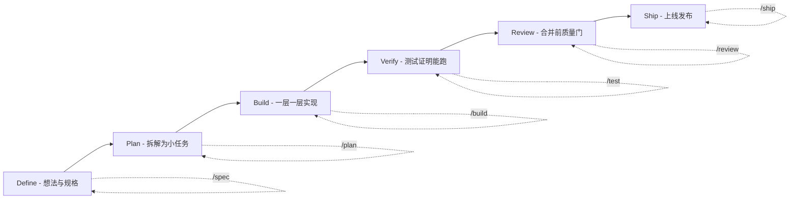

# 别再让 Agent 瞎写代码了：Addy Osmani 把"资深工程师的流程"打包成了 24 个技能

用 AI 编程的你，有没有过这种时刻：Agent 三下五除二把功能写出来了，你一看——能跑，但总觉得不对劲。它没写测试、没走你的代码规范、没过安全审查、也没跟你确认过需求是不是这个意思，而是直接走了最短路径：**给代码、能跑、完事。**

问题就在这。AI coding agent 天生默认抄近道——写规格、补测试、做 review、过安全，这些"费事但让软件可靠"的步骤，它们默认是不做的。我们刚聊完的老是"Agent 能力强不强"，其实拦着生产的，往往不是能力，是**流程纪律**。

最近有个开源项目，把这件事拔到工程层面解决了：**agent-skills**。

一句话说清楚——它是 Addy Osmani 牵头维护的一套**生产级工程技能（Production-grade engineering skills）**，把资深工程师做软件时用的那套工作流、质量门槛和最佳实践，写成 AI 编码 agent 能照着执行的规范文件。你用命令一装，Agent 就会在开发的每个阶段，都乖乖按这些流程走。

它给自己的定位扎得很实在：**"AI coding agents default to the shortest path"——AI 写代码默认抄近道，而这个项目，就是把它拽回正轨的那套约束。**

---

**一个贯穿全文的核心设计**

整个项目的主干就一句话：**用 8 条斜杠命令，把软件工程这条流水线的每个阶段，都挂上对应的工程规范。**

项目用一张很直观的图说明：DEFINE（定义）→ PLAN（规划）→ BUILD（构建）→ VERIFY（验证）→ REVIEW（评审）→ SHIP（发布），每个阶段都对应一条你随手就能敲的命令：

```text
  DEFINE          PLAN           BUILD          VERIFY         REVIEW          SHIP
 ┌──────┐      ┌──────┐      ┌──────┐      ┌──────┐      ┌──────┐      ┌──────┐
 │ Idea │ ───▶ │ Spec │ ───▶ │ Code │ ───▶ │ Test │ ───▶ │  QA  │ ───▶ │  Go  │
 │Refine│      │  PRD │      │ Impl │      │Debug │      │ Gate │      │ Live │
 └──────┘      └──────┘      └──────┘      └──────┘      └──────┘      └──────┘
  /spec          /plan          /build        /test         /review       /ship
```

这不是装饰性的流程图，每条命令背后都有明确的原则和配套技能，下面就是这 8 条命令的对应关系：

| 你在做什么 | 命令 | 核心原则 |
|---|---|---|
| 定义要做什么 | `/spec` | 先写规格，再写代码 |
| 规划怎么做 | `/plan` | 小步、原子化的任务 |
| 增量构建 | `/build` | 一次只切一片 |
| 证明它能跑 | `/test` | 测试就是证据 |
| 合并前评审 | `/review` | 提升代码健康度 |
| 审计 Web 性能 | `/webperf` | 先测量，再优化 |
| 简化代码 | `/code-simplify` | 清晰优先，别炫技 |
| 上线发布 | `/ship` | 更快反而更安全 |

这套映射的意思在于：**你不用背一套流程，只要在对应阶段敲对应命令，Agent 就会自动激活那一整套技能。**

按这个生命周期拉成图，就是一条能清楚看见的"从想法到上线"流水线：



更省一步的是 **`/build auto`**——你批准计划一次，然后它自己把规划和实现全部跑完，中间"人肉一步一步确认"省掉了。注意它省的不是验证：**每个任务依然逐条测试驱动、单独 commit，遇到失败或危险操作会停下来。** 这是"无人值守推进"和"无脑放羊"的区别。

---

**不靠命令时，技能也能自己找上门**

除了斜杠命令，技能还会**根据你正在做的事自动激活**：你设计 API，就触发 `api-and-interface-design`；你在写 UI，就触发 `frontend-ui-engineering`。Agent 不需要你说"给我用上技能"，它自己知道该叫什么。

---

**快速上手**

最快的一条路，装进 70+ 种 Agent（Claude Code、Cursor、Codex、Copilot、Cline，等等），靠的是开源的 [skills CLI](https://github.com/vercel-labs/skills)：

```bash
npx skills add addyosmani/agent-skills            # 安装全部 24 个技能
npx skills add addyosmani/agent-skills --list     # 先浏览再安装
```

或者只挑几个装：

```bash
npx skills add addyosmani/agent-skills --skill code-review-and-quality   # 合并前五维评审
npx skills add addyosmani/agent-skills --skill interview-me              # 需求盘问，一次一个问题
npx skills add addyosmani/agent-skills --skill test-driven-development   # 红-绿-重构，强制执行
```

想用原生集成也可以，项目给各家工具都写了 setup 指南。以最常用的 **Claude Code（官方推荐）** 为例：

```
/plugin marketplace add addyosmani/agent-skills
/plugin install agent-skills@addy-agent-skills
```

如果 SSH clone 时报 `git@github.com: Permission denied (publickey)`，用一个全局 Git 配置把 GitHub SSH 改写成 HTTPS 即可：

```bash
git config --global url."https://github.com/".insteadOf git@github.com:
```

**命令速查**

| 用途 | 命令 |
|---|---|
| 装全部 24 个技能 | `npx skills add addyosmani/agent-skills` |
| 浏览后再装 | `npx skills add addyosmani/agent-skills --list` |
| 只装单个技能 | `npx skills add addyosmani/agent-skills --skill <name>` |
| Claude Code 装插件 | `/plugin marketplace add addyosmani/agent-skills` 然后 `/plugin install` |

---

**技能长什么样**

每个技能都是一种**固定的结构**，不是"一段贴过去的提示词"。它按这个解剖结构组织：

- **Overview**：说明这个技能做什么
- **When to Use**：什么时候触发
- **Process**：分步骤的工作流
- **Rationalizations**：Agent 偷懒的借口 + 反驳的说辞
- **Red Flags**：哪些信号说明事情不对
- **Verification**：必须拿出的证据

它背后有四个刻意为之的设计取向，这几点我认为是整个项目最见功力：

1. **是流程，不是罗列。** Skills 是 Agent 要执行的"工作流"，不是它读的参考文档。每条都有步骤、检查点、退出条件。
2. **反合理化（Anti-rationalization）。** 每个技能都藏了一张"借口 vs 反驳对照表"：Agent 说"我之后再加测试吧"，它直接怼回去。这些其实是最反脆弱的设计——**它专门防 Agent 偷懒。**
3. **验证不可商量。** 每个技能都以"证据要求"收尾——测试过了、build 产物、运行数据。"看起来对"永远不够。
4. **渐进式披露。** `SKILL.md` 是入口，辅助的参考文件按需加载，尽量省 token。

---

**一套能复用到生产的流程库**

除了 8 条命令，这个包里装的东西比你可能以为的多很多：

- **24 个技能**：23 个按生命周期分（Define / Plan / Build / Verify / Review / Ship），外加 1 个"using-agent-skills"元技能，用来帮你判断当前该用哪个。
- **4 个预置 Agent 人设**：code-reviewer（资深 Staff 工程师视角）、test-engineer（QA 专项）、security-auditor（安全审计）、web-performance-auditor（Web 性能，跑 `/webperf`）。
- **7 张参考清单**：definition-of-done、testing-patterns、security-checklist、performance-checklist、accessibility-checklist、observability-checklist、orchestration-patterns。

这套东西不是空谈原则——它的很多硬核方法论，直接来源于 Google 的工程文化（包括 *Software Engineering at Google* 和 Google 的 engineering practices guide）。你在里面能看到：API 设计的 Hyrum's Law、起名测试法里的 Beyonce Rule 和测试金字塔、代码评审里的变更大小建议（约 100 行）与严重度分级（Nit / Optional / FYI）、代码简化里的 Chesterton's Fence、Git 工作流里的主干开发（trunk-based）、CI/CD 里的 Shift Left 和 feature flags，甚至还有一条**把代码当负债的专门技能**（deprecation）。

这些不是挂在嘴边的抽象原则，而是**直接嵌进了 Agent 执行的每一步流程里**。

---

**几个该心里有数的点**

- **它强调的是"流程纪律"，不是"能力边界"。** 它的重心是把 Agent 从"抄近道"掰回"走流程"。如果你的场景本身不需要重重质量门槛（比如一次性脚本、临时原型），这套反而可能显得重。
- **单个技能单独安装有"目录缺口"。** 用命令只装一个技能时，默认只拷贝 `skills/<name>/`，不会带仓库根下的 `references/` 目录——技能能用，但指向共享清单的路径会缺失。官方说明明确提示：要走整仓集成、clone 仓库、或把需要的清单手动拷进已装好的技能里（这个可迁移性缺口在项目的 issue #361 里跟踪）。
- **工具生态差异大。** 它支持 70+ Agent，但各家原生集成方式不同（插件、斜杠命令、清单文件……）。它走的是"哪里都能装"的路子，不要指望每个工具都给你最深的原生体验。
- **质量门槛是规范，不是强制合约。** 技能定义的是"应做到"的工作流，Agent 最终是否真的照做，仍取决于当前工具对它的遵守力度。

---

**写在最后**

我挺喜欢这套做法的立意：**不要把"资深工程师的可靠性"押在每次贴一句随缘的 prompt 上，而是把它编码成一套 Agent 每次都会走到的流程。** 当 AI 能写代码的时候，工程最缺的不是"让它更能写"，而是"让它写得稳、写对、能上线"——这正是这套技能想固化的东西。

它背后还有个很实在的坦诚：官方文档里专门有一节，拿来和 [Superpowers](https://github.com/obra/superpowers)、[Matt Pocock's skills](https://github.com/mattpocock/skills) 做对比，还贴了一个正面对决实验的链接。**做技能，但也不怕别人比，这点很 Addy。** 这套东西在 GitHub 上整体 MIT 协议开源。

如果你正被"Agent 写得快但性格太跳"折磨，不妨先把 `agent-skills` 装进你顺手的工具，从最常用的 `/build` + `/test` 开始，让流程替你兜底。

https://github.com/addyosmani/agent-skills/blob/main

#AgentSkills #AI编程 #CodingAgent #Skills #工程实践 #AddyOsmani #Codex #ClaudeCode #TDD #开源 #MIT