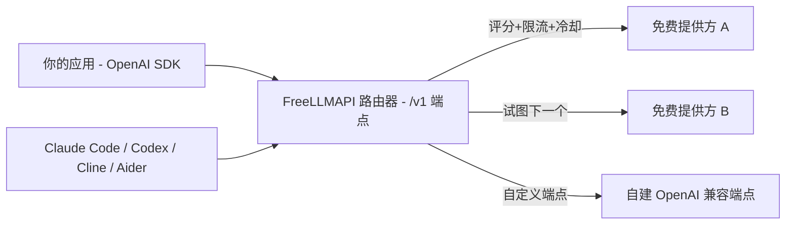

# 别再为 34 套 SDK 手写限流了：一个接口把几十家免费大模型额度叠成一座池子

做 AI 应用的应该都懂这个画面：各家实验室想让你先用起来，都甩了一份免费额度——这里每月几百万词元，那里每天几千次请求。单独拎出来任何一份，都只够"做个玩具"。

真正的麻烦在叠加。今天你想同时吃下 Google、Mistral、Groq 几家免费池，就得面对三十多套不同的 SDK、三十多种不同的限流规则，以及三十多个可能半夜悄悄挂掉的请求点。额度还没用爽，先被接口兼容性磨掉半条命。

最近有人把这个破事做成了一个聚合器，叫 **FreeLLMAPI**。一句话：它把几十家提供方的免费额度，连同你自己搭的任何 OpenAI 兼容的聊天、嵌入、图像、音频端点，一起收进**单个 `/v1` API** 后面。你的应用从头到尾只认一个地址、一把密钥，剩下谁来干活，路由器替你选。

---

把它想成一个免费额度界的"统一插排"：你不再为每台设备单独配充电器。

它的定位很朴素：**在本地自托管一个 OpenAI 兼容网关，自动把请求路由到当前可用、且没超限的免费模型上，让几十家的免费额度真正累加成一座可用的推理池。**

对个人开发者、原型期产品、以及想拿免费额度撑起日常自动化脚本的人来说，这是真能省钱的方案——前提是你接受它免费额度自带的那些脾气。

---

**核心亮点**，挨个说：

**1. 一个统一端点，覆盖 OpenAI 的全套接口。** 从 `/v1/chat/completions`、`/v1/responses`（Codex CLI 要用它）、`/v1/completions`（编辑器的幽灵补全），到 `/v1/images/generations`、`/v1/audio/speech`、`/v1/embeddings` 和 `/v1/models`，流式与非流式都齐。意思是：你现成的 OpenAI SDK 代码，只改一个 base_url 就能全切过来，不用为不同平台各写一套调用。

2. **Anthropic 的坑它也填了。** 它在同一套路由上还讲 `/v1/messages` 协议，所以 Claude Code 和官方 Anthropic SDK 可以直接跑在你的免费池上。走写代码 agent 的人，这一点挺戳。

3. **智能路由，六种策略。** 路由器给每个模型实时打速度、能力、稳定性评分，据此排链路顺序；遇到 429 或 5xx 自动切到下一个模型，还带冷却和密钥轮换。你不需要自己"竞猜哪家现在还能用"。

4. **按密钥的限流跟踪。** 它以 `(平台, 模型, 密钥)` 为粒度维护 RPM/RPD/TPM/TPD 计数器，主动去学各家公布的上限，"始终不越线"才算把免费额度维持在安全带里。

5. **Fusion 多模型合成。** 你甚至可以请求一个虚拟模型 `fusion`——路由器把你的提示词并行分发到一组风格各异的免费模型，再让一个评审模型把草稿合成出一个答案。想要"多模型投票"而不想自己写编排，这条路是现成的。

6. **密钥加密，对外只有一把令牌。** 提供方密钥用 AES-256-GCM 加密存在 SQLite 里，每次请求时在内存中解密；你的应用从头到尾只看得到一个统一的 `freellmapi-…` bearer 令牌。自己家钥匙自己收着，不在你的代码里到处撒。

7. **自更新的模型目录。** 路由器每天两次从官方目录同步经过 Ed25519 验签的模型清单：新模型上线、额度被收紧、提供方把协议改坏了，自动生效，不用 `git pull`。免费额度格局每周都在变，有它盯着，省一大部分手工。

8. **主流 CLI 和编程智能体大多一条命令配好。** Claude Code、Codex CLI、Cline、Continue、Aider、Cursor、Qwen Code、Goose……大多数用 `npx freellmapi setup-xxx` 一键生成配置，还会先备份原有配置、绝不覆盖你已写好的内容。

**划个边界**，免得你期待错：上面这些"能跑在免费池上"的能力，得先有可用的免费模型在前端。文档也明说了——**没有前沿模型、延迟不稳定、没有 SLA**。免费的毕竟只是免费的，到一天后半段，好用的顶级模型陆续撞上当日上限，这个端点的"整体智能水平"会明显下滑，到 UTC 午夜才重置。

---

光看不错，得跑起来才算数。最快的路径是一条命令（需要 Docker）。**它会建好 `~/freellmapi`、生成加密密钥、拉取镜像并启动容器**：

```bash
curl -fsSL https://freellmapi.co/install.sh | bash
```

不放心把脚本直接管道给 bash？可以去 freellmapi.co 把 install.sh 读一遍再跑。这条命令重复执行是安全的：你的 `.env`（以及加密密钥）会被保留，容器会更新到 `:latest`。

装完打开 http://localhost:3001 ，到"密钥"页把各家提供方的密钥填进去，按喜好调一调"回退链"的顺序，再从"密钥"页顶部拿到那把统一 API key。**这个统一 key，就是你的 OpenAI SDK 要指向的东西。**

在 Windows 上最省事的是直接去 Releases 下 `.exe` 安装包；这套东西"能跑 Node 20+ 的地方都能跑"，macOS、Linux 服务器、哪怕树莓派那种 ARM 小单板都没问题，PM2 / systemd 下空闲常驻内存约 40 MB。

**命令速查**，我把关键几步归拢成一张表：

| 阶段 | 命令 | 用途 |
| --- | --- | --- |
| 安装启动 | `curl -fsSL https://freellmapi.co/install.sh \| bash` | 建目录、生成密钥、拉镜像启动容器 |
| 访问面板 | 打开 `http://localhost:3001` | 管理密钥、调整回退链、拿统一 API key |
| 配 Claude Code | `npx freellmapi setup-claude --url http://localhost:3001 --api-key <统一密钥>` | 按服务器实际可用模型自动生成配置 |
| 配 Codex | `npx freellmapi setup-codex` | 同上，面向 Codex CLI |
| 零留存启动 | `npx freellmapi launch` / `npx freellmapi launch-codex` | 只把凭据注入子进程，不写进配置文件 |

最关键的几条复制用：

```bash
# 配 Claude Code（示例）
npx freellmapi setup-claude --url http://localhost:3001 --api-key <统一密钥>
# 配 Codex CLI
npx freellmapi setup-codex
# 零留存启动器，凭据不进配置文件
npx freellmapi launch
```

每个生成器都支持 `--dry-run`，改动文件前还会创建带时间戳备份，是合并进你的用户配置而不是覆盖。

**Python 调用的样子**，跟平时用 OpenAI 库几乎没差别，只是 base_url 换成本地地址：

```python
from openai import OpenAI

client = OpenAI(
    base_url="http://localhost:3001/v1",
    api_key="freellmapi-your-unified-key",
)

resp = client.chat.completions.create(
    model="auto",  # 交给路由器挑选；也可以用 "auto:fast"、"auto:smart"、某个配置档，或具体的模型 id
    messages=[{"role": "user", "content": "用一句话概括罗马的衰亡。"}],
)
print(resp.choices[0].message.content)
print("Routed via:", resp.headers.get("x-routed-via"))
```

注意 `model="auto"` 这个用法：交给路由器挑。你还能指定 `auto:fast`、`auto:smart`、某个具名的回退链配置档，或直接给具体模型 id。每个响应都带一个 `X-Routed-Via: <平台>/<模型>` 头，一眼就能看出实际是哪家帮你处理的。

---

这套"一个网关聚合多家模型"的形态，就跟你网购找代购一个道理。我画一张它做的事的示意图（名词都来自文档，是抽象关系，不代表内置模块结构）：



一句话说清：你的应用和智能体，都只对接一个 `/v1`，路由器拿着你的统一令牌，在几家免费源之间按健康度和限流情况反复横跳。

---

最后聊点大实话。

我本人还没实际部署这套（这篇文章完稿时它还没跑在我本机上），所以下面这些都基于文档来的判断，你先当参考。

**顺手的地方**很明显：如果你想当白嫖党把各家免费额度用满，它真的能省掉"为 34 家各写一套适配"的体力活，还能自动避让限流、自动跟上免费额度每周的变化。对实验型产品、本地自动化脚本、以及想低成本试各种模型特性的人来说，性价比是真的高。

**会卡的地方**也真实：免费池没有前沿模型，延迟看上游脸色，没有 SLA。你要是拿它搭正经对外产品，作者自己也白纸黑字写了——"不适用于生产环境，做真产品之前请换付费 API"。对的，这不是钱的问题，是稳定性问题。

**提气的一点**：它对 34 家提供方、474 个模型系列、635 个免费端点（584 个聊天）的"型号切换"，是文档宣称的能力，实际覆盖度以它的实时目录为准。另外 Premium 实时目录是年 $19 的付费订阅（路由器本体永久 MIT 免费）——这条只是让目录更新得更实时，顺带自负它的日常测试成本，介意就跳过，免费档也够用。

如果你正被"免费额度各家薅不动"卡着，先去 freellmapi.co 或 GitHub 仓库把 docs 翻一遍，重点看架构里的**限制清单**和**术语审查**，再决定要不要接。工具是好工具，只是别把"免费"脑补成"没成本"。

#LLM #开源 #AI应用 #免费模型 #API网关 #OpenAI兼容 #模型路由 #自托管 #开发工具