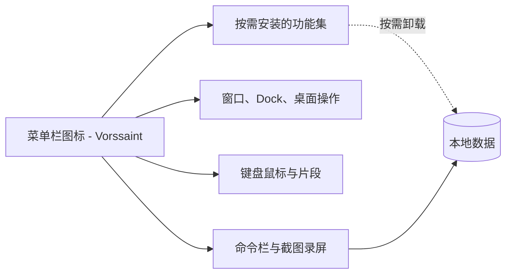

# 一个菜单栏图标，顶掉十二个收费 Mac 工具：这开源免费的“工具箱”把桌面管家一网打尽

用 Mac 的人应该都有同款烦恼：光是让这台机器“顺手”，就能攒下一排收费小工具——单个 App 的音量单独调要一个，看 CPU、温度要一个，更好的 App 切换器和 Dock 预览要一个，剪贴板历史和文字片段又要一个……每一个功能都不大，但每一个基本都要掏钱，还要一个账号、一个订阅、一个常在后台种着的进程。装多了，菜单栏挤得快没地方放。

真正烦的是这些工具互不相通，还各有各的隐私口径和收费姿势。你为了一个几十块的功能，可能得让一个“全家桶”应用抓走你桌面的一堆权限。

最近 GitHub 有个项目把这件事反着做了一遍——**Vorssaint**。一句话：**让它一个菜单栏图标，干以前要买十几个 Mac 应用才干得完的活；免费、开源、全部在你 Mac 本地跑。** 没有账号、没有遥测、没有订阅，还由你自己按需装功能，想装几个就装几个。

---

我先是手动装过三四个这样的小工具，再回头看这套“一个图标扛一堆活”的思路，是挺服气的。

**它定位很干脆**：一台 Mac 桌面上那些“花里胡哨但都只做一件事”的小工具，被并进一个菜单栏图标统一管理——能装能卸、按需使用、全本地、无账号。对 Apple Silicon 上的 macOS 用户，尤其是不想为琐碎功能重复付费、又在意隐私的人来说，这思路很戳。

它一出生就热：从第一次提交到冲上 GitHub trending 前排，只花了三天，还登过 Swift 语言的日榜。

---

这些功能里我挑几条最戳的，**核心亮点**一条条说：

**1. 按需安装，只装你用的。** 没人需要全部功能，它把这一点做成了地基：功能可以在设置里整块装、整块卸；卸掉了它整个就从这个应用里消失，不占 CPU、不吃电。首次安装给了三款一键包——**Essentials、Windows、Battery 和 quiet**，外加一个可视化勾选器。只勾你要的，只弹你需要的权限，之后在设置里随时能改。这跟“全家桶强制塞满”的红线划得非常开。

2. **音量和音频那一摊，单独一个面板就扛住了。** 按应用单独调音量、把某款音量太低的拉到 100% 以上、同时让系统声走扬声器、通话走耳机、一键切输出、插拔耳机自动降音量、一键静音所有麦克风，还能挡掉“插上耳机、音乐 App 突然炸响”那个怪毛病。**不用装音频驱动、不用设置**——这一条就值回一个专门音量工具的订阅。

3. **窗口与 Dock 那一套也齐活了。** 更高级的 ⌘Tab 应用切换器（带实时缩略图、能显示缩到最小的窗口、一个 App 可多窗口）、窗口切分快照到二分之一、三分之一、六分之一、角落或居中、最大化、拖拽吸附、Dock 悬停预览、Dock 点击可最小化或隐藏或循环窗口。还有“关闭即退出”——你设定的 App，关掉最后一个窗口就自动退了。这些单独挑出来，每一个都能报到价。

4. **键盘鼠标的大杂烩，一样没落下。** 文本片段（打几个字自动扩成整段，还能带剪贴板变量和日期时间）、滚动平滑、鼠标滚轮方向单独反、侧键变成真正的前进后退、任意额外键绑定组合键、三指当鼠标中键、“Caps Lock 变身超级修饰键”、键盘去抖，还能对“自家用鼠标驱动的 3D 和设计软件”单独点名让工具空跑不打扰。

5. **Command Bar 是整个工作台的“大脑”。** 一个快捷键唤起一个浮层，你可以跑到任何 Vorssaint 操作、开应用、抓 emoji、从剪贴板历史贴内容；甚至能钻进正在用的 App 里调它的菜单命令。输入算式、单位换算、日期，和关于你 Mac 的提问它都会自动算、自动答；保存的快捷键还能跑本地脚本，输出就显示在浮层里。想搜文件就在指定文件夹里翻，不带自己建索引、也不越界。⌘K 能对某个 App 退出、重启、强退或扔进卸载器，还能改名、置顶、隐藏、配自定义快捷键。它偷偷记住你常用的，又把你每敲进去的全清掉。

6. **能贴、能录、能抠、能吸色的截图套件。** 框选、窗口、全屏截图、长页面滚屏拼接、连音轨的屏幕录制（音画两轨可分离）、编辑器里加贴纸、标注、裁剪、打码、背景。还能**直接从屏幕识别文字**——离线识别直接进剪贴板，认到二维码直接显示内容可复制。连颜色都能抓成 HEX、RGB、HSL、SwiftUI 代码。

7. **隐私默认就是来真的。** 它默认就是**本地优先、无账号、无分析、无跟踪**。网络只在你能一眼看到的东西上出现：更新检查、测速、Homebrew 操作、临时截图或录屏分享链接、你主动发出去的反馈。每个权限都可选、都用大白话讲清楚是干嘛的、列出到底哪个功能在用，甚至能告诉你“你给的某个权限其实已经没有用了”，附一个撤回按钮。

清理器、卸载器（连残留一起拖进废纸篓）、Homebrew 管理器、媒体压缩转 GIF、自动清剪贴板、清理链接去追踪参数、磁盘镜像一键装、保持唤醒、增强 XDR 亮度、睡眠自动断蓝牙……还剩一摞，我留给你自己去 Features 页翻。

---

**两个门槛先说清**：它只支持 **Apple Silicon 的 Mac，macOS 14 Sonoma 或更新**。Intel 老机器和更早的系统，就只能另寻门路了。另外它是 **GPL 3.0 或更新**的开源许可，但“Vorssaint”这个名字、图标和外观走了 **TRADEMARKS** 那套——代码你可以 fork，身份不能顶着用。

**安装**，两条路最省事。一条用 **Homebrew**：

```sh
brew install --cask vorssaint
```

另一条是去 GitHub 的 Releases 页面下载磁盘镜像，把 Vorssaint 拖进 Applications。构建用 Apple Developer ID 签名并经过公证，macOS 打开没有那些碍眼的警告，权限也经得起版本更新。

**卸载**，也给你留了口子：

```sh
brew uninstall --cask vorssaint
```

想把设置和权限一起清干净，再跑一条：

```sh
./Tools/uninstall.sh
```

**从源码自己编译**也可以：

```sh
git clone https://github.com/vorssaintapp/vorssaint-utils.git
cd vorssaint-utils
./build.sh            # compile, generate the icon, assemble the signed bundle
./build.sh --install  # the same, then install into Applications and launch
```

只有 Xcode Command Line Tools 这一个前置依赖。官方构建只来自维护者本人。

**权限与“没它会怎样”**，给你一张速览：

| 权限 | 给谁用 | 不给它呢 |
| --- | --- | --- |
| 辅助功能 | 切换器、Dock 功能、窗口控制、鼠标键盘、片段、剪切粘贴 | 这些功能都停用 |
| 屏幕录制 | 窗口预览、截图、屏幕文字识别、屏幕录制 | 这些捕获都不可用 |
| 系统音频录制 | 按应用音量、输出路由 | 应用回到普通系统音频 |
| 麦克风 | 录屏里可选的音轨 | 录屏继续但不带你的声音 |
| 通知 | Keep awake、电池、监控、更新告警 | 应用保持安静 |
| 完全磁盘访问 | 可选，更深层的清理与卸载扫描 | 只扫得到的地方 |
| 管理员 | 可选，关盖点亮免密码 | 每次开关要弹密码框 |

文件柜和大部分快捷开关，**一丁点权限都不用**；Finder 剪切粘贴、卸载器、清废纸篓、Homebrew 交接这几类，第一次碰到 Finder 或 Terminal 时会问一次“自动化”授权。

---

**这套“一个聚合的本地工具箱”结构上到底是什么形态**，我画一张抽象图帮你记（名词都来自文档，是逻辑关系，不代表官方代码划分）：



几个功能集合在同一个菜单栏图标下被调度、又都能整块卸载，这就是它能“一个打十二个”的结构底子。

---

最后，回到我的真实观感，也带上文档没直说的判断。

**最值得的**，其实不是功能多，而是它的**本地优先和按需裁剪**。剪贴板、屏幕录制、声音路由本来就是敏感数据，一个“默认不上云、权限讲得清、每块都能整块卸”的工具，在信任账上是站得住的。对总被付费小工具烦、又在意隐私的人来说，这类东西“知道了会很安心”。

**先说好别踩**：系统要求卡得很硬，Intel 老本正被请走，Apple Silicon + macOS 14 的门得先过；功能它确实多到“多”的程度，Command 那个入口和自带快捷键体系有学习坡度，刚入手得适应一阵子；还有它是 GPL-3.0，你要是想在商业产品里再发布或改，得先把你能承受的义务搞清楚。

最后我的建议很朴素：**别一上来装全套。** 用“只钩你正缺的三五个”，比如音量面板、Command Bar、剪贴板历史、清理器，先让它在菜单栏“少捣乱多干活”地跑两周，自己记账看值不值。它免费、本地、无订阅，坏不了的，剩的本就归你时间决定。

#macOS #开源软件 #免费工具 #效率工具 #应用推荐 #AppleSilicon #隐私保护 #系统监控