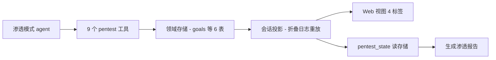

# 让 AI 代打渗透测试：目标、线索、漏洞全被记进一张可回溯的图

做安全工作这几年，最烦的事不是"工具不够"，而是"过程没留下痕迹"。

尤其是让 AI 参与测试的时候，最怕它一顿操作猛如虎、最后却没法回答"你到底测了哪几个目标、得出什么结论、依据是什么"。模型跑完能给你一段总结，可你想复盘、想把某条发现追回到它最初那个思路入口，往往就断了。审计、交接、和写报告，全指望那点不可追溯的对话推断。

最近看到 DeepSeek Harness（dsh）生态里出来一个插件，专治这个问题——**dsh-pentest**。一句话：**授权范围内，让 agent 以"记录目标 → 探索线索 → 验证结果 → 沉淀资产与漏洞"的方式做渗透测试，并在 Web 界面里把探索链路、漏洞、资产、报告一并呈现成可追溯的图。**

它不是又一个"把安全工具丢给大模型"的花活，而是把一次渗透测试真正做成**可复现、可留痕、可交接的工程流程**。

---

它的核心是"让每一步都有记录、每个结论都能追到源头"。定位很简单：**在授权范围内，你的 agent 变成一台渗透测试助手机器——每探一个方向、每验证一个问题、每发现一个漏洞或资产，都被有序记下来，形成一张"边就是关系"的探索图。**

对做安全测试、安全工程师、或者想给自家 agent 套一层"有闭环、有产出"测试能力的人来说，这是把"AI 先测一发看结果"升级成"AI 留下的每一步都能被审计与被复核"的开关。

**再强调一遍授权这条底线**：这份说明里从头到尾都写死了一句话——**只在授权范围内测试**。它 `pentest_add_goal` 工具里专门有个 `authorization` 参数，用来填写授权对象和书面许可引用，并写进状态与最终报告留痕。**但那只是审计事实、不是放行开关**——真正的扫描与利用动作，仍然受你部署环境的沙箱和审批机制约束。它把"资质留痕"做进了工具，但**"能否行动"的闸门不在它手里**。

---

**核心亮点**，挑几条最值得一看的：

**1. 六张表就把一次渗透的结构钉死了。** 它的领域模型用 `goals / intents / facts / findings / assets / edges` 六张表建模：目标、意图、事实、发现、资产、边。边扮演"链路词汇"——`spawns`（goal→intent）、`yields`（intent→fact）、`derived_from`（fact→intent）、`proves`（intent→finding），资产用 `parent` 表达父子关系；而每个 finding 必须带 `reproducibleSteps`（至少一条）。意思是你得出"这个洞存在"的结论，必须有**可复现步骤**兜底，不许只丢一句断言。

2. **工具齐全，还给你"能自指"的确定性 id。** 它暴露 9 个工具：`pentest_add_goal`（重置整图）、`pentest_add_intent`（一个意图只能挂一个锚点）、`pentest_add_fact`、`pentest_add_finding`（步骤必填，还能关联"影响资产"）、`pentest_add_asset`（可选父资产）、`pentest_submit`（让子 agent 直接写父意图）、`pentest_state`、`pentest_graph`、`pentest_report`。节点和边的 id 都是 `<kind>-<n>`，按会话计数、goal 重置后归零——工具返回 id 让模型跨调用引用，整个会话投影能从日志纯重放同一张图，不会错位。

3. **Web 视图把"过程"变成"可操作界面"。** 会话里自动注册一个渗透标签页，四个子标签：**探索链路**（用 `@xyflow/react` 画成图，边带关系胶囊：意图链 / 产出 / 推导自 / 证实）、**漏洞**（严重度、描述、可复现步骤、影响资产）、**资产**（列表 / 图两种模式）、**报告**（Markdown 渲染，可复制可保存）。你不只是在聊天记录里翻结论，而是有一张"长什么样"的图可看。

4. **"会话投影"从日志里纯重放同一张图。** 每次把 `pentest_*` 调用折叠成一个 `{ goal, nodes, assets, edges, counts }` 的视角，还自带"引用拒绝机制"防止边引用不存在的节点。上限各 200——这是"窗口视图"，窗口以外最旧的被逐出、悬挂的边会同步清理。它体贴的是"你能在窗口里看清最近这 200 个，别爆掉浏览器"。

5. **协议和交互规则也把规矩立住了。** 系统提示词里有一段 `pentest:protocol`，强制"沿链路推进、子 agent 通过 `pentest_submit` 直接写父意图、资产先父后子、与用户交互一律中文"。这等于你把"怎么做一次规范安全的渗透测试"的规矩写死在 agent 的默认行为里，而不是每次口头叮嘱。

**边界也说清楚**：它是按**单会话作用域**记的——没有跨会话 / 跨项目的续跑；你要开始一段新的 engagement，得重新 `pentest_add_goal`。运行它需要 Node.js **≥ 22.5** 的宿主运行时。

---

**装上很简单**，两条命令都能用。第一条直接挂 release 包：

```
dsh plugin --profile web add https://github.com/howmp/dsh-pentest/releases/latest/download/dsh-pentest.tar.gz
```

要么下载下来、从本地文件装：

```
dsh plugin --profile web add file:C:\path\to\dsh-pentest.tar.gz
```

装完**重启 dsh**，再新建一个会话，选择自动注册的「渗透模式」就开测。

**速查表**，把核心要点压缩成一张：

| 维度 | 要点 | 阅读门槛 |
| --- | --- | --- |
| 领域模型 | 6 张表 goals / intents / facts / findings / assets / edges | 边即关系词汇 |
| 核心工具 | 9 个 `pentest_*` | 提交 / 加目标 / 加事实 / 加发现 / 加资产 / 查状态 |
| 链路词汇 | spawns / yields / derived_from / proves / parent | 节点间怎么连 |
| Web 视图 | 探索链路 / 漏洞 / 资产 / 报告 四个标签 | @xyflow 图可平移缩放 |
| 会话投影 | 从日志重放同一张图，各上限 200 | 窗口视图不是全文 |
| 边界 | 单会话作用域、授权是审计事实不是门禁 | Node ≥ 22.5 |

它给整个流程画的协作关系，我用一张抽象图表达（名词都来自文档，逻辑关系，不代表真实代码模块）：



一句话收束：你的 agent 在前面攻、六张表在后头记、Web 四个标签在你面前摆出来——它把"做过什么"从黑箱变成增量可追溯的产物。

---

最后说实在的，**这块我还没真刀真枪地跑过**（完稿时它还没在我自己的 dsh 环境里出过一轮正式渗透），所以以下一半是文档推导、一半是我对这类工具的一贯判断，你当参考。

**值得装的原因**就一条：它把"agent 测完跟你说结果"升级成"agent 每一步都有留痕 + 可复现步骤 + 图给你看链路"。做安全审计和写报告的人，最缺的就是这种"可回溯"，它补上了你自身最空的一个环节。

**也要想清楚**这几点：它只是 **agent 的流程编排**，不是一键就打进一切的"终极渗透工具"——真正的扫描和利用能力来自你部署环境的沙箱与授权链；它的会话是本次 scope，长跑一个项目得常 `pentest_add_goal` 重开；Web 图是"窗口视图"，看到的是最近 200 条，想看完整记录得走 `pentest_state` / `pentest_report`。

**最该记住的红线**还是那个：**授权**。它把"审计事实"做得很到位，但"能不能动"永远不是在插件里勾出来的。决定你要去测一台机器的，应当先是那台机器主人的书面许可，再是这套工具本身做出来的留痕。

反正，怎么想装直接用 Release 包一键进，测完 `pentest_report` 出一份可留档的产出——至于要测谁、得到谁的允准，那是你动手之前就该想清楚的事。

[dsh-pentest/README.md at master · howmp/dsh-pentest · GitHub](https://github.com/howmp/dsh-pentest/blob/master/README.md)

#渗透测试 #安全测试 #AIagent #DeepSeekHarness #信息安全 #开源 #Web安全 #安全工具