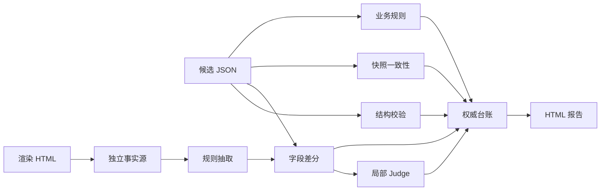

# 别再让大模型给自己判卷：一个结构化报告验证器的完整落地复盘

一份长报告经过大模型抽取，最后变成了一份字段整齐的 JSON。页面能打开，JSON 能解析，几十个字段看上去也都像那么回事。

麻烦恰恰藏在「像那么回事」里。

某个页面区域明明显示正常，结构化结果却把它塞进了异常列表；某个金额只差一个千分位格式，普通字符串比较又会把正确结果打成失败。若再把整份原文和 JSON 扔给另一个大模型，问一句「抽得对不对」，模型很容易顺着候选答案点头。最后得到一张排版漂亮的报告，错误还安安稳稳躺在里面，甚至多了一段语气笃定的解释。

这个项目就是从这种尴尬局面开始的：没有现成人工黄金集，页面模板相对固定，又需要把长报告到结构化 JSON 的质量检查做成可重复执行、能定位字段、能回看证据的工程流程。

我把项目里的方案文档、源代码、测试、历史验证记录和最新台账重新过了一遍。它的价值落在如何使用 LLM Judge：先用确定性代码划清边界，再把 Judge 关进一个很小的笼子里，只处理已经发现的局部分歧。任何模型意见都不能抹掉原文已经证明的失败。

先放 10 个标题候选，方便发布时按读者群调整：

1. 别再让大模型给自己判卷：一个结构化报告验证器的完整落地复盘
2. 没有黄金集，怎么验证大模型抽出来的 JSON？
3. 从一条错字段到 37 条测试：结构化抽取质量是这样兜住的
4. JSON 看着都对，原文却不是：一次差分测试落地实录
5. LLM Judge 最容易踩的坑，是让它判断整份结果对不对
6. 一份 HTML、两条证据链、四层校验：结构化抽取如何做回归
7. 不靠人工标 50 份数据，也能开始验证结构化抽取
8. 把大模型请出硬规则区：报告抽取验证器的工程取舍
9. 从文本快照到独立 HTML：一次验证事实源的纠偏过程
10. 测试报告不能只写失败：还要告诉开发该去哪里修

## 这次到底解决了什么

一句话概括：这是一个面向固定模板报告的离线验证器，它从独立保存的渲染 HTML 恢复可确认事实，再与开发产出的结构化 JSON 做字段级差分，同时检查 JSON 契约、跨字段关系、开发快照漂移，并让 LLM 只仲裁残余差异。

它没有给抽取结果算一个玄学分数，整套实现围绕四个更具体的问题展开。

第一，错误要能落到 JSON Path。开发需要看到 `$.某字段` 多了什么、少了什么、期望来自哪里，而非一句「语义一致性较差」。

第二，格式差异不能制造噪声。季度写成中文格式或规范格式、金额带不带千分位，只要业务值相同就应通过；正常与异常、多一项与少一项，则必须留下稳定差分。

第三，事实源要独立。候选 JSON 里的 `lines` 和 `raw_text` 仍来自开发链路，只能证明内部是否自洽。浏览器保存的完整渲染 HTML 才承担外部正确性主链。

第四，证据不足要老实标记。图片没有文字和替代文本、DOM 出现未知样式、规则尚未覆盖字段时，结果进入 `not_evaluated` 覆盖边界，不能因为「没发现差分」就算通过。

这几个边界让报告的结论变得克制：它能保证已覆盖、可读取证据范围内的结果可复现、可归因；它不能承诺未知模板、纯图片字段或全部长尾语义已经达到 100% 正确。

## 方案是怎么一步步确认的

项目里没有可用的 Git 提交历史，但保留了四组 OpenSpec 归档和对应的任务验证记录，方案演进反而很清楚。

最初确认了两个前提：手里没有大量人工黄金集，也不准备先花很长时间标一批；页面来源单一，模板相对固定。基于这两个条件，方案选择了差分测试。相同报告走两条错误模式不同的路径，一条是待测抽取链，一条是确定性规则抽取链，最后逐字段比较。

第一版先吃候选 JSON 自带的 `lines`，没有时回退到 `raw_text`。这一版落了结构校验、规则抽取、类型感知比较和稳定退出码。它很快抓到了一个真实问题：页面状态为正常，候选异常集合却多出了一项。与此同时，方案文档也把缺陷写得很坦白——文本快照和结构字段装在同一份开发 JSON 里，独立性不够强。

第二轮补齐了证据回溯、跨字段业务规则、局部 Judge 和统一台账。Judge 的输入不再是整份报告，只拿单个差分、局部原文、候选值和规则值；输出必须是固定 JSON，引用还要回到原文里做程序化命中。服务失败、JSON 解析失败、引用找不到或置信度类型不合法，全部记录为 `error`，没有「出错就先算通过」的后门。

第三轮修正事实源。线上页面属于 SPA，接口又无法稳定重放，于是没有继续堆浏览器自动化，而是接受浏览器保存的完整渲染 HTML。BeautifulSoup 直接解析 `#reportRef` 下的可见 DOM，忽略脚本和样式节点，再把页面中可确定的状态恢复成规则抽取器认识的文本。它不依赖在线链接、浏览器版本或登录态，快照也能长期留存。

第四轮增加双链完整性。HTML 主链回答「候选是否符合外部页面事实」；`lines/raw_text` 辅链回答「开发自己的文本快照与结构字段是否一致」；`lines` 和 `raw_text` 还要互相比一次，检查两份快照有没有漂移。同一个字段若在主链与辅链都失败，报告会说明这是同一个缺陷的两条证据，不把它虚增成两个业务问题。

整个确认过程可以压缩成下面这张表。

| 阶段 | 当时要解决的问题 | 采用的方案 | 留下的边界 |
| --- | --- | --- | --- |
| 结构与差分 | JSON 能解析，但字段可能缺失、错值或多值 | 手写契约校验、规则抽取、类型感知 diff | 开发文本快照独立性不足 |
| 证据与台账 | 失败缺少原文和可读报告 | evidence 回溯、业务规则、权威 `run.json` | 真实样本仍少 |
| HTML 事实源 | 开发快照可能与页面一起错 | 解析保存后的渲染 DOM，记录来源哈希 | 图片字段无法从文字确认 |
| 双链一致性 | 开发快照与结构 JSON 可能漂移 | HTML 主链、快照辅链、双快照互比 | 未知模板仍需失败关闭 |
| 可执行报告 | 错误码能看懂，但修复责任不清 | 根因、影响、排查、修复和复测步骤 | 建议不能替代开发侧定位 |

## 项目结构：每个文件到底负责什么

公开稿把业务包名换成了 `report_validator`，目录关系与真实项目一致。项目刻意保持了一个小型 Python 包，没有工作流引擎，也没有为了「以后可能扩展」先搭一堆抽象层。

```text
report-validator/
├── data/<case-name>/
│   ├── source.html          # 保存后的完整渲染页面，外部事实源
│   └── extracted.json       # 开发抽取候选与内部文本快照
├── artifacts/<case-name>/<run-id>/
│   ├── run.json             # 权威机器台账
│   └── report.html          # 从台账派生的可视化报告
├── src/report_validator/
│   ├── cli.py               # 编排入口、退出码与报告生成
│   ├── html_source.py       # DOM 文本和显式状态恢复
│   ├── extractor.py         # 确定性规则抽取
│   ├── schema.py            # 必填、类型与枚举契约
│   ├── diff.py              # 类型感知字段差分和覆盖边界
│   ├── evidence.py          # 原文引用回溯
│   ├── consistency.py       # lines 与 raw_text 辅链检查
│   ├── rules.py             # 跨字段业务约束
│   ├── judge.py             # 差分限定的 LLM 仲裁
│   └── ledger.py            # 统一台账模型
├── tests/                   # 九组模块与集成测试
├── openspec/                # 方案、设计、任务与行为契约
├── README.md
├── VALIDATION_RULES.md
├── pyproject.toml
├── uv.lock
└── run.sh                   # 单样本一键运行入口
```

代码图里识别出的两条主流程是 `main` 和 `validate_file`。`main` 负责完整命令行与产物生成，`validate_file` 保留了默认离线调用；核心编排集中在 `evaluate_with_ledger`，没有把同一套判断复制到脚本、CLI 和报告里各写一遍。



这里有个很实用的取舍：HTML 报告从 `run.json` 派生，历史报告不手工修。机器台账负责保存原始差分、证据、Judge 状态和覆盖边界；renderer 只负责把这些事实排成测试人员能读的页面。报告想改样式或补一段修复指南，就改台账生成或共享 renderer，再重新生成，避免 HTML 慢慢变成无法追溯的「最终版_final_真的最终版」。

## 具体实现：硬规则先把地基打实

看下编排入口的脱敏等价片段。真实代码做的事情很直白：读取候选，按需替换为 HTML 事实源，依次执行结构、差分、快照、业务和 Judge，最后一次性组装台账。

```python
candidate = load_json(input_path)
document = replace_with_html_source(candidate, html_source)

structure_issues = validate_structure(candidate)
rule_document = extract_expected(document)
differences = compare_supported(document, rule_document)
snapshot_result = evaluate_embedded_consistency(candidate)
business_issues = validate_business_rules(document)

judge_results = (
    judge_differences(document, differences, judge_client)
    if judge_client is not None and differences
    else []
)

ledger = build_ledger(
    structure_issues=structure_issues,
    differences=differences,
    snapshot_result=snapshot_result,
    business_issues=business_issues,
    judge_results=judge_results,
)
```

Judge 的调用门是 `judge_client is not None and differences`。确定性差分为空时不调用模型，快照辅链的差分也不会送去仲裁。模型调用量随真实分歧数量增长，不会跟着全文字段数膨胀；模型也没有机会把硬规则已经判定的失败改写成通过。

字段比较也没有追求一个万能的「语义相似度」。项目只登记当前能明确解释的等价变换：季度格式归一、金额去除货币符号和千分位、文本只消除排版空白、区域集合忽略顺序但拒绝重复。未知转换不猜。

```python
def equivalent(path, candidate_value, rule_value):
    if path.endswith(".period"):
        return normalize_period(candidate_value) == normalize_period(rule_value)
    if path.endswith(".estimated_amount"):
        return normalize_amount(candidate_value) == normalize_amount(rule_value)
    return normalize_text(candidate_value) == normalize_text(rule_value)
```

这种写法看着没有模型炫，但很适合调试。某个字段为什么通过、用了哪条归一化、哪里需要新增规则，开发能顺着函数直接找到。若把所有比较都交给语义模型，同一个失败可能今天 0.8、明天 0.6，排查时只能对着概率发呆。

HTML 适配同样采取失败关闭。它要求渲染正文根节点存在，只抽可见文本；页面中的状态样式只有精确命中已登记契约才映射成业务状态，未知颜色或渐变直接跳过，落入覆盖边界。这个策略会牺牲一部分覆盖率，却避免把视觉猜测包装成确定性事实。

Judge 契约更严格。它只能返回 `correct`、`wrong`、`missing`、`unsupported` 四种 verdict；`confidence` 必须是 0 到 1 的数字；`evidence_quote` 必须逐字存在于事实源。候选缺乏原文支持时，Judge 不能返回 `correct`；Judge 给出的正确值若和确定性规则值冲突，结果也会变成 `error`。

```python
if verdict not in ALLOWED_VERDICTS:
    raise ValueError("invalid_verdict")
if normalized_text(evidence_quote) not in normalized_text(source):
    raise ValueError("evidence_not_found")
if verdict == "correct" and not trace.candidate_supported:
    raise ValueError("verdict_conflicts_source")
```

这几条校验专门防一种常见场面：Judge 说得头头是道，引用却来自它自己的想象。让模型强制带引用只完成了一半，程序再去原文中核对引用，证据链才算闭上。

## 测试过程：从 4 个红灯走到 37 条回归

项目的第一阶段留下了完整的 TDD 记录。结构校验先有 4 条失败测试；规则抽取与差分又有 4 条失败测试；CLI 起步时有 3 条失败测试。实现完成后，首轮全量是 13 条通过。

后面的每次方案变化都继续往同一套回归里加证据，而非只跑一次真实样例截图交差。

| 里程碑 | 回归数量 | 新增证明点 |
| --- | ---: | --- |
| 首版结构与差分 | 13 | 必填、类型、枚举、格式归一、真实错字段、退出码 |
| 证据与完整台账 | 22 | evidence、跨字段规则、Judge 契约、台账渲染 |
| 独立 HTML 事实源 | 27 | DOM 提取、状态映射、SPA 空壳失败、来源哈希 |
| 一键样本目录 | 30 | 固定输入、缺失样本、报告生成和退出码 |
| 双链完整性 | 36 | 双快照错值、遗漏、漂移、未知样式 |
| 可执行失败分析 | 37 | 根因、影响、修复、排查与复测信息 |

这次复盘时，我重新在锁定环境执行了当前全量测试：

```bash
uv sync --locked
uv run --locked pytest -q
```

当前结果是 `37 passed in 0.57s`。这里的 37 是源码级自动测试数量，不等于 37 份真实业务报告，更不能拿来换算抽取准确率。

项目还为 CLI 固定了三种退出码：当前覆盖范围内通过返回 0；发现结构、字段或业务差分返回 1；输入、配置或报告生成失败返回 2。CI 可以据此做门禁，测试人员也不会把「报告成功生成」误解成「样本验证通过」。

真实样本按固定目录组织，一条命令完成独立 HTML 差分、局部 Judge 和报告生成：

```bash
./run.sh sample-001
```

现有权威台账记录到一处确定性差分：候选异常集合多出一个页面明确标为正常的区域。HTML 主链和开发文本快照辅链都定位到相同字段，两份开发快照彼此没有漂移，所以责任范围被缩到了「文本快照之后的结构化生成或过滤阶段」。已有 Judge 运行也判定候选错误，并成功引用原文；这次写作只读取了台账，没有再次调用外部模型。

这条结果还有一个容易误读的地方。报告里主链失败一次、辅链失败一次，并不代表有两个业务缺陷。前者证明候选违背外部页面，后者证明开发自己的文本快照也不支持候选值；它们是同一个问题的两张证人证词。

报告随后给出五类信息：具体多出或缺少的值、原文证据、可能责任阶段、建议排查顺序、复测命令与通过条件。开发不用先翻完整 `run.json` 才知道从哪查，测试也能确认修复后该看哪个字段、哪条链路以及是否出现新增回归。

## 快速上手：如何加入一份新样本

新样本不改代码，只创建一个目录，放入两个固定文件名：

```text
data/new-case/
├── source.html
└── extracted.json
```

接着执行：

```bash
./run.sh new-case
```

脚本会创建新的时间目录；同一运行目录若已存在会直接停止，历史报告不覆盖。最终只认同目录下的 `run.json` 和 `report.html`：前者是机器事实，后者是派生视图。

| 命令 | 用途 | 成功判据 |
| --- | --- | --- |
| `uv sync --locked` | 按锁文件恢复项目环境 | 依赖同步完成，无锁文件漂移 |
| `uv run --locked pytest -q` | 运行全部源码回归 | 当前为 37 条通过，退出码 0 |
| `./run.sh new-case` | 跑单份真实样本并生成台账 | 产物生成；退出码按 0、1、2 解释 |

若需要自定义路径，可以直接调用底层 CLI；日常批量沉淀样本时，固定目录入口更不容易把 HTML 与 JSON 配错对。

## 哪些能力现在还不能承诺

项目当前只有有限的真实样本。测试能证明规则在已设计的主路径、边界和异常场景下按契约工作，也能证明现有样本确实检出过一个真实差分；这些证据不足以推出「验证器准确率 99%」。没有人工黄金集时，绝对准确率没有可靠分母，硬编一个数字只是给不确定性穿西装。

纯图片状态仍是明显缺口。页面若没有文字、状态节点或替代文本，DOM 解析无法独立确认。后续可以为这类字段单独引入 OCR 或视觉模型，但需要保存截图坐标、原图哈希、模型版本和置信度，低置信度继续进入人工复核。它不该悄悄混进现有确定性通过率。

模板变化也是单点风险。当前适配器对正文根节点、标签和已登记样式有明确要求，未知样式选择不猜。下一步应给 DOM 骨架、关键锚点、区域数量和样式集合建立结构指纹；页面版本变化时暂停差分结论，提示规则需要升级。

样本扩充的优先级也很清楚。与其随机人工标很多简单字段，不如先把真实分歧沉淀成难例，再加变异测试：删除必填字段、数字改一位、数组多一项、状态翻转、重复值、快照漂移。这样可以测验证器对已知故障的检出率，却仍要记住，变异检出率衡量验证器灵敏度，不等同于抽取器准确率。

## 经验感想

回看整个过程，我最认可的决策是「先争事实源，再谈 Judge」。第一版已经能抓错，但它依赖候选 JSON 内部的文本快照，开发链路若从文本到结构一起犯错，两条看似独立的结果可能一起点头。把浏览器保存的渲染 HTML 提升为外部主链后，差分才有了更硬的落脚点。

第二个收获是，LLM Judge 的价值来自约束，而非自由度。只给单字段、只给局部证据、固定输出结构、程序核对引用、不能覆盖硬失败，这些限制看着把模型「用小了」，却让它的结论更容易复查，也让调用成本和漂移风险一起下降。

第三个收获落在报告上。测试报告若只写 `value_mismatch`，它更像错误码仓库；补上候选与期望、证据来源、责任阶段、排查顺序和复测条件后，报告才进入真实协作流程。测试发现问题，开发定位问题，修复后再用同一命令重跑，这条链路闭合了，历史 `run.json` 还能留下可审计记录。

代价也摆在这里。确定性规则要跟着模板演进，覆盖率需要一点点登记，图片字段还要另开验证方案。这个项目没有试图一次解决所有语义，只把已经能证明的范围做扎实，再把其余内容清清楚楚放进未评测边界。对质量系统来说，这种克制比一张接近满分的仪表盘更有用。

下一轮的三个动作已经很明确：扩大脱敏真实样本集，给模板建立结构指纹，为每个已支持字段生成变异用例。做完这些，项目才能从「单样本验证工具」继续走向可持续的回归门禁。


`结构化抽取` `差分测试` `LLM Judge` `测试工程` `Python` `pytest` `OpenSpec` `质量保障` `证据链` `工程复盘`
