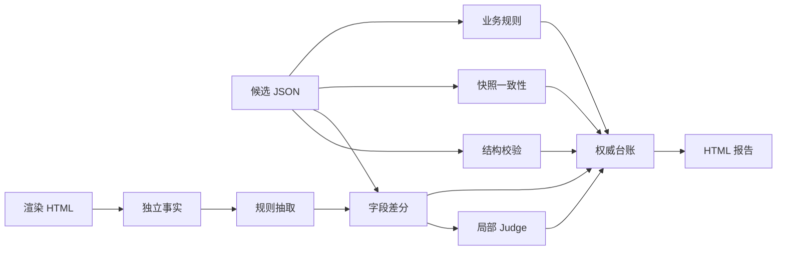

# 没有黄金集，怎么测试大模型抽出来的 JSON？

事情是这样的。

系统里有一份很长的业务报告，页面上混着基础信息、金额、事故明细、维修记录、状态标签和图片。开发用大模型把它抽成 JSON，方便后面的检索、风控或业务判断。

接口返回 200，JSON 也能正常解析。测试接到需求后却会马上撞上一个很现实的问题：我到底要测什么？

拿眼睛把页面和 JSON 从头对一遍，测一份都累，后面来几十份只会变成高级电子找不同。让另一个大模型读完整报告，再问它「抽取结果对不对」，听着省事，可它很容易沿着候选 JSON 的思路继续解释。页面明明显示某项正常，候选结果把它放进异常列表，Judge 还可能认真写一段「信息基本一致」。错误没有消失，只是被套上了更漂亮的边框。

这个项目要解决的就是这类测试需求：原始输入是一份渲染后的报告页面，被测对象是大模型生成的结构化 JSON，测试需要判断它有没有漏提、错提、多提、串行和违反业务约束，还得让开发知道错在哪、证据是什么、修完以后怎么复测。

更麻烦的是，项目起步时没有现成的人工黄金集，也不准备先标几十份数据。唯一的好消息是页面模板相对固定。整套测试方案就是从这两个条件推出来的。

先给出 10 个标题候选，发布时可以按受众选择：

1. 没有黄金集，怎么测试大模型抽出来的 JSON？
2. 大模型把报告抽成 JSON 后，我到底应该测什么？
3. 一份 HTML、两条证据链：LLM 抽取测试完整实战
4. 别再问 Judge「整体对不对」：结构化抽取该这样测
5. 从测试需求到失败报告：大模型抽取质量怎么落地验证
6. 页面明明正常，JSON 却写成异常：一次 LLM 测试复盘
7. 不人工标几十份数据，如何开始做 LLM 抽取回归？
8. LLM 测试方案怎么设计：硬规则、差分与局部 Judge
9. 37 条自动化测试，如何兜住大模型结构化抽取？
10. 测大模型生成的 JSON，还要跨过 Schema 之后的几道关

## 需求背景：这类系统到底在做什么

先把业务链路翻译成人话。一份用户能看懂的长报告进入系统，大模型负责阅读并抽取，最后输出固定结构的 JSON。下游程序不再读原文，只认 JSON 里的字段。

```text
渲染报告页面
    ↓
LLM 抽取程序
    ↓
结构化 JSON
    ↓
检索、判断、展示或其他业务消费
```

这条链路里，JSON 一旦写错，下游通常不会再回头看报告。一个金额多一位、一个状态翻转、一个数组多出元素，程序都会把它当成正式事实继续使用。普通接口测试能证明服务可用，却证明不了内容正确。

测试需求因此分成两层。底层要验证抽取器有没有按输入契约输出；更上面要验证输出内容是否忠于原报告。后者才是 LLM 测试最难的部分，因为同一个意思可能有不同格式，字段之间又有组合关系，简单字符串相等会误报，完全依赖语义模型又会漂。

这次确认需求时还明确了三个约束：

- 没有大规模人工黄金集，不能把方案建立在先标完数据再测试上。
- 页面模板固定，可以写一条与 LLM 错误模式不同的规则抽取路径。
- 报告里存在文字 DOM、样式状态和纯图片信息，三者的可验证程度不同。

有了这些条件，测试目标才算落到地上。否则一句「验证 LLM 抽取准确性」，听着完整，执行时根本不知道从哪里下手。

## 我需要测试什么

把风险拆开后，这类结构化抽取至少要测七件事。

| 测试问题 | 典型缺陷 | 判定依据 | 结果怎么表达 | LLM 是否参与 |
| --- | --- | --- | --- | --- |
| JSON 结构是否合法 | 缺字段、类型错误、非法枚举 | 固定数据契约 | 精确 JSON Path 与错误码 | 不参与 |
| 字段值是否忠于页面 | 错值、串行、状态翻转 | 独立 HTML 事实源 | wrong、missing、unexpected | 只仲裁分歧 |
| 有没有漏提或多提 | 数组少一项、多一项、凭空生成 | 规则抽取结果与字段清单 | 差分路径、候选值、期望值 | 只处理难以直接解释的差异 |
| 格式不同但含义相同 | 千分位、季度格式、空白差异 | 字段级归一化规则 | 语义等价则通过 | 不参与 |
| 字段组合是否成立 | 汇总数与明细数不一致、最大值错误 | 跨字段业务断言 | 规则名、实际值、期望值 | 不参与 |
| 开发内部快照是否漂移 | `lines`、`raw_text` 与结构 JSON 不一致 | 三份开发产物互相比较 | 主链与辅链分别归因 | 不参与 |
| 证据不足时怎么办 | 图片无文字、未知页面样式 | 覆盖字段清单 | `not_evaluated`，不算通过 | 可另建视觉方案，当前不猜 |

这张表其实就是测试范围。它把一句模糊的「测准确性」拆成了结构正确性、内容正确性、完整性、语义等价、业务一致性、内部一致性和覆盖边界。

测试人员还要额外验证测试系统自身：Judge 输出是不是合法 JSON，引用是否真的存在于原文，模型调用失败会不会被误算成通过，报告能不能保留历史结果，CLI 的退出码能不能接入 CI。这些属于测试工具的回归，不该和业务样本结果混在一起。

## 测试方案怎么设计出来的

没有黄金集时，要先确定测试 Oracle 从哪里来，Judge 模型的选择可以往后放。Oracle 就是判定对错的依据。若依据本身不独立，后面的分数再精细也站不住。

项目第一版使用候选 JSON 里自带的 `lines` 和 `raw_text` 重新做规则抽取，再和结构字段比较。它很快检出了真实问题，但也暴露了一个漏洞：文本快照和结构 JSON 都来自同一条开发链，前面若已经抽错，后面可能一起错。

方案随后把浏览器保存的完整渲染 HTML 提升为外部事实源。HTML 是用户最后看到的页面，验证器从 DOM 中独立恢复文字和显式状态，不反向读取候选字段生成期望值。开发 JSON 里的 `lines` 与 `raw_text` 继续保留，不过角色变了，它们只用于检查开发内部是否自洽。

事实优先级由此固定下来：

```text
渲染 HTML DOM        外部正确性主链
开发 lines/raw_text  内部一致性辅链
结构化 JSON           被测候选
LLM Judge             分歧解释与局部仲裁
```

接下来才轮到分层。能由代码确定的内容全部先跑：结构、枚举、金额归一、日期格式、集合差分、计数和跨字段关系。确定性代码发现差异后，Judge 只拿到一个字段、候选值、规则值和局部原文，重新判断这个字段应该是什么。



这里的顺序不能倒。若先让 Judge 看整份候选，它既要找差异，又要理解业务，还要判断证据，任务太宽，候选答案又会给它强烈暗示。确定性差分先把问题缩到一个字段后，Judge 的工作从「批改整张卷子」变成「根据这段原文重做这一道题」。

## LLM 在这套测试里承担什么角色

这类需求里其实有两个 LLM 角色，经常被混在一起。

第一个是被测对象。业务抽取模型读取长报告并生成 JSON，我们测试的是它有没有忠于输入、遵守结构契约、保持字段间一致。

第二个是测试链中的 LLM Judge。它不负责全量判断，只处理确定性代码已经发现的 HTML 主链分歧。模型接收的输入被压缩到单字段，并被要求输出固定 JSON：

```json
{
  "verdict": "correct | wrong | missing | unsupported",
  "correct_value": "<脱敏后的正确值>",
  "evidence_quote": "<必须逐字来自局部原文>",
  "confidence": 0.0,
  "reason": "<字段级理由>"
}
```

拿到模型输出后，程序还要再检查一遍：`verdict` 是否在允许集合内，`confidence` 是否为 0 到 1 的数字，`evidence_quote` 能否在原文中命中，模型给出的正确值是否和硬证据冲突。

```python
if verdict not in allowed_verdicts:
    raise ValueError("invalid_verdict")
if normalized_text(evidence_quote) not in normalized_text(source):
    raise ValueError("evidence_not_found")
if verdict == "correct" and not candidate_supported:
    raise ValueError("verdict_conflicts_source")
```

任何一项不满足，Judge 结果记为 `error`。确定性失败仍然保留，模型没有权限把它覆盖成通过。

所以，所谓「LLM 加持」并不是把测试方案整体外包给模型。它更适合处理局部语义、补充字段级解释，或者在两条抽取路径不一致时提供第三个视角。Schema、枚举、金额勾稽、数组数量和来源引用这些能写成代码的判断，继续交给代码，结果反而更稳定。

## 实际测试过程是怎么跑的

这次项目没有从写一份宏大的测试方案开始，而是沿着真实缺陷逐层补齐。整个过程可以复用成七步。

**第 1 步，确认输入、输出和事实源。** 输入是保存后的完整渲染 HTML，输出是开发抽取 JSON。HTML 主链决定外部正确性，开发快照只检查内部一致性，纯图片字段暂不下确定性结论。

**第 2 步，整理字段契约与风险。** 哪些字段必填、类型是什么、允许哪些枚举、哪些数组需要逐项比较、哪些汇总值可以从明细反算，都登记成明确规则。格式归一只处理已经确认的情况，不做模糊猜测。

**第 3 步，用失败测试固定缺陷。** 首轮结构校验先写 4 条红灯测试，规则抽取与差分再写 4 条，CLI 又写 3 条。它们分别证明缺字段、错类型、非法枚举、格式等价、数组多值以及退出码行为。第一版实现完成后有 13 条测试通过。

**第 4 步，增加独立 HTML 适配。** 验证器使用 BeautifulSoup 读取已渲染正文，忽略脚本和样式节点，从 DOM 顺序提取可见文本；已登记的状态样式转换为明确状态，未知样式保持未知。SPA 空壳没有正文时直接返回输入错误。

**第 5 步，补齐双链与 Judge 契约。** HTML 对 JSON、`lines/raw_text` 对 JSON、`lines` 对 `raw_text` 分开比较。Judge 使用 fake client 覆盖合法输出、非法 verdict、引用不存在、置信度类型错误和结论冲突，不靠真实模型调用来完成单元测试。

**第 6 步，跑真实样本。** 每个样本只要提供两个固定文件：

```text
data/sample-001/
├── source.html
└── extracted.json
```

执行命令也只有一条：

```bash
./run.sh sample-001
```

脚本会执行 HTML 主链差分、开发快照辅链、业务规则和局部 Judge，再把结果写进新的时间目录。发现业务差异时返回 1，但 `run.json` 和 `report.html` 仍会正常生成；输入或配置失败返回 2；当前覆盖范围内通过才返回 0。

**第 7 步，修复后跑同一条链回归。** 不手工改 HTML 报告，也不删除旧失败。开发修正结构化生成逻辑，重新生成候选 JSON，再创建一份新的运行目录。新旧台账可以直接比较，历史证据不会被覆盖。

## 这次实际得到了什么报告结果

当前项目源码回归包含 37 条自动化测试。我在这次文章复盘中重新执行了锁定环境测试：

```bash
uv sync --locked
uv run --locked pytest -q
```

结果为 `37 passed in 0.59s`。这 37 条验证的是测试工具实现，包括结构、抽取、差分、证据、业务规则、Judge 契约、CLI、台账和 HTML 适配。它不代表跑了 37 份真实报告，也不能换算成业务准确率。

再看已有真实样本台账。报告里一共有 4 个测试用例，结果如下：

| 报告用例 | 结果 | 读法 |
| --- | --- | --- |
| 输入 JSON 结构校验 | 通过 | 必填、类型和枚举满足当前契约 |
| HTML 独立事实差分 | 失败 | 候选异常集合多出一个页面明确为正常的区域 |
| 开发快照一致性 | 失败 | `lines/raw_text` 也不支持候选中的额外区域 |
| 跨字段业务一致性 | 通过 | 当前可验证的计数、最大值和明细聚合没有冲突 |

为了公开表达，可以把真实差分脱敏成下面这样：

```json
{
  "path": "$.status_zones",
  "candidate": ["zone_a", "zone_b", "extra_zone"],
  "expected": ["zone_a", "zone_b"],
  "source_evidence": "某区域［正常］",
  "difference": "candidate contains extra_zone"
}
```

HTML 主链证明页面明确显示正常，开发快照辅链也证明内部文本没有把它标成异常，而 `lines` 与 `raw_text` 彼此一致。三条信息互相印证，错误范围集中在文本快照之后的结构化生成或过滤阶段，页面解析和双快照漂移可以先从排查清单中划掉。

已有 Judge 对这一个字段返回 `wrong`，置信度为 `1.0`，引用成功命中原文。这个结果提供了额外语义证据，但最终失败在调用 Judge 之前已经成立。即使 Judge 服务当时不可用，报告也不会把样本改成通过。

报告里显示两个失败用例，却只对应一个业务缺陷。HTML 主链回答「它违背外部页面吗」，快照辅链回答「开发自己的中间文本支持它吗」。两条证据指向同一个字段，不能统计成两个独立缺陷。

台账还列出了覆盖边界：本次 HTML 中有 25 个候选路径缺少可独立确认的文字或状态，开发快照中有 15 个路径无法派生。这些字段没有塞进通过率，统一标为未评测。数字看着没有满屏绿色那么舒服，但测试结论不会把「看不见」伪装成「没问题」。

最终报告除了错误码，还保留候选值、规则值、原文证据、Judge 状态、可能根因、影响、建议修复位置、排查步骤和复测命令。测试人员能交付证据，开发也知道应该查 HTML 适配、文本抽取还是结构化过滤。

## 项目结构与具体实现

读到这里，再看项目结构就容易理解了。公开稿把真实业务包名替换成 `report_validator`，文件关系保持不变。

```text
report-validator/
├── data/<case-name>/
│   ├── source.html          # 独立事实源
│   └── extracted.json       # 被测候选与开发快照
├── artifacts/<case-name>/<run-id>/
│   ├── run.json             # 权威机器台账
│   └── report.html          # 台账派生视图
├── src/report_validator/
│   ├── cli.py               # 编排与退出码
│   ├── html_source.py       # DOM 事实恢复
│   ├── extractor.py         # 规则抽取
│   ├── schema.py            # 结构契约
│   ├── diff.py              # 字段差分
│   ├── evidence.py          # 原文回溯
│   ├── consistency.py       # 开发快照一致性
│   ├── rules.py             # 跨字段断言
│   ├── judge.py             # 局部 LLM 仲裁
│   └── ledger.py            # 统一报告数据
├── tests/                   # 九组自动化测试
├── openspec/                # 需求、设计与任务记录
├── VALIDATION_RULES.md      # 事实优先级与覆盖边界
├── pyproject.toml
├── uv.lock
└── run.sh                   # 一键执行入口
```

核心编排集中在一个函数里。下面是按真实代码脱敏后的等价片段：

```python
candidate = load_json(input_path)
document = replace_with_html_source(candidate, html_source)

structure_issues = validate_structure(candidate)
rule_document = extract_expected(document)
differences = compare_supported(document, rule_document)
snapshot_result = evaluate_embedded_consistency(candidate)
business_issues = validate_business_rules(document)

judge_results = (
    judge_differences(document, differences, judge_client)
    if judge_client is not None and differences
    else []
)

ledger = build_ledger(
    structure_issues=structure_issues,
    differences=differences,
    snapshot_result=snapshot_result,
    business_issues=business_issues,
    judge_results=judge_results,
)
```

`judge_client is not None and differences` 把模型调用限制在真实差分上。全量简单字段无需反复花 token，开发快照辅链也不会送去 Judge。HTML 报告则始终从 `run.json` 生成，修改报告结构时改台账或 renderer，不手工修某一份生成结果。

## 如何把这套方法复用到其他 LLM 测试需求

如果你的系统也是「非结构化输入 → LLM → 结构化输出」，可以沿用同一套推导方式。

先列出可独立保存的原始事实，例如网页快照、PDF、数据库记录或接口响应；再把输出契约拆成必填、类型、枚举、数组、转换和跨字段关系。确定性规则负责能明确计算的部分，语义字段才进入 LLM Judge。每一条 Judge 结论都要带原文引用，程序继续验证引用是否存在。

接着给结果定义四种状态：通过、失败、执行错误、未评测。没有证据的字段留在未评测，模型服务失败进入错误，业务矛盾进入失败。不要把后三种都揉成一个低分，那样开发无法判断该修数据、修规则、修模型还是修环境。

到了回归阶段，把真实分歧沉淀成样本，再补变异测试：删掉必填字段、数字改一位、数组多一项、状态翻转、字段互换、快照漂移。变异检出率能说明验证器能不能抓住已知故障，但它仍然不等于抽取准确率。

这套方法对固定模板最友好。模板经常变化时，需要增加 DOM 或文档结构指纹；纯图片字段需要单独的 OCR 或视觉模型证据链；长尾语义无法写成规则时，可以提高 Judge 比例，同时保留抽样人工复核。适用条件变了，测试 Oracle 也要跟着变，不能照搬一套规则跑到底。

## 经验感想

这次方案方向的改变来自一个测试常识：判定依据要和被测结果尽量独立。第一版已经能抓错，但候选 JSON 和开发文本快照来自同一条链，仍有一起犯错的可能。把保存后的渲染 HTML 变成外部主链后，报告中的失败有了更硬的证据。

LLM Judge 的价值也来自约束。整份报告丢给模型，任务宽、候选暗示强、输出难复查；缩到单字段以后，模型只需依据局部原文重做一道题。固定结构、强制引用、程序验引，再加上不能覆盖硬失败，模型的语义能力才进入一个可审计的测试流程。

测试报告同样不能停在 `value_mismatch`。候选多了什么、页面写了什么、问题更可能出在哪一段、修复后执行哪条命令，这些信息决定了一份报告会进入协作流程，还是躺在目录里慢慢变成数字坟场。

当前方案仍有明显边界：真实样本规模有限，图片字段没有独立视觉证据，模板变化缺少完整结构指纹，所以不能宣称绝对准确率。下一轮更实际的动作是扩充脱敏样本、增加模板指纹和字段级变异集。每扩一类证据，再扩大一块可承诺范围。


`LLM测试` `结构化抽取` `差分测试` `LLM Judge` `测试方案` `Python` `pytest` `测试自动化` `质量保障` `工程复盘`
