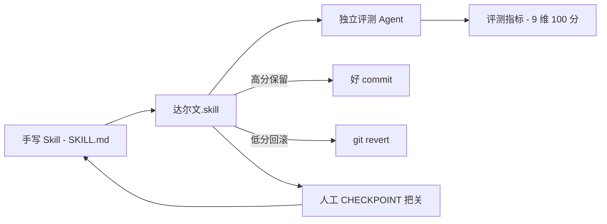

# 你有 60 个 Agent Skill 却还在手改？Karpathy 那套训练思路，被搬来优化 Skill 了

聊个大概率正在发生的事：你的 Agent 工作流里 Skill 是不是越攒越多。Claude Code、Codex、OpenClaw、Trae、CodeBuddy 这些工具都认 SKILL.md 格式，今天加一个会写周报的，明天塞一个能调接口的。手里攒到 10 个的时候，手工维护还行；等到了 60 多个，光改格式、调步骤、看图标的路径通没通，就够你喝一壶。

更要命的是，传统那种 Skill 审查基本是"纯审格式"的：格式对不对、步骤有没有编号、路径能不能访问。可一个格式挑不出毛病的 Skill，真跑起来效果可能烂得不行。**格式完美 ≠ 好用。**

最近有人把训练模型那套"只保留改进、其余全部回滚"的思路，搬到了 Skill 优化上，做成了 **达尔文.skill 2.0**。一句话：像训练模型一样优化你的 Agent Skills——跑实验、看分数、只留变好的，其余全回滚，一个只能向前转的棘轮。

---

你手里每一个 SKILL.md，它都当作一个待优化的"模型参数"。

它的定位很直接：**帮你把一堆手工维护的 Agent Skill，用"评估 + 实测 + 只留改进"的循环自动迭代，分数只升不降。** 对 Skill 多了管不过来、又想让它们真正"好用而不只是好看"的开发者来说，这就是个省心的自动化。

它甚至被做进了生态——**微软研究院在 2026-06-03 的官方仓库更新里，把 darwin-skill 列进了 SkillOpt 的集成名单**，原文原话是 "gbrain, gbrain-evals, and darwin-skill have all integrated SkillOpt."。它不是自己复刻别人的框架，而是真的跟学术线接上了轨。

---

**核心亮点**，逐个拆：

**1. 直接把思路搬自 Karpathy 的 autoresearch。** autoresearch 用 `program.md` 定目标和约束，让 agent 自主生成、测试代码改动，只保留可测量的改进。达尔文把同样一套搬到了 Skill 上：待优化的 SKILL.md 当 `train.py`、9 维加权总分当 `val_bpb`、keep/revert 当 `git ratchet`、`test-prompts.json` 当测试集。逻辑对得上，落点从"改代码"换成了"改 Skill"。

**2. 9 维评估体系，总分 100。** 结构维度靠静态分析，效果维度必须真跑测试看输出。v2.0 从 8 维升到 9 维，其中三个新维度直接来自论文的 rubric：**失败模式编码**（把已知失败路径显式写进 Skill，而不是"别犯错"式叮嘱）、**可执行具体性**（明文禁掉"建议/可以考虑/根据情况"这类模糊词）、**高风险行动黑名单**（rm、git reset --hard、force push 这些破坏性操作必须在 skill 里列禁）。

3. **评分绝不"自己改自己评"。** 每轮启动 2 个独立子 agent 打分，下一轮换全新评委防锚定。之所以这么较真，是文档里引了个具体数据：**LLM 自评准确率只有 46.4%**——连一半都不到，自己给自己打分基本等于瞎猜。这一条治的就是偷懒。

4. **人在回路，三层守关。** 这是达尔文跟"全自动"老哥最不一样的地方：Phase 1 基线评估要人工审报告、Phase 2 单维度优化到一半会 🔴 CHECKPOINT 强制暂停让你确认、Phase 3 回归测试涨幅不够会 🛑 STOP 停手。Skill 好坏比 loss 微妙多了，机器不能全说了算。

5. **反例黑名单 8 条，防的就是自嗨。** 明文禁掉这些反模式：同一个 AI 又改又评、用 `git reset --hard` 当回滚（得用 `git revert`）、为凑分堆冗余、跳过测试直接评分、一轮改多个维度、干跑比例超过 30%……你看，全是"看起来在优化、实际上在造假"的操作，直接标成禁忌。

6. **有实测数据背书。** 文档列了两组真实结果：huashu 那个 image skill，从 **80.8 → 91.5 → 91.65**，涨了 10.85 分，6 个独立评委共识；达尔文自己自评也从 **86.05 → 92.05 → 92.7**。不是干吹，是有记录的涨分。

7. **MVP 极简，一条命令装上。** 不需要你搭一堆环境，一条 `npx skills add` 就装好，装完在任何支持 SKILL.md 的 Agent 工具里说一句"优化所有技能"或"优化某个技能"就开始干。

**划个边界**，别期待错：这套东西的价值高度依赖两个前提——你**必须在 git 仓库里跑**，且先把本地改动 commit 或 stash 掉；其次，Skill 里的 shell 命令、git 操作、凭证、发布流程这类高风险点，它虽然机制上有黑名单和 CHECKPOINT，但**过 checkpoint 时 diff 还是得人眼过一遍**。它降低的是重复体力活，不是人类责任。

---

装上其实就到"一句话命令"的距离：

```bash
npx skills add alchaincyf/darwin-skill
```

装完，在你用的 Agent 工具里（只要认 SKILL.md）说"**优化所有skills**"或"**优化某个skill**"，它就开始循环。这首一行命令是最关键的，你直接复制用。

想配花一点，它也允许你把整个优化循环手动编排成下面这样几张表在脑子里走查。

**流程速查**，我把核心循环掰成张表给你扫读：

| 环节 | 干嘛的 | 谁做主 |
| --- | --- | --- |
| Phase 1 基线评估 | 自动打分 9 个维度 + 人工审报告 | 人定改什么 |
| Phase 2 单维度优化 | 找加权短板最大维度，一轮只改一个，改完 2 个独立评委重评 | 🔴 CHECKPOINT 等你确认 |
| Phase 2.5 测试跑（可选） | 用 test-prompts 验证改动 | 可选 |
| Phase 3 回归测试 | 涨幅不够就 STOP 停手 | 🛑 强制 |

至于它内部每个阶段到底怎么走，这张 Phase 2 的核心流程最抓人心:

1. 算各维度加权缺口（weighted_gap），专挑权重高、短板大的下手
2. 为一轮只出一个具体改法，绝不几个维度一起改
3. 编辑 SKILL.md，`git commit`
4. 起 2 个独立子 agent 重新打分，下一轮换全新评委
5. 新分 > 旧分就保留，否则 `git revert`（禁用 `git reset --hard`）
6. 单轮涨幅 < 1 分就自动早停，不硬凑
7. 🔴 CHECKPOINT，秀出 diff + 分数变化，等你点头

这套"只保留改进、自动回滚退步"的**棘轮机制**，是它最像"训练"的地方：分数只能向上滚，每一轮要么改进、要么干净回滚，不会随时间偷偷攒一堆局部退化。比如某一轮得了 75 分，而当前基线是 78，那这轮就被自动回滚，基线永远锁在 78，后续从 78 继续往上。

为了说清达尔文在整条 Skill 优化里扮演什么角色，我画了一张它跟"训练"对照的示意图（名词都来自文档，是我理解的抽象结构，不代表官方模块命名）：



一句话收束：你的 Skill 是作者，达尔文是循环器；它不断用独立评委量分数，高分留下、低分滚蛋，冲到 checkpoint 时把人拉回来拍板，然后带着只会上升的基线往下滚。

---

最后说点实在的。

我本人还没实际跑过这玩意（这篇完稿时它还没在我自己的 Skill 体系上滚过一轮评估），所以下面是基于文档的判断，你先当参考。

**顺手的地方**对两类人最香。一是 Skill 攒了很多、又懒得逐一维护格式的人——它把"结构对不对 + 跑起来到底行不行"两件本不搭界的事在审。二是想借实证方法让 Skill 变更好的开发者——它那把"9 维评分 + 独立评委 + 棘轮"组合，确实是套能落地的量化思路，至少比"感觉上还行"靠谱太多。

**会卡的地方**也明显：它对"可测量改进"依赖很重，有些 Skill 效果是没法用分数定量画像的（比如文案审美这种），强套可能就催你改掉那些难量化、但其实很重要的手感部分。另外它再聪明也是形式化的肉眼验格子，skill 一进入 shell 命令、凭证、线上发布这种"破坏半径大"的操作，文档自己都在安全检查里提醒你——**过 checkpoint 前必须人眼**。工具是轮子，方向盘还在你手上。

**身位问题**提一嘴：它不是没有同类物。微软研究院的 SkillOpt 也是这件事，还有个显著区别——**SkillOpt 是全自主系统，达尔文强的是 human-in-the-loop**，关键阶段（基线评估、单维度优化、回归测试）强制暂停等人。全自动 vs 自己掌舵，看你更信什么。谁更适合，得看你自己手里的 Skill 到底要不要人在每个拐点做主。

最后的判断是：**"只保留改进，时间就站在你这边"**——这句话是它自己文档里写的收尾，也确实是这套工具最成立的卖点。但你真接它之前，把优先级排清楚：先保证每个 skill 跑在 git 仓库、能干净回滚，再看看你自己是不是那个愿意在每个 checkpoint 正眼看 diff 的人。满足这两条，它才是省心的自动化，不然它只是个会动不动就急刹车的机灵鬼。

想上手的话，直接 `npx skills add alchaincyf/darwin-skill` 装上，去体验一把"分数只进不退"的滋味。唔，记得先把你现有的 SKILL.md commit 了——这句话就是它的第一堂课。
https://github.com/alchaincyf/darwin-skill/blob/master/README.md

#Agent #SKILL.md #AI工程 #自动化 #开源项目 #提示词优化 #Karpathy #SkillOpt #开发工具