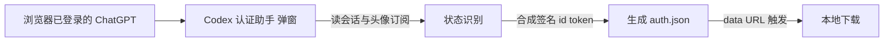

# 想用 Codex 又不想每次手粘 token？这个 Chrome 扩展一键把登录态转成 auth.json

用 Codex 做本地 AI 编程的人，应该都撞过这堵墙：要让 Codex 在本地仓库里替你干活，得先让它有权限。最简单粗暴的方式是去 ChatGPT 网页登录、再把那把 session 凭证拷出来填进去——麻烦的是每次换会话、掉登录、或者想换个订阅计划看看权限，又得从头来一遍。

手动拷 token 的姿势也天生招人烦：地址要对、区间要准、一不小心复制多一个字符，Codex 就理直气壮地报"鉴权失败"。随手搜出来的"教程"又总让你把 token 贴给不知名的脚本或网页——那才是真·危险动作。

最近 GitHub 上有个项目把这个痛点做成了个轻量浏览器扩展——**Codex 认证助手（Codex Auth Helper）**。一句话：**一个 Manifest V3 的 Chrome 扩展，在本地安全地读取你已经登录的 ChatGPT 会话，一键生成 Codex 需要的 `auth.json` 配置文件，全程数据不出浏览器、不上云。**

它不是又一股"把凭证传给第三方"的歪风，而是做了个闭环沙盒流程：一分钟内把"登录状态"翻译成"Codex 认得的 auth.json"。

---

先别急着爽，把一句话定位钉清楚：**它面向的是"想用 Codex、又受够了手动拷 token 或面对各种源码脚本"的开发者的一个本地小工具。** 它读你在当前浏览器里已登录的 ChatGPT 会话，把授权状态、token 有效期直接读出来，并自动合成 Codex 规范要的那个 `auth.json` 配置。对自己本机的会话、自己的登录做转换、做本地保存——这是顺理成章的使用方式，不是把别人的东西往外偷。

重点防点也要先划清：**你把会话凭证给任何第三方脚本和网页都是危险动作**。这里它走的是闭路本地——不经过任何服务器、零上传接口，凭证只在你的浏览器沙盒里走一圈再以 `data:` 下载。隐私的边界至少是写进了承诺里的，下面详拆。

---

**核心亮点**，一条条拆：

**1. 秒级识别当前登录状态。** 插件直接检测当前浏览器的 ChatGPT 授权状态，在弹窗里直观显示你的头像、邮箱、订阅计划（Free / Plus / Pro）。打开就知道自己现在是什么身份，不用跑网页去猜到底还在不在线。

2. **Token 有效期的实时倒计时。** 它精确读取 token 的失效时间，在 Popup 界面上给一个秒级的生存期倒计时。好处是让你对"这个 auth.json 还能用多久"心里有数——快到点了就去续一把，不至于做到一半突然被端掉。

3. **自动合成格式，不想让你手拼 JWT。** 它实现 JWT 仿真构造，自动生成 Codex 规范需要的 Synthetic 签名 id_token。说白了：这类凭证通常需要一串符合签名结构的字符串，插件帮你把"够格通过"的那串拼好，免了你手写手工抓 JSON 再拼的苦工。

4. **100% 纯本地离线处理，是核心卖点。** 核心逻辑跑在闭环的浏览器沙盒里，生成的配置直接用 `data:` URL 触发下载，**不留任何临时 Blob 内存漏洞**。更重要的是**绝不经过任何第三方服务器：零上传接口、数据不上云**。对你"把我的登录凭证交给哪儿了"这个头等顾虑，它给的答案就是"根本没交给任何地方"。

5. **权限声明最小化 + 代码闭环。** 只声明了 `downloads`（保存文件）和 `https://chatgpt.com/`（读本地会话）两项权限，没有多余的危险能力；没有任何外部不可控的 CDN 第三方库，所有静态资源都本地打包。你可以随时 F12 打开 `background.js` 和 `popup.js` 看个明明白白——"彻底的代码闭环"是能自己验证的，不是一个 slogan。

**顺带提一句它不做什么、也别拿它去做什么**：它导出的是你自己的会话凭证、写给你自己的 Codex 配置，**不是用来把某个第三方账号当免费园子分享的**；真正使用这类会话凭证到底合不合相关服务条款，你自己审——它解决的是"本机配置方便"，不是"预定一条规避规则的快车"。

**快速上手**（开发者模式本地加载）——

这是浏览器扩展的主流装法，**无需从商店安装**，照单照样：

1. 下载或克隆仓库到你的本地电脑。
2. 打开 Chrome，地址栏输入 `chrome://extensions/` 回车。
3. 右上角开启 **“开发者模式”** 开关。
4. 左上角点 **“加载已解压的扩展程序”**。
5. 选择仓库里的 `extension` 文件夹（即包含 `manifest.json` 的目录）。
6. 装完后在工具栏的“拼图”图标里找到 **Codex 认证助手** 并固定。

然后导出 `auth.json`：

1. 确认当前浏览器里已经登录了 ChatGPT 官网（chatgpt.com）。
2. 点浏览器右上角插件图标，打开 **Codex 认证助手** 弹窗。
3. 插件自动读取已登录的会话；没登录就点 **一键前往登录**。
4. 识别成功后，点 **生成并保存 auth.json**，一键下载装好的配置文件。

**一份权限速览，不靠背书：**

| 权限 / 能力 | 用它干嘛 | 边界 |
| --- | --- | --- |
| `downloads` | 保存下载的 auth.json | 只落你本地 |
| `https://chatgpt.com/` | 安全读取你已经登录的本地会话 | 决定不了它之外的东西 |
| 外部 CDN / 第三方库 | 无 | 全部本地打包 |
| 服务器上传 | 无 | 零上传接口，数据不上云 |

流程上是"读你本地会话 → 合成 auth.json → 本地下发"，我用一张抽象图（逻辑关系，不代表请求链路图里真的存在服务器）：

**写在最后。**

**我本人还没在你说的环境里真装这副插件跑过完整流程**（完稿时它还没进过我的浏览器），以下一半基于文档、一半是我对这种"导会话凭证工具"的一贯警醒，供你参考。

顺手的点：它把"准备 Codex 的 auth.json"这件本要手动抓 JSON、拼字符串、防手滑的活，做成了一个开箱即点的按钮，还带实时失效倒计时帮你掐时间。对受够了命令行拷 token 的开发人来说，这个"顺手"是真的。

要警醒的也实在：首先，**凭证只在你的浏览器本地闭环生成，是它对你最该抓的安全防线**——但你要能自己核一眼：打开 F12 看这俩脚本到底读了什么、往没往哪儿发，是对它最大的信任基础。其次，这类"把 ChatGPT 会话凭证转成 Codex 用"的工具，**不算 Codex 官方正途**，它是社区解决鉴权麻烦的实操手段——你要是想心安，就把"这个凭证只该给可信的会话工具"当作底线。最后别拿它做任何搬运、分享第三方账号的用途，那是另一套话术。

要不要用，自己权衡那句"数据不上云、本地闭环"是否真的踩到你想要的点。若要用，从开发者模式加载，比随便点开第三方签名工具更可控——这句是真的。

https://github.com/zhishile/codex-auth-helper

#Codex #Chrome扩展 #ChatGPT #auth.json #开发工具 #本地优先 #开源 #Chrome插件