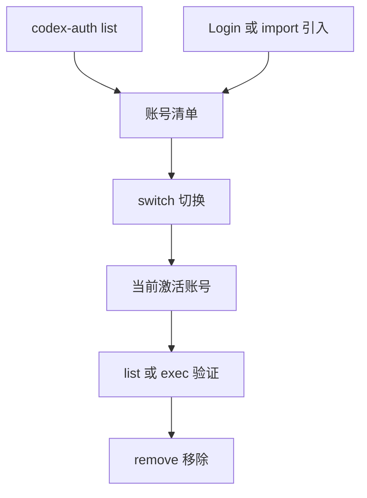

# 有没有人和你一样，为了一套 Codex 搞了三四个账号？

如果你是重度 Codex 用户，这画面多半不陌生：**一个账号的用量到了顶，就得登出、换个账号、重新登录再进去。** 偏偏还分个人号、会员号、还有 Team 号，来回切一次要重捶好几下键盘，等那个坚果 logo 转半天。

更烦的是切完经常"薛定谔的生效"——账号确实换过去了，可有的客户端不重启就不认账，搞到一半才发现自己在用错账号在跑活。真正拔火的人，会为这件事写一个专门的命令行小工具，还把它开源出来。
**一个叫 `codex-auth` 的命令行工具，用来管理并快速切换 Codex 的账号**，像给 Codex 配了个"账号侧滑条"：把各个账号存起来，`list / switch / remove` 一条命令搞定，再也不用来回登出登入。

---

它不是教你怎么"借别人的号跑题"，而是**帮你把自己名下那堆 Codex 账号管起来**——存起来、一键切、可导入导出、还能按别名认人。定位清晰：**面向"持有多个 Codex 账号又想高效切换"的开发者的一个本地命令行小工具。**

给 Codex CLI、VS Code 扩展、Codex App 三路全都通用。而且它管的是你自己的账号、自己机器上的认证文件，属于"给你本地开发省事"的那类工具；唯一要留个心眼的，是它默认那套"用量刷新"会往 OpenAI 发请求——这点它自己的文档写在明处，我一字不改地帮你画出来（见下文"关于用量刷新"）。

---


**1. 把"切账号"从体操变成一条命令。** `codex-auth switch` 交互式挑账号，或用行号 / 账号选择器直接切（`codex-auth switch 02`、`codex-auth switch work`）。切完是该记住的：**对 Codex CLI 和 Codex App，切换后要不要重启客户端才生效**——它文档里把这条醒目标了出来，别切完忘了重启又说它"没反应"。

2. **一次存，随时翻。** `codex-auth list` 列出已存账号和用量状态；`--active` 只看当前激活的；`--live` 打开 TUI 实时视图（刷新间隔可用 `codex-auth config live --interval <秒>` 调）。想留标签？给账号起个别名（`codex-auth alias set <query> <alias>`），找起来直接喊名字。

3. **登录 + 引入，一条命令。** 装了官方 Codex CLI 后，`codex-auth login`（或 `codex-auth login --device-auth` 设备码登录）就能边登边把当前账号加进来；`codex-auth import` 能导入单个 auth 文件、批量导入一个文件夹、导入 CLIProxyAPI 的 token JSON，甚至 `--purge` 从 auth 文件重建 registry 数据库。

4. **导出、清理、顺手维护。** `codex-auth export` 把存的账号 auth 导出来（也能导 CLIProxyAPI token）；`codex-auth clean` 删掉受管理的备份和过期文件。加上 `--json` 变体输出机器可读结果，想拿 JSON 在上面再叠一层 GUI 也留有后门。

5. **无缝切换还有一条"增强线"。** 想切换后不用重启就无缝，作者给了一个叫 `codext` 的增强版 Codex CLI：`npm i -g @loongphy/codext` 然后跑 `codext`。Codex App 用户还能用 `codex-auth app`（实验性）——它设计上支持新开聊天、恢复旧对话、续上被打断的对话这三种场景，让切账号这件事尽量不停手。

**再说说"用量刷新"给你把话说透。** 它是默认开启、这样做的：靠 API 直接 HTTPS 打到 OpenAI 的 `GET https://chatgpt.com/backend-api/wham/usage` 和 `GET https://chatgpt.com/backend-api/accounts`，带上你的 access token 换用量和团队名。**它自己在文档里写明：这个行为可能被 OpenAI 监测到，甚至违反相关条款、带来账号被停用的风险，用不用后果自负。** 想更"安全"一点，逐命令带 `--skip-api` 改走本地模式（扫本地 rollout 文件）——但本地模式你该接受会滞后几小时。用哪个，自己掂量。

**快速上手**——

**全局安装**两段命令，都能用：

```shell
npm install -g @loongphy/codex-auth
```

不装全局也行，直接跑干净：

```shell
npx @loongphy/codex-auth list
```

它支持三路客户端——Codex CLI、VS Code 扩展、Codex App。**即便你主要用扩展或 App，官方仍建议把 Codex CLI 装上**（更好加账号）：

```shell
npm install -g @openai/codex
```

**常用命令速查**，一张表扫完：

| 命令 | 干什 | 说明 |
| --- | --- | --- |
| `codex-auth list` | 列出已存账号与用量 | `--active` 只看当前、`--live` 开 TUI |
| `codex-auth login` | 登录并把当前账号加进来 | `--device-auth` 用设备码登录 |
| `codex-auth switch` | 切换激活账号 | 行号或账号选择器均可 |
| `codex-auth remove` | 移除账号 | `remove --all` 全清 |
| `codex-auth import` | 导入 auth 文件 | 单个 / 整文件夹 / `--cpa` token JSON |
| `codex-auth export` | 导出已存 auth 文件 | 可跟一个目录参数，导出到指定目录 |
| `codex-auth clean` | 清理备份与陈旧文件 | 维护用 |

配套几个**即贴即用**的示例：

```shell
codex-auth list
codex-auth list --active
codex-auth switch
codex-auth switch 02
codex-auth remove work
codex-auth import /path/to/auth.json --alias personal
codex-auth list --skip-api
```

想卸载，一条带走：

```shell
npm uninstall -g @loongphy/codex-auth
```

工作流可以想成"存 → 拉 → 切 → 删"的一段闭环，我画成抽象图（逻辑关系，不代表它实际里的请求链路）：




*多账号不是罪，反复登出登入才是， `codex-auth` 至少把"切"这件事从记性活变成了命令行一步——至于要不要用 API 刷新，那是选择题，不是被迫题。

https://github.com/Loongphy/codex-auth

#Codex #命令行 #OpenAI #开发工具 #账号管理 #开源 #CLI #工作量管理