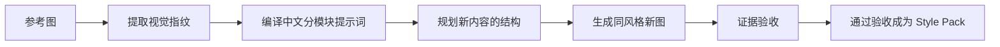

# 你有没有过一个烦：让 AI 画图可以，但想让它们"长成一个样"就没了辙

画技术图的都知道那种别扭：AI 单张图能出，可一旦要它按同一个风格出第二张、第三张，它就开始跑偏——这张是深色底、那张就换套花里胡哨的配色；这张箭头是实线、那张就开始放飞。你不想要千篇一律的模板，但还是希望那一套自己认得的"画风"能稳定下来。

于是以前最原始的办法是：把某张你很满意的图当"参考"，让它照着画。你得把参考图复制一遍、把要做的新图需求丢一遍，对齐得靠运气，几乎没法复现——因为你要的从来不是"这张图长这样"，而是"这一族图都长这样"。

最近 GitHub 上有个 Agent 技能专门治这个毛病——**FigEcho（图易现）**。一句话：**它能从一张参考图里提炼出一份"可复用的视觉配方"，再把你新的技术内容按这份配方，组成同一视觉风格的新图。** 说白了，它教 AI 学会"你家图的那股劲"，而不是学会"你这张图长什么样"。

---

## 1. 这是啥：一个能把图风格“抄”下来、再复用的技能

先把它是什么钉死：**它不是给 AI 加了个"画得更炫"的按钮，而是一套"把视觉风格变成数据"的方法。** 适合画技术路线图、架构图、流程图、科普图这类，而且图多了想统一风格的人；担心"每张图都心思各不同"的团队或个人开发者也正好对上感觉。

它抓住一个很反直觉的点：**一张图真正的"像不像"，根本不在配色，而在更细碎、更稳定、更容易被忽略的那些地方。**

---

## 2. 它到底在"偷"什么：一张图的视觉指纹

很多工具以为"风格 = 取一组颜色套上"。FigEcho 直接不这么干。它去读的，是那些平常不注意、却决定辨识度的东西，我在它文档里一拎就是这个清单：

- **信息怎么分区**：哪块大哪块小、谁镶在谁的里面，空白怎么留
- **容器怎么嵌套**：卡片套卡片，还是平铺一排
- **箭头怎么组织**：实线虚线、直角圆头、粗细、有没有心形白三角
- **字体怎么分级**：大标题、副标题、正文用的字号和衬线关系
- **图标怎么统一**：同一套视觉语言，还是东拼西凑
- **高密度下的秩序**：信息堆得满满时，还整不整齐、喘不喘得过气

它把这些可观察的特征整理成一组**视觉指纹**，再编译成一份**脱离上下文、能单独拿走用的中文分模块提示词**。好处在这里：风格不再依附于某张源图，而是变成了可以复制、可以再次提交给图片模型的"配方"。

> 换个说法就是：大多数工具在“抄颜色”，FigEcho 在“抄看不见但很值钱的结构”。它抄的不只是颜色，其实是那些“看不清但很值钱”的底层结构规则。

配上它那套流程，就更好懂——它是怎么一步步把"参考图"变成"新图"的，我画成一张流程图：



---

## 3. 说人话的亮点

这个技能真值钱的地方，是它有那几件事做得特别"实在"，我给你一条条拆：

**1. 把“风格”当一个可迁移的东西，而不是“配色”。** 它抓的是布局、容器、箭头、字体、图标这些多维组合，不是把“科技感”“简洁”“高级”这种话当约束词，更不是只抄一组颜色套通用卡。**所以你拿到的，是“这张图到底靠什么看着像它自己”的原因，不是徒手 cosplay 一张。**

**2. 风格来自参考图，结构来自新内容。** 参考图只管提供"视觉语言"，新图长几个栏目、几个节点、从哪读到哪、什么色配什么语义，都由新内容重算——**不会把你源图像的"业务结构"机械复制过去。** 这意味着你拿一个不同主题的新图进同一套视觉，它不会硬套。

**3. 一套提示词管到底，不扯两套。** 成图时用的 prompt，就来自保存下来那份唯一的 `style-prompt.md`，不再另写一份简化的英文摘要。**所以文档里声称的你交付的提示词，和你实际调用模型的提示词，是一模一样的——没有"说了和做了"两张皮。**

**4. 验收不是"看像不像"就算了，而是分两种事做。** rendered validation 检查"这次真的画出来，风格锚点体现没体现"；portability validation 要求它"换到另一个主题下重新规划拓扑、重派色语义，还没留下源内容残留"。**两个分开记，谁也不替代谁——因为"像"跟"能迁移"，本来是两件事。**

---

## 4. 装它、用它：其实就几行

它是个技能包，装法就一条命令（需要 Python 3.10 或更高）：

**装到当前项目：**

```
npx skills add giszzt/FigEcho --skill figecho --copy --yes
```

**想全局用：**

```
npx skills add giszzt/FigEcho --skill figecho --copy --yes --global
```

**想从源码直接跑（带测试）：**

```
git clone https://github.com/giszzt/FigEcho.git
cd FigEcho
python -m unittest discover -s tests -p "test_*.py"
```

装好后，你用大白话喊它就行，比如：

- "提取这张技术路线图的布局、图标、线框、配色和字体，给我一份可复用的风格提示词。"
- "分析这组三张论文示意图，找出它们共同的视觉语法。"
- "参考这张架构图的风格，把下面的模块关系画成一张新图。"
- "把刚才的风格保存为'马卡龙三级科研框架'，以后继续复用。"
- "做一张产品分层架构图，风格你从库里挑。"

你没给参考图、也没点名模板时，它会先翻风格库（Style Library）把候选列给你；实在没有匹配的，再问你补参考图或确认自建风格——**它不会自作主张编个不存在的风格来源。**这是它很让人放心的一条。

（补充一句：仓库自带了 6 个示例 Style Pack，像"黑框衬线架构图""炭黑虚线节点科普图""科研申报总体路线图"这种，`preview.png` 只用来预览，真正复用时还是同时加载原始参考图 + 完整提示词。）

还有一个实际的观察点：**不同需求，它默认交付的东西不一样。** 别把它想得太单一，想要啥它会按下面这张表给：

| 你要的结果 | 它默认交付 |
|---|---|
| 抽风格、出复刻提示词 | 一份完整、自带中文说明的分模块提示词 |
| 风格分析、视觉规范、结构拆解 | 简洁风格结论 + 完整提示词 |
| 直接出同风格新图 | 最终 PNG + 实际送入模型的完整提示词 |

---

## 5. 说点坦白话：它到底值不值得用

我是**认真读过项目文档、但在真实画图现场还没自己跑一套图验证**，下面一半按项目说明、一半是这类"风格复用 Agent"的通用规律说给你。

顺手的点很实：如果你长期被"AI 每张图风格都飘"折磨，这就是给你家 AI 画图装了个"一套画风，让图认出你"。它对**批量产图、想让整套架构图/路线图像同一个团队画的**，收益尤其明显——因为你不是在调单张图，你是在建一个"自己的画法"，以后每个新项目都能复用。

但别把话说满，有几件你可能反弹的事已经摆在面上了：

- **它不是“替你调一张好看图”。** 风格能被提取、能被还原，但**它迁移的是布局语法、组件规则、色彩关系、字体尺寸、图标抽象度、表面质感——不迁移文字、Logo、身份、数据、版权标记、水印。**它不是像素级复制工具，也不该拿去做“去水印、冒充原作”那种事。
- **参考图的版权你得自己管好。** 仓库里附的 6 套示例，其中不收费的参考图版权都归原作者；你自己塞进去的参考图，如果含内部、敏感或个人信息，**要先确认你选的那个图片后端适不适合收这些东西**，因为要真出图，就得把内容送到源站的第三方/底层模型。
- **真要它出图时，先看后端怎么接**：若 AI 自带能收参考图的作图工具，优先用内置；没有的话，它再依次尝试 Labnana GPT-Image、Nano Banana、OpenAI、Gemini 或自定义命令。想先看走通哪条路：

```
python scripts/generate_figure.py --precheck
```

**还有一句要在尾巴上说透**：它的“效果好不好”，取决于你给的参考图够不够“清楚”，够不够聚焦在一个风格维度上。图越“清醒”，它提炼的视觉指纹就越值钱；图越花哨松散，配一套下去反而“脱缰”。所以别拿“风格分析”当免费设计顾问，它更高频的用途是“要一套稳定的、带自己味道的可视化”。

---

## 6. 项目在这

`https://github.com/giszzt/FigEcho`

#AI作图 #技能 #风格迁移 #技术图 #流程图 #工程化 #开源 #可视化
