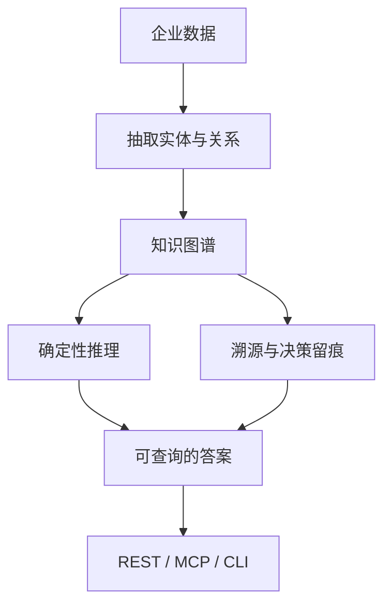

# 当 AI 拍板要负责——想让它能说出"为什么",就得在它脚下垫一层"留痕的脑子"

放贷的 Agent 给客户批了个通过，几个月后监管来问"你为什么这么判"。这时候你只有两个选择：要么拿不出像样的"为什么"，等着被罚；要么从头到尾每一步都有据可查，能甩一份让审计点头的"决策链路"。

这不是"要不要纠结"，这是**"合规会不会把你架住"**的分水岭。大多数 AI 跟人聊天是好用的，可一到"要负责任地拍板"——比如贷款、医疗、法律——它就露馅了：它记住的是向量，不是因果；它能告诉你"结果像"，说不出"为什么这么决定、依据是什么、这几步怎么环环相扣"。

今天我想聊的 Semantica，就是冲着这个"留痕、可解释、可追责"去的。

---

## 1. 这到底是干嘛的

先把它钉死：**它不是一个"AI 画图/聊天"工具，而是一层垫在 LLM、向量库、Agent 框架**底下**的"确定性基建"。** 官方叫它"Graph-Native Infrastructure for Context and Accountable AI Systems"，圈里更直白一点喊它"AI Agent 的开源版 Palantir"。

它干的活一句话能讲完：**把你企业里的数据喂进来，抽出重点，建成一份"上下文图"(Context Graph) 和知识图谱(KG)，再在这张图上面跑图分析、因果推理——整个过程的决策和溯源，统统给你记进档来。** 关键在最后四个字：可解释、可追溯、本身就可信。

它尤其不是为了"填一个网页让我用"做的，而是给**高风险的受监管行业**打地基的：金融、医疗、法律、政府、国防。这些地方，最不能忍受"我把数据送进别人家的 SaaS 换了套黑箱回来"。Semantica 主打三样——

- **开源、可自托管、可审计**：代码和推理图谱都是你自己的，数据不出你边界。
- **严格确定性**：图构建、推理、溯源**完全不需要 LLM 参与**，跑出来是什么就是什么，不是碰运气。
- **零供应商锁定**：RDF 和三方图谱存储（Neo4j、FalkorDB 那些）都可以替换，不把你拴在一家后端。

一句话：**它不是让你的 AI 更"聪明"，而是让你的 AI 更扛得住"你凭什么这么判"这个问题。**




## 2. 里头长这样

这个仓库是个正经开源项目，不只是个玩具。你要是拆开看，主要就这几块：

```text
semantica/            # 核心 Python 包
integrations/         # Agno / CrewAI / LangChain / OpenClaw 等集成
plugins/              # Claude Code / Codex / Windsurf 等编辑器的插件包
deploy/               # 生产部署模板（AWS / GCP / Azure / Kubernetes / Helm）
docs/                 # 文档与图片
```

它是"全链路流水线"，不是单块库：从一个数据源到一张有因果、有溯源的图，中间每个阶段都是能独立 import 的模块——装数据、解析、归一化、切割、抽取实体/关系/事件、冲突检测、去重，再挂上本体（ontology）、推理和溯源，最后落到可互换的多图/向量存储里，对外用 REST / MCP / CLI 访问。

## 3. 值在哪儿

**1. 每个 Agent 决策，都变成一个能查的"节点"。** 传统上，AI 干过的事顶多记条日志，过去就没了。它把一次决定（比如"给谁放贷"）存成一个第一类对象，还带原因、置信度、元数据。 → 你问"为什么批了他"，能拿到结构化的完整链路，而不是一句空话。

**2. 决策有"上下文"，也能翻"先例"。** 一个决定定下来，它能给你因果溯源回源、类似先例、还牵连了哪些后续决定，甚至按策略规则过一遍合规闸。 → 面向监管级"为什么"，它给的是链路，不是推托。

**3. 因果跟关联，是能被查的、不是靠嘴说的。** 图遍历能答"这些节点怎么连、谁是谁的输入"，还能做中心度、社区发现、链路预测。 → 你之前的 RAG 只能答"像不像"，它答"怎么连、为什么"。

**4. 底层的图数据库，随你换。** 一套写好的、没动业务代码，就能在多种图数据库（Neo4j / FalkorDB / Apache AGE / AWS Neptune 这类）和 RDF 存储之间换。 → 想换一个后端接着跑，也不用重写代码。

**5. 别家 LLM 都能往里接。** OpenAI、Anthropic、Gemini、Mistral、Ollama、DeepSeek 都走同一个 `semantica[llm-litellm]` 封装。 → 不用为了用它而换掉你惯用的模型提供商。

一句话：**它的价值，不是让 AI 变得更像人，而是帮 AI 把"为什么"两个字讲清楚、还扛得住审计。** 我知道你多半在想"这是不是把简单的事搞复杂了"——别急着下判断，看完下面怎么装、怎么用。

一句边界话也说在前面：**它解释的是模型"外"的东西（喂进去的上下文、决策、溯源、关系），不是模型内部的黑盒思维链。** 那部分它不碰，跟任何外部系统一样保持不透明。

## 4. 拉起就能跑

安装很简单，它是纯 Python 库：

```bash
pip install semantica
```

装完先自检一下：

```bash
semantica doctor
```

`doctor` 会帮你检查 Python 版本、依赖、配置等有没有毛病。要快速体验、把"决策"记进去看长啥样，几行就能：

```python
from semantica.context import ContextGraph

graph = ContextGraph(advanced_analytics=True)

# 每个决策都变成可查询、可审计的节点
decision_id = graph.record_decision(
    category="vendor_selection",
    scenario="Choose cloud provider for HIPAA workload",
    reasoning="AWS offers BAA, mature HIPAA tooling, and existing team expertise",
    outcome="selected_aws",
    confidence=0.93,
)
```

更多这类的查询（因果链、相似决策、影响、合规闸），它都给你准备好了。命令速查：

| 目的 | 命令 |
| --- | --- |
| 安装核心 | `pip install semantica` |
| 自检环境 | `semantica doctor` |
| 启动后台(带 Web) | `semantica` |
| 查看全部命令分组 | `semantica --help` |
| 接外部图库 / 向量 | `pip install semantica[graph-neo4j]` 等 |

## 5. 装到别处也能用（多环境安装）

它集成的方式多，我把常见的分开讲，用对话给你看"怎么装、能干嘛"。先声明一句：**仓库里那些官方 integration 是它自带的，你把"你的 Agent + Semantica"这套自己组起来跑，严格说属于"组合使用"**，具体以你装到的包和版本为准。装法总共就两条路：`pip install` 装核心，再按你要用的框架点对应的 extras。

```text
用户  ❯ 我这个项目想用 Claude Code / Cursor 这类 agent，Semantica 能进去吗？

助手  ❯ 能。它给 Claude Code、Cursor、Codex、Windsurf、OpenClaw、VS Code
      这些都有现成插件，装包里就有。想自己把语义层塞进去，也可以进他们
      `plugins/` 目录里挑对应的。具体以那份插件的 `install` 为准。
```

再用 MCP 接一个能调 MCP 的客户端（Claude Desktop、Windsurf、Cline、Python 工具），30 秒就接好：

```bash
python -m semantica.mcp_server
# 或用入口命令
semantica-mcp
```

```json
{
  "mcpServers": {
    "semantica": { "command": "python", "args": ["-m", "semantica.mcp_server"] }
  }
}
```

**如果是在 PyCharm / Python 里写 Agent（用 Agno、LangChain 这样的框架）：**

```text
用户  ❯ 我在用 Agno 搭一个多智能体团队，想让它们共享一个上下文图。

助手  ❯ 那装 `semantica[agno]` 就行，它提供团队共享的上下文、
     决策记录、KG 工具。想让 LangChain 直接接，就 `semantica[langchain]`。
```

官方给的包的 extras 里头的几条（都原样）：

```bash
pip install "semantica[agno]"
pip install "semantica[crewai]"
pip install "semantica[langchain]"
pip install "semantica[graph-neo4j]"
```

文档里还强调了一个挺值钱的前提：图构建、推理、溯源都是确定性的，**不非要 LLM 也能跑**；而 `semantica[llm-litellm]` 是当你想要上层 LLM 对话时，把 OpenAI / Anthropic / Ollama / DeepSeek 这些模型接进来的那个 extra。

收个尾。它不是那种"装完马上出活"的小工具——它是给"决定要不要继续深挖"这件事打地基的。你要只想要个聊天机器人，那它帮不上忙；但你要是给 AI 装了会拍板的场景，这个"留痕、能对审计负责"的层面，值得你认真看一眼。

## 6. 项目在这

`https://github.com/semantica-agi/semantica`

#AI #Agent #知识路径 #审计 #溯源 #开源 #图数据库 #决策智能
