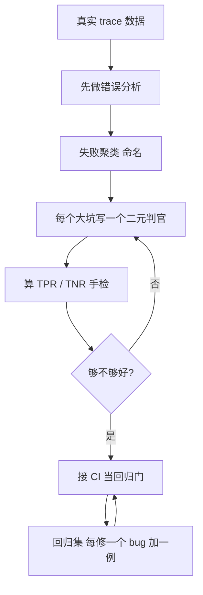

# Evals 是不是新的单元测试？Awesome Agent Evals：把"AI 怎么评"做成了份有门槛的资料库

先交底：**如果你要做 AI 评测 / agent 评测，这份开源资料库可能就是最近 20% 的时间里，最该先拿来当"总纲"读的东西。** 它叫 `awesome-evals`，是个 GitHub 上由 BenchFlow 维护的"Awesome"清单——但你跟它聊两句就会发现，它把两个字母顶在最前面，特别刺眼："**non-BS**"（不含糊、不说虚的）。大多数 awesome 清单是"链接堆"：一长串 URL，谁跟谁有关全靠自己猜。这份不是。

**它干的事一句话：把"构建和评估 AI agent"这条路上最值得看的资料——论文、博客、演讲、课程、工具——做了筛选、标注、核验，编成一份"有注释、无废话"的地图，旁边还附了一份能跑代码的玩法手册。** 它不是个能 `pip install` 的工具，它是一份**带你入局的知识总纲 + 可执行的评估设计模式**。它帮你把力气花在该花的点——用筛过后剩下的"精读集"和"必读集"帮你把精力放在刀刃上。

这份清单是带注释、带验证的：**每一条都会告诉你"这是什么、为什么值得进来"，URL 都人工核过，引文只拿"原文原句"，死掉/废弃的工具会被剃掉而不是默默排进去。** 卷子里标的数字很扎眼：**443+ 条精选链接、143 篇深度阅读笔记、47 场演讲/播客转写**。也就是说，它把"从何下手啃 AI 评测"这件事，替你做了几周的文献调研。

- 仓库: `https://github.com/benchflow-ai/awesome-evals`
- 可跑的玩法手册（重点看这个）: `https://github.com/benchflow-ai/awesome-evals/blob/main/PATTERNS.md`

---

## 为什么它对" AI 评测 / AI 测试"这条路特别有用

先说你最关心的：它对你到底有没有用？有，而且从第一条就给你那种"对上了"的感觉。

往前推一阵子，大家觉得"LLM 能不能评"就是个玄学。可这几年大牛们把这事说通了：**Greg Brockman 那句被全场反复引用的话——" Evals 就是新的单元测试"**；Shunyu Yao 说**"评估变得比训练还重要"**；Eugene Yan 说得更狠——**"再买一个评测工具也救不了你的产品，你得先改流程"**，并把 evals 叫作"伪装成科学的科学方法"。这份库的第 1 节，就把这些"为什么需要 evals"的正反两面全塞给了你。

而真正扎到你心里、让你愿意花周末啃它的，可能还有这几条：

- **"聊天够不够好"评测是张表格，"agent 能不能干活"评测是一套系统。** 库里引的那句话是:"Chat eval was a spreadsheet; agent eval is a system."——你得评结果的"世界状态"（比如订机票这事，到底有没有真写进数据库），而不是只盯着聊天记录看起来像不像。这对你从"看看他回答得好不好"升级到"看他真把活干利索没"特别关键。
- **可验证的比可评判的强。** 库里有句核心判别："verifiable beats judgeable"。能用代码/单元测试/数据库 diff 判的，比靠一个 LLM 当裁判判的可靠。它比一般教程更早地帮你把"这该用断言，那才该用 judge"分得清。
- **污染是现代评测的大坑。** 你的模型训练数据里很可能就带过那些"公开 benchmark 的答案"，它也许是在"背题"不是在"做题"。这份库给了你"抗污染评测"的设计思路（比如按模型训练截断时间划过窗口只评这些之后的题）。
- **成本要当一等公民。** "AI Agents That Matter"（Kapoor 等的论文）被它放进必读：评测不只是准不准，还要把"跑这一遍花多少钱、用多少时间"算进去——做 AI 测试你现在特别吃这套。

---

## 从零到能做 agent 评测，它给的落地方向是这样一条链

下面这张图不是它的原图，是我根据它的玩法手册（PATTERNS.md）把"从无数据到敢上生产"这条链路画出来。你会看到，它的核心是一直"**看数据 → 出错模式 → 针对性地写二元判官 → 抠出召回率 → 上 CI 当门禁**"，而不是一上来就买一堆通用打分器。



具体地，"搭一套能上产线的、对的 agent 评测"，它给了几块能动的落点：

**1. LLM-as-judge：先对齐到人，再上量。** 最忌讳的事，是看到 8000 条 trace 就直接拎一个 judge 去泛读。它对的做法是：先看你手上真实 trace 的出错模式（用人工把每条 trace 的第一个错写下来），再针对**你亲眼见到的主坑**写专属的二元（PASS/FAIL）判别器，再用一批专家标注过的 few-shot"批评样本"去喂它，最后**在留出集上分别算 TPR（真实坏例里抓到了几成） 和 TNR（好例里有没有误伤）**——而不是只报一个"准确率"，因为在失衡数据里 90% 都是 PASS 时，哪怕什么都抓不到，准确率也看着像 9 成。

**2. pass@k、pass^k——你到底在问"能力"还是"可靠"。** 真到你要落地时，最容易把这两个搞混：`pass@k` 说的是"这 k 次里碰上一次成功就行"（写代码够一句答案就对），`pass^k` 说的是"这 k 次你必须次次都成"（对一个客服 agent，次次都按规则来才叫可靠）。它把 OpenAI human-eval 里那个无偏估算也写进了玩法，别拿 `1-(1-p)^k` 那个偏高估计糊弄自己。

**3. 能用一行断言就别上 LLM 判官。** 就算你测再久，一大半其实是"没把占位符 `[name]` 填上"这种机械错。而这一段就是能`json.loads`、`assert` 一把过的。库的意思很利落：**大部分你亲眼见过的错误，顺势就能用正则/切点/JSON/数据库 diff 判个清清楚楚，真正"还得靠裁判"的只剩一少撮。**（它有 `pytest`、`promptfoo`、`deepeval` 三种等价表达，下面会看一行。）

---

## 亲自动一步：给一个"电商客服 agent"搭起二元判官 + CI 门

我不给你空话，直接给你 PATTERNS.md 原文里那段真实、可跑的判官代码。场景放到你熟悉的：一个客服 bot。它对错的坑，是**会编造一个时间**（比如客户问"有没有 7 月 1 号两居"，它对你说"有的！7 月 1 号两点看房"，但"两点"根本不在它资料里）。

你要为"会不会捏造"写一个判断器。代码照抄就能跑（它是 PATTERNS.md 里忠实还原的 few-shot 二元判官写法）：

```python
# 摘自 awesome-evals / PATTERNS.md —— binary LLM-as-judge (cot_classify)
JUDGE_PROMPT = """You are evaluating whether an AI assistant's reply meets a
specific criterion. Here is the data:
[BEGIN DATA]
*** [User request]: {input}
*** [Assistant reply]: {output}
*** [Criterion]: The reply must directly answer the user's question using ONLY
facts present in the provided context, and must not invent appointment times.
[END DATA]

First, reason step by step about whether the reply meets the criterion. Do not
state your verdict at the outset. Then print ONLY "PASS" or "FAIL" on its own line.

Reasoning:"""

# 关键：把专家标注的 few-shot 样例变成判官的核心，而不是硬要塞长 rubric
FEW_SHOT = [
  {"input": "Do you have a 2-bed available for July 1?",
   "output": "Yes! I have a 2-bed ready July 1 at 2pm.",
   "critique": "FAIL — invented a tour time ('2pm') that was never in context.",
   "label": "FAIL"},
  {"input": "What's the pet policy?",
   "output": "Per our listing, cats and dogs under 40lbs are welcome with a $300 deposit.",
   "critique": "PASS — every fact ($300, 40lbs) is grounded in the context.",
   "label": "PASS"},
]

def build_messages(input, output):
    shots = []
    for ex in FEW_SHOT:
        shots.append({"role": "user", "content": JUDGE_PROMPT.format(input=ex["input"], output=ex["output"])})
        shots.append({"role": "assistant", "content": f'{ex["critique"]}\n{ex["label"]}'})
    return [*shots, {"role": "user", "content": JUDGE_PROMPT.format(input=input, output=output)}]

# 上线前：在留出集上分别算 TPR / TNR，而不是只报一个平均准确率
def validate(judge, labeled):  # labeled: [(input, output, human_label in {PASS,FAIL})]
    tp = fp = tn = fn = 0
    for inp, out, human in labeled:
        verdict = judge(inp, out)          # "PASS" or "FAIL"
        fail = (verdict == "FAIL")
        human_fail = (human == "FAIL")
        if fail and human_fail: tp += 1
        elif fail and not human_fail: fp += 1
        elif not fail and not human_fail: tn += 1
        else: fn += 1
    tpr = tp / (tp + fn) if tp + fn else 0.0  # 真的坏例里抓到了几成
    tnr = tn / (tn + fp) if tn + fp else 0.0  # 真通过例里有没有误伤
    return {"TPR": tpr, "TNR": tnr, "FP": fp, "FN": fn}
# TPR 和 TNR 同时高（比如 >= 0.9）再上；否则换判官模型，别去堆 rubric
```

想再往前一步、把"没填占位符、JSON 对不对、send_email 到底发没发"这些硬判接进 CI，它能给你现成的 `promptfoo` 配置，和这份"当联合便禁止合入"的 GitHub Actions。核心精神是：**每个 bug 修完，把那一个触发用例拷进回归集，固定进 git，CI 跑不过 95% 就不给合**。这就把"AI 的可变性"变成"普通测试的门禁"。

---

## 想快速入局，从这条"必读集"看起


- **Anthropic《Demystifying Evals for AI Agents》**——agent 专属评测的最佳入门：任务设计、结果 vs 轨迹、孤立实验、`pass@k` vs `pass^k`。
- **Hamel Husain & Shreya Shankar《LLM Evals FAQ》**——最密的操作性问答：错误分析、二元判定、"仁者见仁的标注员"怎么选。
- **Anthropic《A Shared Playbook for Trustworthy Third-Party Evaluations》**——独立第三方评测怎么做到可信：harness 选择、会坑你的校验漩涡、第三方评估者需要的标准。

再加上 Greg Brockman 那句"Evals are the new unit test"（官方常拿它当起步金句）、**Eugene Yan 的"评测是流程不是工具"**、**Nathan Lambert 的"LLM 评测没有 ground truth"**——这几个就把"为什么需要 evals"这一轮的立论讲完了。剩下的 400 多链接，你按自己那块的坑去挖就行。

---

## 边界，别神化它（我把它也摞给你）

它很强，但也有它的"不是"：

- **它不是个你跑一下就能出分的工具。** 它是一个**资源库 + 玩法手册**。真正要跑、要算，你得从它的 PATTERNS.md 里把模式抄下来，自己接 `promptfoo` / `deepeval` / `verifiers` 这些周边工具去建。
- **它收录的分歧也不小。**"评测是否只是变相的打榜""LLM judge 是不是自己人欺己"这类，库里也明摆着收录了正方反方（比如有 Greg Brockman 那句"评测就是新的单元测试"一边有 Nathan Lambert 那句"大厂打榜都只是营销"）。**你要的不是让库替你裁决，而是把两边的链接当成你自己的原始证据。**
- **真到生产你还是要踩一遍真地。** 再精选的清单也不能替你"翻 opencode、翻 vendor 文档、在你的 App 上跑一遍"。它的价值是让你从一个聪明的起点走，而不是你从零往差路上撞。

想把 agent 评测这摊事从"凭手感"变成"有谱"，它确实值得你认真通读一遍——尤其那份能跑的玩法手册。

官方入口：仓库 `https://github.com/benchflow-ai/awesome-evals` · 玩法手册 `https://github.com/benchflow-ai/awesome-evals/blob/main/PATTERNS.md` · 维护方 `https://benchflow.ai`

#AI #agent评测 #LLM #评测 #错误分析 #单元测试 #开源 #资源
