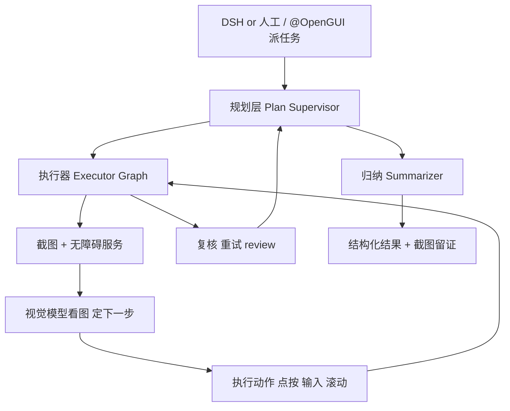

# 让 AI 自己点真安卓 App——OpenGUI 把手机端 UI 自动化做成了"发一条命令就跑"

做 app 测试的人，多半都念叨过这么件苦差事：**回归的时候，得拿真手机一步步点。** 你跑了半年多的 App 要发版前做一遍冒烟，于是搬出真安卓，开搞，点首页、点搜索、进详情、走下单……一个流程几十步，点错一步就得重来。而现在你想把"点手机"这件事丢给 AI，又卡在"AI 还得能看见屏幕、会点屏幕"这层。

OpenGUI 就是冲这个来的一个开源项目。**它干的事一句话：让 AI agent 能在真实安卓手机上"看到、看懂、并且动手"——看屏幕、规划下一步、点按输入、回来给你结构化结果。** 它是个"手机 GUI agent 框架"，专门跑在安卓设备上，能接管真机界面当"操作员"。官方原话是：帮 AI agents 在真安卓设备上**看到、理解、操作 App 界面**。这不正是"把 UI 自动化测试里的'人''换成'模型'"那一层吗。

而且对用 DeepSeek Harness 的人更有意思：它做成了一个插件 `dsh-coremate-mobile`，**装上之后不用搭整套后端，直接在 Harness 里发 `/opengui` 就能让 AI 帮你点手机、截屏、跑回归**。这篇就从"一个 UI 自动化测试/回归工程师的视角"来拆它——它到底能干嘛、怎么把它接到你的自动化流水线、能照抄的命令有哪些。

它不是个聊天框，也不是个现成的"录脚本回放工具"，它是一套**能在真机上多角色协作、能跑长任务、能留截图证据**的 UI 操作底座。至于它能不能拿来就用起来，下面展开讲。

---

## 它本身解决的是哪一类题，先掰开说

传统 UI 自动化，核心是**脚本编写 + 元素定位**（找控件、写 ADB 坐标、录回放），一旦界面改版定位就挂。OpenGUI 换了个思路——**它不让脚本碰控件，它让模型"看屏幕理解后在真机做操作"**。它把"读屏幕 → 规划 → 执行 → 复核"这条链给你搭好了：



也就是说，一个" 回归用例"从定义到给出可断言结果，中间"截图、看图、定步、操作、复核、归纳"这一整套它都替你扛了，最后丢给你的是一份「发生了什么、做到了什么、还剩什么」的结构化结果——正好能当你断言、也留底账。

---

## 对" AI + UI 自动化测试"它到底能帮你做到哪些点

**1. 真机上的 UI 操作与回归，能自动化了。** 仓库的"典型用途"里第一句就写着：**在已授权设备上做自动化 UI 操作与回归测试**。你可以在真实 App 里，让模型按自然语言把一整条用户路径走完，而不是手写几十行查找控件。

**2. 长任务扛得住：一次跑几小时，中途还给你"人审"。** 它设计上就面向手机里的长流程（可能跑几小时甚至一晚上），在系统内带有进度、复核、恢复这层。你不用守着，出事它会停下来请你拍板。

**3. 截图保留 + 结构化结果，测试断言和复核都有着落。** 任务完成后它会交一份结构化的总结——哪些做到了、哪些没做到、还有哪条需要关注。视线断了、要补截图查证，都有据可循，这正好是 UI 回归最难保证的"留证"。

**4. 规划用的模型和执行用的视觉模型，能拆开按厂商挑。** 计划、监督、看图这几件事可以不走同一个模型，你按活挑 provider（官方给了优先级表）。既能控质量也能压成本——官方的省钱组合是文本侧用 Qwen 3.6 Plus、视觉侧用 Doubao Pro，配合全 Claude Opus 大概能省 10~15 倍的模型成本（视任务长短和截图量而定）。

**5. 也能接进你看熟的工具。** 它提供本地 REST API、CLI、以及给 Codex / Claude Code / OpenCode 用的引导与远程控制 Skill，还有飞书 / Telegram / Discord / REST 通道。换句话说，除了跑在 DSH 里，你也能让别的编码 agent 直接指挥手机干活。

---

## 最快的那条路：当 DeepSeek Harness 插件用（推荐，不用搭后端）

插件 `dsh-coremate-mobile`（当前稳定版 v0.1.5）让你 **不用部署整套后端**，就在 Harness 里通过 `/opengui` 控制一台或多台已授权的安卓手机、以及插件自己管理的本地浏览器。它通过受限的「手机子任务 / 浏览器子任务」来干活，父 agent 可以观察到里头的调用过程和结果。

**装之前确认：** 已装并能启动官方 DeepSeek Harness（基线 `0.1.0-rc.7`）、Node.js `^22.19.0` 或 `>=24`、能访问 GitHub Releases、一台已授权并选中的安卓手机。当模型不兼容时，OpenGUI 会引导你配一个独立的 OpenAI 兼容视觉模型做回退；但**默认复用你在运行的 DSH 会话模型**，不强制单配。

**安装（macOS 用 Codex Skill 一条龙）**：让 Codex 去仓库里那目录，跑 `$opengui-coremate-install` 这个安装 Skill。它会去 OpenGUI 公开 Release 拉取固定版 `v0.1.5` 的安装包与 SHA-256，校验后只装这个插件、保留你 Harness 其它配置，需要时自己把 DSH 拉起来。**手动安装**也适用于所有平台：

```sh
# 下载发布包与校验文件
#   dsh-coremate-mobile-0.1.5.tgz
#   dsh-coremate-mobile-0.1.5.tgz.sha256
# 校验 SHA-256（macOS）
shasum -a 256 -c dsh-coremate-mobile-0.1.5.tgz.sha256

# 装进 web profile
dsh plugin --profile web add /绝对路径/dsh-coremate-mobile-0.1.5.tgz
```

用 `npx` 启动官方 CLI 的话，把 `dsh` 换成 `npx @deepseek-ai/dsh@0.1.0-rc.7`。首次安装若报 `ERR_PNPM_IGNORED_BUILDS`，把仓库说明里那两项 `allowBuilds` 合并进 profile 的 `pnpm-workspace.yaml` 再重试（别整文件覆盖）。

**验证装载**：启动后发一条独立消息：

```text
/opengui
```

预期回 `Usage: /opengui <task>`——说明插件命令已装载，且空命令不会碰模型配置。

**跑第一个手机任务**，保持手机解锁、已授权 USB 调试，发：

```text
/opengui 打开手机设置，并报告 Android 版本
```

也可以从原生 `@` 菜单选 `@OpenGUI` 再输入同一句。手机选择和状态在 **OpenGUI** Tab 里；多台可选任意一台或多台后再发任务。每一步「能点就点、能往下就往下」，页面实时截图，执行状态和进度会作为结构化结果回给你。

---

## 落一个能跑的自动化回归场景：给手机装个电商 App 跑一遍季度冒烟

假设你维护一个电商 App（类似京东那种）的安卓端，每次发版前要跑一遍"进首页→搜索→进详情→加入购物车"的冒烟。用 OpenGUI，你可以让模型在真机上自己点完这条路径。先用 CLI 看设备：

```bash
cd server
pnpm opengui -- devices --json
```

然后下发一个 `do` 任务（**异步**的，它只负责捡起任务并返回一个 `executionId`）：

```bash
pnpm opengui -- do "打开刚才那个电商App，到首页，在搜索框输入'蓝牙耳机'搜索，进第一个结果详情，点加入购物车。做完依次告诉我每一步看到了什么" --json
```

拿到 `executionId` 之后，用一个 snapshot 查它的当前状态（要更新的画面再跑一次）：

```bash
pnpm opengui -- status <executionId> --json
```

看返回里的 `executionStatus`（`PENDING` 表示等在手机上开始，`RUNNING` 表示正在跑，`FINISHED` 表示完成），以及 `currentStep`、`executionResult`、`errorMessage`。如果跑偏了想停，用同一个 id：

```bash
pnpm opengui -- cancel <executionId> --json
```

这一套不是天边，是把「打开 App→搜→加购→留截图」这样一个 30 秒的 UI 回归路径，交到模型手里，且每一步都有截图可查——对你写断言、复盘、报 bug 都够。

**要跑 DSH 插件的话，它更轻**：上面在 server 下的用的是整套后端 + 本地 CLI；当你只用 Harness 插件那套，`/opengui` 一条命令就够，不用自己起 server 和 client。

---

## 架构和底层：它不是根手机，它只是"替你看和点"

OpenGUI 用了不少成熟的安卓机制，但你没猜对它不 root 手机。它走的是标准无障碍服务（Android AccessibilityService）来截屏和执行操作；ADB 只用来装和启动 APK、配 `adb reverse` 端口转发，**不 root、不改系统**。也不需要解锁 bootloader。

它的系统由几块组成：

- **主图 + 执行子图**：规划（Plan Supervisor）拆成步，执行器（Executor Graph）里跑"截图→视觉→动作→需要用户确认"的循环。
- **待机通道**：手机能挂着待机，从 DSH 案件、REST/飞书/Telegram/Discord 接收远程任务。
- **模型路由**：规划/监督/执行可以分开，用不同（便宜/贵的）模型组合给不同环节。先决条件：你用的模型必须同时支持**图片输入 + 工具调用**。

在你喂给它跑前，先把手机权限都放好（Android 11+ / API 30 以上、打开 USB 调试、用着无障碍服务、授予悬浮窗与电池免杀）。各权限选项的位置在不同厂商之间不太一样。

---

## 边界和坑，也给你摆到台面上

它也有它的短板，别神化：

- **必须真机**：要 Android 11（API 30）及以上的手机或模拟器，要 USB 调试 + 无障碍服务 + 悬浮/电池权限。没有手机它就是空气。
- **执行质量看模型看 App**：跑多快、跑准不准，取决于模型、App 界面、网络、任务长度。要是你的当前模型不会看图/不会调工具，光能聊天动不了手机，得配专用视觉模型回退。
- **不是系统级管家**：它现在不是"常驻后台的全系统助手"，任务要手动触发或走配置好的入口。
- **长任务的可靠性还在磨**：设计上支持长任务，但还需要更多真机实测。
- **授权/隔离不是它的安全兜底**：它不能替你处理"多个租户/用户之间不可共享缓存"这类隔离；官方说明里也提示，带着有敏感/多租户数据前，先看它跟模型及应用的协作责任那几页。

另外补一句：OpenGUI 是 **BUSL-1.1** 源码可用协议，非生产可自由用；**生产 / 商用 / 托管服务要另谈商业授权**。Change Date 到 2030-04-29 之后转 Apache-2.0。要是你买来自己跑本地自动化测试，授权和边界要自己再对一对。

---

## 它能帮你把" UI 自动化测试"这一块怎么推进

说到底，它没想取代你在 UI 测试里的判断力，它想替你换掉那部分**"睁着眼看真机一步步点、手还要人工把用例路径打出来"的真累活**。试验室、回归时，把路径给它：**动手截图、理清看的步骤、必要时（模型没法确定/需要你授权）就停下来问你，做了之后还把一份结构化结果交到你手里**。

对把 AI + UI 自动化当正经做事的人，这就是一个"真机还有视觉的 GUI Agent"落进来的地方——尤其是你手上已经有 DeepSeek Harness 这种底座时，一条 `/opengui`，比搭一套完整手机自动化测试平台要轻得多。

官方文档与更新入口：

- 仓库：`https://github.com/Core-Mate/OpenGUI`
- 组装指南（引导 Skill）：`https://github.com/Core-Mate/OpenGUI/blob/dsh-coremate-mobile-v0.1.5/deepseek-harness-plugin/README.zh.md`
- 官网：`https://opengui.ai/`

#AI #UI自动化 #Android #自动化测试 #agent #回归测试 #DeepSeek Harness #开源
