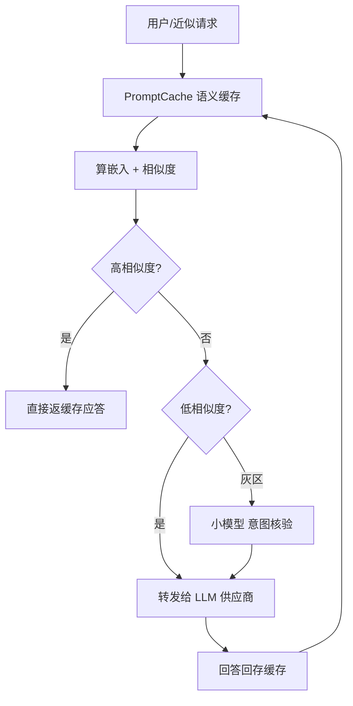

# 用户老问同一句，AI 每次都重新算一遍？PromptCache 给"查重"加了层语义缓存

做 LLM 的人都撞过这么个荒诞的事：**同一个问题，问十遍，模型就跑十遍。** 一个电商客服机器人，十个人问"什么时候发货"，它就真把这问题发给大模型十次、掏十份钱、等十次。你盯着账单想不通——这不是同一句话吗？就不能记住一次答案，下次直接给？可编程上"判断两句是不是一问"这关，又不像 SQL 主键那么好搞：改一个字、换个说法，字符串就对不上了。

PromptCache 就是冲这个来的一个开源项目。**它干的事一句话：在程序和小模型中间，加一层"语义缓存"——它靠"语义"而不是"字符串"判断两句是不是一问，是的话直接返回上次存好的回答，不再真金白银调一次模型。** 一句话，命中缓存就能省下一次上游调用，省的是钱，也省下来回等的时间。对自己托管，仓库在你手里，不进别人的云。它是用 Go 写的，MIT 协议，放 Docker 里就能跑。

它不是聊天工具，也不是通用的键值缓存，它是专门为"GenAI 那点反复出现的请求"做的一层节流阀。至于你该不该、能不能给自家 AI 套上这一层，下面这篇会把它讲明白——包括它不能当什么用（这条挺重要）。

---

## 它解决的是哪一类问题，先讲清楚

它不解决"所有 LLM 请求都该缓存"这个命题，它只针对一个很常见的行当：**生产环境里，LLM 请求有一大部分是"近乎重复"的。** 仓库里明说了这几种：

- **RAG 应用**里，那些总被翻来覆去问的内部问题；
- **AI 客服 / 聊天机器人**，用户反复问的相似问题（"运费怎么算""退货运费谁出""怎么开发票"）;
- **AI 智能体**里反复出现的推理或"用哪个工具"的模式。

只要命中缓存，这一次不需要跑上游生成，**省的是 provider 的用量，省的也是这一次的延迟**。说白了，它是把"十遍"变成"十次查缓存 + 一遍真调"。



---

## 它是怎么"判断同一句"的：两个阈值，留一块灰区

这就是它跟简单字符串比较不一样的地方。它不是对比字面一样不一样，而是**算语义相似度**，用两个阈值来分层处理：

1. **高相似度** → 直接命中缓存，回上次答。
2. **低相似度** → 没命中，把请求转给真实的模型。
3. **灰区**（不高不低，拿不准）→ 可以再用一个**更小的模型**去核验"这俩到底是不是一个意图"，先别急着用缓存结果冒充。

三个阈值相关的都是环境变量：`CACHE_HIGH_THRESHOLD`（默认 `0.70`）、`CACHE_LOW_THRESHOLD`（默认 `0.30`）、`ENABLE_GRAY_ZONE_VERIFIER`（灰区核验开关）。**永远记住 `CACHE_HIGH_THRESHOLD` 要比 `CACHE_LOW_THRESHOLD` 大**，不然逻辑就自相矛盾了。

一句大白话就是——**它不想一上来就把"看着像"当成"就是"，宁可用一个小模型多核验一下。** 但它也把话撂这儿了：语义相似永远只是个概率，它不保证"两句肯定能互换"。

⚠️ 这里它强调了一条红线，务必不要踩：**语义相似不能当安全/授权边界。** 别拿缓存匹配去当"不同用户、不同租户、不同权限之间"的隔离手段——那会出大问题。它的索引是进程级的，**没有内置的租户隔离**。要是不同客户不能共享缓存数据，要么分开部署，要么在查之前自己加可信分区层。

---

## 拉起来跑：Docker 一把起，接口跟 OpenAI 兼容

最简单的一条路，Docker 一把起：

```bash
git clone https://github.com/messkan/prompt-cache.git
cd prompt-cache

export EMBEDDING_PROVIDER=openai
export OPENAI_API_KEY=your_key_here

# 强烈建议：任何非本地部署都要设
export API_AUTH_TOKEN=your-secret-token

docker-compose up -d
```

不想用 Docker，直接跑源码也行：

```bash
./scripts/run.sh
# 或
make run
```

起来后它是一个 **OpenAI 兼容的接口**。也就是说，你手里那套 OpenAI SDK 只要把 `base_url` 改成它就行，其它几乎不改：

```python
from openai import OpenAI

client = OpenAI(
    base_url="http://localhost:8080/v1",
    api_key="your-openai-api-key",
)

# 第一次请求会转发给上游 provider
client.chat.completions.create(
    model="gpt-4o-mini",
    messages=[{"role": "user", "content": "Explain quantum physics"}],
)
```

**第一次**：它把请求转发给你配的 provider（比如 OpenAI），跑一遍真模型。
**后面再来一句足够相似**：它可能直接从缓存里把回答给你，不转发上游。

---

## 落一个具体场景：电商客户一个问题问十遍，让它一遍就行

下面这个场景，把"语义缓存在这儿能干嘛"落到看得见的地方。一个客服机器人每天回答"商品运费谁出、怎么退换、什么时候发货"这类问题，一天能问几百遍、其中大部分意思完全一样——只是每个人的措辞略有不同。**用 PromptCache 之后，第一遍真调，后面反复问就缓存回，不再真调。**

我们用 Python 的 OpenAI 兼容客户端来怼它，模拟一个电商客户反复问"退款"这同一件事：

```python
from openai import OpenAI

client = OpenAI(
    base_url="http://localhost:8080/v1",   # 指向 PromptCache，不再是真实 provider
    api_key="your-openai-api-key",
)

def ask(q):
    r = client.chat.completions.create(
        model="gpt-4o-mini",
        messages=[{"role": "user", "content": q}],
    )
    return r.choices[0].message.content

# 第一次：真模型生成的回答，被缓存
first = ask("商品想退货，什么时候能退款？")

# 后面几次：意思几乎一样、措辞略有不同，命中语义缓存
repeat = ask("我买的东西要退，退款多久到账？")
repeat2 = ask("退货之后哪天钱回来？")

print(first)
print("---")
print(repeat)   # 很大概率直接是缓存里同一份回答，不再重新算
```

这段不是吹，也不是包治百病：**语义命中全靠那两条阈值和那层小模型核验，不是百分百。** 你要是把关键阈值调紧、或者完全关掉灰区核验，缓存命中率和"会不会乱答"也会跟着变。

跑完你可以从管理接口拉一下统计，看看有多少被 hit 拦住、多少 miss 转发：

```bash
curl http://localhost:8080/v1/stats \
  -H "Authorization: Bearer your-secret-token"
```

`/v1/stats` 这类管理接口带 Bearer 认证。要是没设 `API_AUTH_TOKEN`，管理认证会被关掉，并打一条警告——所以任何非本地部署，**务必设**。

---

## 它支持哪些 provider，怎么配

用 `EMBEDDING_PROVIDER` 挑用哪家的嵌入。默认值：

| Provider | 嵌入（判断相似度） | 核验（灰区小模型） |
|---|---|---|
| OpenAI | `text-embedding-3-small` | `gpt-4o-mini` |
| Mistral AI | `mistral-embed` | `mistral-small-latest` |
| Anthropic / Claude | `voyage-3`（走 Voyage AI） | `claude-3-haiku-20240307` |

比如换到 Claude 要配 `ANTHROPIC_API_KEY` 和 `VOYAGE_API_KEY`。**Provider 名称只代表兼容性**，这项目独立、不是 OpenAI 等官方附属，用的时候心里有个数。

**上线运行环境里怎么调阈值**：支持运行期改，不用重启进程。读当前配置：

```bash
curl http://localhost:8080/v1/config \
  -H "Authorization: Bearer $API_AUTH_TOKEN"
```

改阈值（要求 `0 <= low < high <= 1.0`）：

```bash
curl -X PATCH http://localhost:8080/v1/config \
  -H "Authorization: Bearer $API_AUTH_TOKEN" \
  -H "Content-Type: application/json" \
  -d '{"high_threshold": 0.85, "low_threshold": 0.40, "enable_gray_zone_verifier": true}'
```

还能"灌缓存预热"（把你已有的标准回答提前塞进去，让高命中问题起步就有缓存）：

```bash
curl -X POST http://localhost:8080/v1/cache/warm \
  -H "Authorization: Bearer $API_AUTH_TOKEN" \
  -H "Content-Type: application/json" \
  -d '{
    "entries": [
      {
        "prompt": "What is Go?",
        "response": {"choices": [{"message": {"role": "assistant", "content": "Go is..."}}]}
      }
    ]
  }'
```

语义检索项目内部是"**BadgerDB 持久化 + in-memory LRU + ANN 索引**"，缓存 TTL 默认 24 小时。别把"缓存 TTL"当成数据保留策略——如果你的 prompt 会带个人/敏感/租户信息，先看它官方那份 responsible use 再动手。

---


官方文档与接口细节：`https://messkan.github.io/prompt-cache`，仓库在 `https://github.com/messkan/prompt-cache`。

#AI #LLM #语义缓存 #缓存 #成本优化 #大小模型 #客服 #开源 #质量
