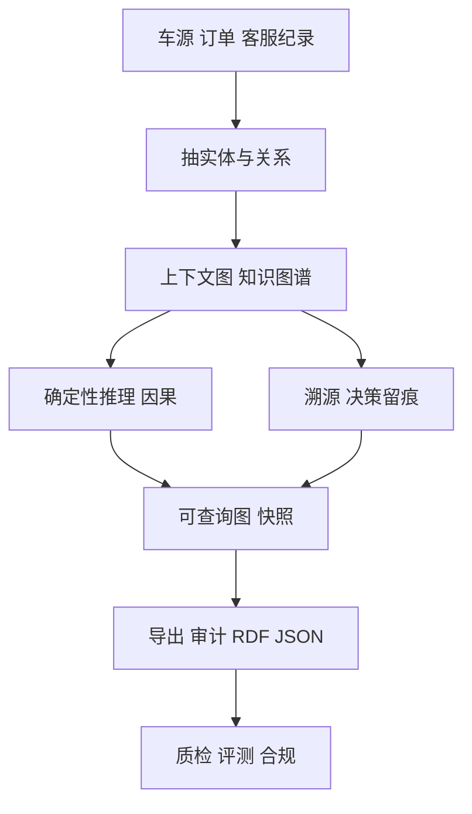

# 二手车平台的 AI 凭啥出这个价、凭啥退这笔？Semantica 把每个决定记成能查的图

现在互联网业务里，AI 早就不只干"推荐个商品"这种小事了，它开始真刀真枪**替你做决定**：

- 二手车平台，AI 看到一台车上传的照片和车况，直接给这台车**估个收车价**——低了卖家不卖，高了平台亏钱；
- 电商（京东这类）平台，AI 客服接到"这单商品坏了，我要退货退款"的投诉，直接**答不答应退、退多少**；
- 生鲜、出行、售后平台，AI 判断**该不该补偿、该赔多少**。

以前这些"决定了就完事了"。可问题来了：**它拍板那一刻，过程往往就没了。** 你售后一纸纠纷怼上来、平台被抽检要"你为什么给这台车这个价 / 为什么给这个订单全额退款"的证据——AI 翻个白眼，回一句"模型算出来就这样"。这在个人用无伤大雅；可放到**要追责、要审计、要被监管**的业务里，这一句"就这样"，是要出问题的。

Semantica 就是冲这个来的一个开源项目。**它干的事一句话：把 AI 每次"决定"的前因后果、上下文、因果和来源，做成一张能查、能审、能复核的图。** 圈里有人叫它"AI Agent 的开源版 Palantir"，名字唬人，拆开看就是一层**"记账的底"**——它不是让你的 AI 更懂业务，而是让你 AI 说过的每句话、做过的每个决定，都有据可查，出事能翻旧账。

它不是个聊天框，也不是个"装完就帮你把测试跑完"的现成工具，它是你搭**要给监管交代、给审计交底的 AI**时，垫在下面的那一层底座。这篇我挑一个互联网场景——**给一台二手车的"AI 定价 + 售后退赔"记录全套可审计的证据**——把功能、安装、试跑全铺开。

---

## 它把"决定"变成图，而不是几行日志

名字里的"Graph"不是客套。它把 AI 背后的一切，放进一张**图**里来管。图里，实体、关系、决策、事实，各是一个节点；节点之间用带类型的边连起来，比如"谁影响了谁""谁是谁的输入""跟哪条车源对上"。

一张图，比一堆向量强在哪——**向量只能答"谁跟谁像"，图能答"谁跟谁连着、为什么连着、从哪来的"。** 它不会把一个实体当孤零零的点；它会告诉你，这台车、这份检测报告、这笔报价之间转了几个弯、怎么扯上关系的。更关键的，每个节点都**挂着它的出处（provenance）**，你能一直追问"这信息到底打哪来"。

从原始数据到能用，中间就是一条这样的链路，我先画出来，后面照着讲：



---

## 它在"AI + 测试 / 质检"上到底能干什么，几个有料的点

**1. 每个决定，都是带全生命周期的图的点。** 它用一次 `record_decision()` 把一次"估价 / 判赔"记成带原因、带来源、带链路的图节点，字面一直存在，不是过眼烟云。它还有 `add_causal_relationship()`、`find_similar_decisions()` 这些。→ 你测一个估价 / 客服 agent 时，"这轮为什么给 8 万""那轮怎么判的"，都能随手存进图里随时翻。

**2. 历史快照能往回看。** 你想看某一天的图长什么样，`state_at()` 一把拉出当日的底账。→ 复现、回归时不用把整套从头再跑一遍，拿快照直接复盘，抽旧账也方便。

**3. 冲突不会被坏数据悄悄覆盖。** 新信息跟旧图对不上的时候，它会**标成冲突让你来定**，而不是默默覆盖掉。→ 对车源信息这种"多渠道、可能有矛盾"的数据，这个"别乱覆盖、给我标出来"就很关键，不让自己知识库被脏事实污染。

**4. 推理是带解释的，不是黑盒。** 它有前向链、Rete、Datalog、SPARQL 等推理引擎，且**输出的是能讲明白的路径**。→ 问它"你凭什么给这个定价"，它能给你一条可看的推导，不是甩个毫无上下文的结果。

**5. 底层存储随便换，换后端不碰代码。** 图可以落 RDF（Oxigraph、Blazegraph、Apache Jena）、也可以落 LPG 图库（Neo4j、FalkorDB、Apache AGE、AWS Neptune），还能配向量库（FAISS、Pinecone、Weaviate…）。→ 数据放哪你说了算，自己托管就不被一家绑死。

---

## 落一个具体的落地场景：给"二手车 AI 估价 + 退款判定"配全套证据

下面这一大段我把最典型的"受监管的 AI 决策留痕"——**一台二手车从估价到成交的 AI 决策链**——亲手走一遍，代码能直接在 PyCharm 建个 `.py` 跑起来。你会发现你测一个估价/客服 agent 时想留的那些证据，这套能原样给你存下来并且能再生出来给别人复核。

先装库、起一张图：

```bash
pip install semantica
```

```python
from semantica.context import ContextGraph

graph = ContextGraph(advanced_analytics=True)
```

### 第一步：AI 第一次"决定"——给这台车估价

估价 agent 先看了一眼车源，调 `record_decision` 把"这台车值多少"这个决定记成图的点，带上理由和置信度：

```python
appr_id = graph.record_decision(
    category="car_valuation",
    scenario="Wuling MINI EV 2022, 1.2万km, 无明显事故, 报价 5.6万",
    reasoning="同款市场成交区间 5.2-6.0万; 行驶里程低, 车况好, 无事故记录",
    outcome="price_56k",
    confidence=0.92,
)
```

### 第二步：信用/风控那一步的"后续"决定

车源可能牵扯分期金融。AI 又对这笔车子的金融风险评估做了一次"后续决定"，跟估价用因果关系连起来：

```python
fin_id = graph.record_decision(
    category="finance_risk",
    scenario="车源 Wuling EV 2022: 分期申请, 首付 30%",
    reasoning="客户收入与征信达门槛; 车辆价格低, 风险可控; 但提交材料缺行驶证照片",
    outcome="conditional_approval",
    confidence=0.86,
)

# 补上因果链：估价影响了后续金融
graph.add_causal_relationship(appr_id, fin_id, relationship_type="CAUSED")
```

### 第三步：挂上车辆与订单的来源

把"这台车的信息是从哪条车源纪录、哪份检测报告抽出来的"记下来，给你的"为什么"一个出处：

```python
from semantica.provenance import ProvenanceManager
prov = ProvenanceManager(storage_path="./car_audit.db")
prov.track_entity("vehicle_WHL_2022", source="marketplace/inventory_2026q1.json",
                  metadata={"extractor": "VehiclePropertyExtractor"})
```

### 第四步：把整条决策链吐出来给质检 / 监管看

把因果链和出处导出成 W3C PROV-O——也就是合规框架认的格式，落个审计文件给业务侧或者审计：

```python
from semantica.export import RDFExporter
kg = graph.to_kg_dict()                    # 官方适配器，把图转成导出形状
RDFExporter().export(kg, "car_audit.ttl", format="turtle")
```

现在，当有人问"你凭什么给这台 Wuling 估 5.6 万"，你掏出一份 `car_audit.ttl`，里面明明白白：这单估了 5.6 万、为什么（原因原文）、后面怎么牵到分期风控、这台车的信息来自哪份车源文件。**整条因果链是"能查的"，不是"听说的"。** 这就是它区别于日志的地方：你不是记一行"今天估了台车"，你是记了"为什么这样估、依据是什么、来源在哪"。

---

## 除了 Python，它也可以通过 CLI 和一些接口来碰

装包自带完整 CLI，装完在 terminal 敲：

```bash
semantica        # 起 Dashboard 看你的图
semantica doctor # 健康检查
semantica --help # 看全部命令分组
```

命令几乎铺满了整条链路：`ingest`（接入原始数据）、`parse`/`extract`（抽实体与关系）、`kg`（建图）、`reason`（推理）、`decision`（决策）、`provenance`（溯源）、`ontology`（本体）、`export`（导出）、`pipeline`（流程）、`mcp`、`shell`、`watch` 等等。上面那段 Python 干的事，命令行基本都能干。

| 你想干嘛 | 怎么做 |
|---|---|
| 装核心库 | `pip install semantica` |
| 自检环境 | `semantica doctor` |
| 看全部命令 | `semantica --help` |
| 开一个 Web 仪表盘 | `semantica` |
| 后台跑整条流水线 | `semantica pipeline ...` |

---

## 怎么接进你手头那套

它不孤立，能按你顺手的方式接进去：

**接 MCP（Claude Desktop、Windsurf、Cline 都能接）**，先起服务：

```bash
python -m semantica.mcp_server
# 或
semantica-mcp
```

在客户端配置里加一段：

```json
{
  "mcpServers": {
    "semantica": { "command": "python", "args": ["-m", "semantica.mcp_server"] }
  }
}
```

配好后 agent 直接查它暴露的 `record_decision`、`trace_decision_chain`、`find_similar_decisions`、`export_graph` …

**接 Codex / DeepSeek Harness / Claude Code 这类 agent**：既可走 MCP，也可把仓库里的 agent 插件打包挂上。注意这套更偏向"组合着用"，想把它当成标配塞进你自己的 agent 工作时一般要自己搭一层。

**Python / PyCharm**：上面估价那段就是纯 Python，PyCharm 建个 `.py`、用平时 venv 解释器就能跑，不用额外部署服务。

**要上生产**：官方建议用 Docker / Kubernetes 而不是本地 `pip` 跑，再配个持久化的图库（Neo4j / FalkorDB，或 RDF 三元组存储）放数据。

---

## 它给"AI + 测试 / 评测"的那条破口，说清楚

说到底，Semantica 不是让你 AI 更聪明，它是给你 AI 的**决定装了一套能翻的旧账**。对做 AI 测试、评测、质检的你来说，真正有用的是这个破口：**你测的每一个 agent 判断（给这个价、退这笔、判这件合格），都能在它这里留下"可复查、可重放、可交出去"的证据。** 把"我去哪找为什么"变成"图上一查就有"，而且能自托管、不被一家厂商锁死——这层，只是塞个日志是做不到的。

它也有它的边界：**它解释的是"模型外"的东西——喂进去的上下文、做的决策、来的来源、跟谁有关。模型内部那团黑盒子它不碰。** 所以别指望它能拆开 LLM 的"心窝子"。它管的是"外面这一圈为什么"。而这，正好补上了测试与评测里最常缺的那一环——**可查的输入、可查的决策、可查的证据。**

## 关于它（官方源入口）

`https://github.com/semantica-agi/semantica`

#AI #Agent #知识图谱 #二手车 #智能客服 #决策溯源 #评测 #审计 #开源 #质量
