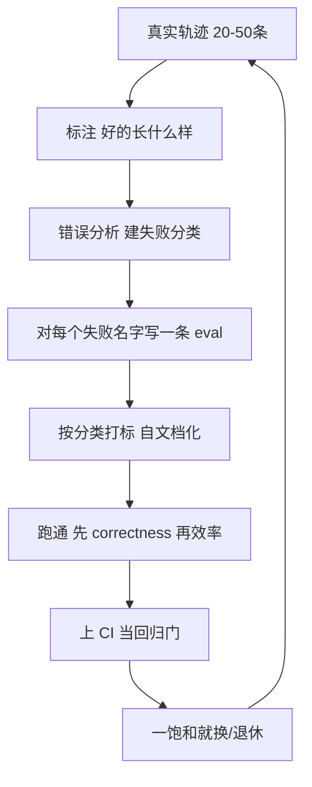

# 给 AI Agent 写 evals 的完整实操手册——把三篇硬核拆开揉碎

先交底：这篇不是一篇观点，是把三篇讲"AI agent 到底怎么写评测"的硬核资料，**拆开揉碎成一套能照着做的完整手册**。三篇分别是：

- **Manjeet —《How to Build Great Evals for AI Agents》**（客服 agent 视角，最"动手"）
- **Anthropic —《Demystifying evals for AI agents》**（工程视角，最系统）
- **LangChain Deep Agents —《How we build evals for Deep Agents》**（开源 agent 框架的真实做法）

三篇各自有侧重点，但拧成一股绳，核心其实就一句话——**好的 evals，不是一张"打分仪表盘"，而是一条"反馈回路"。** 它不生产让老板开心的好看数字，它生产"产品到底在哪一环坏了、下一步该修哪里"这个信息。把这层先立住，后面所有细节才都有着落。

---

## 一、AI agent 的评测为什么这么难？先讲清楚"难在哪"

早期的单轮 LLM 评测很简单：丢一句 prompt 进去，给它一套打分逻辑，判断"它回得对不对"，结束。可 agent 不一样——**它是一个跨很多轮"动手"的系统**：调工具、改系统状态、又拿中间结果去改下一步。Anthropic 那篇把原因说得很透：**让 agent 有用的那些能力——自主、聪明、灵活——恰恰也是让它最难评的能力。** 错误不是孤立的一次，它会在多轮之间**传染、累积、滚雪球**。

更扎心的是，静态评测可能会把手脚绑得太死。Anthropic 举了个例子：**给 agent 一个"订机票"的任务**，结果模型 Opus 4.5 发现了政策里的一个漏洞，搞了一个"在既定规则里算失败、但对用户其实是更好"的方案。你写死的 eval 判它挂了，但它对用户其实干得更漂亮。**评测写得太死，反而把真会办事的 agent 拒之门外。**

所以，做 agent 评测之前，先把一套术语对齐了。Anthropic 提供了这组定义，是整套体系的地基：

| 术语 | 含义 |
|---|---|
| **task（任务 / problem / test case）** | 单个测试，有明确的输入和成功标准 |
| **trial（尝试）** | 跑一次任务就叫一次 trial。模型输出不稳定，要多跑几次 trial 取一致结果 |
| **grader（判分器）** | 给 agent 某方面表现打分的逻辑；一个任务可有多个 grader |
| **assertion / check（断言）** | 一个 grader 内部的若干检查点 |
| **transcript / trace / trajectory（轨迹）** | 一次 trial 的完整记录：输出、工具调用、推理、中间结果全数在内（在 Anthropic API 里就是整条 messages 数组） |
| **outcome（结果）** | trial 结束时环境里的**最终状态**。订机票的 agent 嘴上说"订好了"不算，得看数据库里到底有没有这条预留 |
| **evaluation harness（评测框架）** | 端到端跑 evals 的基础设施：给指令和工具、并发跑任务、记录每一步、打分、汇总 |
| **agent harness / scaffold** | 让模型能当 agent 的系统（如 Claude Code），评 agent 其实评的是"harness + 模型"合计 |
| **evaluation suite（评测套件）** | 一组有共同目标的任务集合，比如"客服支持"的 suite 会测退款、取消、升级等 |

---

## 二、为什么值得认真做 evals？——它比你想的更"值回票价"

很多团队开荒 agent 时靠手动测试 + 自用（dogfooding）+ 直觉，还挺快。但 Anthropic 强调：**早期可能撑得住，一旦 agent 上线并规模化，没有 evals 就会"飞着飞着失明"。**

掉进"瞎飞"的泥潭是这样的：用户反馈"agent 好像变差了"，但你**没法验证**，只能靠猜、靠手动复现、修完赌没坏别的地方。解码就变成被动的：等投诉 → 手动复现 → 修 bug → 祈祷没坏别的。你没法在生产前自动拿几百个场景跑一遍，也没法量化到底有没有变好。**要区分"真回归"和"噪声"，没有 evals 你做不到。**

而 evals 一旦建起来，回报是会**复利**的，只是"投入的成本现在就要付、收益要到后面才攒得起来"这点容易让人打退堂鼓：

- **逼你想清楚"成功"到底是什么。** 两人读同一份 spec，可能对"这类边角怎样算答对"理解完全不同。eval 套件直接把这种含糊消除掉。
- **换模型时你比别人快几周。** 新模型出来，没有 evals 的团队要试好几周；有 evals 的直接跑一遍已有套件，一眼看出新模型强在哪、调 prompt 就能升级，几天内完成。
- **免费拿到基线和回归。** 静态任务库上一跑，延迟、token、单任务成本、错误率都能跟踪。
- **成为产品与技术之间最高带宽的对话通道。** 评测定义的那些数字，让优化动作有靶心。

---

## 三、判分器的三种类型：code、model、human

一切 evals 的本质，是给"输出"套一层**判分逻辑（grader）**。Anthropic 把判分器分成三类，各有脾气。你要做的是：**为一个任务选对判分器，别一把梭。**

### 1）代码判分器（Code-based graders）

**能干的：** 字符串精确匹配（精确/正则/模糊）、二进制测试（失败→通过、通过→通过）、静态分析（lint/类型/安全）、结果验证、工具调用验证（用了哪些工具、参数对不对）、轨迹分析（轮数、token 数）。

**强在哪**：快、便宜、客观、可复现、好调试、能精确验证特定条件。

**弱在哪**：对"合法的变通写法"很脆（它认不得你没想过的合理变化）、缺 nuance、评不了主观任务。

### 2）模型判分器（Model / LLM-based graders）

**能做什么**：rubric 打分、自然语言断言、两两比较、参考参照评测、多判官共识。

**强在哪**：灵活、可缩放、能抓 nuance、能处理开放式任务和自由格式输出。

**弱在哪**：非确定性（天生不稳定）、比代码判贵、需要先拿人工判官校准才准。

### 3）人工判分器（Human graders）

**能做什么**：领域专家审（SME）、众包评分、抽样抽检、A/B 测试、annotator 间一致性（inter-annotator agreement）。

**强在哪**：金标准、最贴合专家判断、能用来校准模型判分器。

**弱在哪**：贵、慢、规模大了依赖人工专家很难扩。

每一条任务，打分可以是**加权**（多种判分器合并分数要过阈值）、**二元**（所有判分器全过才算过）、或**混合**。

> 一句话选法：**能用一行断言/一段代码就验的，别浪费 LLM；只有"像不像、有没有人情味、有没有道理"这类，才让模型判分器上；再不判不准的边角，留给人终审。**

---

## 四、Capability 评测 vs 回归评测：一个是攻，一个是守

Anthropic 把评测分成攻守两种，别混在一块跑：

- **Capability（"质量"）评测**：回答"这 agent 到底能做好什么？"它应该**从一个很低的通过率**起步，专门挑 agent 现在还不擅长的任务——给你一座"要爬的山"（hill-climb）。
- **回归评测**：回答"agent 之前会的还一样吗？"它应该**接近 100% 通过**，用来防倒退——一旦分数掉下来，就说明哪儿被改坏了，得查。

Anthropic 的实战经验：**让 agent 上线跑顺之后，那些通过率已经很高的 capability evals 会"毕业"转成回归套件，每天跑抓漂移。** 曾经的问题"我们做不做得到？"，变成"我们还能不能一直可靠地做到？"这两件事用同一个任务库，改一下跑的频率和门槛就行。

---

## 五、把评测一件件落到具体的 agent 类型上

Anthropic 给四类常见 agent 都给了可行的一套评测方法，你不用从零发明：

### 5.1 编码 agent（coding agents）：用确定性判分打底

编码 agent 写代码、跑测试、修 bug。评测重点是**清晰任务 + 稳定环境 + 对生成代码的充分测试**。因为"代码对不对"基本可判断，所以确定性判分是天然主场：**代码能不能跑、测试能不能过。**

两个基准就是这种路子：**SWE-bench Verified**（给 GitHub issue，跑测试套件判断：通过 = 修好问题且不破坏别的）——LLM 在这上面一年从 40% 干到 80%+；**Terminal-Bench** 走另一条路，测端到端技术任务（比如从源码编一个内核、训练一个 ML 模型）。

一套样例任务的判分设计（这是 Anthropic 给的一个理论性示例，最能说明"一个编码 eval 可以同时挂多少判分器"）：

```yaml
task:
  id: "fix-auth-bypass_1"
  desc: "Fix authentication bypass when password field is empty and ..."
  graders:
    - type: deterministic_tests
      required: [test_empty_pw_rejected.py, test_null_pw_rejected.py]
    - type: llm_rubric
      rubric: prompts/code_quality.md
    - type: static_analysis
      commands: [ruff, mypy, bandit]
    - type: state_check
      expect:
        security_logs: {event_type: "auth_blocked"}
    - type: tool_calls
      required:
        - {tool: read_file, params: {path: "src/auth/*"}}
        - {tool: edit_file}
        - {tool: run_tests}
  tracked_metrics:
    - type: transcript
      metrics:
        - n_turns
        - n_toolcalls
        - n_total_tokens
    - type: latency
      metrics:
        - time_to_first_token
        - output_tokens_per_sec
        - time_to_last_token
```

**注意**：这是把判分器全列出来给你看上限。真到生产，编码评测通常靠**单元测试**验证正确性 + **一个 LLM rubric** 评整体代码质量，就够用了；别的判分器是"按需再加"。

### 5.2 对话 agent（客服/销售/辅导）：难点在"交互本身也是被评的对象"

对话 agent 会维护状态、用工具、中途行动，难点在于**"交互质量"本身也是要评的**。有效的对话评测大多靠：**可验证的最终状态（end-state）** + **覆盖"任务完成 + 交互质量"的 rubric**。而且对话 eval **常常要第二个 LLM 来扮演用户**——Anthropic 那些对齐审计 agent 就是这么 stress-test 的。

一个客服 agent 的成功是多维的：工单有没有被关闭（state check）、是不是 10 轮内解决（transcript 约束）、语气是否得体（LLM rubric）。两个带多维度的基准：**𝜏-Bench** 和它的下一代 **τ2-Bench**——它们在"零售售后、机票预订"之类域里模拟多轮交互，一个模型扮演用户 persona，agent 在真实场景里摸爬滚打。

---

## 六、从零到一：给 evals 一张落地路线图（Anthropic 版）

Anthropic 给了"从没有 evals 到可以有信任的 evals"的实操线：

**Step 0 — 尽早开工。** 团队常以为要做 evals 得凑几百个任务，其实"**从真实失败里抽出的 20~50 个简单任务就是很好的起跑**"。早期 agent 每次改动对结果的影响都大（效应量大），小样本就够用。别想着一次凑齐几百条；早开工，早见效，因为评测越拖越难建——拖久了，你只能对着一个"活着的生产系统"反向推断它的成功标准。

**Step 1 — 从你已经在手动测的东西起步。** 拿开发时每次发布前手测的那几个行为、真实用户常干的任务当源头；已上线就翻 bug 列表和支持工单。**把用户报过的失败转成测试用例**，才能真正反映实际使用；按"用户影响"排优先级，才把力气用在刀刃。

**Step 2 — 写"无歧义"的任务 + 参考答案。** 任务质量比想象更难。**一个好任务，是让两个领域专家能独立得出相同过/不过结论。** 你写出来之前，先自己能不能做对这个任务？做不对，说明任务还要打磨。歧义的任务，会变成指标里的噪声。讲到这个，Anthropic 提了个很扎的排障点：**如果用 frontier 模型去跑，多 trial 还 0% 通过（pass@100 = 0），多半问题在任务本身/判分器，不在 agent。** 每个任务最好配一个**参考答案（reference solution）**——一份已知能通过所有判分器的正确输出，它是"证明任务可解"的锚。

**Step 3 — 建平衡的数据集。** 既测"该发生的行为发生"，也测"不该发生的别发生"。**单侧的 eval 只会养出单侧优化的 agent**——比如你只测"该搜的应该搜"，你可能会养出一个"几乎什么都搜"的 agent。Claude.ai 的 web search eval 自己就吃过类不平衡的亏。**避免类不平衡的 eval。**

---

## 七、pass@k 和 pass^k：你到底在问"能力"还是"可靠"？

这是做 agent 评测的两个最基本也最容易混淆的指标：

- **pass@k**：衡量"k 次尝试里至少一次成功"的概率。k 越大，分越高——因为"射门机会"越多，"命中一次就成"。在编码里你多半关心**pass@1（首次就成）**；但有些场景只要有一次能用就够。
- **pass^k（读成 pass hook k）**：衡量"**全部 k 次都成功**"的概率。k 越大，pass^k 掉得越快——因为要求更多次都稳定，是更难的标尺。举 Anthropic 那个数学例子：**单次成功率 75%，跑 3 次，三次全过的概率 = (0.75)³ ≈ 42%。** 对客服这种"用户每次都要可靠"的面向端，这个指标特别重要。

关键直觉（Anthropic 那张曲线的惨状）：**在 k=1 时它俩相同；到 k=10，它俩在唱对台戏——pass@k 冲向 100%，pass^k 跌到 0%。** 选哪个，取决于产品需求：**pass@k 给"只要一次成功就好的工具"；pass^k 给"每次都成功才算可靠"的客服/实用 agent。**

---

## 八、"评估的梯子"：别用一个分数，要分 5 条路（Manjeet 版）

Manjeet 把这些回答过不同问题的评测，画成"在成本—真实性轴上"摆开的**5 类（ladder）**——**绝不压缩成一个平均值**。原因很扎手：**一个在简单 FAQ 变好、却在复杂退款变烂的模型，平均值看会"变好"，可它正在悄悄伤你最值钱的客户。**

- **Hill-climb（往上爬）**：难、真实、逼着你顶到前沿。多轮退款 + 历史 + 政策**例外**。
- **Regression（回归）**：上一版改动，有没有把今天还能跑的流程搞砸了。
- **Smoke（冒烟）**：**永远不许失败**——公司名别写错、别编政策、别许一个你兑现不了的退款。
- **Red teaming（红队/信任）**：安全、提示注入、越狱场景。
- **Launch（上线）**：最贴近真实流量，控制最少、真实度最高。

旧世界靠一套测试套件，新世界靠一座"梯子"——Manjeet。每个 eval 回答一个不同的问题，让它们各就各位。

---

## 九、失败分析：建一套叫得出名的"失败分类法"

"第一个 eval 版能跑之后"的 Manjeet 一条建议，是用来把错误搞成**可修**的。做法：去挖最近 500~1000 条生产轨迹，把这些失败取**具体名字**，而不用"回答不好""幻觉"这种泛泛词。具体到客服上，它的分类长这样：

- 检索错的知识库文章；
- 检索对了但引用错了段落；
- 编造了一条根本不存在的 policy；
- 请求含含糊糊，却没问澄清问题；
- 政策要求"换货"，它却直接给了退款。

**一个失败要是没法用一句话叫出它的名字，你就修不了它。** 泛泛标签写不出有针对性的 test。写得出针对性 test，才有能滚起来的改进飞轮。这是一个今天 500 条真实失败 vs 500 条合成数据的那个判断的原由之一——真实失败，才是有名字的。

---

## 十、评分要"分 job"，别只盯 final answer（Manjeet）

客服 agent 的最终输出"退款已处理""工单已关闭"，这粒度太粗，没法排障。**要把 agent 真正做的"job"拆开单独打分：**

1. 理解客户真正的需求、语气；
2. 检索对的政策和订单历史；
3. 决定正确行动（退款/换货/升级）；
4. 表达清楚、有同理心；
5. 用工具去执行这个 action。

最终结果错了，你马上能定位是**检索层**、**决策层**还是**表达层**的问题——这正是"agent 坏了"跟"检索层挑出的是 2023 年的退款政策"之间的差别。**太细你溺入噪声，太粗你诊断不了，要刚好能让你照做——Goldilocks 区。**

**用它指那条金句**：对客服，真正该盯的**指标，不是"避答率（deflection rate）"，而是"正确解决 × 正确升级"。一个靠编政策就关掉工单的 bot，比一个愿意升级的还糟糕。**

---

## 十一、混合判分并"评结果的状态"

测试结果，不只是盯 exact tool-call path。Manjeet 一句话最重要：**agent 经常会走到你的参考答案没预想过的、对用户其实更优的路。** 所以：

- **打分"最终状态"胜过"工具调用序列"。** 用它判分器（state check）去判——工单关没关？退款真到账没？调的工具对不对、ID 合法不？——这类 check 又快又难骗。
- **LLM-as-judge** 评那些"状态、语气、政策解释、有没有制造新问题"。
- **人工** 判最含糊、最边角的边角。
- 轨迹只用来做**诊断**，不做唯一的过/不过标准。

**混合判分**，一句话总结三点：能代码验证的别省；不能代码验证的用 LLM judge；两个都拿不稳的，才用人。

---

## 十二、把"评价"变成"能开跑的流水线"（LangChain Deep Agents 的实战）

LangChain 那篇把前面这些"原则"落地成"怎么真跑"，讲得特别细，值得照着搭。它讲 **Deep Agents**（一个开源的、模型无关的 agent harness）。核心心法先立住：**每个 eval 都是会让 agent 行为偏移的一个向量**——比如一个"文件读取要高效"的 eval 失败了，你多半会去改系统 prompt 或 `read_file` 工具描述，把它"拧"过去。所以"加 eval"得想清楚，别眼睛一闭加几百上千个，那是**"用一堆测不准生产行为的 eval 刷出'在提升'的幻觉"**。**更多 eval ≠ 更好的 agent。**——它最狠的一句。

### 11.1 数据从哪来？三条来源

1. **Dogfooding（自己吃自己）：直接** — Deep Agents / Open SWE 团队每天自用 agent，**哪个错误都变成一条 eval**，更新 agent 定义和上下文工程。因为每次交互都 trace 了，所以失误天然可转成 eval，保证不再犯。
2. **从外部基准挑选并改造**——比如函数调用类从 **BFCL**、编码任务从 **Terminal Bench 2.0**（在 sandbox 里跑）；不是整批 benchmark 照搬，而是"挑能用 → 改造成切合自己 agent 的"。
3. **自己手写（artisanal）eval 和单元测试**——针对你看重、但外面没有的行为写一点孤立测试（比如单独测 `read_file` 工具的正确性）。

> 它还特别强调：**把 SDK 单元/集成测试（模型无关的流程纯对接）跟"模型能力 eval"分开。** 任何模型都过得了前者，把它塞进"分数"没信号。因为任何模型都过得了前者，把它塞进"分数"没有信号。

### 11.2 给 eval 分类：按"它在测什么"分，而不是按"它哪来的"分

创建一个**评测的 taxonomy**，看的是"它测的行为"，不按"数据来源"。因为 FRAMES 和 BFCL 如果都标"外部基准"，你就看不出它其实一个测 retrieval、一个测 tool use。LangChain 用的分类（可以直接照抄当分类词典）：

| Category | It Tests |
|---|---|
| `file_operations` | 文件工具（read/write/edit/ls/grep/glob）、并行调用、分页 |
| `retrieval` | 跨文件找信息、搜索策略、多跳文档合成 |
| `tool_use` | 选对工具、多步调用链、跨轮记住状态 |
| `memory` | 记住 seed 上下文、抽隐式偏好、持久化 |
| `conversation` | 模糊请求会追问、多轮对话和动作 |
| `summarization` | 处理 context 溢出、触发摘要、压缩后恢复信息 |
| `unit_tests` | SDK 流程（prompt 透传、interrupt 配置、subagent 路由） |

每个 eval 补**一句 docstring**，说明它测什么能力——**让每个 eval 自文档化**，谁都能一眼看明白它到底在测什么。

### 11.3 指标不止"对没对"：还要测"效率"

LangChain **用"理想轨迹（ideal trajectory）"** 当一个参考点：一段"能对，但没有多余动作"的步骤序列。

以"我这儿当前时间和天气"这样一个简单请求为例，理想轨迹是："利用最少必要工具调用（把"定位用户 → 定位地点 → 取时间天气"并行掉独立的）→ 没有多余中间轮"。给个能让它们对比的数字：**理想轨迹 = 4 步、4 次工具调用、约 8 秒**；而一个"对但是磨叽"的轨迹是 **6 步、5 次工具调用、约 14 秒**。

它们为此定义了一套指标，你直接在评测对比时用：

| 指标 | 定义 | 这个磨叽例的值 | 怎么读 |
|---|---|---|---|
| **Correctness** | 正确完成任务与否 | 1 | 这次跑成功 |
| **Step ratio** | 观测步骤 / 理想步骤 | 6/4 = 1.5 | 比理想多 50% 步数，越低越好 |
| **Tool call ratio** | 观测工具调用 / 理想 | 5/4 = 1.25 | 比理想多 25% 次调用，越低越好 |
| **Latency ratio** | 观测延迟 / 理想 | 14/8 = 1.75 | 比理想慢 75%，越低越好 |
| **Solve rate** | 理想步数 / 观测延迟（没完成给 0） | 4/14 ≈ 0.29 | 单位耗时里的进展，越高越好 |

**选模型的第二步**：先用 **Correctness** 筛掉不达的；再在同一批好模型里，比 Step/Tool/Latency ratio，挑"质量 + 延迟 + 成本"综合最划算的。这就是把"会不会做"和"做得好不好"分开。

---

## 十三、RUNTIME——它怎么跑起来（就是那些能照抄的命令）

LangChain 用 **pytest + GitHub Actions**，在 CI 里跑 eval，让每次改动都在干净可复现的环境里跑。每个 eval 起一个特定模型的 Deep Agent，喂进任务，算 correctness 和效率指标。

还可以**就按 tag 跑子集**来省钱和做针对实验（比如要读大量本地文件的 agent，就只跑 `file_operations` 和 `tool_use` 这两组）：

```bash
export LANGSMITH_API_KEY="lsv2_..."

uv run pytest tests/evals --eval-category file_operations --eval-category tool_use --model baseten:nvidia/zai-org/GLM-5
```

若你想照着这个思路跑，上面就是一条能直接当起点的命令模板。（它的整套 eval 架构/实现也开源在 Deep Agents 仓库里，可对照参考。）

---

## 十四、评测工具生态：框架有，别当万灵丹

Anthropic 结尾给了工具地图，LangSmith（LangChain 生态里，有 trace、离线/在线评测、数据集管理）、**Langfuse**（自托管的开源替代，适合数据驻留要求高的）、**Arize Phoenix / AX**（开源的 trace、调试、离在线评测 + SaaS 贵 scale 版）。还有 Deep Agents 掀起的 EVAL 框架。

但 Anthropic 最后那句是真话：**"框架只帮你加速，但只有你交给它的 eval 任务的质量，才决定一切。"** 一开始先快速挑一个贴合工作流的框架，然后把精力投在"迭代出高质量 task 和 grader"上。千万别变成「为了框架而框架」。

---

## 十五、让评测一直"听人话"：别让它饱和、别让它过期

三篇都敲了同一个警钟：**当一个评测所有人均值都刷到 93~95%，它就成了"洁白的安慰毯，不是信号"。**（Anthropic 管这叫 saturated。）能想见："拿小学五年级的数学卷去考一屋子博士，人人满分，谁也没学到东西"。

一个真正能区分系统的评测要同时满足三样：

- **真实**：贴合真实用户的语言和约束；
- **够难**：现在的系统不是个个满分，还有分可爬（hill to climb）；
- **灵敏**：能体现有意义的差异。

**饱和了就换掉或扩展它**，别一直跑一个已经分不出高手/高手的测试。同时，用户行为在变，评测要跟着变——这就是**评测路线图**。Manjeet 用客服 agent 一年弧线演示了这一点：

- 第 1 周：答 "我的订单在哪"这类简单问题；
- 第 3 周：处理需要"订单历史 + 政策"的多轮对话；
- 第 2 个月：处理"部分发货、店铺额度、例外"的退款；
- 第 6 个月：主动检测有风险订单、在用户抱怨之前先联系。

你的 eval 还在测第 1 周的题，而用户已经在第 2 个月，会在 churn 数字上显形。**先把下周用户会到的那类 P0 eval 建好，别等用户先骂了再补。** 做法是：把"维度变化（turn 数、文档长度、工具使用、自主性、任务覆盖）"画出来，挑最影响你那产品的优先建。

---

## 十七：兜底一张图

把困惑的碎片拼一起，这条"让评测从无到有、又长大"的链路是这样的：



最后出炉，别把"评测"做成"毕业答辩"要收尾——**它是会一直转的飞轮。**你每修一个 bug，就多一条 eval 挡住；每过一个阶段，就让顶层的 capability evals 转成回归。**按错误分析入手、先用你能信任的判分、再把便宜/自动化一点点加上去、分 job 评分、盯饱和、给它路线图。** 这一整套做完，你的 agent 评测就从"凭手感"变成了"有谱"。

---

## 原文入口

- Manjeet · [How to Build Great Evals for AI Agents](https://manjeet.substack.com/p/how-to-build-great-evals-for-ai-agents)
- Anthropic · [Demystifying evals for AI agents](https://www.anthropic.com/engineering/demystifying-evals-for-ai-agents)
- LangChain · [How we build evals for Deep Agents](https://www.langchain.com/blog/how-we-build-evals-for-deep-agents)

#AI #agent评测 #eval #反馈循环 #客服 #错误分析 #LLM #开源 #质量
