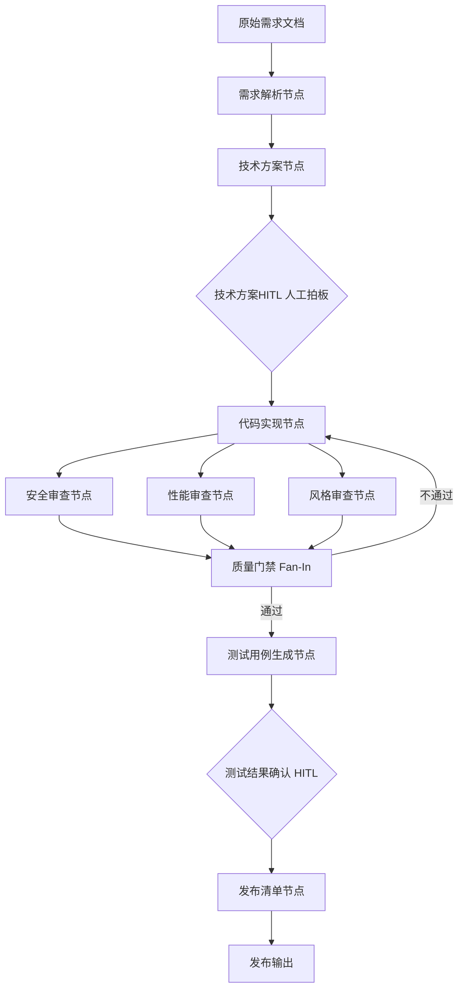

这篇讲的是把 **Graph 工程（基于 LangGraph 的 Agent 编排）** 用到研发流程里——从需求解析、技术方案，到代码实现、并行审查、测试生成、发布清单，一路用一张图串起来，该人工拍板的地方留两个人（标志性组件叫 **HITL**）给"人看着"。

它解决的核心问题不是"哪个环节能用 AI 替代人"，而是：**把一堆会互相打架的 AI 能力，串成一条能协同、能打回重来的流水线**。你在测试 / 质量 / 评测这条线里混久了就会发现，单点 AI 到处都是，苦的偏偏是"把这些点串成一条能自己跑、出问题能自己回头"的链。

---

先说一句交底的话：这套方案不是今天发明的新东西，拆开看就是**"Graph 工程 + 研发流程"**，本质是前几篇讲过的那套 Agent 编排思路，搬到了"需求到上线"这条链上。本文站在**测试开发 / AI 质检 / 工程化**的立场，把里面"能在真项目里省功夫"的地方挖出来，也把"它替不了谁"的地方讲透。

开始之前，我想先讲清楚一个很多人（包括我）长期以来撞过的墙。

---

## 我一开始也想过：技术方案这活，非要 AI 干吗？

先出结论：**不是所有环节都要 AI 干，也不是 AI 干的就比人好。Graph 工程最值钱的，是把"专长不同、要独立验证"的环节拆开，该并行并行、该打回打回。**

这篇原文给的判断标准特别犀利——**任务能不能拆成不同专长的子任务，需不需要独立验证**。能拆的、各管一摊的，上 Graph；不能拆的、非得人拍板的，留给 HITL。就这么一句，比我当时纠结三天想明白的还多。

再说一句大白话：**用 Graph 之前依赖"哪里需要 AI 就哪里塞 AI"，结果塞了一堆互不相干的工具，效率没提多少，反而多了一堆要维护的东西。** Graph 的价值恰恰是把这些散点串成流水线。不是帮你写代码，是帮你不用每天在"这堆工具谁该接谁"上再耗一个下午。

---

## 它到底解决研发链条上的哪六个痛点

一排研发流程，人人都写过一遍：

```
需求评审 → 技术方案 → 代码实现 → 代码审查 → 测试 → 发布
```

每个环节都有各自的疼，原文列得很平。我转成一张自己能看懂的表格：

| 研发环节 | 人疼在哪个点 | 图上能不能"自动"一把 |
| --- | --- | --- |
| 需求评审 | 需求文档参差、歧义多，来回确认 | 需求解析节点，把"歧义点"和"边界情况"显式提取 |
| 技术方案 | 评审靠经验，漏边界、漏安全面 | 方案生成节点 + HITL（技术方案评审，人来拍板） |
| 代码实现 | 重复逻辑多，AI 生成质量不稳 | 实现节点，带审查意见打回重做 |
| 代码审查 | Review 是瓶颈，资深的 PR 积压 | **三个并行审查节点**（安全/性能/风格）Fan-in 汇聚 |
| 测试 | 用例覆盖不全、边界易漏 | 测试用例生成节点（带 pytest） |
| 发布 | 发布前检查靠人工，易漏 | 发布清单节点（10 条起步 + 回滚方案） |

里面最亮眼的，是**安全审查、性能审查、风格审查拆成三个独立节点并行跑**——三件事需要不同的专注度，硬塞进一个 Agent 会互相干扰。拆开了，每个只盯一件事，才谈得上真正做成"专家"。

---

## 把研发流水线画成一张链路图

看到这里你应该有个大概感觉了。我把整条"原始需求→产出"的链路画成一张图，方便你一眼看清它从一头到另一头到底是怎么走的：



看清楚了吧：**两个黄点是 HITL（技术方案评审、测试结果确认），这是整个研发流程里最需要人判断的环节——方案对不对、测试够不够，AI 给建议，人拍板。** 剩下的，能代码判断的门禁就走代码判断，不劳 LLM 大驾。

---

## 落到代码上：State 怎么设计、节点长什么样

先看 State（整张图的"共享大脑"，所有节点都要在这里读、在这里写）：

```python
from typing import TypedDict, Annotated, Optional
import operator

class DevPipelineState(TypedDict):
    # ── 需求信息 ──────────────────────────────────
    requirement_doc: str          # 原始需求文档
    parsed_requirements: dict     # 解析后的结构化需求
    acceptance_criteria: list[str] # 验收标准

    # ── 技术方案 ──────────────────────────────────
    tech_spec: str                # 技术方案文档
    tech_risks: list[str]         # 技术风险点
    human_spec_feedback: Optional[str]  # 人工评审意见

    # ── 代码实现 ──────────────────────────────────
    code_files: dict              # 生成的代码文件 {文件名: 内容}
    implementation_notes: str     # 实现说明

    # ── 代码审查（并行，用 Reducer 追加） ──────────
    review_results: Annotated[list[dict], operator.add]

    # ── 质量评估 ──────────────────────────────────
    quality_gate_passed: bool
    quality_issues: list[str]
    revision_count: int

    # ── 测试 ──────────────────────────────────────
    test_cases: list[dict]
    test_results: Optional[dict]
    human_test_feedback: Optional[str]

    # ── 发布 ──────────────────────────────────────
    release_checklist: list[str]
    release_notes: str
    deploy_ready: bool
```

**怎么看这段**：`review_results` 用 `operator.add` 追加——三个并行审查节点的结果都要保留，不能互相覆盖。要么加个 Reducer 兜底，要么三个节点各写各的，结果把最后写的那个覆盖掉了。这一点不写对，并行就白并了。

### 需求解析节点：把"歧义"和"边界"显式拎出来

需求文档质量参差不齐，节点做的事是把它转成结构化需求 + 验收标准：

```python
from langchain_openai import ChatOpenAI

llm = ChatOpenAI(model="gpt-4o", temperature=0.2)

def parse_requirement_node(state: DevPipelineState) -> dict:
    """需求解析节点：把需求文档转化成结构化需求"""
    prompt = f"""
你是一个资深产品经理，擅长需求分析。

请分析以下需求文档，输出结构化需求：

【需求文档】
{state['requirement_doc']}

请输出：
1. 功能需求列表（每条需求要明确：谁、做什么、达到什么效果）
2. 非功能需求（性能、安全、兼容性等）
3. 验收标准（可测试的、明确的标准，至少5条）
4. 需求歧义点（哪些地方描述不清楚，需要确认）
5. 边界情况（容易被遗漏的边界场景）

输出格式为 JSON：
{{
  "functional_requirements": [...],
  "non_functional_requirements": [...],
  "acceptance_criteria": [...],
  "ambiguities": [...],
  "edge_cases": [...]
}}
"""
    result = llm.invoke(prompt)
    parsed = parse_json_safely(result.content)

    return {
        "parsed_requirements": parsed,
        "acceptance_criteria": parsed.get("acceptance_criteria", [])
    }
```

这个节点最值钱的不是"把需求整理清楚"，而是**把"需求歧义点"和"边界情况"显式提出来**。你想想，这两样东西在传统流程里多半是被忽略的，等到开发完才发现理解偏了，返工的成本比写这段 Prompt 高出不知道多少。你哪天在评审会上拿不出"这个需求有哪 3 个歧义点"，那这个评审白开了。

---

## 技术方案节点：把人工意见带回去

方案节点基于需求出方案，还要处理一个微妙的循环：**人工评审给了修改意见，下一轮生成方案时要带进去**（看 `human_spec_feedback` 那段）——这跟第 05 篇研报系统里的 `improvement_notes` 是同款模式。

代码从略，原文在，`llm.invoke(prompt)` 出来 `tech_spec` + 提取 `tech_risks` 返回即可。重点是那条"上一版本评审意见，请针对性修改"的 Prompt 拼接——**这里是"人拍板 → 图反馈 → 再生成"闭环的锚点**。

---

## 代码实现节点：会"带审查意见打回"的实现

实现节点要注意：它不只是"基于方案写代码"，还会**把上一轮的代码审查问题（`quality_issues`）塞进 Prompt 让它修复**，并且控制上下文长度（`tech_spec[:3000]` 截前 3000 字）：

````python
def implement_node(state: DevPipelineState) -> dict:
    """代码实现节点：基于技术方案生成代码"""
    llm_coder = ChatOpenAI(model="gpt-4o", temperature=0.1)

    # 如果有审查意见（来自代码审查循环），带进去
    review_context = ""
    if state.get("quality_issues"):
        review_context = f"""
【上一版本的代码审查问题，必须修复】
{chr(10).join(state['quality_issues'])}
"""

    prompt = f"""
你是一个资深工程师。

基于以下技术方案，生成实现代码：

【技术方案】
{state['tech_spec'][:3000]}  # 截取前3000字，控制上下文

【验收标准】
{format_list(state['acceptance_criteria'])}

{review_context}

要求：
- 代码要完整可运行，不要省略关键逻辑
- 每个函数都要有清晰的注释
- 处理好边界情况和错误处理
- 遵循 SOLID 原则

输出格式：
```
# 文件名：xxx.py
[代码内容]
```
# 文件名：yyy.py
[代码内容]
""
    result = llm_coder.invoke(prompt)

    # 解析生成的代码文件
    code_files = parse_code_files(result.content)

    return {
        "code_files": code_files,
        "implementation_notes": extract_implementation_notes(result.content),
        "revision_count": state.get("revision_count", 0) + 1
    }
````

`revision_count` 每轮 +1，这个字段在后面**质量门禁的"强制通过"兜底**里会被用到。

---

## 三个并行代码审查节点：最值钱的设计，也最讲究

这是整张图里我眼中最值钱的一段——**把代码审查拆成三个独立专家节点，并行运行**，各管一摊：

```python
def security_review_node(state: DevPipelineState) -> dict:
    """安全审查节点：专注安全漏洞"""
    llm_security = ChatOpenAI(model="gpt-4o", temperature=0)

    code_content = format_code_files(state["code_files"])

    prompt = f"""
你是一个专注安全的代码审查专家。

只关注安全问题，不评价代码风格或性能。

审查以下代码的安全性：

{code_content}

检查项：
- SQL 注入风险
- XSS 漏洞
- 身份验证和授权问题
- 敏感数据处理（密码、token、个人信息）
- 输入验证不足
- 不安全的依赖

输出格式（JSON）：
{{
  "review_type": "security",
  "issues": [
    {{
      "severity": "high/medium/low",
      "location": "文件名:行号",
      "description": "问题描述",
      "fix": "修复建议"
    }}
  ],
  "passed": true/false
}}
"""
    result = llm_security.invoke(prompt)
    review = parse_json_safely(result.content)
    review["review_type"] = "security"

    return {"review_results": [review]}

def performance_review_node(state: DevPipelineState) -> dict:
    """性能审查节点：专注性能问题"""
    llm_perf = ChatOpenAI(model="gpt-4o-mini", temperature=0)

    code_content = format_code_files(state["code_files"])

    prompt = f"""
你是一个专注性能优化的代码审查专家。

只关注性能问题，不评价安全或代码风格。

审查以下代码的性能：

{code_content}

检查项：
- N+1 查询问题
- 不必要的循环嵌套
- 缺少缓存的高频操作
- 内存泄漏风险
- 同步阻塞操作（应该用异步）
- 大数据量处理的效率

输出格式（JSON）：
{{
  "review_type": "performance",
  "issues": [...],
  "passed": true/false
}}
"""
    result = llm_perf.invoke(prompt)
    review = parse_json_safely(result.content)
    review["review_type"] = "performance"

    return {"review_results": [review]}

def style_review_node(state: DevPipelineState) -> dict:
    """代码风格审查节点：专注代码规范"""
    llm_style = ChatOpenAI(model="gpt-4o-mini", temperature=0)

    code_content = format_code_files(state["code_files"])

    prompt = f"""
审查以下代码的规范性：

{code_content}

检查项：
- 命名规范（变量、函数、类名是否清晰）
- 函数长度（单个函数是否过长）
- 注释质量（是否有必要的注释）
- 重复代码（是否有可集中抽取的公共逻辑）
- 错误处理（是否有适当的异常处理）
- 代码复杂度（是否有过于复杂的逻辑）

输出格式（JSON）：
{{
  "review_type": "style",
  "issues": [...],
  "passed": true/false
}}
"""
    result = llm_style.invoke(prompt)
    review = parse_json_safely(result.content)
    review["review_type"] = "style"

    return {"review_results": [review]}
```

三兄弟各只盯一个维度，Prompt 都很窄：**安全专家不分心看风格，性能专家不分心看安全漏洞。** 这段 Prompt 的写法，"只关注安全/性能/规范，不评价其他"这句，是它能不能"窄得住"的关键——你的审查节点要是 Prompt 里多写一句"顺便看看代码风格"，它就开始分心，安全问题反而更少发现。这跟"忙就是懒，是没排好"是一回事。

---

## 质量门禁：这是图和 LLM 分界最清爽的地方

三路审查并行完，都得汇聚到质量门禁——**而它的判断规则用代码写死，不用 LLM 决策**：

```python
def quality_gate_node(state: DevPipelineState) -> dict:
    """质量门禁：汇总三个审查结果，决定是否通过"""
    reviews = state["review_results"]

    all_issues = []
    has_high_severity = False

    for review in reviews:
        for issue in review.get("issues", []):
            all_issues.append(f"[{review['review_type'].upper()}] {issue['severity'].upper()}: {issue['description']}")
            if issue.get("severity") == "high":
                has_high_severity = True

    # 质量门禁规则：
    # - 有任何 high 级别问题 → 不通过
    # - 总问题数超过 10 个 → 不通过
    # - 迭代次数超过 3 次 → 强制通过（避免死循环）
    passed = (
        not has_high_severity
        and len(all_issues) <= 10
    ) or state.get("revision_count", 0) >= 3

    return {
        "quality_gate_passed": passed,
        "quality_issues": all_issues if not passed else []
    }

def route_after_quality_gate(state: DevPipelineState) -> str:
    if state["quality_gate_passed"]:
        return "generate_tests"
    return "fix_issues"
```

**这跟我在搞 AI 评测里撞见的那条铁律一模一样：能用 `if/else` 写清的路由，就别交给 LLM** 去判断。门禁判定"有没有 high、总问题数是否 >10、迭代是否超 3 次"全是确定逻辑，交给代码，快、稳、可解释、不花钱。别把"图很能打"发挥到"什么都该拿去让模型拍板"——那叫没边界，不叫能打。

### 测试用例生成节点

基于验收标准和代码，生成测试用例，每一类都覆盖到 Happy Path、边界值、异常、安全、性能：

```python
def generate_tests_node(state: DevPipelineState) -> dict:
    """测试节点：基于验收标准和代码生成测试用例"""
    llm_tester = ChatOpenAI(model="gpt-4o", temperature=0.2)

    prompt = f"""
你是一个测试工程师，擅长编写全面的测试用例。

基于以下信息生成测试用例：

【验收标准】
{format_list(state['acceptance_criteria'])}

【代码实现】
{format_code_files(state['code_files'])[:2000]}

生成测试用例，覆盖：
1. 正常流程测试（Happy Path）
2. 边界值测试
3. 异常情况测试（错误输入、网络异常等）
4. 安全测试（基于审查发现的安全点）
5. 性能测试（关键接口的响应时间）

每个测试用例包含：
- 测试名称
- 前置条件
- 测试步骤
- 预期结果
- 测试代码（pytest 格式）

输出 JSON 格式的测试用例列表。
"""
    result = llm_tester.invoke(prompt)
    test_cases = parse_json_safely(result.content)

    return {"test_cases": test_cases if isinstance(test_cases, list) else []}
```

这段对你这种测试跟岗的人应该是"肋骨被戳到"的一下：**自动化测试解放的不是"写测试"，是"从写满到合格"那 80% 的流水线活；让你用同等的精力，去做真正只属于人的"这测试够不够格"判断。** 一个字，它生出的 `pytest` 用例，是给你"审"的，不是给你"全信"的。

---

## 把整张图编译起来：两个 HITL 断点怎么接

LangGraph 的开发方式：所有节点注册进 `StateGraph`，**并行审查走 Fan-out，审查完走 Fan-in，门禁后走条件路由，两个关键点用 `interrupt_after` 做成 HITL 挂起**：

```python
from langgraph.graph import StateGraph, END
from langgraph.checkpoint.sqlite import SqliteSaver
from langfuse.callback import CallbackHandler

builder = StateGraph(DevPipelineState)

# 添加所有节点
builder.add_node("parse_req", parse_requirement_node)
builder.add_node("gen_spec", generate_tech_spec_node)
builder.add_node("implement", implement_node)
builder.add_node("security_review", security_review_node)
builder.add_node("performance_review", performance_review_node)
builder.add_node("style_review", style_review_node)
builder.add_node("quality_gate", quality_gate_node)
builder.add_node("gen_tests", generate_tests_node)
builder.add_node("gen_release", generate_release_checklist_node)

# ── 主流程 ──────────────────────────────────────
builder.set_entry_point("parse_req")
builder.add_edge("parse_req", "gen_spec")
builder.add_edge("gen_spec", END)  # 暂停，等 HITL

# ── 代码实现后，并行三个子节点的 Fan-out ──────
builder.add_edge("implement", "security_review")
builder.add_edge("implement", "performance_review")
builder.add_edge("implement", "style_review")

# ── 三个审查完成汇聚的 Fan-in ─────────────────
builder.add_edge("security_review", "quality_gate")
builder.add_edge("performance_review", "quality_gate")
builder.add_edge("style_review", "quality_gate")

# ── 质量门禁后的条件路由 ─────────────────────────
builder.add_conditional_edges(
    "quality_gate",
    route_after_quality_gate,
    {
        "generate_tests": "gen_tests",
        "fix_issues": "implement"  # 打回重新实现
    }
)

builder.add_edge("gen_tests", END)  # 暂停，等 HITL
builder.add_edge("gen_release", END)

# ── 编译：两个 HITL 暂停断点 ──────────────────────
checkpointer = SqliteSaver.from_conn_string("dev_pipeline.db")
app = builder.compile(
    checkpointer=checkpointer,
    interrupt_after=["gen_spec", "gen_tests"]
    # gen_spec 后暂停：等方案评审
    # gen_tests 后暂停：等测试结果确认
)
```

**关键点是两个 `interrupt_after`**：`gen_spec`（技术方案评审）和 `gen_tests`（测试确认）。没有这两个断点，这图就是一列"跑到完完全全的流水"，但真正的研发交付，这里恰恰必须有人下结论。

### 完整使用流程：人怎么介入每一次

从上往下看，这是"人到底在哪里按了暂停键"的真跑一次：

```python
from datetime import datetime

def run_dev_pipeline(requirement_doc: str, pr_id: str):
    """运行研发流水线"""
    config = {
        "configurable": {"thread_id": f"pr-{pr_id}"},
        "callbacks": [CallbackHandler(
            public_key=os.environ.get("LANGFUSE_PUBLIC_KEY", ""),
            secret_key=os.environ.get("LANGFUSE_SECRET_KEY", "")
        )]
    }

    print(f"🚀 开始处理需求，PR: {pr_id}")

    # ── 阶段一：需求解析 + 技术方案 ──────────────
    state = app.invoke(
        {
            "requirement_doc": requirement_doc,
            "review_results": [],
            "revision_count": 0
        },
        config=config
    )

    # 暂停在 gen_spec 之后，等技术方案评审
    print("\n📋 技术方案已生成，等待评审...")
    print(f"\n{state['tech_spec'][:500]}...")
    print(f"\n⚠️  技术风险点：")
    for risk in state.get("tech_risks", []):
        print(f"  - {risk}")

    decision = input("\n[a]批准方案 / [m]修改后批准 / [r]打回重写 > ").strip()

    if decision == "r":
        feedback = input("请输入修改意见：")
        app.update_state(config, {"human_spec_feedback": feedback})
        # 重新生成方案
        state = app.invoke(None, config=config)
        # 再次等待评审...（实际项目里应该循环处理）

    elif decision == "m":
        feedback = input("请输入修改意见（AI 会基于此修改）：")
        app.update_state(config, {"human_spec_feedback": feedback})

    # ── 阶段二：代码实现 + 审查 ──────────────────
    print("\n⚙️  开始代码实现和审查...")

    # 手动触发实现节点（从 gen_spec 之后继续）
    app.update_state(config, {}, as_node="gen_spec")
    state = app.invoke(None, config=config)

    # 暂停在 gen_tests 之后，等测试确认
    print(f"\n✅ 代码审查完成")
    print(f"质量门禁：{'通过' if state['quality_gate_passed'] else '未通过'}")

    if state.get("quality_issues"):
        print(f"\n⚠️  发现问题（已自动修复）：")
        for issue in state["quality_issues"][:5]:
            print(f"  - {issue}")

    print(f"\n🧪 测试用例已生成：{len(state.get('test_cases', []))} 个")

    test_decision = input("\n[a]确认测试通过 / [r]发现问题，打回修改 > ").strip()

    if test_decision == "r":
        feedback = input("请描述测试发现的问题：")
        app.update_state(config, {
            "human_test_feedback": feedback,
            "quality_issues": [feedback]  # 作为下一轮的修改意见
        })
        # 打回重新实现...

    # ── 阶段三：生成发布清单 ──────────────────────
    app.update_state(config, {}, as_node="gen_tests")
    final_state = app.invoke(None, config=config)

    print(f"\n🚀 发布清单已生成")
    print(f"\n📝 发布说明：{final_state.get('release_notes', '')}")
    print(f"\n✅ 发布前检查清单（{len(final_state.get('release_checklist', []))} 项）：")
    for item in final_state.get("release_checklist", [])[:5]:
        print(f"  □ {item}")

    return final_state
```

**这一段是"人把暂停键按在哪里"最直观的体现**——技术方案出来你拍 `[a]/[m]/[r]`，测试出来你拍 `[a]/[r]`。图把这个"人机交接"做成一个显式的可打回循环，而不是一次性把话说完就不管。

---

## 落到可以真的用：拿一个真实的接口开发当例子

光看是不算数的，我先给你"**能真跑**"的组装版。配上你熟悉的业务——一个二手车平台的车辆信息查询接口，从需求文档进图。我把流程压成一个"喂需求 → 看它怎么拆 → 看出什么",你照着能把自己手里的需求换进来。

```python
# 一段示意：喂进需求，看它解析出什么（示意字段）
prompt_input = "查询车型估值接口：按车型、车况、里程返回均价区间；要支持同年不同配置的差异化估值；价格要可追溯、可解释。"
```

> 注意这段我没有跑过真实模型，`ChatOpenAI` 需要一个可用的 key、要装 `langchain` / `langgraph` 依赖，跑出来的 JSON 也随模型和 prompt 浮动。下面标注了"示意"，是你换掉需求开头、装上依赖就能拿去试的骨架，不是铁定输出。

这类接口需求，用上面的 `parse_requirement_node` 跑，最值钱的产出不是"它把话读通"，而是这四样显式拿出来：
- `ambiguities`（需求歧义点）："同年不同配置"到底按什么来定义？价格区间是含税还是裸车？返给你的 `ambiguities` 会把这类"以为没歧义、其实有"的地方挑出来；
- `edge_cases`："无历史成交数据、里程数异常、配置选项缺失"这些在传统评审里容易被漏的，它会给清单；
- `acceptance_criteria`：可测试的验收标准（你后面测的护栏）；
- `functional_requirements` + `non_functional_requirements`：给方案生成的输入。

然后 `generate_tests_node` 会基于验收和代码，产出 `pytest` 用例（Happy Path / 边界 / 异常 / 安全 / 性能）。**你要做的，是从"写测试"变成"审测试"**：它说"价格区间要含税"是不是你想要的？边界样例"里程=0"该不该判非法？——这些"够不够格"的判断，才是测试工程师真正值钱的地方。

---

**但这里藏着一个必须自己把握的坑**：它是给你抄、给你审的，不是给你"全信"的。别把"它生成的 pytest 全跑一遍变绿了"当成"这需求测完了"。测试用例是人定"标准"、AI 写"过程"，你可以把它打回两轮直到满 3 轮强制通过（`revision_count` 兜底），但最终"这需求到底测到几成才算数"，还是你拍板。

---

## 放进团队怎么落地：别贪多，分三批上

> 整个这套到底怎么上一个真实团队里，原文讲得特别实在。**如果你只有 3 个人，全上线这整张图的维护成本，可能比省下的还贵。**

**第一批（1-2 周）**：只上代码审查那三个并行节点——最落地、收益最明显。直接挂到 GitHub Actions，每次 PR 自动触发，结果作为 PR Comment 输出：

```yaml
# .github/workflows/ai-review.yml
name: AI Code Review
on:
  pull_request:
    types: [opened, synchronized]

jobs:
  ai-review:
    runs-on: ubuntu-latest
    steps:
      - uses: actions/checkout@v3
      - name: Run AI Review
        run: python scripts/ai_review.py ${{ github.event.pull_request.number }}
        env:
          OPENAI_API_KEY: ${{ secrets.OPENAI_API_KEY }}
          GITHUB_TOKEN: ${{ secrets.GITHUB_TOKEN }}
```

这一段我重点说：**这是全篇最容易"照抄就能跑"的入口**。三个审查节点拆成独立脚本，`ai_review.py` 收 PR 号，跑三路，结果写成 PR Comment；你代码库接入 `OPENAI_API_KEY` + `GITHUB_TOKEN` 两个 secrets，`scripts/ai_review.py` 把三路调一遍、汇总贴评论，就能用起来。注意这里用的是 `env` 里的 key，别把 key 写死在 `.py` 里——这也是安全审查节点自己会盯的一条。

**第二批（1 个月后）**：加需求解析节点。需求文档进来，自动出结构化需求和验收标准。价值重点不是替代 PM，是帮 PM 发现需求里的歧义和遗漏。

**第三批（稳定后）**：加测试生成节点。让测试从"写测试"变成"审查测试"。

---

## 代码审查三个节点的实际效果（一个数据点）

原文给了一组"10 人团队引入三节点并行审查"的真实数据点。这个数据我不能替你编，但它是原文白纸黑字给出的，我把它原样摆出来，你自己判断需要与否：

| 指标 | 引入前 | 引入后 |
| --- | --- | --- |
| PR 平均等待审查时间 | 4.2 小时 | 8 分钟（AI 初审） |
| 高级工程师 Review 时间 | 每天 2.5 小时 | 每天 45 分钟 |
| 安全问题漏到生产的比例 | 约 15% | 约 3% |
| 月 API 费用 | - | 约 ¥600 |

用大白话讲给你：**AI 初审不替代人，但它能把低级问题拦掉一大半，让高级工程师只管最需要经验判断的地方。**

---

## 把它和同类"代码审查工具"放一张表

这种"AI 代码审查"市面上早有了，先跟相近的比一比，别只见它一个。这里我列的都是我能查到并且客观的差异，不吹，也不骑着门框吹自己：

| 工具 / 方案 | 核心定位 | 上手难度 | 适用场景 | 什么时候别用它 |
| --- | --- | --- | --- | --- |
| 三节点并行审查（本文） | Graph 编排的研发流水线，审查只是其中一个环节 | 中（要装 langgraph + openai key + 挂 GitHub Action） | 已有研发链、想把"需求→方案→测试→发布"整条串图 | 只想"改完就跑一张审查"，嫌重 |
| 单一 Prompt 的 AI Review（各家都有的最小版） | PR 来了，一条 prompt 扫一遍 | 低 | 快速给 PR 提建议 | 要分安全/性能/风格三个维度，debate 会被糊在一起 |
| Cursor / Claude 的"内联审" | IDE 里边写边审，人机对话式 | 极低 | 单人边写边看 | 要落地成团队门禁、要走 CI 自动触发 |

它在同类里真正的占位是：**它不只是一套"审查器"，而是把审查放进一条能存能续、能带参数、能打回的流水线。你缺的从来不是"一个能审 PR 的 AI"，是"一条能跑的、留人拍板的研发链路"。**

---

## 几个容易踩的坑（括号里是原文说的）

这是全篇最实在的一块，原文一口气列了四个坑：

**坑一：代码生成节点的上下文太长。** 技术方案文档很长，全塞进 Prompt，上下文爆，而且 LLM 在超长上下文里容易"失焦"。**解法：只传核心（架构 + API），细节数据模型单独传**，文件里就写了 `tech_spec[:3000]`。

> 讲到这里，一个同事小声问了句："这套落地挺合理的。可我们组一开始连'真实评审意见'都攒不齐，这 3 个审查节点岂不是一开始全是'空转'？"
> ——问得对。你最开始拿一两段真实 PR 在自己那 `.py` 里跑一遍，先把"这条链审出来的格式长什么样"看清楚，再挂进 GitHub Actions；真实数据攒起来，慢慢从"帮我看风格"叠到"补安全漏洞"。**Graph 这条链能先从最简单的步子起步，但不能从"没想到要留人拍板"起步。**

**坑二：审查节点的 Prompt 不够窄。** 只要"也顺便看看代码风格"，它就开始分心，安全问题反而不见得抓得多。**解法：Prompt 开头明文写"只关注 XX，不评价其他"。**

**坑三：质量门禁规则太严。** 设成"零问题才通过"，代码会反复回炉很多轮，成本堆起来，而且 AI 生成的代码真要零问题太难。**解法：分级，只让 high 阻断，medium/low 当建议输出。**物理上 `revision_count >= 3` 强制通过，是防死循环的兜底，得留。

---

## 我得跟你把不该细说也说清楚：它不是什么

我不会上"边界说明"这种说明书式的标题，就直说：**它是"菜市场传的宫廷秘方"，不是过了药吃的宫廷御方。**

- 它不是一个现成能跑的产品骨架——这套代码里 `parse_json_safely`、`format_list`、`parse_code_files`、`extract_tech_risks` 这些都是自定义函数的占位，原文没有给出它们，你得自己补齐。**没补齐就跑不起来，这不是误伤，是实现者的一定工作量。**
- 它目标是 `gpt-4o` / `gpt-4o-mini`。你想换 DeepSeek、Ollama，那 `ChatOpenAI` 换成对应的 `langchain` 模型类即可——这是"组合使用"，不是他方案原生讲的能力。
- `app.update_state(config, {...})` 与 `app.invoke(None, config=config)` 这种"续跑已挂起的图"的写法，需要 `checkpointer`（SqliteSaver）支持，断点续跑才有戏；没有它，`interrupt_after` 就只是摆设。
- 它是"测试用例生成 + 质量门禁"都围着 AI 代码走，**它对"你业务本身"一无所知，别指望它能替你把业务需求表一步到位地定死。**

> 我这话是平静说的，你就当家里人给讲价。真伪是它的事，长本事是你的事——它能帮你把"哪条链能让我在代码审查上不排队"理顺，但它不替你决定"这需求到底测到几成才算合格"。

---

## 那这套图，到底把"谁"从天上拽下来

**我不是在劝你全上、一步到位的。** 它给你最值的一笔，不是"替代"谁，而是**把"从需求到上线里，那些各管一摊、能并行开火"的活，用一张图串成能打回、能续跑的链**；把"哪个环节该由人拍板"用 `HITL` 显式钉住。它把 AI 从"东打一下、不敢全信"的散沙，变成"一条能自查、能打回、能留档"的流水线。

给刚读到这里的朋友一句话带走——**真码一段，选一个真实的需求（二手车估价、电商查询、客服工单都行），装上依赖，先只跑 `parse_requirement_node`，看到它把你"以为没歧义、其实有"的地方挑出来那一下，你就懂它值在哪儿。**

回过头看，"说是这么个理，可回头一看"，你掉过的那些坑，其实早就有人替你想好了；它不过是把坑填上的人。

