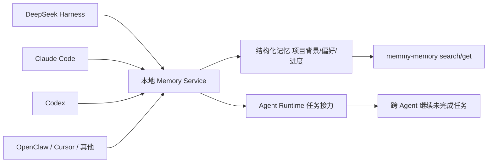

# Memmy：让每个 AI 记住同一个你——跨 Agent 的记忆与任务延续

先交底：Memmy 是一个开源的**个人记忆基础设施**，解决的是这样一个问题——你手上有 DeepSeek Harness、Claude Code、Codex、OpenClaw、Cursor 一堆 AI agent，它们各干各的活，也**各忘各的你**。在 A 里交代过的项目背景、在 B 里确认过的偏好、在 C 里干到一半的任务，换个工具全得重说一遍。Memmy 干的事一句话：**让这些 agent 共享同一个本地记忆，任务在工具之间接着做，不从头再来。**

它不是又一个 agent，它是 agent 的"公共记忆底座"。官网在 [memmy.cn](https://memmy.cn/)，代码在 `github.com/MemTensor/memmy-agent`，Node.js 写的，开源。

项目自报的三个核心能力，正好是三张卡片的形状：

- **Remember（记得）**：它记得你说过什么——自动把本机 AI 协作历史整理成**结构化记忆**；
- **Relay（接力）**：工具随便换，记忆不掉线——换 agent 时它带上项目背景、偏好和进度；
- **Act（行动）**：Memmy 本身也是一个 Agent——能整理资料、合并方案、继续没干完的任务。

一句话的底色：**个人记忆基础设施**。它的路线图也写得明白，边界不止于写代码的 agent——还想收浏览器行为、本地文档，乃至更多终端和硬件设备；之后还规划团队协作，让团队成员的 AI 助手在隐私保护下共享知识。

仓库地址：`https://github.com/MemTensor/memmy-agent` · 中文文档：`https://memmy.cn/docs/`

---

## 为什么这东西对"AI 测试 / 评测"的人特别有嚼头

你可能第一反应：这又是给我多个 agent 记笔记的东西，跟测试有什么关系？

——有，而且关系不小。**做 agent 评测的人，最头疼的维度之一就是"记忆到底有没有被用起来"**：你测一个客服 agent 记没记住用户上次的地址，测一个代码 agent 换会话后还认不认得项目约定——这些全是在测"记忆的读写和一致性"。而 Memmy 把"记忆"从每个 agent 私有的黑盒，变成了**一个本地、有接口、可查询的服务**。这等于把评测目标从"猜"变成了"能调"。

下面这句是关键，划一下：**Memmy 的本地记忆服务暴露了一组命令行接口**，`memmy-memory search/add/get` 这种——你在测试脚本里可以直接查"这个 agent 刚才到底往记忆里写了什么"。对做评测的人，这比对着对话记录猜"它记没记住"要硬核得多：**记忆成了可断言的对象**。

---

## Memmy 怎么实现的？先把架构地图摆出来



核心是中间的"本地记忆 + Agent Runtime"两层：所有 agent 往同一个地方写、从同一个地方读；换工具时，新 agent 通过 Memmy 把背景、偏好、进度"带"过来，接着干。

---

## 怎么装、怎么跑起来（照抄能跑）

完整说明在入门指南里，这里给最小可跑路径。

**方式一：桌面端（最省事）**——去 [memmy.cn](https://memmy.cn/) 或 GitHub Release 下载安装包。注册后送体验 Token，能完整跑 Memory + Agent Runtime；额度用完可切 BYOK（自带模型 API）模式。

**方式二：Linux 上 CLI/TUI 一行装**（Linux x64/arm64，需 Node.js 22+，systemd 用户会话可用）：

```bash
curl -fsSL https://raw.githubusercontent.com/MemTensor/memmy-agent/main/scripts/install.sh | bash
memmy
```

装完顺手看一眼两个服务有没有起来：

```bash
systemctl --user status memmy-memory.service
systemctl --user status memmy-gateway.service
```

日常命令速查（照抄）：

```bash
memmy onboard                              # 初始化配置和 workspace
memmy status                               # 检查配置、模型和 Provider
memmy agent --message "介绍一下当前工作区"  # 单轮任务
memmy                                      # 进入交互式 TUI
memmy serve                                # 启动 OpenAI 兼容 API（:18990）
```

> 有个细节值得夸：安装阶段**只初始化记忆服务，不会去动你已装好的 Codex / Claude Code / Cursor**——要接入时你自己显式跑 `memmy-memory init` 才装对应 Agent 的 Memory Skill 和 Hook。不偷偷改你的环境，这点做得很规矩。

**方式三：源码跑**（Node.js >=22 + npm；Windows 用 Git Bash）：

```bash
git clone https://github.com/MemTensor/memmy-agent.git
cd memmy-agent
cp .env.example .env
npm install
npm run build
bash scripts/dev-start.sh
```

---

## 记忆服务接口：评测 agent 记忆的"探针"

这是给评测工程师的重点。`memmy-memory` 是独立于 TUI 的记忆服务 CLI，供 Agent、脚本和调试流程访问本地记忆服务：

```bash
memmy-memory init
memmy-memory health
memmy-memory search "项目里的记忆策略"
memmy-memory add "这是一条需要保存的知识"
memmy-memory get <id>
```

默认连 `http://127.0.0.1:18960`，可用 `--url`、`--token`、`--config`、`--source`、`--user-id` 指定服务和命名空间。

**对做评测的人，这套接口就是探针**：你的 agent 说"我记住你的偏好了"，口说无凭——`memmy-memory search` 一把梭查出来，白纸黑字。这在下面"走一遍"里会真的用起来。

---

## 走一遍真的用法：给一个"跨 agent 的电商客服任务"做记忆延续评测

挑个互联网业务方向落一遍：**电商客服**。场景是这样——你在 Claude Code 里让 agent A 查一个售后工单的背景（用户上次的地址、退款偏好、进行到哪一步），接着切到 Codex 让 agent B 继续处理同一个工单。**没有 Memmy 时，B 对工单一无所知；有 Memmy 时，B 应该能接上话。**

评测"接没接上话"，你用记忆服务当探针（这是组合使用的思路：Memmy 提供记忆底座，你自己写 pytest 测延续性，不是抄它的代码）：

```python
# 组合使用示例：用 memmy-memory 当"探针"，测跨 agent 记忆延续（示意）
import subprocess

def memmy(args):
    return subprocess.run(["memmy-memory", *args], capture_output=True, text=True).stdout

def test_memory_persists_across_agents():
    # 步骤 1：agent A 在 Claude Code 里记住工单关键信息
    memmy(["add", "工单 #8842：用户李姐，收货地址朝阳区 XX 路 3 号，偏好顺丰，当前进度：等待换货确认"])

    # 步骤 2：换到 agent B（Codex），它应该能检索到这些背景
    hits = memmy(["search", "工单 #8842"])

    # 断言：B 确实能"接上话"
    assert "李姐" in hits
    assert "朝阳区" in hits
    assert "顺丰" in hits
    assert "换货" in hits

def test_memory_is_namespaced():
    # --user-id 可以把不同用户/租户的记忆隔开，别串味
    a = memmy(["--user-id", "user_A", "add", "A 的私有信息"])
    b = memmy(["--user-id", "user_B", "search", "私有信息"])
    assert "A 的私有信息" not in b
```

> 说明：`memmy-memory` 是真实存在的命令，上面用例是**示意骨架**——`add` 的返回值和 `search` 的具体输出格式以你本地实测为准。但"记忆能跨 agent 查到、能按命名空间隔离"这两条，正是"跨 agent 记忆"这个能力该被断言的两件事。

**这套思路的妙处**：把"这个 agent 记性好不好"从玄学变成可回归的测试。今天 agent A 记住了、明天换版本忘了——`memmy-memory search` 一查就现形。

---

> **"听起来是挺方便，可这不就是把我的对话记录全存到别人服务器上吗？隐私这块它怎么说的？"**

——问得是地方。看它的架构和安装方式，隐私设计是刻意做的：记忆服务和 Gateway 都是 **`systemd --user` 服务，只绑定本机地址**（127.0.0.1）；Gateway 的配置环境变量刷到 **权限 `0600` 的私有文件** `~/.memmy/systemd/gateway.env`，不给别的用户读。换句话说，**记忆默认留在你机器上，不是上传到 Memmy 的云端**。当然，"本地服务"不等于"绝对安全"——你机器被攻破、或你在配置里填了云端模型 API，数据还是会路过第三方。它做的是"默认本地、接入才联网"的设计，不是"魔法般零风险"。用之前自己掂量一下你的数据敏感度。

> **"我手上 agent 一堆，它真的都能接？会不会又说支持、实际只有一两个能用？"**

——文档里点名的有 deepseek harness、openclaw、hermes、claude code、codex、cursor、workbuddy、openCode、pi 这一串，听着是广撒网。但"支持列表"和"每个都好使"是两回事：接入方式是 `memmy-memory init` 去检测已装的 agent、装对应的 Memory Skill 和受支持的 Hook/插件——**哪些 agent 是官方深度支持、哪些只是"能搜到记忆"的浅接入，建议你装完逐个 `init` 试一遍再下结论**。我这边只读了项目文档，没在真机上一个一个验证过，这块我不替你打包票。

---

顺便把这盆冷水泼明白，这项目有它自己的"三不沾"：

- **它不是"给你换了个更聪明的模型"。** 它不提升任何单个 agent 的智商，它解决的是"记忆不共享"这件事。你原来的 agent 有多笨，共享记忆之后还是那么笨——只是它记得住你上次教过它什么了。别指望装完 AI 突然开窍。
- **它不是记忆越多越好。** 把十年对话全灌进去，检索时全是噪声，跟没记一样。真正值钱的是**结构化**——项目背景、偏好、进度分门别类，`search` 才搜得准。记忆这东西，跟衣柜一样，塞满不等于会穿。
- **它的"跨 agent"有前提。** 得那个 agent 真接了 Memmy 的 Skill/Hook 才谈得上"带上记忆"。光装个 Memmy、别的 agent 纹丝不动，那它就是个本地笔记工具，跨不起来。

说到底一句话：**记性是工具，用记性是本事。** Memmy 把"记住你"从每个 agent 的私有黑盒里拿出来，放到一个你能查、能测、能断言的本地服务里——对做评测的人来说，这比什么都值钱：**记忆终于从"猜它记没记住"，变成了"查它记了什么"。**

真要到动手那步，也别贪多：装完先跑一条 `memmy-memory add` 再 `memmy-memory search`，把"写进去、查出来"这条闭环走通。走通了，剩下的——接哪个 agent、记什么、怎么测延续性——都是日子，一天天过出来的。

原文入口：仓库 `https://github.com/MemTensor/memmy-agent` · 中文文档 `https://memmy.cn/docs/`

#AI #agent评测 #记忆 #跨Agent #DeepSeekHarness #ClaudeCode #Codex #开源 #知识库 #测试
