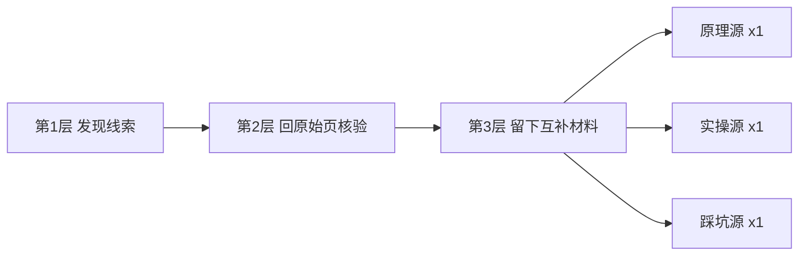

Nowledge 是个**装进 Claude Code、Codex、DeepSeek Harness 这类编码 Agent 里的"学习技能"（SKILL.md）**。它不负责再帮你搜一篇文章看，而是把一个值得学的主题，走完一条**"现查 → 判断 → 看懂 → 动手 → 复述 → 复训"**的学习闭环：会变化的知识先去查今天的最新来源，稳定知识回到权威教材和经典材料；**每次只展开一个学习块，配一个能运行的小练习、一道不看答案的回忆题，外加下一次复训时间。**

打个比方打到底：普通 AI 问答是"把信息说出来"就收工，跟念了一遍就点头；Nowledge 是那个"翻完书还得合上自己写一遍、下礼拜还要回来抽查你"的教法。你一句话能答出来的静态事实、单纯总结一个 URL、写代码、翻译这种事，它根本不动整套闭环。

对搞 AI 测试开发、天天在跟"这个模型说太快、那个来源敢信吗"较劲的人，这个项目的肉不在"会学习"，在两层：**一、判断比抓取值钱**（面向学习材料的选材判断引擎）；**二、可重复地评测一个 Agent 的辅导行为**（它附带一个 TutorBench-lite）。这两块跟日常里"怎么证明我的 agent 真行"是同一件事。我拆给你看。

---

## 先摆清它到底解决什么：不是"不知道"，是"不知道该信谁"

那句让我夹笔停一下的话，用大白话先交底。

我们很多人（包括我）问 AI 技术的姿势是：**把"搜索结果多"当成"说得对"，把读一遍点头当成记住了。** 这是坑。Nowledge 先把这件事拧过来：**一个知识，该信什么来源、用什么时点的信源？**

拆两步走。

**第 1 步：该信什么来源。** 它给信源上了三层过滤，每层只干自己那点活：



第一层"发现线索"：GitHub、Hacker News、Reddit、X、AI HOT、中文社区一块回答"最近有什么值得继续查"。它们可以很新，但**热度、转发、摘要都不是最终证据**。

第二层"回原始页面核验"，按论断找能真正证明它的东西：
- 发布、版本、价格、额度、服务状态 → **官方博客、文档、Changelog、Status**；
- 论文结论、有没有正式发表 → **论文原文、OpenReview、ACL/PMLR/NeurIPS**；
- "更强、更快、更便宜" → **独立评测，方法、配置、样本、日期一起留**；
- 真实体验、失败模式、权衡 → **Issue、维护者记录、独立作者与社区复盘**。

聚合摘要、员工预告、厂商自测、单个总分、大 V 身份——这些能给线索，但**不能独自承担结论**。

第三层"为学习留互补材料"，核验完**不往你头上一把丢几十个链接**，只留：**原理源 ×1、实操源 ×1、踩坑源 ×1**。

**第 2 步：把主题按稳定性分清楚，再决定信哪个时点。** 原文给的三类：

| 主题类型 | 特征 | 优先信什么 |
| --- | --- | --- |
| **stable** | 算法、数学基础等稳定知识 | 权威教材、大学课程、经典解析 |
| **fast** | 版本、价格、新模型等快变量 | 近期一手信息，且标 `as-of` 日期 |
| **mixed** | RAG、Agent 框架这类混合主题 | 稳定原理与易变工具**分开**处理 |

一句话：**稳定知识回去权威，会变的知识先查今天。** 这就把"现查 → 判断"坐实了。也是它跟一个普通搜索工具的边界——搜索负责把材料找回来；Nowledge 还要判断材料、组织学习动作、确认知识有没有真进脑子。

---

## 它落在我的测试 / 评测日常里，能省什么

说实话一开始我当它是"又一个背单词的"，没走心。后来发现它至少有三块跟**评测 / 质量 / 自动化 / 知识库**是同一句话。

**第一块：它把"谁更值得信"做成一个开源、可复现的选材引擎（判断层）。**

做评测的人最清楚一个要命的背景：**来源摆一排，哪个该信，常常卡在"敢不敢据它下结论"上。** 现在流行的新闻型聚合（原文点名 `last30days/aihot` 这类）把料端到你面前就结束了；再把"读一遍点头 = 流畅性错觉"一叠加，等于你信的那些,其实是你以为你读懂了。Nowledge 把"该信谁"用**加权 RRF + 实体聚类 MMR + URL 去重 + 角色三角**做成了**确定性、可复现**的选材，争议主题还再追加一轮"检索后的观点、矛盾与论断审计"。翻成人话：**它把一个"对 AI 的材料怎么排"的功劳，从"点评靠玄学"变成可跑的步骤。** 原文自己也点破：面向学习材料的判断层，在开源是块**真空**——aihot 是新闻场景、评分不开源。你要是正给自家 agent 搭知识底座 / 知识库问答，这条"先判据再入库"的思想，是能单独抄下来当门禁的。

**第二块：它自带一个 TutorBench-lite—— 对 Agent 辅导行为的可重复冒烟评测。**

这一行对做 AI 测评的人，几乎就是范文。它用 `eval_tutorbench.py` 做**确定性辅导行为评测**，检查五件事：**误解纠正、难度适配、官方来源引用、目标推进、追问行为**。最难得的是它**自己先划了边界**："这是可重复的冒烟评测，**不是**真实学习者长期保持概率的证明"——这句"我没做长期评估，我不吹"，我做评测时是压舱石，它主动把它写出来了。

**第三块：把自动化当一腿——追踪 / 发现 / 复训。**

不用你去翻，写 `discover.py` 按月把某个领域的新 Agent 项目**落成榜单**（还分"热度线索 / 官方事实 / 独立评价"三栏）、`track.py` 只报"上次之后"的新变化、`review.py` 按 **1 / 3 / 7 / 16 / 35 天**回来抽查你忘了没。接进一个固定的 CICD，"每周给我追一次新、每两个月跑一遍退变质检"，就是能落地的自动化常态。

---

## 怎么装、怎么跑：给你的实际命令

装法极简——你把这句直接递给你正在用的那个大模型就行：

> 请帮我安装 Nowledge Skill：<https://github.com/hjxccc/nowledge>。

它自己说：核心脚本**零必需的 API Key、纯 Python 标准库**，不用你配 key。装完，日常使用就是说人话，不碰命令行。要亲眼看到任务真跑起来，下面命令行是原样抄的（括号里"大概应该看到什么"是我的理解，不确定的标了"未实测"）：

```bash
python scripts/ground.py "RAG 检索增强" --quick --compact          # 快答：只回必要字段
python scripts/gate.py "向量检索-intuition.html" --strict --summary # 单页直觉图质量 gate
python scripts/ground.py "https://github.com/HKUDS/DeepTutor" --quick --compact  # 精确仓库优先
python scripts/ground.py "loop engineering" --out sources/raw.json --compact  # 完整料落盘 + 紧凑视图
python scripts/discover.py --since month --limit 5 --out hot.html --quiet     # 榜单落盘 + 一行摘要
python scripts/track.py "MCP" --dir mcp-track --quiet                       # delta 落盘 + 一行摘要
python scripts/review.py due --file <主题>-nowledge/progress.json             # 复训：到期回考
python scripts/gate.py <主题>-nowledge --strict --summary                    # 通过时只回一行
```

产出落在当前目录 `./<主题>-nowledge/`。

**评测（TutorBench-lite）**：

```bash
python scripts/eval_tutorbench.py --validate
python scripts/eval_tutorbench.py --responses responses.jsonl --threshold 0.75
```

场景与响应的合同在 `evals/tutorbench-lite/scenarios.json`。

说句实在话，**我没真跑过**，你和它的差异全在环境：你是不是真有一个 Python 3、`ground.py` 是要直接去抓一手源的，撞反爬/限流/登不上 X 都属正常。你要把它动起来，第一件事是**确认装对了、`ground.py --help` 能出说明**，而不是急着看辣眼睛的输出。

---

## 挑一个熟的互联网场景走一遍：客服拒退的"知识追新 + 复训"闭环

别停在那种抽象的例子上。你现在在一家电商平台管客服质量，要帮客服 agent 配一套"按月追新 + 回头考它有没有真学走"的机制。Nowledge 把这条路拆得很明白：

1. **追新**：`python scripts/track.py "客服拒退规则" --dir cs-nowledge --quiet` —— 每周只收到"上次之后改了什么"，不会重新灌一大坨。
2. **每次只拆一个学习块**："退款时效口径"这个块，配一个能跑的小练习、一道闭卷回忆题。
3. **复训**：`review.py due` 按 1 / 3 / 7 / 16 / 35 天把答错的项重新拉回，越忘越狠——这是对冲"读一遍就以为会了"。
4. **自动质检门**：把 `gate.py` 的质量门挂进发版前的 CI，"不过就打回这个学习块再讲"。

这一套下来，客服 agent 天天被质检套话，它自己每月也被 1/3/7/16/35 一拨拨地"考回来"——正对测试人最在意的那句话：**学没学会，得考出来，不留情面。**

要把话说清楚：这是我举的一个组合用法方向，不是它官方主打客服。正如作者自己把它划出范围的——**一句话能答的事实、单纯总结 URL、写代码、翻译，不用启动闭环**。它天生不是"拿来怼你的接口发言"的那种大模型壳。

---

## 一样是"陪学"的一排，谁跟谁

横向放一个比长短的表，只讲原文讲清的，不吹：

| 方向 | Nowledge | 在线学习站 | 单张绘图/图形站 |
| --- | --- | --- | --- |
| 核心 | 判断 + 动手 + 复训全套本地闭环 | 按主题列路线图 | 一张图直观 |
| 信源判断 | 内置三层（发现→核验→备料） | —（看你站） | — |
| 本地可动手 | 本地文件 + Python 标准库 | 联网站 | 单图 |
| 评测行为 | 有 TutorBench-lite 冒烟评测 | — | — |
| 什么时候别用 | 只想"一句话答出来"的人 | 想要现成知识点列表 | 只看图 |

它占那一席是：**把"追新 + 判断 + 复训"做成一块本地、可挂 CI 的料。** 你缺的如果正是"跟紧最新、又能复用旧错"的自动化，它补得到；你要是只想查个信息，它确实不如一个搜人省事。

---

## 我得把丑话说在前面：它不是什么"麻药"

这话是平静说的，你就当街坊给你讲价：

- **它只认"学习闭环"，不认"别人讲你就懂"。** 你那句"它怎么质检我 agent 输出质量"它答不上来，那是"输出质量判分"不是"学习闭环"。这两块不同，别拿一头套另一头。
- **信源是活的，就可能会打脸。** 它自己写明了：HN、GitHub、arXiv、掘金、公众号、Context7、X、AI HOT "都做过实测，但受登录态、反爬、限流、网络影响"。**能跑得通不等于"天天都能跑得通"。**
- **AI HOT 和 AI Source Map 是两把椅子**：一个只当中文热点 `signal`（信号），一个只当核验 `catalog`（目录），**都不是最终证据**。有人把它吹成"热点自动判据"那可以闭嘴了。
- **X 有一点键盘在你手上**：X 源优先用已认证的 `twitter-cli` 搜 Latest；没登录、没装、失败就降级成固定账号的公开时间线，**免登录 ≠ 全站 X 搜索**。
- **TutorBench-lite 是"冒烟"不是"完整"**。它自己坦白：它只能证明检查器和契约能重复，真要公开发布还得补真实学习者前后测、延迟复测、跨平台验证。你拿它当进阶"AI 辅导评测完整体系"，那会很空。

一句话把底交给你：**它不完美，但"判断 > 抓取"这句是真的。** 你当一份"信源委托 + 复训"壳，它够用；当"全网全能保证书"，它漏。

---

## 那它到底，把哪一步从你肩膀上拿下来

讲到底我不劝你全家都去装一把。它真正给你的，就两句话这么直白：

- **一条可复用的判断逻辑**（三层选材 + `gate.py` 质量门），把"该信哪个"和"谁话多"拆开——"判断比抓取的值钱"这件事，在'AI 该不该照着做'上挺稀缺。
- **一套把"跟紧最新 + 结合旧错"做成自动化的模板**：追新鲜、定检查、放 CI 门 —— 全**不用 key、纯标准库**，接进 DeepSeek Harness / Codex / Claude Code 都行。

它最后那句最像我自己写的，我抄下来给你收尾，**不是总结**：

> **读一遍点头 = 流畅性错觉；真正学会，是合上本书还能自己写出来，忘了还得让人叫它回来。**

说是这么个理，可回头一看——你掉过的那些坑，其实早有人替你想好桩子；它不过是把桩子的位置又标了一遍。信不信是它的事，学不学是你的事。

---

