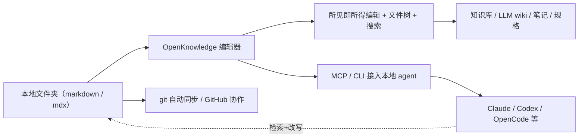

# OpenKnowledge：给 AI 搭一个能一边编辑、一边让 agent 动手的本地知识库

先交底：**OpenKnowledge 是一个开源的 Markdown 编辑器**，干的是"笔记 + 知识库 + 给 agent 用的底座"这摊事。它最抓人的不是"又一个好看的编辑器"，而是**它把"写文档"和"agent 改文档"焊在了一起**——你在左边当作 Google Doc / Notion 一样所见即所得地改 Markdown，边上并排坐着一个 Claude / Codex / OpenCode 随便哪个 agent，就能直接对着这份文档动手，而且改完还是标准 Markdown，随便进 git。

它不是 Notion 的平替，也不只是又一款笔记软件。它是"Notion 式和 VS Code 式"缝合的一个东西：上来就是开一个本地文件夹，里面要是有现成的代码库、Obsidian 库、或者一堆 md / mdx，它直接就当你的工作台打开；你要是想往上叠"LLM 知识库""第二大脑"这种更重的玩法，它有 starter pack 帮你搭。而且它不是来抢你文件的，**你的文件就是你的文件，纯本地、免费、私有**。

一句话定位：**本地、所见即所得、跟 agent 打通的 Markdown 编辑器，打知识库和 LLM wiki 的底**。下面把它到底能干什么、跟测试 / 评测 / 搭知识库的人怎么搭，一层层掰开。

---

## 先看它是干嘛的，再决定要不要装

我先把最直接的用处撂出来，你就知道该不该往下读——它适合这几类人：

- **搭 LLM 知识库 / 第二大脑的人**：官方有 starter pack，一个命令把结构、MCP、skills 全配好，不用自己从零拼一整套。
- **日常拿 Markdown 记笔记、写规格、画架构图的人**：它真 WYSIWYG，编辑体验像 Notion，但存的是干净 Markdown，随时能进 git。
- **被 agent 折腾过的人**：它安装时会扫你机器上的 agent（Claude Code、Codex、OpenCode、Cursor……），顺手把 MCP 和 skills 给你牵好，让 agent 以后在你知识库里"带上下文地搜、带格式地改"，而不是瞎翻。

一句话：**它是"给 agent 配一个读得懂、改得动的 Markdown 后花园"**。这对干测试、做 AI 评测、攒知识库的人特别对味，下面我挑能对上你日常的讲讲。

---

## 它的主链路，一眼看穿

不用我说它多牛，你先看它从一头到另一头到底走什么路：



从左读到右：你本地一堆 Markdown，在编辑器里既当文档又当"能被 agent 读写的"数据源；边上坐着 agent，通过 MCP / CLI 来"帮你在库里搜索、动手改"; 底层靠 git/GitHub 兜底做同步和多人协作。不是概念产品，全是能落地的东西。

---

## 落到你的日常：这几件事是真省功夫

**1. 搭 / 维护 LLM 知识库，不用再拆十几个工具**

搭知识库最烦的从来不是"写文档"，是"写了谁能读懂、谁能改、怎么不散架"。OpenKnowledge 的 starter packs，用项目方的话就是帮你搭"LLM 知识库、第二大脑、结构化知识库"。而且它装完会自动帮你找机器上检测到的各种项目工具（Claude、Codex、OpenCode、Cursor……），把 MCP 和 skills 牵好——这些 MCP 和 skills 的职责，就是**帮你加上了"在知识库里做检索增强的搜索 + 按规范改写文档"的看家本领**。

对你这种"搭知识库 / 干 AI 评测"的人，价值在哪？**你写过的评测结论、prompt 库、用例、crash 复盘，一旦底子是有结构、能被 agent 检索的 Markdown，后面再让 agent 帮你"查漏、归类、复核"，它才真有上下文可依。** 不然你让 agent 处理一堆散文件，它就只能瞎猜。

**2. 结合 MCP / CLI，让 knowledge 成为 agent 的"外脑"**

这是它跟普通 Markdown 编辑器最大的分水岭。它装上以后会自带 MCP、skills 和"agentic search"（面向 LLM 百科、第二大脑、知识图谱的检索能力）。意思就是：**你的知识库不是一堆文本，而是能接入你 agent 工具的"外挂大脑"**。它能跟任何通过 MCP / CLI 接进来的 agent 或 harness 配合。拿这个思路在测试侧落地：你写回归案例、评测数据集、接口契约文档，全都沉淀成 agent 可读、可检索、可改写的知识，那 CICD 里让 agent 做用例回归、做需求可测性检查，用的就不再是"一份没人更新的文档"，而是 agent 随时能查的活库。

**3. 写工程规格 / 可视化报告，它能给你富组件加可视化的原生 HTML**

它不是光叫你写 Markdown。它支持**嵌 HTML 和富组件**，用来写工程规格（engineering specs）和做"可视化的报告"。这对做测试的你特有用——你想在报告里嵌图表、放交互组件，直接在知识库里反手出来，不用再造一套文档系统。够省的。

**4. 团队协作 + 本地优先：git 自动同步**

它还有个"无代码团队共享 / 自动同步"的开关，底层是 git / GitHub 撑的。这跟你 LLM 知识库 + 多人配合是天然一对：把知识库放 git，开会、评审、review 都有据可查、能版本对比。而且默认本地、私有、免费——你那份数据不出你那台机器。

---

## 它跟"测试 / 评测 / 知识库"到底怎么勾上

讲到这里，会议室里大概有人要插一句：

> **"你这一套是粘人，可我们组现状很骨感——知识库还停在'某个同事翻 Dropbox 找一个去年写的老文档'，agent 连门都摸不着，你让我先装啥、先拿它干嘛？"**

——说得实在。这种底子，你一步都别贪，就从"把现有最有用的文档收拢"开始：**先把你们组最常引用的那批（接口约定、测试计划、线上事故复盘）拷进一个本地文件夹，用 OpenKnowledge 打开，先把 Markdown 的检索和人工编辑跑顺。** 先别碰 MCP，先别想着 agent 改库。等你们自己都开始"搜得到、改得起"了，再往里加 MCP、加 skills、再上 agent。一句话：**知识库可以从小文件起家，但不能从"没人敢用、agent 读不到"起家。**

讲真，做 AI 测试 / 评测的人天天跟"上下文"打交道。你测一个 agent 答得对不对，不也看它能不能从上下文里捞到该捞的信息吗？**OpenKnowledge 干的就是把这"上下文"从"写死在一份文档里"变成"能被 agent 实时检索、改写、回归"的东西。** 它不是测试工具，但它是那类让你"拿 agent 来测"更站得住的底座。

---

## 怎么装、怎么跑起来：照抄就能动

装有两种途径，看你想要桌面 App 还是网页版。**先说桌面版**——直接去官网下载安装包，对应平台点开装就行，很简单（这里不细表）。

**再讲网页版 + CLI 这条路**，这条也最对命令行党的胃口。前提是机器上有 Node.js 24+ 和 git。命令行敲：

```bash
npm install -g @inkeep/open-knowledge
cd your-project
ok init          # 生成项目骨架，并帮你把 AI 工具（Claude Code、Claude Desktop、Cursor、Codex、OpenCode、OpenClaw）牵好
ok start --open  # 起本地 web 编辑器并自动开浏览器
```

我按文档写，装完进项目目录跑 `ok init`，它给你把项目 + 各种 agent 的接线都配好; 然后 `ok start --open` 起服务、弹浏览器。**这一套我没实测过（手头这台机器没装 Node 24），下面这些是基于项目文档的判断**——真要哪一步跑不通，多半是 Node 版本或 git 环境，先 `node -v` / `git --version` 查一遍。

跑起来以后，把一个**含 markdown/mdx 的本地文件夹**拖进去就能用：当 WYSIWYG 编辑器使，配好文件导航、搜索、标签、知识图谱这些，然后按提示装 MCP 和 skills。它对已经有的代码库、Obsidian 库、wiki 都能直接打开。

---

## 跟同类工具放一张桌子比

它做的事不是一个纯新人，家里早有几个常客：

| 工具 | 核心定位 | 上手难度 | 适用场景 | 什么时候别用它 |
|---|---|---|---|---|
| **OpenKnowledge** | 所见即所得 + 本地 agent（MCP/skills）+ 富组件 / 嵌 HTML 的知识库编辑器 | 中（CLI 一条命令装） | LLM 知识库、结构化笔记、给 agent 配可读写底座 | 你根本不需要 agent 写文档、只想纯记笔记时仍好用但不必要 |
| Obsidian | 双向链接知识库，插件生态巨丰富 | 低 | 个人笔记、关系图谱 | 接 agent 能力要走第三方插件，且非 WYSIWYG |
| Notion | 在线团队协作笔记 / 数据库 | 低 | 团队协作、项目管理 | 强制云端、不本地、数据不在你手里 |
| VS Code + Markdown | 全能编辑器 | 中 | 写代码 / 文档开发流程 | 没内置 agent 上下文、没 WYSIWYG，工作区散 |

它不是来"吊打"谁，它是**堵上了"本地私有又想让 agent 在知识库里动手"这块空档**。纯记个人笔记，Obsidian 已经很够；团队在线协作就走 Notion；你要是既想本地私有、又想有个 agent 能一边检索一边改的底座，它这会儿能顶上。

---

## 说句可能要挨骂的话：它也不是万灵丹

它有个我一开始特别想不通的点——**"本地、私有、免费"这几个字确实好听，但"免费"两字底下藏着一句没直说的话：它跟各种 agent 配合，得靠 MCP / CLI 的"桥"**。换句话说，**"用 agent 写文档"这套手感，不是你装上就自动有，得靠它帮你牵的 MCP/skills + 你机器上装好的 agent 工具共同配合。** 中间哪一环没配好，你觉得"怎么不灵了"，多半不是编辑器的问题，是那条 MCP 链路没通。

还有一点，它把数据安生全押在 git 上。要是你根本不使 git、不碰 GitHub，那"自动同步 / 团队协作"这块就等于空转，它更像一个纯本地编辑器——那也 OK，但你别指望它自动帮你把知识库翻成团队共享的那一份。**它不替你整理你的知识，它只是给你一个"能读能改"的容器。** 就好比菜市场上有人传的宫廷秘方，你照着做能不能出锅，是小火跟你那把米的事，方子只是方子。

它也不是给你"一键长出知识库"的魔法。starter pack 能把骨架铺好，但每一条你知识库里真算自己攒的料，还得你填。真难的不是装它，是你愿不愿意每天往里记一点、并让它长成 agent 读得动、改得动的结构。

---

## 收一笔

说到底，它不是帮你少写一封信，是帮你**不用再在"要不要信这份文档"上面耗掉一个下午**。你把知识库变成 agent 能检索、能真动手改的东西，才发现原来"知识库漂了、散、没人认"不是没法治，只是以前没人把它当"食材"喂给 agent 罢了。

真伪是它的事，长本事是你的事。

原文入口：仓库 `https://github.com/inkeep/open-knowledge` · 官网 `https://openknowledge.ai`

#AI #Agent #知识库 #LLM-wiki #Markdown #MCP #本地优先 #开源 #测试