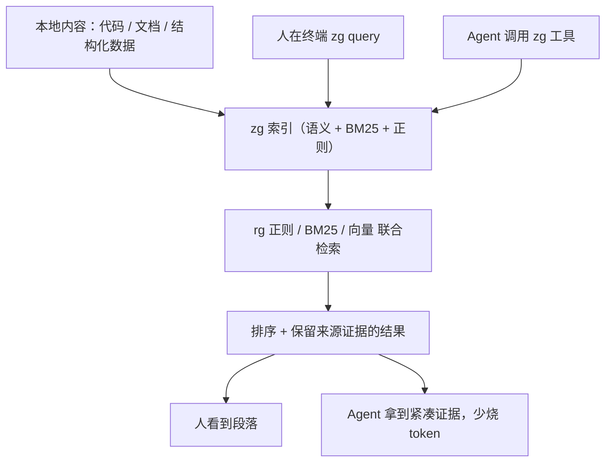

# zg（zvec-grep）：让 Agent 自己会搜代码库的本地统一检索层

先交底：**`zg`（zvec-grep）是一个"本地优先的统一检索层"**，一句话就是**把 ripgrep（正则）、BM25（关键词）、向量检索这三套搜法，收进同一个入口**，既能让人在终端里搜，也能让 Agent 根据你问的什么问题、自己挑合适的检索方式去翻你的本地内容。

它不是又一个"跟 grep 一样的搜索插件"。它是想做**"面向人 + 面向 Agent 的本地检索底座"**：装一次、索引一次，在 macOS / Linux / Windows 上都行，CLI 和 Agent 复用同一个工作区。对干 AI 测试、AI 评测、搭 agent、做工程化的人来说，这东西的一端接在"你的代码和文档怎么被找到"，另一端接在"Agent 怎么少烧 token、少瞎翻、还找得准"——这两件事，都跟你天天干的活直接挂钩。

Apache-2.0 开源，装起来一条命令。下面把它能干什么、在测试 / 评测日常里到底顶什么用，一层层掰。

---

## 它在检索这件事上，一开始就把套话甩开了

我先把最抓人的几条撂这：

- **人和 Agent 都开箱即用**：装一次、索引一次，三个系统都能用同一个工作区，CLI 是给人，Agent 是给机器，一套底子养活两头。
- **不止关键词**：先用语义发现内容、按相关性排序，需要精确时再用文本 / 正则去验证。说穿了就是"语义兜底找人、词法锚定定位"。
- **多格式**：代码、文档、结构化数据都能搜，还保留来源位置和内容结构。
- **更少搜索、更少上下文**：排序 + 保留来源的结果，能少掉工具调用、少烧 token、少接没用的噪声。
- **默认本地跑**：文件、索引、本地模型全留在本机；除非你点头，否则你的数据不会发给远端 embedding 服务。

这最后一条对做测试、对数据敏感的团队特别值钱——**你的代码库、测试用例、事故复盘这些，本来就该躺在自己机器上，而不是为了"搜得准一点"就送出去。**

---

## 主链路，一眼看穿

它到底从一头到另一头走什么路：



输入是你本地的代码和文档，经过一层同时存语义和词法的索引，人问或者 Agent 问都进同一个检索，出来的是"排好序、带着来源位置"的证据，喂给人看也好、喂给 Agent 当上下文也好。不是概念，是你真能照跑的整条路。

---

## 落到你的日常：这几处是真能省事

**1. Agent 想起你代码库里的"证据"，不再靠 Ctrl+F 碰运气**

做 agent 开发、搭 agent 的人最头疼的，就是 Agent 在一个你没给它地图的仓库里瞎翻。zg 干的是给 Agent 一把"会自己挑检索方式"的钥匙：语义先摸到该看哪块，再由词法去锚定精确的符号 / 签名 / 层级路径。**你测过的 crash、改过的接口、写过的测试用例，Agent 一搜就到，还带来源，回你的时候能指路径给你看。** 对测试来说，等于让 Agent"带着上下文去翻"而不是"靠命去碰"。

### 2. 做 Agent 评测，它有可复现的 Bench 思路

文档里给了它自己的评测方法——**配对 A/B 评测**：任务、Agent/模型、Prompt、环境、资源限制都保持一致，只动"给不给 zg"这一个开关。跑过 SWE-QA-Bench（Claude 配 Claude Opus 5 高推理）和 BrowseComp-Plus（Codex gpt-5.6-sol 中等推理），测的是答案质量、输入 token、工具调用次数、Agent 耗时。做 AI 评测的人可以照这个思路搬：**你想知道"加了某个检索工具到底值不值"，最好的办法不是听它吹，是把其余变量钉死、只动检索这一个开关。**

### 3. 真实代码库上，它瞄的是"位置不明的架构 / 数据流"问题

文档里的三个真实案例——pylint（区分带不带类型标注的 AST 属性初始化）、matplotlib（追踪 `FontInfo` 在数学文本渲染 Pipeline 里跨文件的传递）、django（username 唯一约束跟 ORM 事务为何挂钩）——全是"目标位置你不知道在哪个文件、证据又散在多处"的问题。**这正是代码要测的主战场之一**：拿到一个从没见过的仓库，你得先知道"这段逻辑在哪、怎么串的"，才能谈怎么测、怎么改、怎么回归。zg 给的"紧凑且带来源"的证据，就专门治这种"地图都没画"的场景。

---

## 怎么装、怎么真正跑起来：照抄就能动

先装（要 Node.js 22+）：

```bash
npm install -g @zvec/zvec-grep
```

造一个示例书架（README 给的，两个公版英文书）：

```bash
mkdir zg-mystery && cd zg-mystery
curl --retry 3 --retry-all-errors --progress-bar -fL \
  -o alice-in-wonderland.txt https://raw.githubusercontent.com/GITenberg/Alice-s-Adventures-in-Wonderland_11/master/11.txt \
  -o sherlock-holmes.txt https://raw.githubusercontent.com/GITenberg/The-Memoirs-of-Sherlock-Holmes_834/master/834.txt

zg index --embedding local/potion-retrieval-32m
```

`zg index` 会给这份"书架"建索引，`--embedding local/potion-retrieval-32m` 是让 embedding 用本地模型、不发外网。**这段我没实测（我手头机器 Node 环境不对），下面判断是照项目文档来的**——你要是 Node 版本不够就先升到 22+，`node -v` 验一下。

索引建好，两种用：一是让 Agent 用（文档配的 OpenCode 官方示例）：

```bash
zg install --target opencode --yes
opencode models
opencode run --model opencode/nemotron-3-ultra-free \
  "An unseen creature left a few marks. What did the detective infer? Cite local evidence."
```

意思是你问 Agent 一个跟书有关的问题，它自己就会去调 zg 工具搜，然后再带着出处回答（文档里给了完整调用和带 `sherlock-holmes.txt:5479-5486` 这类出处格式的回答样例）。注意文档提示：**免费模型随时可能变，先 `opencode models` 看看有没有，把示例模型换成你现在环境里能用的。**

二是你自己在终端直接搜：

```bash
zg query --human "An unseen creature left a few marks. What did the detective infer?" --limit 3
```

按项目文档的说法，zg 会把 `sherlock-holmes.txt` 里相关段落排在 `alice-in-wonderland.txt` 前面——也就是语义相关的那本排在前面。你要真想看效果，跑完这条，结果前三名里应该能直接看到那句话出自哪本。

**至少，人用终端的这条 `zg query --human` 是文档里确定的真实调用，照抄能跑。**

---

## 会议室里，有人问了句

> **"你说它少烧 token、找得准，可我担心的恰恰是'找太准'——它会不会把我的真实代码库、涉及敏感的那部分写进去，或者干脆把数据送到外面一次？"**

——问得正是地方。它默认本地跑，这一点写在开头：**文件和索引和本地模型都在你机器上，远端 embedding 服务不接你的数据，除非你明确授权。** 所以真敏感的东西，它默认不出门。可这不是"用/不用"的无限自由——**你怎么配索引范围、哪些目录给索引、要不要连远端 embedding，是你在部署时得先想清楚的决定**，不是它替你拍板。一句话：**它把"数据在哪"的开关放在你这只手，你得先按一下。**

---

## 跟同类检索方法放一张桌子比

它属于"本地检索 / RAG 底"这一类，几个熟人放一排：

| 工具 | 核心定位 | 上手难度 | 适用场景 | 什么时候别用它 |
|---|---|---|---|---|
| **zg（zvec-grep）** | rg + BM25 + 向量，统一入口，人 & Agent 两用 | 中（CLI 弄懂索引即可） | 让 Agent 在代码/文档上自主检索、要求来源证据、本地优先 | 你只需要人肉 grep 一下，不接触 Agent |
| `rg` + `fzf` | 纯关键词 + 递增过滤 | 低 | 日常自己 grep 文件 | 语义、跨文件相关性、给 Agent 提供上下文，不擅长 |
| 各家嵌入式 RAG | 全语义库、问答式 | 高（要管向量库 / 切块 / 模型） | 大文档库做问答、知识库 | 只想"让 Agent 搜代码"，太重、难收敛 |
| 云端语义搜索服务 | 托管向量检索 | 低 | 不想管基础设施、可外传数据 | 数据敏感、不能出本机 |

它不"秒杀"谁，它填的是**"既想本机私有、又想给人+Agent 两用、还要源码文档一起搜"**那块。真到你要搭一个完整知识库问答，你还得往上叠切 chunk、存向量这些；它更像"给 Agent 检索本地利器"那一层，不是"万能的知识库生成器"。

---

## 一句不一定中听的话

可它十个里面有九个，是被人当成"查得更快的搜索工具"来使的——其实它更像**把你本机的内容变成 Agent 的"证据地毯"**。搜索只是为了让你别在"信不信这句话、证据在哪"上再耗一下午。

当然它也有撇不清的利害：**本地 embedding 模型要啃你机器多少算力、多大显存，取决于你本机配置**；远端 Agent 要真把它用顺，还得配合你机器的环境（OpenCode、Codex、Claude Code 这些），配置多一层就多一分"配不全"的翻车率。文档自己也多次说，"Agent 何时怎么调用，结果会随模型和运行浮动，多次跑再取均值更可靠"——这话翻译成测试人的话就是有波动，别信单次结果，要信它陪你测几轮。

也没写它是万能的：那些"目标位置根本不知道、证据跨文件"的调用链、数据流、架构问题，是它的甜区；你要是只想要个"查个字符串"，那直接 ripgrep 就做好了，别把它当升级版 grep 用。

---

## 收一路

说到底，它不是帮你把代码再认识一遍，是帮你先在"让 Agent 自己会找、而且能找到带出处的证据"这件事上少熬几个夜。你把"搜"这件事从根上想明白，才恍然原来"证据在哪儿、信不信它"那口锅，一直是你自己人肉背着的。

人是会脸皮薄的，问不准、找不到，多半咽下去不说。Agent 不会不好意思，它只会任务没跑完就多调几次。可它调的是你的 token，问的是你的代码库。它问的不是搜索工具，是你敢不敢让它先自己找一遍——而你手边，多了一把找得着证据、证据又留在本地的钥匙。

原文入口：仓库 `https://github.com/zvec-ai/zvec-grep`

#AI #Agent #检索 #BM25 #向量检索 #本地优先 #RAG #开源 #测试 #评测