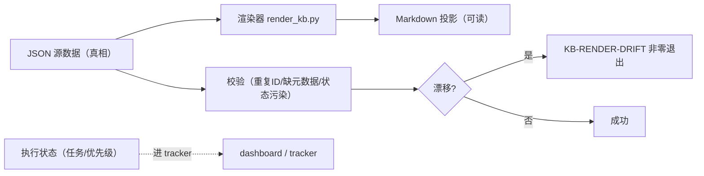

# 把文档当代码一样治：doc-system-kb-builder 让文档漂移变成可回归的测试

先交底：**`doc-system-kb-builder` 是一个给 Codex 用的开源 Skill**，它干的事一句话——**把"文档系统"从一堆手写的 Markdown，变成一个"doc-as-data"（数据即文档）的知识库**。核心理念就一句，特别值得划下来：

> **耐久真相活在验证过的 JSON 里；Markdown 只是它的一个确定性"读取投影"（reader projection）。执行状态不进文档，放在 dashboard / task tracker 里。**

翻译成人话：**你的文档不再是"人工维护的第二份真相"，而是"从一份被验证的数据渲染出来的画面"。** 改文档改的是数据，Markdown 是脚本跑出来、永远跟数据一致的那张脸。这一下，长期困扰文档系统的两个病——"文档又和现实漂了"和"文档该谁说了算"——从根上被治了一部分。

它是 Codex 的一个 Skill（用 `$doc-system-kb-builder` 唤起），仓库在 `github.com/buccaneermethodology/doc-system-kb-builder`，装的是一套"可安装的 Skill + 全量参考 + 示例 + 测试"的目录。

它有明确的适用边界：**适合做新的 doc-as-data 知识库、做"源权威清理"、做生成文档的漂移检测、做证据/冲突/演进的显式记录、做手写文档的分阶段迁移。它不是审批引擎、不是通用任务追踪器、也不能替代领域评审。**

---

## 为什么这东西对"测试 / 评测 / 知识库"的人特别有嚼头

做测试、做 AI 评测、搭知识库的人，最烦的一件事就是：**文档到底跟现实对不对得上？** 你见过多少"按文档操作，文档是去年写的"的坑？漂移检测在代码里人人都会做（CI 跑不过就红），可文档漂移，几乎没人系统管过——因为文档不是数据，没法 diff。

而这份 Skill 恰好把"文档系统"变成了**能 diff、能断言、能进 CI 的对象**：

- **Markdown 是确定性的投影**，所以"投影对不对"是一个可判定的问题——渲染出来应该跟数据完全一致，不一致就是漂移;
- **漂移有专门的检出信号**：`KB-RENDER-DRIFT`，`--check` 模式只报告不修复，检出就非零退出；
- **还有一套 fail-closed 的规则**：重复文档 ID、缺 owner、规范文档里混进执行状态……每种都有固定错误码，都可写进测试。

一句话：**这份文档系统，从"没法治的烂摊子"变成了"能被自动回归测试守住的正确系统"**。这跟测 API、测数据契约是一路的思路，只是换到了文档上。

---

## Doc-as-Data 的架构：真相、投影、状态三者不混

先看这张图，它把"什么是真相、什么可以动"画得很清楚：



核心不在渲染脚本本身，在**那个"数据合约"**：JSON 字段怎么定、谁能当权威、哪些东西坚决不让混进来。这套合约是它的灵魂，下面一层层拆。

---

## 数据怎么定：先给来源分类再写，别让"执行状态"混进真相

REFERENCE 开头就给了一张**权威模型（authority model）**的表，决定"什么来源、进什么桶"：

| 分类 | 含义 | 去处 |
|---|---|---|
| **Canonical（规范）** | 已批准的当前架构、契约、术语、产物语义 | JSON，`doc_type: canonical` |
| **Strategy（策略）** | 怎么应用/演进当前真相的长期指导 | JSON，`doc_type: strategy` |
| **Evolution（演进）** | 被替代的设计、冲突、缺口、未决问题 | JSON，`doc_type: evolution` |
| **Execution state（执行状态）** | 任务、优先级、负责人、进行中的活、临时阻塞 | **外部 tracker，不进文档** |

几个"不可折叠"的坚持（作者点名提醒的坑）：**别把 JSON 真相折叠进生成的 Markdown**、别把"schema 合法"当成"内容被批准"、别把迁移输出当规范真相、别把一个实现细节软化成弱化目标设计、别把新笔记当成已批准的决策。

这里就引出了它对测试人员最友好的一条：**`KB-EXECUTION-STATE-IN-CANONICAL`**——规范文档里一旦混进 `priority` 这种任务字段，直接报错挡下。执行状态就该在 tracker 里，不该跟真相躺一个文件。

---

## JSON 契约长什么样（能照抄的字段）

每个文档源（JSON）约定了这套字段，REFERENCE 里列得清清楚楚：

| 字段 | 契约 |
|---|---|
| `doc_id` | 非空稳定标识，全库唯一 |
| `doc_type` | `canonical` / `strategy` / `evolution` |
| `title` | 面向读者的文档标题 |
| `version` | 源契约/内容版本 |
| `status` | 内容生命周期标签，如 `approved` / `current` / `draft` |
| `output_path` | 相对 `docs/*.md` 的投影路径，不许目录穿越 |
| `metadata.owner` | 对源负责的 owner，不是临时 assignee |
| `metadata.updated_at` | 源修订日期或评审标记 |
| `metadata.source_scope` | 非空列表，声明证据/决策范围 |
| `metadata.depends_on_docs` | 已有 `doc_id` 的依赖列表 |
| `sections` | 有序的带类型小节 |

渲染器目前只支持 `narrative`（叙事）、`definition`（定义）、`table`（表格）三类小节。想加一类，得做完整的契约扩展（加校验 + 确定性渲染 + 正反例 + 排序），不是顺手加个 section kind 就行。

---

## 怎么装、怎么跑起来（照抄能跑）

它是 Codex Skill，安装是复制目录到 Codex skills 目录：

```bash
cp -R .codex/skills/doc-system-kb-builder "${CODEX_HOME:-$HOME/.codex}/skills/doc-system-kb-builder"
```

仓库自带了独立 sample KB + 只用 Python 标准库的工具，把仓库当工作目录就能跑：

```bash
python3 scripts/render_kb.py --repo examples/sample-kb
python3 scripts/render_kb.py --repo examples/sample-kb --check
python3 scripts/migrate_markdown.py --input examples/legacy/architecture-notes.md --output /tmp/architecture-notes.draft.json
python3 tests/run_tests.py
```

四个命令分别是：渲染、只查不写（漂移检测）、把手写 Markdown 迁移成待审的 JSON 草稿、跑测试。**`render_kb.py` 会先校验源元数据、拦截重复文档 ID、拦截执行状态污染，再写 Markdown**；`--check` 只报告漂移不改文件，一旦有漂移就非零退出——这句正好能落进 CI。

仓库布局：

```text
.codex/skills/doc-system-kb-builder/   Installable Codex Skill 和全量参考
examples/sample-kb/         JSON 源 + 生成的 Markdown
examples/legacy/            迁移输入示例
scripts/                    确定性渲染器 + 草稿迁移器
tests/run_tests.py          正例 + fail-closed 负例测试
```

---

## 五种检查码：fail-closed 的断言集合（重点）

REFERENCE 把"哪些算坏、怎么修"钉成了五条。**对测试的人，这就是一份现成的规范断言集**：

| 检查码 | 触发条件 | 典型修复 |
|---|---|---|
| `KB-INVALID-SOURCE` | JSON 非法/缺元数据/不安全输出路径/不支持的分节/未解决依赖 | 修 JSON 契约或源 |
| `KB-DUPLICATE-DOC-ID` | 两个源对同一个稳定标识认领 | 显式解决身份/所有权 |
| `KB-EXECUTION-STATE-IN-CANONICAL` | 规范源带 tracker 字段或用执行状态当类型 | 状态移去 tracker，只留稳定真相 |
| `KB-RENDER-DRIFT` | 生成 Markdown 缺失/异常/与 JSON 投影不一致 | 先审源，再重新生成 |
| `KB-MIGRATION-PROVENANCE-MISSING` | 迁移输入读不到，产不出可追溯草稿 | 给可读、可追溯的来源 |

作者强调：这些都属于**阻塞型**检查，对"评审类建议"（措辞不清、源权威弱、缺审批）不会放过。测试的人会心一笑：**这就是 fail-closed（该挂就挂），不是"能过就过"。**

---

## 走一遍真的用法：把一个"电商客服知识库"接进文档漂移回归

挑个互联网业务方向落一遍：**电商客服的知识库**。场景——客服知识库的答案，直接决定客服 agent 的答复质量（退款政策、发货规则、风控边界）。这种文档必须"跟数据一致"，最怕"政策改了，文档没改"。用这份 Skill 把它管起来，`--check` 就成了每一次改动前的"文档漂移体检"。

**一套能直接模仿的 CI 用法**（组合使用的思路：Skill 提供 doc-as-data 底座，你把 `--check` 请进自己的流程）：

```bash
# 本地先确认：渲染出来的 Markdown 与 JSON 投影完全一致（零漂移）
python3 scripts/render_kb.py --repo examples/sample-kb --check

# 提交前把它们一并跑掉——套件+漂移体检一起过，才放行
python3 tests/run_tests.py && \
  python3 scripts/render_kb.py --repo examples/sample-kb --check
```

> 说明：`render_kb.py --check` 和 `tests/run_tests.py` 都是真实命令。仓库自带的 `tests/run_tests.py` 已写好正例和反例（含"手改 Markdown 触发 `KB-RENDER-DRIFT`"这类负例）；上面只是把它们串起来当回归门，不是新造命令。这对测试的人是最大的便宜：**漂移负例仓库都已经替你想好了。**

**这套思路的妙处**：文档漂移第一次成了能 `--check` 出、能红能绿的回归信号。改文档 = 改数据 → 重新渲染；谁要是跳到数据直接手改 Markdown，`KB-RENDER-DRIFT` 立刻咬人。

---

> **"说得好听，可我的团队现在全是手写 Markdown，几十年老资料，这怎么破？"**

——这正是它提供 `migrate_markdown.py` 的原因。按它的迁移方式：**先把手写 Markdown 转成"待审的 JSON 草稿"（写到临时目录，绝不直接进正式源）**，评审定稿后再正式源、渲染、比对；分批小步、保留来源与评审记录，不是一刀切。老文档不用一夜重写，挑一个低风险的目录试点就行。

> **"那是不是只要渲染器过了、测试绿了，文档就是对的？"**

—不是，这条它自己说得最清楚。看它那句 **Evidence boundary**：通过测试只证明"这套数据结构满足规则 + Markdown 投影逐篇一致"，**不等于**证明"内容被批准了""语义是对的""可以上生产"。评审与审批是渲染器给不了的，得人来。**它守住的是"一致、该挂就挂"，不是"内容经得起生活"**。把它当一致性卫兵，别当内容会审。

---

顺便把这盆冷水泼明白，这个 Skill 有它的"三不沾"：

- **它不是让文档"自动变对"，只让文档跟数据一致。** 数据本身对没对，它管不着；源头专家把口径定错了，它照渲染成一致的错误文档。它守住的是"一致"，不是"正确"——它自己把这句话写在最小的门槛上：**"通过测试，只是证明结构规则满足 + 投影一致"，不是证明"这内容是经过批准的、是对的了、可以上生产了"。**
- **它不是给每个笔记当真相的。** REFERENCE 明确说别把它拿"把随便一条笔记当规范真相"用。它是给"需要稳定 + 可溯源"的知识用的，不是给所有笔记贴金标准标签的。
- **它不是万能模板。** 它只有 `narrative / definition / table` 三类小节；要富 schema 校验、多语言、搜索索引、签名溯源，作者明说那是"你自己做的扩展"，别吹成核心能力。

说到底一句话：**记得住容易，记得准才难；文档系统最难的不是写，是"让写的和真的对得上"。** 它把"文档"从"手写的第二份真相"降格成了"数据的可读投影"，再用 `--check` 守住那句话——**纸上的对，得经得起数据一查。** 这句话，比它一整仓库代码都值钱。

真到动手那步，也别贪多：克隆仓库，先跑一条 `python3 scripts/render_kb.py --repo examples/sample-kb --check`，把"一致→绿"走通；再手动改一下 `docs/architecture.md` 跑同一命令，看到 `KB-RENDER-DRIFT` 报出来——你就明白"文档漂移可测"是怎么一回事了。剩下那些——哪些进 JSON、谁当 owner、怎么分批迁——都是日子，一天天过出来的。

原文入口：仓库 `https://github.com/buccaneermethodology/doc-system-kb-builder` · 全量参考：`.codex/skills/doc-system-kb-builder/references/REFERENCE.md`

#AI #知识库 #doc-as-data #文档漂移 #测试 #自动化 #Codex #确定性 #CI #开源
