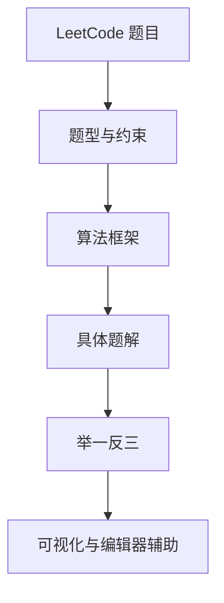

# labuladong 算法笔记：把刷题从答案收集变成框架训练

很多人刷题，刷到后来像在仓库里搬砖：今天搬一道二叉树，明天搬一道动态规划，搬得不少，换个题型还是得重新找答案。`labuladong/fucking-algorithm` 这个项目的出发点不一样，它把六十多篇基于 LeetCode 的原创文章，组织成一套强调算法思维、框架和举一反三的学习资料。

它真正想解决的不是“怎样多收集几段代码”，而是“遇到新题时，能不能认出它属于哪类问题”。这对准备面试的人有用，对做自动化测试和质量平台的人也有用：测试数据、状态转换、检索路径，换个名字，底层仍然在考察同一种抽象能力。

---

## 先别急着收藏：它在解决哪种刷题困境

项目说明里有一句很明确的判断：只给题目代码和时间复杂度，学习价值很有限。代码通过测试，只能说明这一题暂时过了；如果没有解释思路和框架，下一题换个问法，手还是会停在编辑器上。

所以这套资料的重点不是把题解做成代码展览，而是把常见问题抽出可复用的思考方式。目录里能看到“核心刷题框架汇总”，也能看到双指针、滑动窗口、二叉树、动态规划、回溯、BFS、贪心和分治等主题。你读的不是一排互不认识的题，而是一组可以反复调用的解题工具。

这和测试开发里的用例设计很像。一个接口用例过了，不代表同类边界都覆盖了；真正有用的是知道它在验证哪种状态变化、哪种约束和哪种异常路径。

---

## 这套内容怎么搭起来



按内容理解，这套资料可以分成四层；这不是官方声明的仓库目录分层，而是本文为了帮助阅读做的归纳：

| 层次 | 内容 | 读者得到什么 |
|---|---|---|
| 框架层 | 双指针、滑动窗口、动态规划、回溯、BFS 等 | 先判断问题属于哪种模型 |
| 数据结构层 | 数组、链表、树、图、哈希、堆等 | 理解工具的基本动作 |
| 题解层 | 经典题目和变形题 | 把抽象框架落到代码 |
| 辅助层 | 网站、可视化面板、浏览器和编辑器插件 | 在阅读和练习时减少切换成本 |

这张表里最值得留意的是“框架层”。没有这一层，资料越多，收藏夹越胖，迁移能力未必跟着长。

---

## 网站、可视化和插件分别干什么

项目配套的学习网站是 <https://labuladong.online/algo/>。项目说明把它描述为系列教程的核心承载位置，每篇文章开头还会关联对应的 LeetCode 题目。适合把阅读和练习放在一起，不必读完一篇后再到处搜索题目。

算法可视化面板解决的是另一件事：有些数据结构和递归过程，光看代码很难在脑子里跑起来。可视化可以把指针、节点和递归过程摊开，读者能先看状态怎么变化，再回头看代码为什么这样写。

配套插件则负责把题解放到刷题所在的位置：Chrome 插件面向中文版力扣或英文版 LeetCode，VS Code 插件面向编辑器使用者，JetBrains 插件覆盖 PyCharm、IntelliJ 和 Goland 等环境。项目说明还提到，这些插件会建立题目与算法技巧之间的引用关系，并和网站、公众号、课程联动。

这里要交代清楚：本次只核对了项目公开说明，没有实际安装这些插件，也没有把它们写成“复制命令即可完成”的安装教程。插件的具体安装，应继续打开各自手册并在目标环境验证；文章先讲清它们在学习链路中的位置。

## 用一个案例看懂“框架训练”

滑动窗口是很适合拿来练习的例子。官方文章把它归纳为“右指针扩大窗口、左指针收缩窗口”，关键不在背下某道题，而在维护窗口内的约束。

以“最小覆盖子串”为例：给定字符串 `s` 和目标字符串 `t`，要在 `s` 中找到包含 `t` 全部字符的最短连续子串；字符需要满足出现次数，找不到时返回空字符串。

可以按下面的顺序推导，而不是先抄代码：

1. **输入**：`s = "ADOBECODEBANC"`，`t = "ABC"`。窗口从左到右移动，不能跳过中间字符。
2. **扩张**：右指针逐个加入字符；当加入的字符属于 `t`，更新 `window` 计数。
3. **满足约束**：当窗口已经覆盖 `t` 中所有字符及其次数，`valid` 达到目标数量，窗口就具备收缩资格。
4. **收缩**：不断移动左指针，删除不必要字符；一旦删除导致约束不再满足，就停止收缩，并记录此前的最短答案。
5. **验证**：至少检查目标为空、`s` 比 `t` 短、目标字符重复、完全找不到和多个同长度答案等边界。

下面是依据官方滑动窗口框架整理的**组合示例/示意代码**，不是项目原文的逐字复制；这里不虚构运行输出，读者应在自己的 Python 环境执行验证：

```python
from collections import Counter


def min_window(source: str, target: str) -> str:
    need = Counter(target)
    window: Counter[str] = Counter()
    left = 0
    valid = 0
    best_start = 0
    best_length = float("inf")

    for right, character in enumerate(source):
        if character in need:
            window[character] += 1
            if window[character] == need[character]:
                valid += 1

        while valid == len(need):
            if right - left + 1 < best_length:
                best_start = left
                best_length = right - left + 1
            removed = source[left]
            left += 1
            if removed in need:
                if window[removed] == need[removed]:
                    valid -= 1
                window[removed] -= 1

    return "" if best_length == float("inf") else source[best_start:best_start + best_length]
```

验证方式是执行 `min_window("ADOBECODEBANC", "ABC")`，并检查结果是否为 `"BANC"`；再补充 `("", "A")`、`("A", "AA")`、`("ABC", "AA")` 等边界断言。以上只是可复现的验证入口，本次文章整理未执行代码，因此不把结果写成实测输出。

这段代码的可迁移价值在于不变量：`window` 保存当前窗口的计数，`valid` 表示已经满足计数要求的目标字符种类。把它迁移到订单查询时，可以把“字符是否满足需求”换成“筛选条件是否满足”，但仍要重新定义输入、约束和边界，不能把算法代码直接当成业务实现。官方案例和可视化页面可分别参考：<https://labuladong.online/algo/essential-technique/sliding-window-framework/>、<https://labuladong.online/algo-visualize/tutorial/minimum-window-substring/>。

## 从算法框架迁移到测试设计

刷算法不等于每天去参加竞赛。对测试开发来说，更实在的用法是把“识别约束、维护不变量、验证边界”迁移到测试设计，而不是硬套某个算法名。

以订单查询为例，先明确输入是关键词、日期范围、状态和分页参数，约束是“结果必须同时满足所有筛选条件”，验证则包括空结果、边界日期、重复条件、跨页查询和条件组合。这样设计出来的不是几条孤立用例，而是围绕约束变化的一组测试。

第二种是读懂开发代码。代码评审时，看到一段循环，不要只问“结果对不对”，还可以追问：它维护了什么不变量？边界在哪里？输入规模变大时，时间和空间成本会怎样？这些问题和算法学习中的复杂度、数据结构、状态转移是同一套基本功。

还可以把同一框架用于 AI 测试的变形设计：让模型生成边界输入、反例和回归样本，再由人工判断是否真的覆盖约束。这里是组合使用场景，不是这个项目原生提供的 AI 评测功能。

旁边的同事可能会问：“我不是准备算法面试的，为什么要看这个？”

因为工程里很多难题并不穿着“算法题”的外套出现。测试数据怎么覆盖，检索条件怎么收敛，状态机怎么避免漏状态，本质上都在问：能不能把一个大问题拆成可识别、可验证的结构。题目只是练习场，工作才是正式考试。

---

## 怎么开始用

项目公开说明没有给出统一的 `pip install`、`npm install` 或仓库启动命令，因此不建议把它当成一个需要本地编译的 Python 工具来安装。比较稳妥的入口是：

1. 打开学习网站，先看速成目录或完整目录学习规划。
2. 选择一个框架主题，例如滑动窗口、二叉树或动态规划。
3. 先读框架文章，再做对应题目，不要只复制题解代码。
4. 用可视化面板观察数据结构或递归过程。
5. 如果习惯在浏览器、VS Code 或 JetBrains IDE 中刷题，再按对应手册确认插件安装。

项目目录还提供 ACM 模式代码模板、编程语言刷题实践和算法复杂度分析等入口。它们更适合在遇到具体学习障碍时按需打开，不必第一天就把整个目录读完。

---

“框架”不是万能钥匙。它能帮你识别问题、组织思路，但不能替你完成练习。只看文章不写代码，和只收藏测试规范不跑用例，最后都会变成一种很有秩序的拖延。

另外，公开项目说明里列出了网站和插件能力，但没有在这次核验中证明每个插件当前版本的安装细节、兼容范围和全部功能。遇到这些信息时，应该回到对应手册确认，别拿项目总说明当成完整安装文档。

如果准备把这套内容接进自己的学习或测试流程，可以执行一个小闭环：选一个算法框架，完成十道题；为每道题补上输入约束、边界样本、参考解法和变形问题；最后让 AI 只生成候选，由人工复核正确性和覆盖度。这样得到的不是答案仓库，而是一份能反复回归的训练集。

项目地址：<https://github.com/labuladong/fucking-algorithm>

学习网站：<https://labuladong.online/algo/>

## 经验感想

这次对项目资料的核对有一个很实际的提醒：介绍一个开源项目，先把它公开写明的能力讲清楚，再补自己的使用判断。没有安装验证，就不要把“有插件”写成“插件一定能在当前环境正常运行”；没有后台数据，也不要拿“热门”替代内容证据。对读者来说，最小可执行动作不是收藏，而是选一个框架、做十道题、补齐边界并复核一次迁移结果。


`#算法学习` `#LeetCode` `#GitHub开源项目` `#测试开发` `#AI测试` `#数据结构` `#动态规划`
