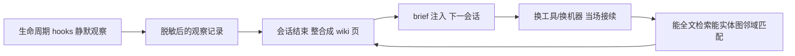

# 换 Claude Code 换 Codex，AI 不再失忆

ai-memory 是一个为 AI 编码 Agent 提供长期记忆的开源工具。服务运行在自托管 server 上，维护一份由 Git 管理的 Markdown 知识库。Claude Code 中记录的项目架构、问题和未完成事项，可以被 Codex 等其他工具继续读取。项目说明列出二十多个兼容 Agent，包括 Claude Code、Codex、Cursor、Gemini CLI、OpenCode、Grok 和 Devin。

多种 AI 编码工具并行使用时，上下文无法共享是常见问题。

不同编码工具通常维护各自的记忆文件。记忆与具体工具、机器绑定后，切换编码器就需要重新提供项目架构、失败路径和未完成事项。问题在于存储边界不同，而不只是模型能力差异。

在测试和质量工作中，这相当于缺少版本管理：上下文只存在于个人会话，换工具或换人后难以恢复。

---

ai-memory 不是单纯提供 function 调用的记忆 SDK，而是一个记忆基础设施。源文件采用普通 Markdown，可通过 grep 或 Obsidian 查看和修改；数据库属于由 Markdown 派生的索引，可以重新构建。

其主要链路是将会话中需要保留的信息写入磁盘：



hooks 记录 prompt、工具调用和会话边界，并在写入前进行脱敏。会话结束后，观察记录被整合为 Markdown wiki 页面。下一次会话通过 brief 恢复进度，并支持全文检索、实体检索和关联检索。默认模式不需要调用大模型，FTS5 可以独立完成全文检索。

下面以 Docker 部署和 Claude Code 接入为例说明最小闭环。

---

## 直接把最小闭环跑起来（以 Docker 为例）

以下命令来自官方项目说明。本文未配置 Docker 和 Agent 引擎，命令执行结果属于未实测内容，相关目录和输出以目标环境为准。

运行前需要安装 Docker 和一个兼容的 Agent 编码工具。下面以 Claude Code 为例，Codex 可替换对应客户端参数。

**第一步：安装启动器。** 该 shell 脚本负责挂载 `$HOME`、环境变量和配置。官方提供了带校验的安装方式：

```bash
mkdir -p ~/.local/bin
wrapper_tmp="$(mktemp -d)"
trap 'rm -rf "$wrapper_tmp"' EXIT
wrapper_base=https://github.com/akitaonrails/ai-memory/releases/latest/download/ai-memory-wrapper
curl -fsSL "$wrapper_base" -o "$wrapper_tmp/ai-memory-wrapper"
curl -fsSL "$wrapper_base.sha256" -o "$wrapper_tmp/ai-memory-wrapper.sha256"
expected="$(awk 'NR == 1 { print $1 }' "$wrapper_tmp/ai-memory-wrapper.sha256")"
if command -v sha256sum >/dev/null 2>&1; then
    actual="$(sha256sum "$wrapper_tmp/ai-memory-wrapper" | awk '{ print $1 }')"
else
    actual="$(shasum -a 256 "$wrapper_tmp/ai-memory-wrapper" | awk '{ print $1 }')"
fi
[ -n "$expected" ] && [ "$actual" = "$expected" ] || { echo "wrapper checksum mismatch" >&2; exit 1; }
install -m 0755 "$wrapper_tmp/ai-memory-wrapper" ~/.local/bin/ai-memory
rm -rf "$wrapper_tmp"
trap - EXIT
```

最后的 `install` 将可执行文件放到 `~/.local/bin/ai-memory`。如果命令不在 PATH 中，需要将该目录加入 shell 配置。

**第二步：启动服务。** 使用 `docker run` 启动容器。端口绑定到本机回环地址时只允许本机访问，适合单机部署：

```bash
docker run -d --name ai-memory \
    --restart unless-stopped \
    -p <本机回环地址>:49374:49374 \
    -v ai-memory-data:/data \
    -e AI_MEMORY_LLM_PROVIDER=anthropic \
    -e ANTHROPIC_API_KEY=sk-ant-... \
    -e AI_MEMORY_EMBEDDING_PROVIDER=openai \
    -e OPENAI_API_KEY=sk-... \
    akitaonrails/ai-memory:latest
```

这里的 `<本机回环地址>` 需要替换为操作系统的 loopback 地址。多人或局域网部署还需要配置认证和 TLS，不能直接对所有网卡开放。

`AI_MEMORY_LLM_PROVIDER` 和 `AI_MEMORY_EMBEDDING_PROVIDER` 及其 key 用于会话总结和语义检索，也可以移除以使用 FTS5 全文检索。镜像支持 `linux/amd64` 和 `linux/arm64`。`--restart unless-stopped` 用于容器重启后自动恢复，前提是 Docker 服务已启动。

**第三步：接入 Claude Code。** wrapper 负责处理挂载和客户端配置路径：

```bash
ai-memory install-mcp   --client claude-code --apply
ai-memory install-hooks --agent  claude-code --apply
```

第一条命令注册 MCP，使 Claude Code 可以调用 ai-memory 检索接口；第二条命令安装 hooks，捕获 prompt、工具调用和会话边界。切换 Codex 时将两处 `claude-code` 替换为 `codex`，Cursor 使用 `--client cursor`。

完成启动器、服务和 Agent 接入后，官方说明会话可以开始捕获。验证可在同一项目目录启动新会话，并执行以下查询：

- `where did we leave off?`：查询上一次会话的进度。
- `search memory for X`：检索历史记录。
- `catch me up`：生成最近进度摘要。

还可以使用 `--enable-web` 开启只读网页视图，并通过 `/api/v1` 下的 JSON API 查询记忆。该能力来自官方说明，本文未在本机实测。

卸载使用 `ai-memory uninstall --apply`。官方说明安装命令具备幂等性，修改过的文件会保留时间戳备份。

---

## 记录哪些内容

核心问题是：系统实际保存哪些内容？

系统记录的是**已发生的操作**：发送的 prompt、调用的工具、会话起止时间。数据写入前经过类型化隐私边界和脱敏处理，再整合为 Markdown 页面。每个仓库可以通过 `[capture]` 规则排除路径，也可以配置为白名单模式。记录范围应在采集前确定，避免敏感内容直接落盘。

数据目录如下：

```text
<data_dir>/
├── wiki/    # markdown 源真理，git 版控
├── raw/     # 不可变的脱敏会话段（managed workstream 专用）
├── db/      # SQLite 索引（FTS5、实体、嵌入）
├── models/  # 本地嵌入模型的预留位
└── logs/    # 滚动日志
```

其中 **`wiki/` 是源数据，`db/` 是可重建索引**。搜索由 FTS5 全文检索、实体匹配、图邻域 RRF，以及可选的向量和来源权威度排序组成，支持从关键词检索扩展到实体关系检索。

---

## 工程场景

该工具主要适用于跨工具协作、团队知识共享和工程过程记录。

**多工具切换。** Claude Code、Codex 和 Cursor 可以共享同一份项目记忆。官方说明中，v1.39+ 的“当前项目”指针按用户隔离，项目知识共享，个人交接（handoff）保持独立。

**团队知识共享。** server 可以部署在 homelab 或局域网环境，由多个用户访问。官方说明提到按项目共享、多用户认证、mutation 审计和约 700/s 的写入吞吐数据。源文件使用 Markdown，能够纳入 Git 管理。

**测试与质量记录。** 测试执行中的问题、评测结论和交接信息可以整理为 handoff，供后续会话检索。这属于将跨工具记忆用于测试质量工作的组合场景，不是项目原生测试功能。

其他常用命令包括：

- `ai-memory bootstrap`：扫描已有项目历史。
- `ai-memory --enable-web`：开启网页和 API 访问。
- `ai-memory run claude`、`ai-memory run codex --yolo`、`ai-memory continue`：启用跨会话操作。
- 凭据通过环境变量注入，不写入源文件。

以上命令来自官方项目说明；完整运行结果取决于 Docker、Agent 客户端和本地配置，本文未在本机实测。

---

## 能力边界

该工具的定位是基础设施。官方说明强调基础设施应当稳定、低干预，实际使用仍有部署、权限和数据维护要求。

- **跨工具接续依赖完整配置。** MCP、hooks 和 server 必须正常运行，跨会话接续功能才会生效。
- **检索能力取决于配置。** FTS5 可以提供全文检索；语义检索需要配置 embedding 相关服务，不能将两者混为一谈。
- **默认本机访问不等于生产安全。** 局域网或多人部署需要补充 bearer token、用户认证和 TLS。
- **记忆系统仍需维护。** Markdown、索引和日志都需要备份；官方给出的写入吞吐数据不能替代容量规划和故障恢复方案。

---

## 与同类方案的区别

ai-memory 与其他 Markdown 记忆方案的主要差异如下：

| 方案 / 思路 | 核心定位 | 上手成本 | 适合场景 | 不适合场景 |
|---|---|---|---|---|
| **ai-memory** | 自托管、跨工具/跨机器、Git Markdown 长期记忆 | 中（需要 Docker、包装器和 Agent 接入） | 跨工具接续、团队共享知识库 | 仅需单工具内的轻量记忆 |
| **Claude Code 自带记忆 / Cursor 自带记忆** | 单工具内置、随工具使用 | 极低（默认提供） | 长期使用单一工具 | 需要跨工具、跨机器或团队共享 |
| **basic-memory** | Markdown-on-disk 记忆 | 中 | 偏好本地 Markdown 源文件 | 需要 ai-memory 的跨 harness 能力时需单独比较 |

ai-memory 的优势集中在跨工具、跨机器和团队共享；单一工具内的轻量记忆需求则不一定需要自托管服务。

---

综合来看，ai-memory 解决的是记忆的存储边界问题：

AI 编码工具不断变化时，如果记忆始终绑定单个客户端，切换工具就需要重复提供上下文。ai-memory 将记忆放在工具之外的 Markdown 知识库中，使项目上下文可以跨客户端复用。

因此，是否部署取决于实际需求：存在跨工具、跨机器或团队共享场景时，自托管方案更有价值；单一客户端使用时，内置记忆可能已经足够。

---

原文链接：<https://github.com/akitaonrails/ai-memory>

`#AI记忆` `#Agent工程` `#ClaudeCode` `#Codex` `#Docker` `#知识库` `#开发效率`
