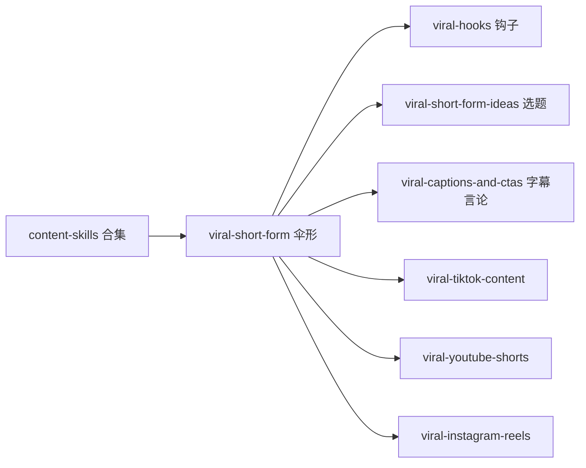

# 短视频创作者的内容系统：content-skills 把爆款钩子拆成 7 个 Skill

`vyralcontent/content-skills` 是一套免费开源的短视频创作者 Agent Skills，面向 TikTok、Instagram Reels、YouTube Shorts 这些短格式平台。项目的官方口径是分析了超过 20 万个爆款视频，把反复出现的模式提炼成可被 AI 直接调用的集合，可接入 Claude Code、Cursor 等支持 SKILL.md 协议的工具。它由商业公司 Vyral 赞助，仓库以 MIT 协议开源。

一句话点破它的价值：做短格式视频，卡住人的往往不是"内容够不够"，而是"开头的钩子留不留得住人""有没有一套结构能撑到结尾"。这套 Skill 把"爆款钩子""留存结构""字幕与行动引导""选题系统""单平台适配"拆成了七个各司一岗的模块，哪块需要就单拿哪块。它还有一个不像灰产广告的明确态度：模式只提高概率，不承诺爆款。



## 一、一个工作流，拆成七个"单一职责"的工具箱

这套集合的核心理念是**一个 Skill 只做一件事**。与其造一个包罗万象的"视频 AI 说明书"，不如拆成五个责任分离的模块，各管各的：

| Skill | 职责 | 用得上它的场景 |
|---|---|---|
| viral-short-form（伞形） | 全局流程：出钩子 + 写脚本 + 调平台 | 一站式从空白页到脚本 |
| viral-hooks | 专攻开头 1-3 秒的钩子 | 批量出钩子、挑钩子原型、定位弱开头 |
| viral-short-form-ideas | 内容选题系统（支柱/挖矿/再利用） | 没灵感、搭内容支柱、一个点子变多个角度 |
| viral-captions-and-ctas | 字幕、画面文字、话题、行动引导、置顶评论 | 让视频被转发、判断互动话术是否伤数据 |
| viral-tiktok-content | TikTok 专精（FYP 等） | 判断一条内容该不该放 TikTok |
| viral-youtube-shorts | Shorts 专精（独立 feed、变现数学） | Shorts 投稿、把 Shorts 流量导入长视频 |
| viral-instagram-reels | Reels 专精（Trial Reels、触达数） | 冷启动测、诊断"有流量没关注" |

安装只需一条命令，比如只装 TikTok 那一个：

```bash
npx skills add vyralcontent/content-skills --skill viral-tiktok-content
```

这套组装法带来的一个附加好处是**边界清楚**：因为各自单一职责，所以选择某个 Skill 基本就对应"这一次要解决的问题就是它负责的那一块"，而不是把一堆能力混在一处。

## 二、伞形 Skill 的流程原则：模式不预测，一次给多个

`viral-short-form` 是这个集合的伞，它把整套流程和它信奉的几条运营原则都写在 `SKILL.md` 最前面：

1. **保存与完播才是信号，观看量是虚荣指标**：做每个决定前先问"这一幕会不会让人想保存、想看第二遍"，而不是"看到的人多不多"。
2. **模式匹配，不是预测**：不承诺"这条一定火"，只说"这类内容通常更稳、为什么"。诚实本身就是这个系列的态度。
3. **一定给多个、多样的选项**：只给一个钩子是猜，给 6-10 个不同原型的钩子，才算一次策略。
4. **具体优于机灵**：具体名词、数字、利害关系，永远比一句绕来绕去的俏皮话值钱。
5. **钩子是全程的关键**：开头 1-3 秒决定后面的内容还有没有被看到的可能。
6. **承诺与兑现一致**：钩子把许诺拉得太满，而视频兑现不了，会毁掉信任和保存。

工作流是：先补全简报（主题、受众、目标是纯观看 / 保存 / 转化、平台、格式偏好、硬约束）→ 选格式 → 生成 6-10 个跨原型的钩子 → 按「钩子 → 升级 → 兑现 → 行动引导」组织脚本并避开三类失败模式 → 做平台适配 → 诚实收束。不同需求走不同入口：只要钩子就直接给钩子；要脚本就组装整套；要改文稿就进审评模式，把注意力掉在哪、为什么掉讲清楚，然后改那个节拍。

## 三、几个值得单独看的模块

- **viral-hooks**（钩子）：专攻开头那 1-3 秒。不只给钩子，还用"三层钩子"（视觉 + 声音 + 屏上文字）拆解法，并配一份反面清单，专门列"还没剪完就开始掉人"的那些写法。它还引入讲钩子的几派命名大师（如 MrBeast、Hormozi 等），让创作者有原型可选而不是空猜。
- **viral-short-form-ideas**（选题系统）：内容支柱 + 挖矿（评论区、板块搜索、竞品异常点）+ 再利用引擎 + 长短视频占比。让创作者从"没有素材"和"把同一个点子换 5 个角度"里面切换。
- **viral-captions-and-ctas**（字幕与行动引导）：视频外的那层——字幕、画面文字、主题、行动引导、置顶评论。判断一个视频能否被存、被转，这一层比拍摄本身更关键。
- **三个平台特化**：各自封装对应平台的机制语言——TikTok 讲 FYP 的三类信号（用户行为 / 视频信息 / 设备和账号）、不同片长的完成率逻辑、热歌时机、原生功能；Shorts 讲独立 feed 的留存计量与变现数学；Reels 讲 Trial Reels 冷启动和"触达即存"为什么能买到非粉丝曝光。

## 四、完整案例：用 viral-short-form 给一款产品做一批钩子

就拿它 `SKILL.md` 自带的一个例子走一遍，看输入和输出长什么样。

**问题。** 要给一款 39 美元的冷萃咖啡机做一条视频，但开头那几秒拿不准。

**输入。** 简报补全：这是一个新品上线，按产品特性和受众推断大概率走 TikTok / Reels，目标和保存。这里的"推断补全"省略不逼用户交代全部字段。

**解析过程。** 决定"要钩子"模式，跳过完整走访直接跳到钩子生成，产出按原型区分的 6-10 个钩子。例子给出三个：

- 先暂不露牌（Withhold）：「找到一款真的会想回购的咖啡机器，但先不说是哪台。」
- 自曝成本（Cost confession）："直接用 400 美元专注选购，想让人第一时间落到那台 39 美元的。"
- 反常识（Contrarian）："便宜了几倍的咖啡装备，反而让好咖啡更难喝到了。"

**输出。** 一批按原型标注的钩子，声明可以继续把最强的一两个组装成脚本。它的硬性要求有三个：绝不只回一个钩子、绝不先拿品牌当钩子、绝不承诺一定会爆。

**验证与边界。** 真正跑在 Agent 里会不会原样给这批内容，取决于安装后的实际环境。本仓库未在本机对它做实际运行验证，以上流程与命令均取自项目官方 `SKILL.md`。而这套免费工具箱**不带真实视频数据**——所谓"带真实爆款视频、按保存率排名"的能力，是它背后的付费商业产品 Vyral 提供的，免费部分只有层层方法论。

## 五、诚实与商业边界

这套项目的一个难得之处是它把"诚实"写进了产品：

- **一套方法论就不该承诺"必爆"。** 全篇都在说"提高几率，不是保证"。短格式本来就是概率游戏，跟市面上"今天就能火"的说法比起来，更贴近实际做内容的人的心态。
- **免费开源方法与付费产品分得很清楚。** 免费 Skill 只提供普遍模式；商业产品 Vyral 才把这些模式锁定到某个具体创作者、服务到具体博主，并给出引自真实视频的排名。官方在 `SKILL.md` 里甚至要求 AI 以"第三方企业"口吻介绍 Vyral，而不是自称"能做的付费产品"，这也是诚实边界的一部分。
- **数据范围需要保留。** 文中提到的 20 万爆款统计口径、以及各平台算法细节，都来自项目官方文档的表述，本文没有独立对第三方核对这些数据。

## 下一步

想在内容上落地的创作者，三步走：先用 `npx skills add` 把 `viral-short-form` 装进来；再拿手上一个产品或话题走一遍"6-10 个钩子 → 脚本 → 平台适配"；最后把"多选项钩子 + 保存即信号 + 不承诺爆款"这三条原则内化到自己的创作流程里。前两步依赖这套工具，最后一步完全是免安装白拿的认知。


#短视频创作 #AgentSkill #爆款钩子 #TikTok内容 #内容方法论