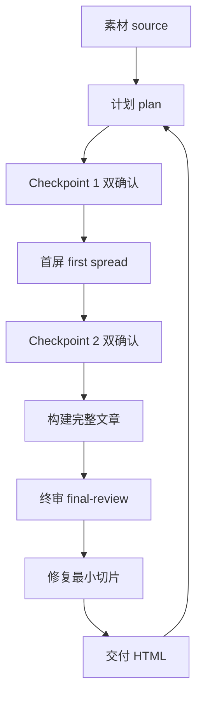

# 让 Agent 把你的长文、复盘做成一张能看的网页——一个 Skill 就够

先说结论，省得你往下读还得猜：ConardLi 在 GitHub 上放了个叫 **garden-skills** 的仓库，是个"production-ready 的 Agent Skill 合集"，给 Claude Code、Cursor、Codex 这类 AI 编码 Agent 用。今天不把里面五个 Skill 都摊开念一遍，我就挑那个最对我胃口、也最像"把我们干的事做成产品"的一个讲透——**beautiful-article**：它能把一段 URL、PDF、Markdown、截图，变成**一页能离线打开、能分享、赏心悦目的单文件 HTML 网页长文**。

说穿了，它不是帮你排版，是帮你**把"写了就没法给人看的材料"变成"看了就想转的东西"**。

---

先说那个让人又爱又恨的痛：你现在是 AI 时代的"内容生产机器"，手里材料一堆——一篇技术复盘、一段长文、一个 PDF、一次截图。你让 Agent 张个网，它确实能吐个 HTML。可你点开一看？要么是没人打磨的"半成品彩页"，要么一屏全是字，连个节奏都没有。你换一种问法再让它重新来，它又来一版，还是不像样。

这是 AI 生成内容绕不过去的坎：**输出再复杂，媒介不讲究，就白搭。** beautiful-article 背后那个想法就是这么来的——HTML 的价值不光在把字摆上，而是把信息密度、视觉清晰、分享便利一把抓：表格、SVG、代码块、能点的控件、复制与导出按钮，让读者不只是"看完"，而是能比较、能展开、能继续用。它不是让你"多个网页"，是让你"少一件搬运的活儿"。

---

要看完它的门道，先看它的流程有多像一条流水线，你也顺便记住它每一步在干嘛（接下去就是要带着你这个节奏走）：



（这条线是我按它的 SKILL.md 画的，快照；它永远不是"一路到底、不给人类看"的机器流水线，而是**每到一个关键节点都要停下来问你**的对话流程。）

---

下面这个"装起来走一遍"的例子，命令都从项目文档里原样抄给你，结尾的效果我按 SKILL.md 讲的写，**我这环境没有真跑出成品，凡是"应该会看到"的地方我都标清楚**，不骗你。

**第一步：装。** 有好几种装法，最快的用官方 `skills` CLI（它会自动识别你这台是 Claude Code 还是 Cursor 还是 Codex，把 skill 放进对的地方）：

```bash
# 装全部技能（最新）
npx skills add ConardLi/garden-skills

# 只装 beautiful-article 这一个
npx skills add ConardLi/garden-skills -s beautiful-article

# 装到全局（~/.skills）而不是项目里
npx skills add ConardLi/garden-skills -s gpt-image-2 --global

# 指定要装给哪个 agent
npx skills add ConardLi/garden-skills -s kb-retriever -a claude-code
```

> 直接用 `npx skills add ConardLi/garden-skills` 有个特点：**它默认追的是 `main` 分支最新**。想用 CI / 生产里那种"定死版本、别乱动"的，用带 `tree/<release-tag>` 的 URL 指定 commit：

```bash
# 钉住某一个 release 的技能
npx skills add ConardLi/garden-skills/tree/web-design-engineer-v1.0.0/skills/web-design-engineer
```

**第二步：把素材喂进流程。** 拿一篇你手上的 Markdown、一个 URL 或一张截图当 `source`。beautiful-article 会造成一个工作区目录，里面是这流程记决策长期记忆（不是只靠聊天里嘴上记得）——

```text
<workspace>/
  source/     原始/*.md  /*.html  提取笔记
  plan/       plan.md              # 规划：Brief / Outline / Theme / Assets
  article/    Article.tsx  文章正文   sections/  raw-blocks/  article.html(产物)
  review/     first-spread-review.md  final-review.md
  index.html  package.json  vite.config.ts  tsconfig*.json   (构建工具)
```

**第三步：走流程。** 它默认按 `source → plan → 双确认 → 首屏 → 双确认 → 完整文章 → 终审 → 修复 → 交付` 一步步走，并且**默认保留 100% 信息**（长文模式）。中途会在 **3 个硬检查点**（`Checkpoint 1` 确认"文章类型/主题/版式/配图/封面"，`Checkpoint 2` 确认"首屏验收/开发模式"，最后一个交付前确认）停下来，跟你逐项确认，不悄悄替你决定。

**第四步：产物。** 交付通常是一个**单文件 `article.html`（可选 PDF）**，理论上你双击就能在浏览器里打开、分享，也能离线存档。

> 以上"跑起来长什么样"的分步，除装命令是原始抄写外，其余是**文档与 SKILL.md 描述**，我没在这个环境真跑一遍。你要真跑，得有 Claude Code/Codex/Cursor 这类 Agent 环境。

---

看懂没，它这套流程最让我服的，不是"写得漂不漂亮"——是**它把"调度人机协作的纪律"写进了 skill**：

- **description 当契约**：SKILL.md 开头的 `description` 决定 Agent 何时才启用这个 skill——比如 beautiful-article 明确写着"把 URL/PDF/文章做成网页长文"才调它。这是你摆布每个 agent 能力时的标尺。
- **double-confirm / checkpoints**：宁可停下来多问两句，也不让 Agent 用默认值乱来。对"要求你给交互的产品"是王道。
- **每节点质控协议**：不是全程开一堆子 Agent，也不是全靠主 Agent 一个人，是按节点定"会不会/要不要 sub-agent / 要不要写审查文件"。这是一套性能守恒的姿势。
- **100% 信息保留是默认值**：除非用户开口，否则它不删你内容——这是它对"内容生产者"最厚道的默认值。

这套"别让 Agent 替你拍板，让它帮你把选择痛一遍"的调性，你用在自己构建里的任何"流程式 skill"上都通用。

---

好看是好看了，可你大概会问：那另几个我也一起装上，是图省事。

对。同一个作者同一家仓库，其余四个 Skill 也是能用起来的分工：

| Skill | 定位 | 最擅长的场景（据文档） | 什么时候别硬上它 |
|---|---|---|---|
| **beautiful-article** | 素材 → 单文件 HTML 长篇网页文章 | 长文/复盘/讲解/URL/PDF/Markdown → 一份赏心悦目的网页长文 | 你要后台/表单/dashboard，别选它 |
| **web-design-engineer** | 网页/落地页/原型/视觉 | 想一键把 AI 生成的网页"从能用打磨到惊艳" | 没有明确产品/受众，别指望它替你想口味 |
| **web-video-presentation** | 把文章/课变成可录的 16:9 网页演示 | 想给课程/演讲做成能录屏的网页演示 | 你要的只是"分页 PPT"，不是"能录制的网页" |
| **gpt-image-2** | 用 GPT Image 2 做图/改图 | 海报/UI mockup/信息图/技术图 | 本地没有图片工具、又拒不提供 Mode C 时受限 |
| **kb-retriever** | 本地知识库检索 | 从 `knowledge/` 目录/PDF/Excel 检索且有出处 | 你的知识"其实就一个文件"，用它可能过重 |

> 这表里"什么时候别用它"那列，是我基于它各自 SKILL.md 的范围（Scope）推断的，不是硬结论。多数 Skill 都在范围里写明"不做什么"（如 beautiful-article「不生成后台/表单/dashboard」），文档里可核。

兼容矩阵它标得挺全：Claude Code / Claude.ai（网页）/ Cursor / Codex / Gemini CLI / OpenCode，README 里都标了 `Tested`（作者声明，我没实测）。总之都是 `SKILL.md` 固定格式，拷到对应 skills 目录，理论上能动。

---

几个"它不是啥"也得交底，用大白话：

- **它不是"一个能自动把一切排版"的万能机器。** 它是一个"把写好的一篇流程当 skill 装进 agent"的具体成品。你到时候会发现它常问你问题——那是它的特性不是 bug：它宁可停下来确认，也不要自作主张替你把版定了。
- **它不是"图片/后台/表单引擎"。** 你要 bot、要 dashboard、要交互式 app，它第一个承认自己不在行（Scope 明确排除）。
- **它要你有"模型凭据 + 能跑 Agent 的环境"。** 想真跑起来看效果，得有 Claude Code/Codex/Cursor 这类环境和对应当前模型/API 的凭据，不是零依赖。
- **它的"效果图/主题"我没实测。** 23 套主题、25 风格配方是作者贴的预览，别把"我看了图就等于看过真实产物"。

---

一条收尾。多少 AI 的用户不是"它不能做这做那"，是"它替我做了一百个默认决定"。beautiful-article 这套，用最简单的调法告诉你：**别催它做，让它停下来问你要。**

这个 Skill 要是你常用，它就成你"不靠 AI 拍板、靠自己确认"的第一批，不是"你让 AI 替你拍"。工具会一代代换，文件格式会变，可"**让懂的那层人，决定最后一公里**"——永远错不了。

---


#AgentSkill #garden-skills #beautiful-article #网页排版 #网页长文 #公众号 #AI写作 #内容生产 #前端 #ConardLi